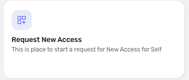
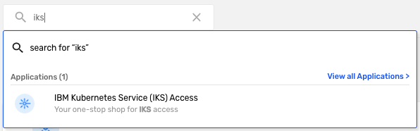
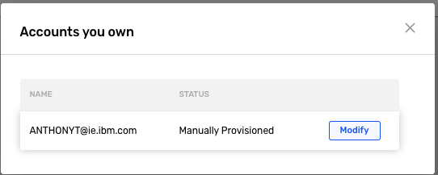
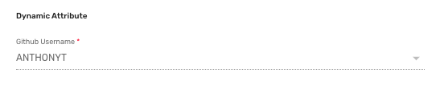
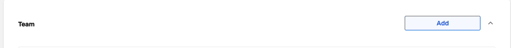
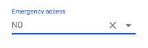
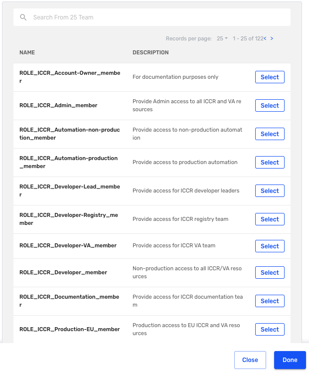

Ops
{: .label .label-green}

Using AccessHub to request, remove and maintain access for services
-------------

## Overview

[AccessHub](https://ibm-support.saviyntcloud.com/ECMv6/request/requestHome) [AH] is used to control access to resources.
_**AH** uses a role based access control (RBAC) model_

### Prerequisites

- **IBM GitHub userid**  
Before you start onboarding, please ensure that you already have logged on to IBM GitHub and that a GitHub userid has been created for you - to achieve this go to [https://github.ibm.com](https://github.ibm.com).  
_Log on, if necessary, using the w3id federation. If you click on the top most right icon, github should show you as signed in._  
_**If you create a new user, please allow AccessHub half a day to discover and synchronize your new userid!**_

  Without a valid user in IBM GitHub, the AccessHub onboarding will fail.

### Roles

As notes earlier, AccessHub uses a role based access control (RBAC) model, which means a user need request the appropriate roles and all backend resources that are needed for this role will be provided.

#### IKS developer should request the roles:
- `ROLE_IKS_Developer` : generic access to all resources as developer of the IKS tribe
- `ROLE_IKS_Developer-<Squad>` : access to the specific resources needed as a member of said \<squad\>
- `ROLE_IKS_Developer-<Squad>-<admin|approver>` : For certain squads, there is also an approver or admin role. These should only request by approvers or admins 
- `ROLE_IKS_Production-Ops` : access to special resources in production for selected developers
- `ROLE_IKS_Production-Ops-EU` : access to special resources in production in EU for selected developers

#### SREs should request the roles  
_IKS SREs are normally also SREs for ICCR and Razee_
- `ROLE_IKS_SRE-<your_country>` : generic access to all resources as SRE of the IKS tribe (new role to manage region based access control)
- `ROLE_IKS_SRE-Leads-<your_country>` : access specific for SRE leads of the IKS tribe (new role to manage region based access control)
- `ROLE_RAZEE_SRE-<your_country>` : generic access to all resources as SRE for Razee (new role to manage region based access control)
- `ROLE_ICCR_SRE-<your_country>` : generic access to all resources as SRE for Registry and VA (new role to manage region based access control)

SRE for BNPP should onboard to roles that give access to resources of the `BNPP` account. Same is true for their functional userids.

#### Registry and VA development should request these roles
- `ROLE_ICCR_Developer` : generic access to all resources as a developer for registry and VA
- `ROLE_ICCR_Developer-Registry` : access to the specific resources needed as member of the registry squad
- `ROLE_ICCR_Developer-VA` : access to the specific resources needed as member of the VA squad
- `ROLE_ICCR_Developer-Leads` : access specific for team leads of the Registry and VA squads

#### Razee development should also request these roles
- `ROLE_RAZEE_Developer` : generic access to all resources as a developer for Razee

#### Satellite Link development should request these roles
- `ROLE_SAT_Developer-Link` : generic access to all resources as a developer for Satellite Link
- `ROLE_SAT_Production-Link` : access to special resources in production for selected developers

#### Satellite Location development should request these roles
- `ROLE_SAT_Developer-Location` : generic access to all resources as a developer for Satellite Location
- `ROLE_SAT_Production-Location` : access to special resources in production for selected developers

#### Functional userids also need to be onboarded
Depending on the usage of the functional userid, these may also be onboarded to the same roles as a developer or SRE. In general, only onboard them to these roles for deployment to development , stage or production environments:

- `ROLE_IKS_Automation-non-production` : access to development or stage environments of the IKS tribe
- `ROLE_IKS_Automation-production` : access to production environments of the IKS tribe
- `ROLE_IKS_Automation-non-production-tugboat` : access to development or stage environments of IKS tugboats
- `ROLE_IKS_Automation-production-tugboat` : access to production environments of IKS tugboats
- `ROLE_IKS_Automation-Compliance` : access to resources for userid conauto@uk.ibm.com
- `ROLE_IKS_Automation-Build` : access to resources for userid alconbld@uk.ibm.com
- `ROLE_IKS_Automation-AccessHub` : access to resources for userid Alchemy.Access@uk.ibm.com
- `ROLE_IKS_Automation-Performance` : access to resources for userid armada.performance@uk.ibm.com
- `ROLE_IKS_Automation-Performance` : access to resources for userid armada.performance@uk.ibm.com
- `ROLE_IKS_Automation-production-Bootstrap` : access to resources for userid armboot@uk.ibm.com
- `ROLE_IKS_Automation-production-cluster` : access to resources for functional userids of the cluster squad
- `ROLE_IKS_Automation-Scorecard` : access to resources for userid scorecar@us.ibm.com
- `ROLE_ICCR_Automation-non-production` : access to development or stage environments of the Registry or VA squads
- `ROLE_ICCR_Automation-production` : access to production environments of the Registry or VA squads
- `ROLE_RAZEE_Automation-non-production` : access to development or stage environments of the Razee squads
- `ROLE_RAZEE_Automation-production` : access to production environments of the Razee squads
- `ROLE_SAT_Automation-non-production` : access to development or stage environments of the Satellite squads
- `ROLE_SAT_Automation-production` : access to production environments of the Satellite squads
- `ROLE_IKS_Superadmin` : admin rights both in production and stage/development
- `ROLE_IKS_SRE-netint-automation`: access to resources for the netint squad functional userids

#### Certain teams also have special roles
* IKS Security team should request the role `ROLE_IKS_Security`
* IKS netint team should request the role `ROLE_IKS_SRE-netint`
* IKS Design team should request the role `ROLE_IKS_Developer-Design`
* Istio open source committer should request the role `ROLE_IKS_Developer-Istio-OpenSource`
* ACS support team should request the role `ROLE_IKS_Support-ACS`
* ACS support team should request the role `ROLE_IKS_Production-Ops-SOS`

If you need access to LaunchDarkly, please request access to one of these roles depending on the level of access you require.
IKS members, please onboard to `ROLE_LaunchDarkly_IKS-<Reader|Writer|Admin>`.
CF members, please onboard to `ROLE_LaunchDarkly_CF-<Reader|Writer|Admin>`.

If you need access to the Alchemy dashboard and are not a member of the IKS, ICCR or Razee squads, you can request access by requesting access to `ROLE_IKS_Dashboard`

### How to use AccessHub

You can reach the main page using <https://ibm-support.saviyntcloud.com/ECMv6/request/requestHome>.

In AH an application represents some facility to request access for a single instance of a service or a a group of services.
For IKS, ICCR & VA decision has been made to have a single application that will provide access control for all services.
AccessHub (AH for short) has a kind of shopping basket system.

Use the `Request or Manage Access` to start.

The name of the application is `IBM Kubernetes Service (IKS) Access`.
Search for the above mentioned application in the search box - `IKS` might be enough.

A first time user can only select `Request New Account`, if you already used the application `Manage Access` is appropriate.

If you clicked on `Manage Access`, click modify on the relevant account. 

On the next page, verify that under the value of the Dynamic Attribute as GitHub Username your GitHub user shows up.

If this field is empty or seems to contain a wrong entry, please verify your IBM GitHub user. If you just created your GitHub user,
please allow AccessHub half a day to discover and synchronize your user. If not, please open up a ticket against AccessHub support.

In the `Team` section, click on `Add` 

If you are **modifying** your account, you will need to select `NO` for Emergency access. If you are applying for a new account, you should not need to do this.

You will be shown you a list of `teams` that represent `roles`. Search for the roles you require and click `Select`.

Please go through the roles and select the ones that are appropriate,  
_i.e. ICCR colleagues should select the ROLE_ICCR_* roles_

Developers should pick the generic ROLE_*\_Developer role and if exist, the special roles ROLE_*\_Developer-* role,  
_i.e. colleagues of the cluster squad should request ROLE_IKS_Developer and ROLE_IKS_Developer-Cluster._
Depending on your work, you may need to select several roles.

Once you are satisfied with your selection you can press the `Done` button on the bottom right.

In the `Team` section, there is summary of what roles you want to request and actions to take. Click `Review & Submit` on the bottom right. On the next page, review the changes you've made. Enter the `Business Justification`. Click the checkbox to agree that everything is correct and `Submit`
- Removal actions will be directly processed without further approvals.
- Add actions require you first line manager and a further group of people to approve your request.

If you want all access to be removed from the AH application the flow differs a bit.

Instead of `MODIFY EXISTING ACCOUNT` you need to:
1. select `REMOVE ACCOUNT`
2. then the `Remove` button on the popup
3. lastly `Checkout` on top
4. This time you will directly face the summary page where you need to provide a `Business Justification` and then press `Submit`.

## Escalation

For assistance, reach out to [#armada-accesshub](https://ibm-argonauts.slack.com/archives/CQ4C89HUG) in Slack

### Reviews

Last review: 2024-07-18 Last reviewer: Hannah Devlin Next review due by: 2025-07-18
