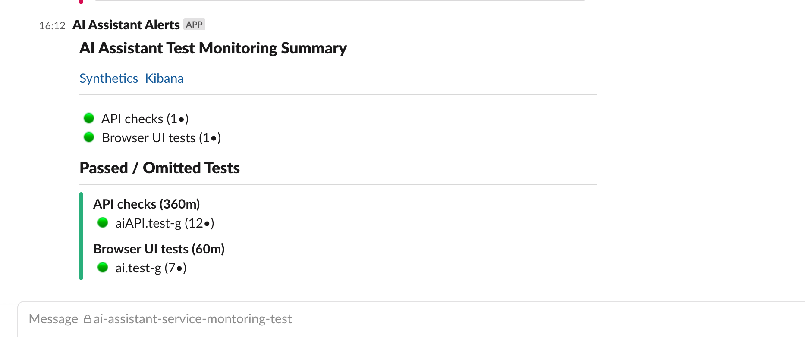

Informational
{: .label }

## Overview

This page is an inventory of Service alerts for the AI Assistant service

## Detailed Information

### Observability

- Sysdig is present in the `dn-prod-s-cpapi-extended` account for each region.
- LogDNA is present in the `dn-prod-s-cpapi-extended` account for each region.

### Synthetic Monitors

These monitors are executed via [Synlab](https://synthetics.cloud.ibm.com/) and are stored in the **Console** tenant.

Source for the monitors: <https://github.ibm.com/ibmcloud/console-synlab>
Fork: <https://github.ibm.com/ai-content/console-synlab>

| Monitor Name               | Type      | Test                            | Condition                          | Runbook |
| ----                       | ----      | ----                            | ----                               | ----    |
| console-synlab.ai-sev2.api | Synthetic | Checks health, posts a question | Alert if fails 3 consecutive times | [console-synlab.ai-sev2.api](console-synlab.ai-sev2.api.html)|
| console-synlab.ai-sev2.ui  | Synthetic | Opens and closes Chatbot window | Alert if fails 3 consecutive times | [console-synlab.ai-sev2.ui](console-synlab.ai-sev2.ui.html)|
| console-synlab.ai-sev2.qa  | Synthetic | Checks health                   | Alert if fails 3 consecutive times | [console-synlab.ai-sev2.qa](console-synlab.ai-sev2.qa.html)|

#### Synthetic monitor notifications

Status for synthetic monitors is posted to #ai-assistant-monitoring-test.  An example is shown below

### Capacity Monitors

These monitors are found in the Sysdig instances ( 1 per region ).  The criteria for generating alerts varies depending on the monitor and severity

Source for the monitors:

| Monitor Name               | Type      | Condition                          | Runbook |
| ----                       | ----      | ----                               | ----    |
| TBD | Sysdig Capacity | TBD | [tbd](#capacity-monitors)|
