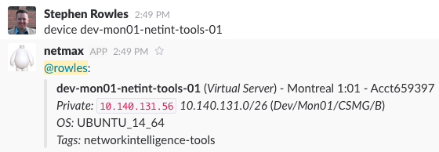
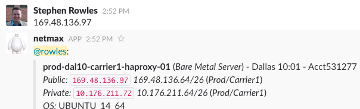
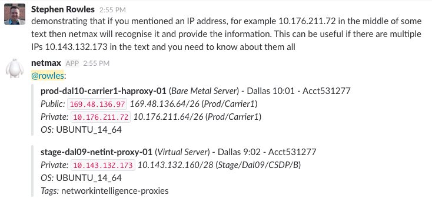
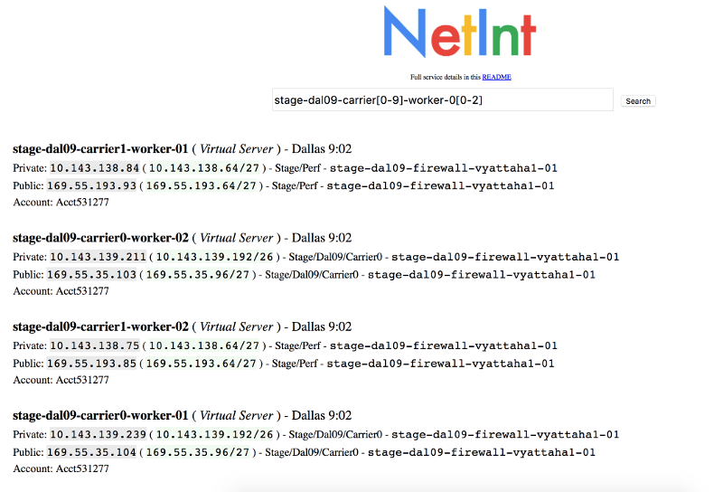

Informational
{: .label }

## Overview

How to find out more information about a host in SoftLayer. If you have received an IP address or host name, and wish to find out more details, then the techniques described here will help.

## Detailed Information

### In Slack

You can private message the bot `@netmax` to find out more information. If you supply a hostname or an IP address then netmax will resolve that to the machine in question and fill in the other details about the machine.

for example:

### In a web browser

There is a NetInt search tool available via the [alchemy-prod dashboard](https://pages.github.ibm.com/alchemy-conductors/documentation-pages/docs/process), click on "Tools" and then  "Device Lookup" or simply visit [here](https://alchemy-dashboard.containers.cloud.ibm.com/stage-dal09/stage/devicelookup/site/) directly.

The lookup tool allows searching by IP addresses or machine name, and regex's can be supplied to obtain multiple results, for example: [looking up hosts using numeric ranges](https://alchemy-dashboard.containers.cloud.ibm.com/stage-dal09/stage/devicelookup/site/?q=stage-dal09-carrier[0-9]-worker-0[0-2])

### By hand using GIT

The full inventory of machines is available in [GIT](https://github.ibm.com/alchemy-netint/network-source/tree/master/softlayer-data). Inside this folder there is a sub-directory of accounts. Each folder contains a `details.json` containing the details of the account owner, name etc. and then devices.csv which contains information on all the hosts in the account.

A device can be located, and then the IP address cross-referenced with data in the subnets.csv and vlans.csv file to locate the right data centre and vlan etc.
