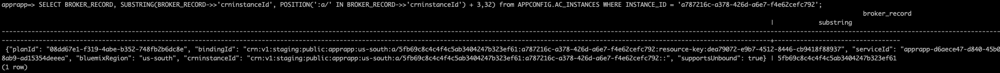

Informational
{: .label }

## Overview 
# Account specific notifications

When an incident happens in the service, account specific notifications are to be sent for all our customers.  To do this we need to retrieve the account details from our DB.  


## Detailed Information
Here is the SQL to retrieve all the account details from our db. 

```
SELECT DISTINCT(SUBSTRING(BROKER_RECORD->>'crninstanceId', POSITION(':a/' IN BROKER_RECORD->>'crninstanceId') + 3,32)) FROM APPCONFIG.AC_INSTANCES ;
```

If we need it for a specific instance we can use this -

```
SELECT SUBSTRING(BROKER_RECORD->>'crninstanceId', POSITION(':a/' IN BROKER_RECORD->>'crninstanceId') + 3,32) from APPCONFIG.AC_INSTANCES WHERE INSTANCE_ID = '<instance id>';
```
If we need it for specific plan we can use this - 

```
SELECT DISTINCT(SUBSTRING(BROKER_RECORD->>'crninstanceId', POSITION(':a/' IN BROKER_RECORD->>'crninstanceId') + 3,32)) FROM APPCONFIG.AC_INSTANCES where enabled=true and deleted=false and plan IN ('Standard', 'standard');
```

How this works - 

substring of crn string is used to identify account id - 


