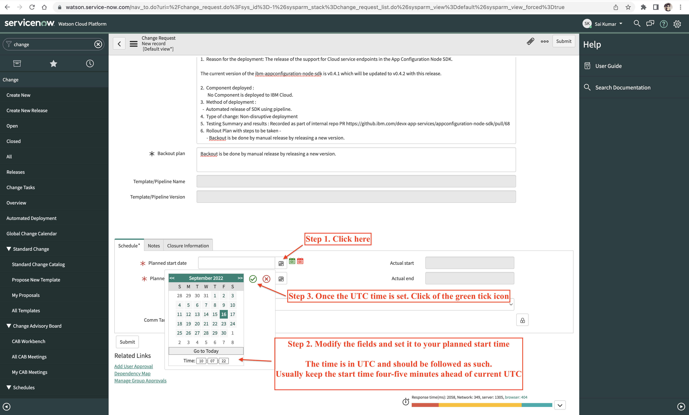

Informational
{: .label }

## Overview
# Change Management

Service uses [Service Now](https://pages.github.ibm.com/alchemy-conductors/documentation-pages/docs/runbooks/app-configurations/servicenow.html) for tracking change requests. A new change request can be created [here](https://watson.service-now.com/nav_to.do?uri=%2Fchange_request_list.do%3Fsysparm_query%3Dcmdb_ci%3D52df23ce1b2a54d4a2b499ffbd4bcb62%5Estate!%3D3%26sysparm_first_row%3D1%26sysparm_view%3D) for the service.  


Any change to the production is tracked using change requests.  Following are the list of activities tracked using CR (but not restricted to) - 

* GC changes
* RMC changes
* Broker updates
* Deployments of Microservices (Service components)
* Worker Node Reload / patch
* CSUtil cluster setup / update
* Kubernetes version update
* CIS updates
* Dependency addition 
* Data migration / update if any 
* Secret updates
* Key Rotation 
* Vulnerability fixes
* Ingress changes
* Credentials updates in Secret Manager
* SDK release / updates
* Razee plugin release / updates

## Detailed Information
Following is the procedure followed for any change requests - 

* A change request in service now is mandatory for any production deployments
* Approval for production deployments are done manually to closely track the changes in the production environments.  Following the exceptions to this process i.e for the following cases an automated approval is agreed.
  * Worker Node Reload
  * CSUtil cluster setup
* A change request is mandated for any production pipeline to be triggered
* A change request can have only a time period of 8 hours.  
* Change request is closed manually once the deployment period is completed.  There is an operations pipeline that checks the deployment period and if any CR is missed to be closed, this pipeline takes care of closing it. [here](https://cloud.ibm.com/devops/pipelines/tekton/02284a75-7840-40c8-adb8-ba30329a8607?env_id=ibm:yp:us-south) is the pipeline which runs everyday to verify the CR closure.

# Steps to create a Change Request

**Reference CRs** : [CHG4508334](https://watson.service-now.com/nav_to.do?uri=/change_request.do?sys_id=f98132d02fca9d14b36fddda2799b6e0&sysparm_domain=null&sysparm_domain_scope=null&sysparm_view=default&sysparm_view_forced=true) & [CHG4508188](https://watson.service-now.com/nav_to.do?uri=/change_request.do?sys_id=f98132d02fca9d14b36fddda2799b6e0&sysparm_domain=null&sysparm_domain_scope=null&sysparm_view=default&sysparm_view_forced=true)

### Go to Service Now Home page

https://watson.service-now.com/nav_to.do?uri=%2Fhome_splash.do%3Fsysparm_direct%3Dtrue


### Search for "Change" in the left and click on "Create New" as shown


### The below page will appear


### Fill in the details as shown below


### Fill the "Assigned to" details as shown below


### 6. Next select the "Priority" as 'Moderate' as shown below


### Follow the details as shown below

In case of SDK & CLI which are not region specific changes, you can enter "any" one of the regions of App Configuration. Since we cannot leave that field empty)


### Scroll down


### Fill in the Planned start date & time

(Enter the time in UTC. Do not convert it to IST)



Note that start time should be kept ahead at least 4-5 minutes of your current UTC time.

### Fill in the Planned end date & time

It should also be in UTC and should be kept at max 8 hours ahead from the start time


Example:
  ```
    start time: 2022-09-16 09:38:24
    end time: 2022-09-16 17:35:31
  ```

The difference is less than 8 hours.

### Save the CR as shown below


### Get the CR reviewed

Once the CR is saved, copy the page URL of the CR and give it to Srikanth/Adi for review.


### Request for approval

After the CR is manually reviewed by Srikanth/Adi, then request for approval.


### Wait for CR to be approved.

After Adi/Srikanth approves the CR you can refresh the page and check the CR status.

### After that, put the CR in implement state as shown below.


### Next

Once your release/deployment is done. Come back to servicenow and close the CR. Note that CR must be closed within 8 hours of time


### The END


