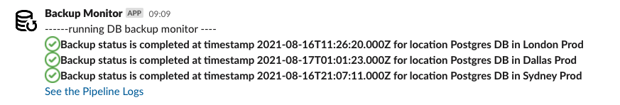

Informational
{: .label }

## Overview 
# Data Backup and Restore

All persistent storage used by the service is auto backed up.  Backup storage is also encrypted at storage.  This is done as part of the regular ICD backups & is enabled by the ICD service by default.

Important requirements of data backup thats taken care by the service are - 

* Data backup should be encrypted at rest
* Data backup is done in COS
* Data backup should be at-least 8 miles apart from the primary location
  * App Configuration service supports three regions.  Each of the respective regional backup are stored 8 miles apart.  Dallas backup is stored in Washington, London & Sydney backup is stored in Dallas.
* Backup monitoring is done automatically and is monitored with alerts in slack.  For production alerts are integrated with Pager Duty.  

## Detailed Information
## Backup monitoring 
Monitoring is used to confirm that the back up runs daily and this is done using the ```ibmcloud cdb deployment-backups-list``` command. 

We monitor the below persistent storage in all regions, including the dev & stage - 

* ICD Postgresql storage

Monitoring alerts the squad's slack as below - 



When there is a failure, backups can be triggered manually using the respective cloud service UI - 


## Backup restore

To restore a Postgresql backup follow the steps mentioned [here](https://cloud.ibm.com/docs/databases-for-postgresql?topic=cloud-databases-dashboard-backups#restoring-a-backup)

## COS Backup - Production Data 

Backup to be stored in a COS bucket is one of the Service Framework.  Service maintains the COS instance is created in a separate cloud account, to backup the databases.  Each production data is maintained in separate bucket to backup each database.  Automation is set up using Tekton pipeline to backup the database everyday and upload it to the COS bucket.  Pipeline is also available to restore the database whenever necessary by picking up latest bucket object.

Pipeline for the backup is available [here](https://cloud.ibm.com/devops/pipelines/tekton/946d4e73-5e1c-4eef-b98e-7c2e703b1edf?env_id=ibm:yp:us-south).  This is an automated job.  


The same pipeline has a "Restore-trigger" to restore the backup.


