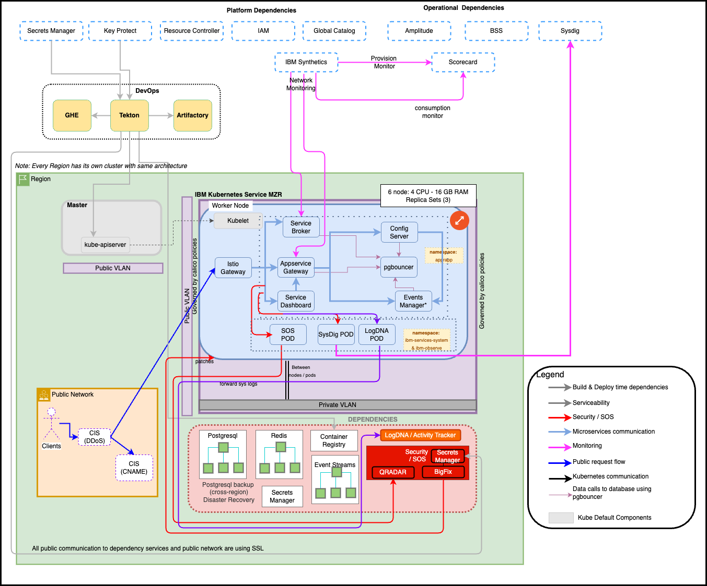
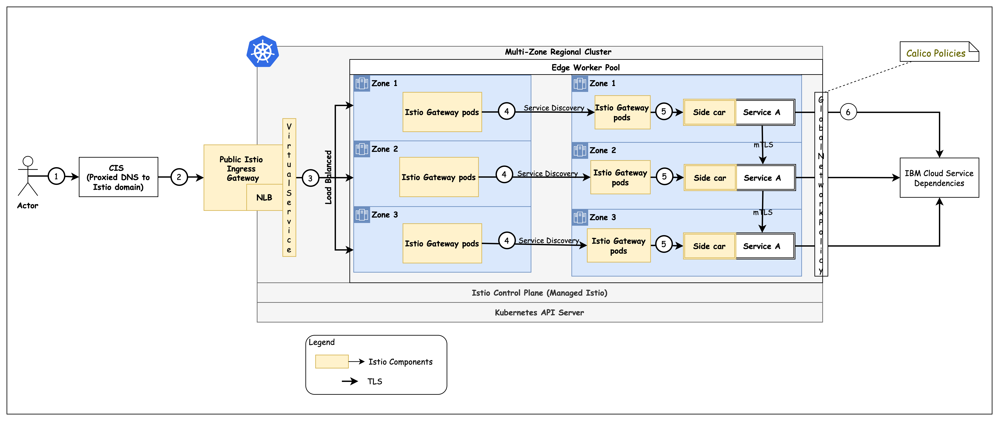

Informational
{: .label }

## Overview
# Physical Architecture

## Detailed Information
## Flow of a request

## High Availability

High Availability within a region is inbuilt into the infrastructure.  Each microservice runs on a Multizone Regional (MZR) cluster with nodes distributed across three datacenters.  Minimum 3 replica-sets run distributed across the zones / datacenters.  

Availability for all the service components is managed by Kubernetes liveness checks. If any running component fails its liveness check, Kubernetes will reschedule and restart the component.

<!-- ## Disaster Recovery -->

