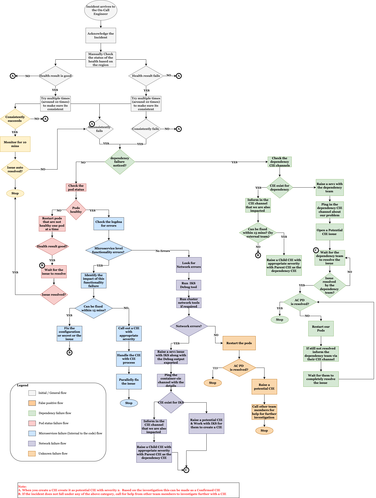

Informational
{: .label }

## Overview
# App Configuration Monitoring Procedures

IBM Cloud App Configuration is a centralized feature management and configuration service for use with web and mobile applications, microservices, and distributed environments. 

Summary: IBM Cloud App Configuration Service is down

Dependencies: IBM Cloud Platform, ICD PostgreSQL, Event Streams, ICD Redis, & CIS

Slack Channel: [#appconfig-monitoring](https://ibm.enterprise.slack.com/archives/G015E0G22GK) 

## Detailed Information
## Overall Process

## Service Verification Steps

Refer [Service Functionality Verification Steps](https://pages.github.ibm.com/alchemy-conductors/documentation-pages/docs/runbooks/app-configurations/serviceverify.html)

## CIE & Severity Information

Refer [CIE & Severity Information](https://pages.github.ibm.com/alchemy-conductors/documentation-pages/docs/runbooks/app-configurations/cie.html)

Refer [Get Help from services we depend on](https://pages.github.ibm.com/ids-sre/runbooks/docs/runbooks/incident-management/dependency-escalations.html) for specific dependency based help.

## Incident Management & Notification to customers
Refer [here](https://pages.github.ibm.com/alchemy-conductors/documentation-pages/docs/runbooks/app-configurations/incident.html) for incident management in IBM Cloud.  Refer [here](https://pages.github.ibm.com/alchemy-conductors/documentation-pages/docs/runbooks/app-configurations/accountnotify.html) if account specific notification has to be sent out.

## Runbooks 
Following are the various runbooks used to maintain the service.  

### Alert & Operations Runbooks

* [Database Backup Monitoring](https://pages.github.ibm.com/alchemy-conductors/documentation-pages/docs/runbooks/app-configurations/dbbackup.html)
* [Cluster Exec operation](https://pages.github.ibm.com/alchemy-conductors/documentation-pages/docs/runbooks/app-configurations/socincident.html)
* [Database Capacity Monitoring](https://pages.github.ibm.com/alchemy-conductors/documentation-pages/docs/runbooks/app-configurations/sysdig.html)

### Informational Runbooks

* [BCDR Runbook](https://pages.github.ibm.com/alchemy-conductors/documentation-pages/docs/runbooks/app-configurations/bcdrrunbook.html)

### Troubleshooting Runbooks

* [Cluster Network debugging](https://pages.github.ibm.com/alchemy-conductors/documentation-pages/docs/runbooks/app-configurations/clusternetwork.html)

### Escalation Policy

* [Escalation Policy](https://pages.github.ibm.com/alchemy-conductors/documentation-pages/docs/runbooks/app-configurations/escalation.html)