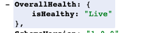
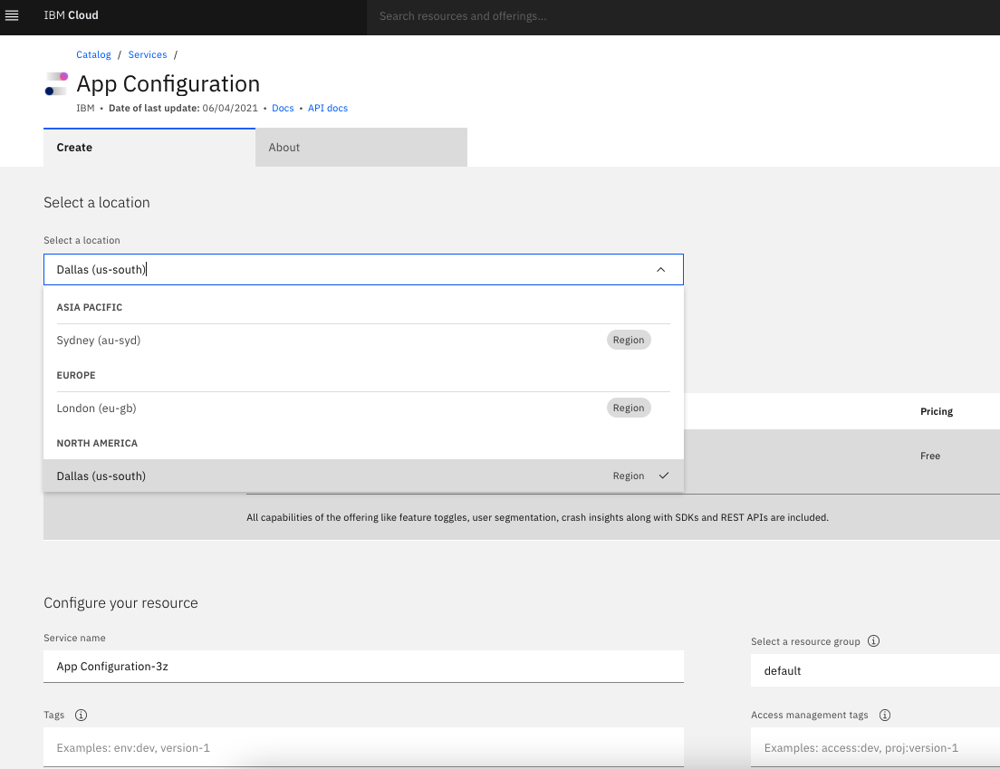
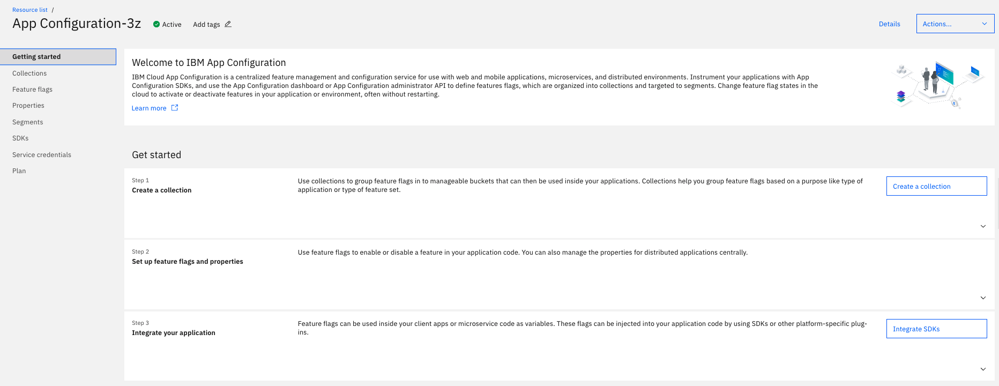
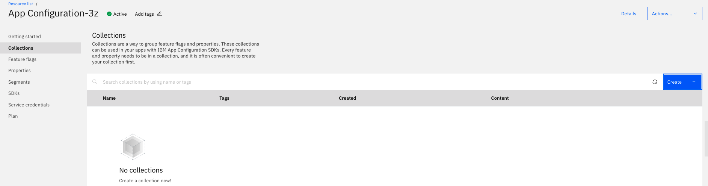
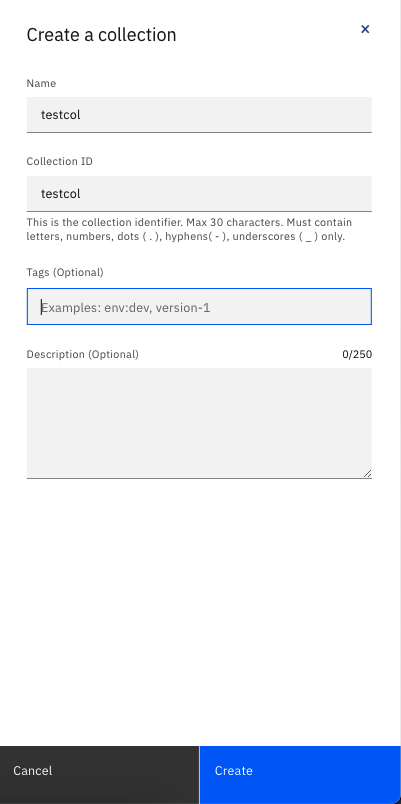
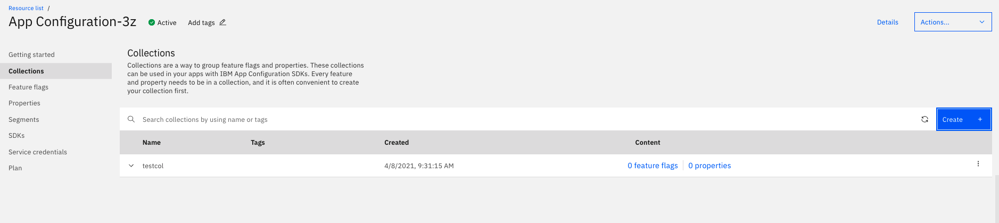

Informational
{: .label }

## Overview
## Service Health End-Points Verification Steps

1. Confirm the health end points of the region displays as Live.  To confirm this, access the health end point of the region mentioned below. 

End points of various regions are - 
* Sydney (au-syd) - https://au-syd.apprapp.cloud.ibm.com/apprapp/v1/health/status
* Dallas (us-south) - https://us-south.apprapp.cloud.ibm.com/apprapp/v1/health/status
* London (eu-gb) - https://eu-gb.apprapp.cloud.ibm.com/apprapp/v1/health/status

Verify the isHealthy as Live

1. If the overall Health is not Live, then please follow the escalation steps to engage the service team.

## E2E Run

App Configuration has the E2E automated tests which should be run to verify if the functionalitiese are really impacted.

1. Go to the [E2E Pipeline](https://cloud.ibm.com/devops/pipelines/tekton/06f8f8c1-47c8-4094-8017-0d6f3d656d75?env_id=ibm:yp:us-south)
2. If the E2E succeeds, it indicates the backend being available for all functionalities
3. If the E2E partially succeeds then analyze the impact on the functionalities
4. If the E2E compeletely fails then it indicates the service is entirely down.

## Detailed Information
## Dependencies Verification Steps

1. Go to the [IBM Cloud status page](https://cloud.ibm.com/status?selected=status) to check the status of the component IBM Cloud Platform.
   Note: If there is an issue with a particular region and red exclamation point will show under the status. A green check mark indicates the platform is working as expected. Using the > to the left of the component name you can also see a list of notifications relating to the platform. Look for any notifications which are currently open or being investigated.
2. Check for any open CIE (Customer Impacting Events) for the environment impacted by using @ciebot cie list 
3. Escalate to the service team if any of the dependencies has a open CIE.

## Service Provisioning Verification Steps

If dependencies are working well, verify the service provisioning steps.
1. Login to [IBM Cloud](https://cloud.ibm.com)
2. Navigate to the [App Configuration Service provisioning page](https://cloud.ibm.com/catalog/services/app-configuration)
3. Select the region impacted to provision a instance in that specific region. 

1. Click create button to create the instance.  
2. If provisioning the instance fails, retry to verify once again.  If instance provisioning fails, even in the second attempt, then please follow the escalation steps to engage the service team.

## Service Functionality Verification Steps

If the service provisioning worked well, continue to view the dashboard and perform the below steps to verify if the service functionality works well.

This is the initial page of the service dashboard 

1. Click on the Collections navigation.  Since this is a new instance, an empty collections page would be displayed.
   
2. Click on Create button the collections navigation.  In the side popup, fill in any alphabetical strings for name & description. Click on the "Create" button on the popup.
   

3. Once created, the page should display the newly created collection.  

1. With the above steps completed successfully, it is a confirmation that the service is functioning as expected. Resolve the incident with appropriate details of service functioning as expected.   
2. If any of the steps fails, then please follow the [escalation steps](https://pages.github.ibm.com/alchemy-conductors/documentation-pages/docs/runbooks/app-configurations/escalation.html) to engage the service team.
