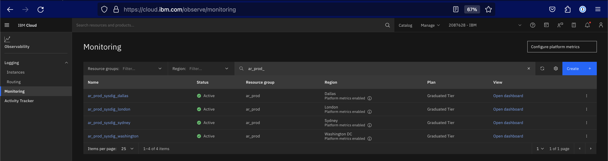
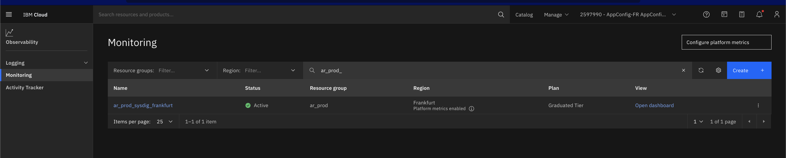
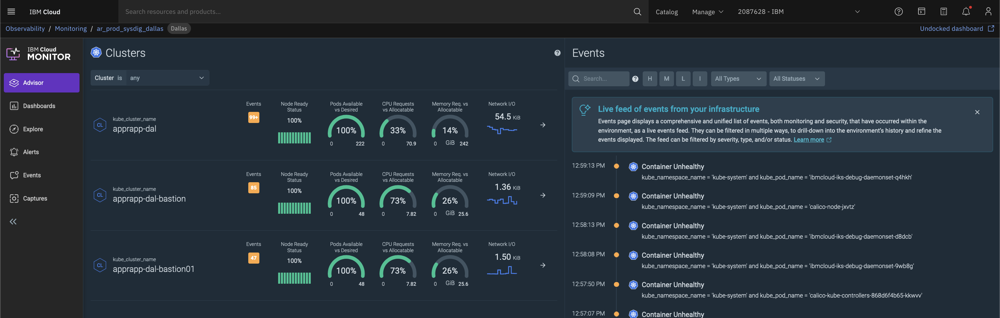
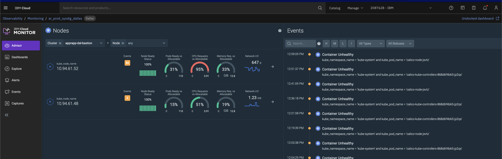
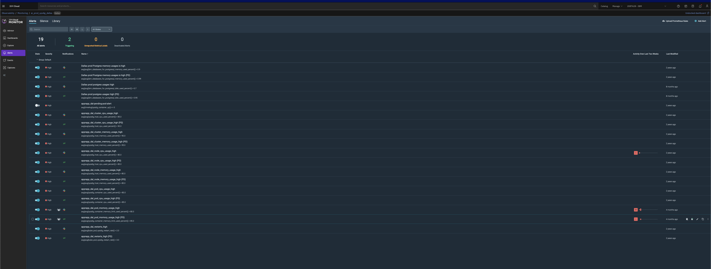
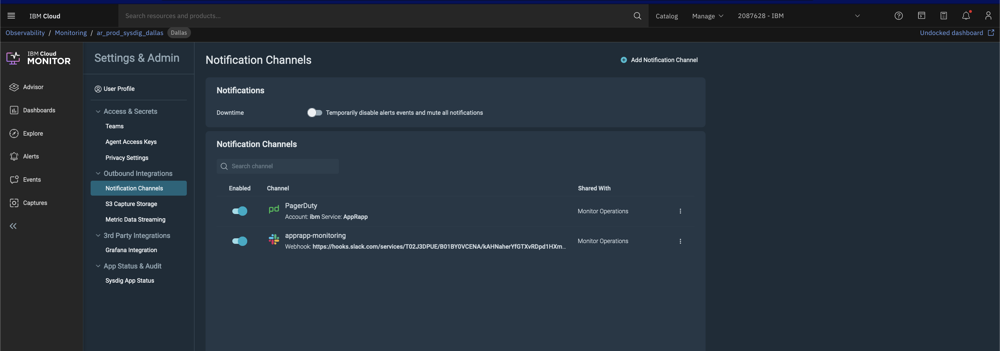
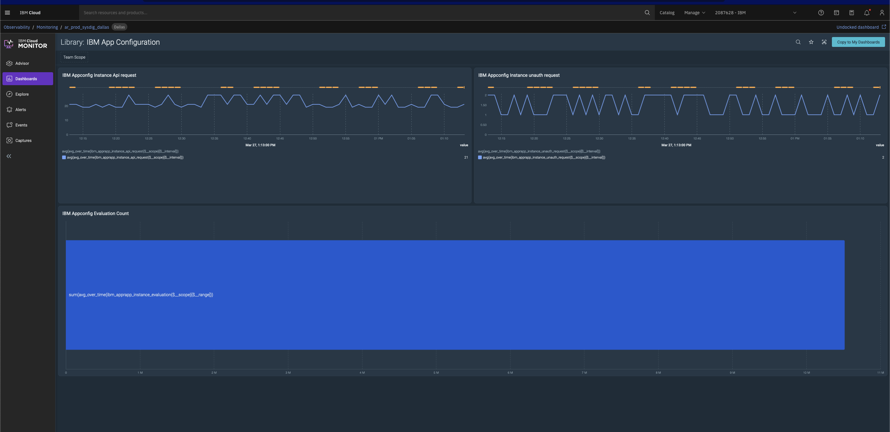

Informational
{: .label }

## Overview
# Sysdig Integration

Sysdig is integrated with the service for two purpose

1. Infrastructure Monitoring (Internal)
2. Custom Metrics (External)

## Detailed Information
## Infrastructure Monitoring (Internal)
Sysdig is integrated with Kube infrastructure for capacity monitoring perspective.

Sysdig monitors are setup in every cluster which is registered with a sysdig instance. One single instance of the sysdig is used for the tribe.

To know more about SysDig monitoring, tutorials are available [here](https://cloud.ibm.com/docs/Monitoring-with-Sysdig?topic=Monitoring-with-Sysdig-kubernetes_cluster)

To know more on Tip integration refer [here](https://github.ibm.com/cloud-sre/tip-api#console)

**Sysdig instances for production account are**

Non-EU Account
    

EU Account
    


**Sysdig listing all clusters**



**Sysdig listing all worker nodes in clusters**



**Sysdig alerts configuration**



**Sysdig alerts are sent to the squad monitoring channel and the configuration is available at**



### Sysdig Runbook 

When sysdig alerts for high memory or CPU, engineer on call, should take appropriate actions to identify the bottleneck on the service.  

#### Identification of bottlenecks 

* First identify if the resource usage is high because of the service pods running in the cluster `apprapp` namespace.  To do this execute the following command in the `apprapp` namespace, after logging in to the respective cluster.

```
# To get all pods from service running
kubectl -n apprapp top pods

# To get all pods from sysdig running
kubectl -n ibm-observe top pods
```

This will display the resource usage of each pod.  This will provide details of how the pods are consuming memory.  Further to this, verify if the nodes are running normal on resources.  To do this execute the following command after logging in to the respective cluster.

```
# To get resource utilize from service namespace
kubectl -n apprapp top nodes
```

This will display the resource usage of each nodes.  

With this identify the pod which is causing the bottleneck and accordingly investigate the threads running in a microservice, reasons that could cause the memory consumptions in a microservice etc., 


## Custom Metrics (External)

Custom metrics are posted to the customer using the super-tenancy of Sysdig.  Following are the metrics that we will onboard

* Evaluation Time - Onboarding json for this is available [here](./assets/AppConfig%20Custom%20Metrics%20-%20Evaluation.json)


