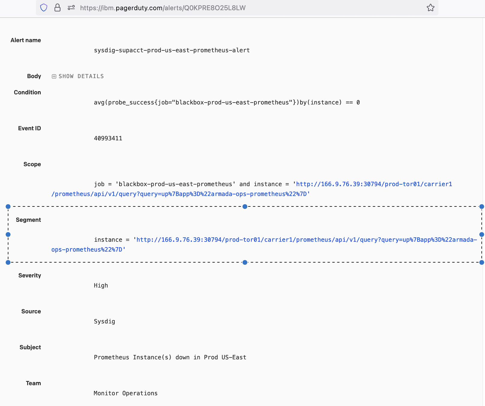

Troubleshooting
{: .label .label-red}

## Overview

This runbook describes how to deal with alerts arising from Sysdig check reporting prometheus is down.

## Example Alerts

Example PD alert:
- [Prometheus Instance(s) down in Prod US-East](https://ibm.pagerduty.com/alerts/Q0KPRE8O25L8LW)

## How to associate the instance mentioned in the alert with a specific target
  - Get `instance` value from `Segment` section in the alert
    - Example: <br>
      instance#1 = <code style="display: block; white-space: pre-wrap;">http://166.9.76.39:30794/prod-tor01/carrier106/prometheus/api/v1/query?query=up%7Bapp%3D%22armada-ops-prometheus%22%7D`</code> <br>
      instance#2 = <code style="display: block; white-space: pre-wrap;">http://c109.private.us-east.containers.cloud.ibm.com:30794/prod-wdc04/carrier109/prometheus/api/v1/query?query=up%7Bapp%3D%22armada-ops-prometheus%22%7D</code>
      
  - Get target name by retrieving the text after IP address and Port in the `instance`.
      - Example: <br>
        - For above instance#1, target `prod-tor01-carrier106` name is available after IP:Port = `http://166.9.76.39:30794/prod-tor01/carrier106/...`
        - For above instance#2, target `prod-wdc04-carrier109` name is available after Private-End-Point:Port = `http://c109.private.us-east.containers.cloud.ibm.com:30794/prod-wdc04/carrier109/..`
        
## Investigation and Action

Prometheus is troubled and has either crashed or failed deployment to the environment.

This could be due to an ongoing promotion or maintenance.
**armda-ops-prometheus promotion** This can be checked [here](https://razeeflags.containers.cloud.ibm.com/alchemy-containers/flags/default/production/armada-ops-prometheus).

If no ongoing promotion, then there are something wrong on the Prometheus microservice, please do the following:

1. `kubectl get pods -n monitoring -o wide -l app=armada-ops-prometheus`
   ```
   root@dev-mex01-carrier5-master-01:~# kubectl get pods -n monitoring -o wide -l app=armada-ops-prometheus
   NAME                                    READY     STATUS    RESTARTS   AGE       IP              NODE
   armada-ops-prometheus-162432359-wcx4f   1/1       Running   2          1d        172.16.243.88   10.130.231.137
   ```
   - If the pod is not running, please [Restart prometheus pod](#restart-prometheus-pod) directly.  
   - If it's running, please make a note of prometheus pod name and node IP, and continue.

1. Verify prometheus status through prometheus dashboard
   - Check the status of prometheus in the given carrier, from the [Alchemy Dashboard](https://alchemy-dashboard.containers.cloud.ibm.com/), navigate to the carrier and execute the query  
   `up{app="armada-ops-prometheus"}`  

     _for example_
     

   - If it returns **Gateway Time-out**  
   [Restart prometheus pod](#restart-prometheus-pod)

   - If Prometheus does not load and instead you receive an error similar to the one below, restart calico on the master nodes with this [jenkins job](https://alchemy-containers-jenkins.swg-devops.com/view/Conductors/job/armada-ops/job/restart-calico-pod-on-master-nodes/):

   ```
      Error: 'dial tcp 172.16.176.123:9090: i/o timeout'
      Trying to reach: 'http://172.16.176.123:9090/prod-hkg02/carrier2/prometheus/'
   ```

1. [Fix prometheus](#fix-prometheus-manually)
If Prometheus can be fixed, then the pd should be auto-resolved soon, otherwise **escalate**

## Restart prometheus pod
1. Describe the health of the pod and the latest messages associated with it  
`kubectl describe pod <prometheus-pod-name> -n monitoring`
1. Determine whether Prometheus is recovering  
`kubectl logs <prometheus-pod-name> -n monitoring`
   - if prometheus is recovering, please wait, otherwise, continue.
1. Deletes the pod (which will be in not ready state) and the pod is recreated automatically  
`kubectl delete pods <prometheus-pod-name> -n monitoring`

If the issue persists, view the logs (in step 2), there could be an issue with the current build causing this outage.

## Fix prometheus manually

### For legacy carriers
1. `kubectl get pods -n monitoring -o wide -l app=armada-ops-prometheus` - get the endpoint of prometheus and verify on the worker node that prometheus pod in and the master node with `curl <prometheus-endpoint>`
~~~
 kubectl get ep -n monitoring -l app=armada-ops-prometheus
 NAME                    ENDPOINTS             AGE
 armada-ops-prometheus   172.16.224.182:9090   155d
~~~
1. If `curl <prometheus-endpoint>` timeout in worker node, it indicates something wrong with the prometheus pod.  Then please [Restart prometheus pod](#restart-prometheus-pod).

1. If `curl <prometheus-endpoint>` returns normal in worker node, but timeout in master node, it indicates calico node is down on 1 or more master nodes (ha master). go to every master node, do the following
   - `sudo crictl ps | grep calico-node`- get the calico-node container id
   - `sudo crictl stop <container-id>` - restart the calico-node container

1. If `curl <prometheus-endpoint>` returns normally in both worker node and master node, it indicates something wrong with the Sysdig monitoring pods running on Support Account.
 - please follow the runbook [How to debug Sysdig monitoring running on Support Account](https://github.ibm.com/alchemy-conductors/documentation-pages/pull/5259/files)

### For tugboats
1. For tugboats, note the `service_url` from the PD alert, for example <code style="display: block; white-space: pre-wrap;">http://166.9.82.5:30794/prod-sao01/carrier102/prometheus/api/v1/query?query=up%7Bapp%3D%22armada-ops-prometheus%22%7D</code>

1. Attempt to `curl <service_url>` from a worker node on the hub carrier. If it fails, proceed to [Manual recovery for tugboat](#manual-recovery-for-tugboat) as we likely need to clean up old WAL files and restart the pod.


## Recovering prometheus after a CrashLoopBackOff error

Review the `kubectl logs` output for the prometheus POD.

~~~
$ kubectl get pods -n monitoring -o wide -l app=armada-ops-prometheus
$ kubectl logs  -n monitoring <pod_found_in_prevous_command>
~~~

If there are many log entries like the following, it indicates that the WAL files have become too large (10s or 100s of GB) and the prometheus pod is struggling to load them all. Proceed to [Manual recovery for tugboat](#manual-recovery-for-tugboat)
~~~
level=info ts=2022-01-14T12:40:37.751Z caller=head.go:813 component=tsdb msg="WAL segment loaded" segment=48372 maxSegment=48376
level=info ts=2022-01-14T12:40:41.043Z caller=head.go:813 component=tsdb msg="WAL segment loaded" segment=48373 maxSegment=48376
level=info ts=2022-01-14T12:40:44.428Z caller=head.go:813 component=tsdb msg="WAL segment loaded" segment=48374 maxSegment=48376
~~~

Check logs for CrashLoopBackOff pods:

~~~
prod-dal10-carrier3-master-01:~$ kubectl get pods -n monitoring -o wide -l app=armada-ops-prometheus
NAME                                     READY     STATUS             RESTARTS   AGE       IP             NODE
armada-ops-prometheus-7457df7c7b-p8nfp   0/1       CrashLoopBackOff   6          6m        172.16.23.39   10.177.182.150
prod-dal10-carrier3-master-011:~# kubectl logs  -n monitoring armada-ops-prometheus-7457df7c7b-p8nfp
time="2018-06-14T04:58:06Z" level=info msg="Starting prometheus (version=1.8.1, branch=HEAD, revision=3a7c51ab70fc7615cd318204d3aa7c078b7c5b20)" source="main.go:87"
time="2018-06-14T04:58:06Z" level=info msg="Build context (go=go1.9.1, user=root@ab78fb101775, date=20171023-15:50:57)" source="main.go:88"
time="2018-06-14T04:58:06Z" level=info msg="Host details (Linux 4.4.0-89-generic #112-Ubuntu SMP Mon Jul 31 19:38:41 UTC 2017 x86_64 prometheus-68cc5bb94d-tt45q (none))" source="main.go:89"
time="2018-06-14T04:58:06Z" level=info msg="Loading configuration file /etc/prometheus/prometheus.yml" source="main.go:254"
time="2018-06-14T04:58:06Z" level=info msg="Listening on :9090" source="web.go:341"
time="2018-06-14T04:58:06Z" level=error msg="Could not lock /metrics/data/DIRTY, Prometheus already running?" source="persistence.go:200"
time="2018-06-14T04:58:06Z" level=error msg="Error opening memory series storage: resource temporarily unavailable" source="main.go:192"
~~~

First try these steps if the prometheus container is in `CrashLoopBackOff` or there are two prometheus containers, one of which is stuck in `Terminating` state.

1. If multiple prometheus PODs are present when `kubectl get pods -n monitoring -o wide -l app=armada-ops-prometheus` is executed, with one being in `Terminating` state, cordon, drain and reboot the node which the terminating POD is on.  Once the terminating POD has disappeared, it should be enough to delete the `CrashLoopBackoff` POD to get it running again.

1. If one POD exists and is in `CrashLoopBackOff` state -  try deleting the POD  - this is sometimes enough for the problem to be resolved and a new pod recreated.

1.  If a `CrashLoopBackOff` POD exists on its own and a delete has not resolved the issue, cordon, drain and reboot the node which the container is scheduled on - the node can be determined using `kubectl get pods -n monitoring -o wide -l app=armada-ops-prometheus`

In the above cases, to cordon, drain and reboot, use either;

- [Igorina-bot](https://ibm-argonauts.slack.com/messages/DG489K939) to perform this action or
- Follow [the node troubled runbook](./armada/armada-carrier-node-troubled.html)  


If the above actions do not resolve the issue, then a final recovery step to take is to scale back prometheus, delete its local data and then scale it back up.  If there are unrecoverable errors with the local data, this is the only way to recover.

##### Manual recovery for carrier

1.  Make a note of the IP address where prometheus is in `CrashLoopBackOff`

1. Scale back the prometheus deployment on the carrier using `kubectl scale --replicas=0 -n monitoring deploy/armada-ops-prometheus`

1. Log into the worker node where the POD is stuck and find the mount point for prometheus data - use `mount | grep prom` to see this

   ~~~
   pcullen@prod-dal10-carrier3-worker-95:~$ mount | grep prom
   fsf-dal1001e-fz.adn.networklayer.com:/IBM02SEV531277_15430/data01 on /var/lib/kubelet/pods/ca166514-7328-11e8-99a4-061ff3ec0b0a/volumes/kubernetes.io~nfs/monitoring-prometheus-data-nfs type nfs4 (rw,relatime,vers=4.0,rsize=65536,wsize=65536,namlen=255,hard,proto=tcp,port=0,timeo=600,retrans=2,sec=sys,clientaddr=10.177.182.150,local_lock=none,addr=161.26.98.91)
   ~~~

1. Switch to root user

1. Change directory to the location where promdata is mounted - in this example change to <code style="display: block; white-space: pre-wrap;">/var/lib/kubelet/pods/ca166514-7328-11e8-99a4-061ff3ec0b0a/volumes/kubernetes.io~nfs/monitoring-prometheus-data-nfs</code>

1. KEEP file `alertmanager-config.yml` and folder `alerts` and delete all the other files (or move all the other files to a folder with name like metrics-backup). *PRO TIP* Just running `rm -rf *` will take ages.  Instead, break the `rm` commands down into lots of separate commands such as `rm -rf a* &`, `rm -rf b* &` etc.

1. Once all the data is removed, scale prometheus back up to 1 replica - `kubectl scale --replicas=1 -n monitoring deploy/armada-ops-prometheus`

1. If the prometheus POD does not automatically restart after scaling back up, delete the POD to force it to be recreated.

##### Manual recovery for tugboat
Tugbot worker cannot be accessed directly so it's required to use privileged pod to access it. 

<b>Note:</b> notify `#soc-notify` before executing `kubectl exec` command.

1.  Make a note of the IP address where prometheus is in `CrashLoopBackOff`
2.  Use instructions in [running commands on IKS worker nodes runbook](./armada/armada-run-commands-on-workers.html) to safely connect to worker node.
3.  Access the host filesystem and locate the directory where prometheus data mounted by checking `/etc/mtab`, e.g: `cat /etc/mtab | grep layer.com`, <br> in below example the directory is <code style="display: block; white-space: pre-wrap;">/var/data/kubelet/pods/4d594b13-895b-4115-9e53-06c2650fd0ef/volumes/kubernetes.io~nfs/monitoring-prom2-data-nfs</code>

    ```
    / # cat /etc/mtab | grep layer.com
    fsf-mex0101a-fz.service.softlayer.com:/IBM02SV659397_1/data01 /var/data/kubelet/pods/4d594b13-895b-4115-9e53-06c2650fd0ef/volumes/kubernetes.io~nfs/monitoring-prom2-data-nfs nfs4 rw,relatime,vers=4.1,rsize=65536,wsize=65536,namlen=255,hard,proto=tcp,timeo=600,retrans=2,sec=sys,clientaddr=10.130.231.176,local_lock=none,addr=10.2.190.97 0 0
    / # cd /var/data/kubelet/pods/4d594b13-895b-4115-9e53-06c2650fd0ef/volumes/kubernetes.io~nfs/monitoring-prom2-data-nfs
    ```

4.  KEEP file `alertmanager-config.yml` and folder `alerts` and delete all the other files (or move all the other files to a folder with name like metrics-backup). *PRO TIP* Just running `rm -rf *` will take ages.  Instead, break the `rm` commands down into lots of separate commands such as `rm -rf a* &`, `rm -rf b* &` etc.
5.  Exit the privileged pod. Then scale down and up prometheus app using
    ```
    kubectl scale --replicas=0 -n monitoring deploy/armada-ops-prometheus
    kubectl scale --replicas=1 -n monitoring deploy/armada-ops-prometheus
    ```

## False Positive alert
If PagerDuty Alert is still open after verifying that Prometheus is up and running, refer to [Sysdig Monitoring On Support Act runbook](https://pages.github.ibm.com/alchemy-conductors/documentation-pages/docs/runbooks/sysdig-suptacct-debug.html) for further debugging steps.

## Escalation Policy

Involve the `armada-ops` squad via the [{{ site.data.teams.armada-ops.escalate.name }}]({{ site.data.teams.armada-ops.escalate.link }})

Discussion for down nodes is best handled in the [Armada-Ansible Slack Channel](https://ibm-argonauts.slack.com/messages/C53ML1TV0).

Discussion for general prometheus problems is best handled in the [Slack Channel #armada-ops](https://ibm-argonauts.slack.com/messages/C534XTE49/)
