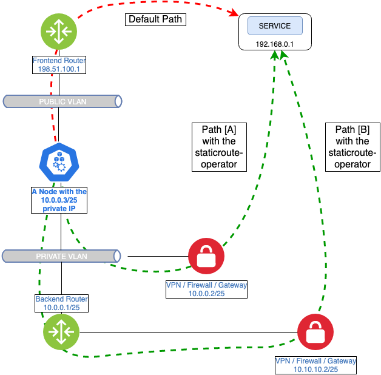

Informational
{: .label }

## Overview

The IBM Cloud Kubernetes Service (IKS) introduces an open source solution to manage arbitrary static routes on Kubernetes cluster nodes in a simple way. The addon lets our customers add static routes to all or just some of the nodes.

End user documentation can be found [here](https://cloud.ibm.com/docs/containers?topic=containers-static-routes).

## Detailed Information

The addon achieves this by adding a CRD (Custom Resource Definition) and running a DaemonSet that looks for changes in such CRs (Custom Resources) and manages the routes in the kernel routing table.

<a href="images/armada-addon/staticroute.png">
</a>

In the diagram above the customer have an otherwise unreachable service at 192.168.0.1, which can be e.g. an on-premises service, any kind of IaaS, PaaS or SaaS from IBM or another provider. Once the customer deployed a VPN, Firewall or Gateway function - out of the scope of this runbook - they can use the addon to adjust routing for the service. By default nodes in a cluster follow the default route to a Fronted Router, which in turn would drop such packets. With the static route addon we can reroute these packets to the aforementioned function, through which the customer's k8s cluster and their service can establish communication.

Path \[A\] shows the high level packet flow when the VPN, etc. function is in the same subnet.

This function can also be in another subnet of the same account, in which case the nodes will send packets to the Backend Router, following  the ```10.0.0.0/8 via eth0``` route to resolve the recursive route added by the addon. Path \[B\] shows this scenario, when a static route with a gateway to which there's no direct route is used to reach the VPN function. Like any other node in the same cluster, but on a different subnet.

## Deploying as an Addon

To tell which Static Route addons are enabled for this cluster, run:

```
ibmcloud ks cluster addons --cluster <CLUSTERID>
```

To enable or disable addon for this cluster, run:
```
ibmcloud ks cluster addon <enable|disable> static-route --cluster <CLUSTERID>
```

## Node Selectors

To limit the scope of a static route to some of the nodes in a cluster, we can use selectors to select a subset of the nodes:

```
apiVersion: static-route.ibm.com/v1
kind: StaticRoute
metadata:
  name: example-staticroute-with-selector
spec:
  subnet: "192.168.1.0/24"
  selectors:
    -
      key: "kubernetes.io/arch"
      operator: In
      values:
        - "amd64"
```

## Protected Subnets

To prevent misrouting traffic critical for the operation of a cluster - such as the Calico POD and Kubernetes Services subnets, the Kubernetes API addresses, the Softlayer IaaS or any other kind of control plane ranges - environment variables can be defined in the PROTECTED_SUBNET_* form, e.g. ```PROTECTED_SUBNET_CALICO=172.30.0.0/16```.

Before going into deep analysis, make sure that customer did not add any such static route, as these can break the control plane, the data plane or both.

## Troubleshooting

The Static Route addon runs as an operator deployed inside a daemonset, that is configured so to tolerate every kind of taints clusterwide. This implies that the operator pods shall run on every cluster node including Edge, Gateway and Worker nodes.
After installing the addon, the following components must exists in the cluster:
  - a Custom Resource Definition called `staticroutes.static-route.ibm.com`
  - a Cluster Role called `staticroute-operator`
  - a Cluster Role Binding `staticroute-operator`
If you are experiencing that some (or all) of the Static Route operator pods are not in a Running state, please check the following:
  - the cluster nodes are in a good condition, up and running and are joined to the cluster
  - the CPU, memory and disk usage of the node where the pod could not start
  - in case of `ImagePullBackoff` state, the registry credentials in the `kube-system` namespace
  - get-master-info job

Run the [get-master-info](https://alchemy-containers-jenkins.swg-devops.com/job/Containers-Runtime/job/armada-deploy-get-master-info/) job and look for the `STATIC ROUTE ADDON:` section for a summary on the CRs:

```
STATIC ROUTE ADDON:

Subnet             Gateway         Desired   Matching  Missing  
192.168.1.1/32     10.94.218.129   4         4         0        
192.168.1.2/32                     4         4         0        
192.168.2.222/23   10.94.218.129   2         2         0        
192.168.31.0/23    10.94.218.129   3         3         0        
192.168.33.222/23                  2         2         0        
192.168.39.222/23                  1         1         0        
192.168.254.0/24   10.94.218.129   0         0         0        
192.168.66.0/23    1.1.1.1         2         0         2 [ERROR!]
192.168.69.0/23    1.1.1.1         4         0         4 [ERROR!]
```

Moreover, look at the CRs `status:` section to verify which nodes applied the staticroute:

```
kubectl get staticroute example-staticroute-with-gateway -o yaml

apiVersion: static-route.ibm.com/v1
kind: StaticRoute
metadata:
[..]
  name: example-staticroute-with-gateway
[..]
spec:
  gateway: 172.17.0.1
  subnet: 192.168.1.0/24
status:
  nodeStatus:
  - error: ""
    hostname: staticroute-operator-fvt-control-plane
    state:
      gateway: 172.17.0.1
      subnet: 192.168.1.0/24
  - error: ""
    hostname: staticroute-operator-fvt-worker2
    state:
      gateway: 172.17.0.1
      subnet: 192.168.1.0/24
  - error: ""
    hostname: staticroute-operator-fvt-worker
    state:
      gateway: 172.17.0.1
      subnet: 192.168.1.0/24
```

And the same with (Node Selectors)[#Node-Selectors]:

```
status:
  nodeStatus:
  - error: ""
    hostname: 10.94.218.198
    state:
      gateway: 10.94.218.129
      selectors:
      - key: kubernetes.io/hostname
        operator: In
        values:
        - 10.94.218.134
        - 10.94.218.198
      subnet: 192.168.2.222/23
  - error: ""
    hostname: 10.94.218.134
    state:
      gateway: 10.94.218.129
      selectors:
      - key: kubernetes.io/hostname
        operator: In
        values:
        - 10.94.218.134
        - 10.94.218.198
      subnet: 192.168.2.222/23
```

### Analyzing the logs

The first operator doing a reconciliation after a staticroute CR has been added will register the static route in its kernel routing table, followed by adding the ```status: nodeStatus: []``` attribute to the object and filling it with its own status.

```
{"level":"info","ts":1586160868.1972249,"logger":"controller_staticroute","msg":
"Registering route","Node":"10.94.218.158","Request.Name":"example-staticroute-1-1"}
{"level":"info","ts":1586160868.198683,"logger":"controller_staticroute","msg":"Update the StaticRoute status","Node":
"10.94.218.158","Request.Name":"example-staticroute-1-1","staticroute":{"nodeStatus":
[{"hostname":"10.94.218.158","state":{"subnet":"192.168.1.1/32","gateway":"10.94.218.129"},"error":""}]}}
```

Other operators reconciling at the same time will fail at first as the object is being modified by another operator.

```
{"level":"error","ts":1586160868.2076592,"logger":"controller_staticroute",
"msg":"Failed to update StaticRoute with finalizer","Node":"10.94.218.135",
"Request.Name":"example-staticroute-1-1","error":"Operation cannot be fulfilled
on staticroutes.static-route.ibm.com \"example-staticroute-1-1\": the object has
been modified; please apply your changes to the latest version and try again",
[....]
}
```

```
{"level":"error","ts":1586160868.2077944,"logger":"controller-runtime.controller","msg":"Reconciler error","controller":
"staticroute-controller","request":"/example-staticroute-1-1","error":"Operation cannot be fulfilled on staticroutes.
static-route.ibm.com \"example-staticroute-1-1\": the object has been modified; please apply your changes to the latest
version and try again","stacktrace":"github.com/go-logr/zapr.(*zapLogger).Error
[....]
```

Eventually it'll be able to do the reconciliation, register the static route in the node's kernel routing table and update the object's ```status: nodeStatus: []``` attribute.

```
{"level":"info","ts":1586160869.208426,"logger":"controller_staticroute","msg":
"Registering route","Node":"10.94.218.135","Request.Name":"example-staticroute-1-1"}
{"level":"info","ts":1586160869.2098272,"logger":"controller_staticroute","msg":
"Update the StaticRoute status","Node":"10.94.218.135","Request.Name":"example-staticroute-1-1","staticroute":
{"nodeStatus":[{"hostname":"10.94.218.158","state":{"subnet":"192.168.1.1/32","gateway":"10.94.218.129"},"error":""},
{"hostname":"10.94.218.135","state":{"subnet":"192.168.1.1/32","gateway":"10.94.218.129"},"error":""}]}}
```
