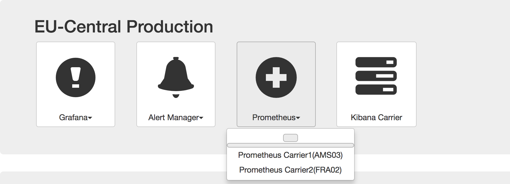
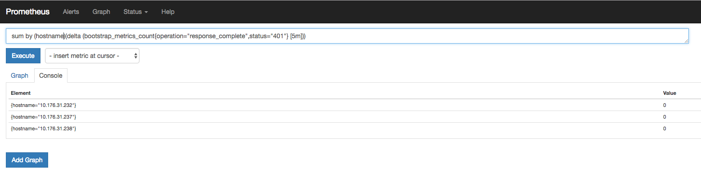

Alert
{: .label .label-purple}

## Overview

The bootstrap process is run on customer workers during a worker deploy and brings the worker up as a functioning Kubernetes worker node.
Armada-bootstrap serves up a post-provisioning script that is specified when ordering machines through the desired IaaS. The script will  set the machine up for a worker-deploy.
During the worker deploy, various Kubernetes components are configured and installed like kubelet and kube-proxy.

This runbook will describe all the alerts from armada-bootstrap and how to resolve them.

| Alert_Situation | Info | Start |
|--
| `BootstrapRequestHandlerFailed`| A worker failed to bootstrap more than 3 times in the past 5 hours. | [Bootstrap Request Handler Failed](#bootstrap-request-handler-failed) |
| `BootstrapTarHandlerFailed`| Failed to serve configuration to a worker more than 3 times in the past 5 hours. | [Bootstrap Tar Handler Failed](#bootstrap-tar-handler-failed) |
| `BootstrapReloadWorkerFailed`| Bootstrap failed to initiate a reload for a worker more than 3 times in the past 5 hours| [Bootstrap Reload Worker Failed](#bootstrap-reload-worker-failed) |
| `BootstrapFinishedStatusNotReported`| A worker has started bootstrapping more than 2 times in the past 5 hours and not reported a final state.| [Bootstrap Finish Status Not Reported](#bootstrap-finished-status-not-reported) |
| `BootstrapCordonJobFailed`| Bootstrap failed to undeploy a worker more than 3 times in the past 5 hours.| [Bootstrap Cordon Job Failed](#bootstrap-cordon-job-failed) |
| `BootstrapCleanupJobFailed`| Bootstrap failed to cleanup a deleted workers K8 data more than 3 times in the past 5 hours.| [Bootstrap Cleanup Job Failed](#bootstrap-cleanup-job-failed) |
| `APIRequestFailedBootstrap`| 5xx HTTP status codes occurring for _bootstrap handler | [API Request Failed Bootstrap](#api-request-failed-bootstrap) |
| `WorkerSetToUnsupportedBomVersion`| Unsupported BOM Version in the environment | [Worker Set to Unsupported Bom Version](#worker-set-to-unsupported-bom-version) |
| `HourFailedCountThresholdBreached`| Threshold breached for amount of worker bootstrap attempts allowed to fail in an hour | [Failed Unique Worker Bootstrap Attempts Breached](#failed-unique-worker-bootstrap-attempts-breached) |
| `BootstrapApplyNetworkPolicyFailed`| Bootstrap failed to apply network policy to the worker 3 times in the past 5 hours | [Bootstrap Apply Network Policy Failed](#bootstrap-apply-network-policy-failed) |
| `BootstrapMachineTypeFailed`| Over 20 unique workers of a specific machine type failed to bootstrap over the past 5 hours | [Bootstrap Machine Type Failed](#bootstrap-machine-type-failed) |
| `BootstrapLabelFailed` | A worker failed to label more than 3 times in the past 5 hours | [Bootstrap Label Failed](#bootstrap-label-failed) |
| `BootstrapTaintFailed` | A worker failed to taint more than 3 times in the past 5 hours | [Bootstrap Taint Failed](#bootstrap-taint-failed) |


{:.table .table-bordered .table-striped}

## ## Example Alert(s)


~~~~
Labels:
 - alertname = BootstrapFinishedStatusNotReported
 - alert_situation = bootstrap_request_handler_failed
 - service = armada-bootstrap
 - severity = warning
 - workerID = kube-dal12-cr0597797da9a2477584c7bd1f78c45718-w1
Annotations:
 - description = It is likely the worker is timing out during the bootstrap process and cannot report a final status before being reloaded
 - runbook = TBD
 - summary = A worker has started more than 2 times in the past 5 hours and not reported a final state. WorkerID: kube-dal12-cr0597797da9a2477584c7bd1f78c45718-w1.
Source: http://localhost/prod-dal10/carrier3/prometheus/graph?g0.expr=changes%28armada_bootstrap%3Abootstrap_request_start_count%5B5h%5D%29+%3E+2+and+changes%28armada_bootstrap%3Abootstrap_request_complete_count%5B5h%5D%29+%3C%3D+0+and+changes%28armada_bootstrap%3Abootstrap_request_fail_count%5B5h%5D%29+%3C%3D+0&g0.tab=0
~~~~

## General Prometheus Usage
Access Prometheus for the specific region by going to the Prometheus web UI for the desired carrier.

<a href="images/armada-bootstrap/Prometheus-Region-Select.png">
</a>

Insert query into top box and click execute.

Clicking on Alerts on the top banner will bring you to a page with all alerts. Failures will show at the top of this page in red

Under the status dropdown clicking rules will bring you to a list of alerts with links

Clicking a link on this page will run a query for you

<a href="images/armada-bootstrap/Prometheus_alert_link.png">
</a>


## Metrics and Queries

### Bootstrap Request Handler Failed
Related metric: bootstrap_request_handler_state_count
Get all metrics associated with a worker: bootstrap_request_handler_state_count{workerID="*workerID*"} > 0

To find only the failures search for: bootstrap_request_handler_state_count{state="FAIL",workerID="*workerID*"} > 0
Search for the `failureReason` tag. The value will provide context on what specifically failed. These reported failures actually occurred on
the worker during the bootstrap process. Please look at the Armada worker verification [runbook](./armada-bootstrap-worker-verification.html)


### Bootstrap Tar Handler Failed
Related metric: bootstrap_tar_handler_state_count
Get all metrics associated with a worker: bootstrap_tar_handler_state_count{workerID="*workerID*"} > 0
Failures in this role are either due to communication errors with the backing etcd cluster storing all customer data. Verify etcd is functioning
properly when experiencing this error. Also verify the config of bootstrap is pointing to the proper etcd instance with the proper auth info.
If problems are still being experienced even though etcd is up, see the Escalation section.


### Bootstrap Reload Worker Failed
Related metric: bootstrap_reload_job_state_count
Get all metrics associated with a worker: bootstrap_reload_job_state_count{workerID="*workerID*"} > 0

Failures in this role are either due to communication errors with the backing etcd cluster storing all customer data or communication errors
to the customer's master API server. Verify etcd is functioning properly when experiencing this error.
Also verify the config of bootstrap is pointing to the proper etcd instance with the proper auth info.
If etcd is up, ensure the customers [master pod is up](#checking-master-pod)
If problems are still being experienced even though etcd and the customer master pod is up, see the Escalation section.


### Bootstrap Finished Status Not Reported
Related metric: bootstrap_request_handler_state_count
Get all metrics associated with a worker: bootstrap_request_handler_state_count{workerID="*workerID*"} > 0

The bootstrap process is starting but continually is timing out.
Please look at the Armada worker verification [runbook](./armada-bootstrap-worker-verification.html)


### Bootstrap Cordon Job Failed
Related metric: bootstrap_cordon_job_state_count
Get all metrics associated with a worker: bootstrap_cordon_job_state_count{workerID="*workerID*"} > 0

Failures in this role are either due to communication errors with the backing etcd cluster storing all customer data. Verify etcd is functioning
properly when experiencing this error. Also verify the config of bootstrap is pointing to the proper etcd instance with the proper auth info.
If problems are still being experienced even though etcd is up, see the Escalation section.


### Bootstrap Cleanup Job Failed
Related metric: bootstrap_worker_cleanup_job_state_count
Get all metrics associated with a worker: bootstrap_worker_cleanup_job_state_count{workerID="*workerID*"} > 0

Failures in this role are either due to communication errors with the backing etcd cluster storing all customer data or because of problems
communicating with the customer master API server (hosted in the carrier). Verify etcd is functioning properly when experiencing this error.
Also verify the config of bootstrap is pointing to the proper etcd instance with the proper auth info. In addition, verify the customer master
is [up and running](#checking-master-pod). If problems are still being experienced even though etcd is up, see the Escalation section.


### Worker Set To Unsupported Bom Version
Related metric: bootstrap_tar_handler_state_count
Get all metrics associated with a worker: bootstrap_tar_handler_state_count{workerID="*workerID*"} > 0

This metric is reported when a worker was set to a BOM version that is not supported. This occurs when deploy has been promoted with a new
BOM version for the master but the bootstrap image in the environment does not support the same version. The newest bootstrap and deploy pods
in stage should both be redeployed to all the envs to ensure they are up to date.


### Failed Unique Worker Bootstrap Attempts Breached
Related metric: changes(armada_bootstrap:bootstrap_request_fail_count[1h]) > 0
To get more detailed information about the failures use the worker ID found above: bootstrap_request_handler_state_count{workerID="*workerID*"} > 0

This alert is triggered when multiple unique workers have failed a bootstrap attempt in the past hour. This is usually indicative of a problem
affecting a region or carrier as a whole (since multiple workers are failing bootstrap attempts). For each worker that is failing, use the `bootstrap_request_handler_state_count`
to dive deeper into why the worker is failing. The [Bootstrap Request Handler Failed](#bootstrap-request-handler-failed) section has details on how to look
more in depth into the failure.

### Bootstrap Apply Network Policy Failed
Related metric:

```
changes(armada_bootstrap:bootstrap_worker_policy_job_state_fail_count [300m]) > 3  and changes(armada_bootstrap:bootstrap_worker_policy_job_state_complete_count[300m]) <= 0
```

To get more detailed information about the failures use the worker ID found above: `bootstrap_worker_policy_job_state_count{workerID="*workerID*"} > 0` and look for the `reason`

This alert is triggered when a worker has failed to apply a network policy more than 3 times in 5 hours without a complete. This is usually indicative of a problem
communicating with the customers etcd instance.
To resolve, check to make sure the master pod is up and reachable [checking the master pod](#checking-master-pod). If problems are still being experienced even though etcd is up, see the [Escalation section](#escalation-policy)

### Bootstrap Machine Type Failed
NOTE: this alert should be escalated to bootstrap squad

Related metric:

```
count by (machineTypeID) (count by (workerID, machineTypeID) (changes(bootstrap_failed_job_state_count{state="bootstrap_failed_job_complete",machineTypeID!=""}[5h]) > 0)) > 20  unless count by (machineTypeID) (changes(bootstrap_bootstrapped_job_state_count{state="bootstrapped_complete",machineTypeID!=""}[5h]) > 0)
```
This alert is triggered when more than 20 unique workers of a specific machineType have failed to bootstrap over the past 5 hours.

Get a list of all unique workerIDs that are failing to bootstrap:

```
count by (workerID) (count by (workerID, machineTypeID) (changes(bootstrap_failed_job_state_count{state="bootstrap_failed_job_complete",machineTypeID!=""}[5h]) > 0))
```

The workerID's can be used to track the state of the worker over time like so:

```
bootstrap_request_handler_state_count{workerID="WORKERID"}
```

where `WORKERID` is the specific workerID being investigated.

In the rest of this section, we explain parts of the alert rule. All the parts are valid queries and will run successfully in the prometheus query UI.

```
changes(bootstrap_failed_job_state_count{state="bootstrap_failed_job_complete",machineTypeID!=""}[5h]) > 0
```
gives an instant vector consisting of time series that changed over the past 5h window.

```
count by (workerID, machineTypeID) (changes(bootstrap_failed_job_state_count{state="bootstrap_failed_job_complete",machineTypeID!=""}[5h]) > 0)
```
aggregates over `workerID` and `machineTypeID` parameters as we only care about the unique `machineType`s that are failing. The `workerID` is required since we want to count the unique `(workerID, machineTypeID)` pairs. If we aggregated over `machineTypeID` only, we would be counting instances of the same worker failing more than once.

```
count by (machineTypeID) (count by (workerID, machineTypeID) (changes(bootstrap_failed_job_state_count{state="bootstrap_failed_job_complete",machineTypeID!=""}[5h]) > 0))
```
aggregates over the `machineTypeID` so that we get `unique` worker failures for a specific machine type in the last 5h.

```
count by (machineTypeID) (count by (workerID, machineTypeID) (changes(bootstrap_failed_job_state_count{state="bootstrap_failed_job_complete",machineTypeID!=""}[5h]) > 0)) > 20
```
applies a threshold to select only those `machineTypeID`'s (technically, to select timeseries labelled with `machineTypeID`s) which have more than 20 unique workers failing in the last 5h.

If a worker of the failing machineType does succeed in bootstrapping, that would mean that the bootstrap failures might have some other reason for failing (i.e. not _all_ workers of the specific `machineTypeID` fail). Thus we want to exclude the `machineTypeID`s that have even a single success in the past 5h.
This is done via:

```
count by (machineTypeID) (changes(bootstrap_bootstrapped_job_state_count{state="bootstrapped_complete",machineTypeID!=""}[5h]) > 0)
```

The `unless` operator removes all timeseries from the LHS instant vector whose labels match those of the RHS instanct vector. Thus, we eliminate all the `machineTypeID`s that have even 1 successful bootstrap in the preceding 5h period.

You can get a list of workerIDs that are failing with the following prometheus query:

```
count by (workerID) (count by (workerID, machineTypeID) (changes(bootstrap_failed_job_state_count{state="bootstrap_failed_job_complete",machineTypeID!=""}[5h]) > 0))
```

### API Request Failed Bootstrap
Related metric: incomingBadRequestCounter

Promethous query:

```sum by (clusterID, workerID) (bootstrap_incoming_malformed_request_count)```

### Bootstrap Label Failed
Related metric: bootstrap_worker_label_fail_count
Get all metrics associated with a worker: bootstrap_worker_label_fail_count{workerID="*workerID*"} > 0

To find only the failures search for: bootstrap_worker_label_fail_count{state="FAIL",workerID="*workerID*"} > 0
Search for the `error` tag. The value will provide context on what specifically failed. An example is provided below


```
bootstrap_apply_label_trigger_count{app="armada-bootstrap",error="Failed to unmarshal label json can not proceed: in",hostname="10.130.231.211",instance="172.16.247.230:8080",job="kubernetes-service-endpoints",kubernetes_namespace="armada",pod_name="armada-bootstrap-67559fcf66-fpnf6",service_name="armada-bootstrap",state="apply_label_trigger_complete",workerID="dev-mex01-pa374bd294bd204dbabf6a770d44dc41dd-w1"}
```
In this example labels were not in proper json form causing a failure

### Bootstrap Taint Failed
Related metric: bootstrap_worker_taint_fail_count
Get all metrics associated with a worker: bootstrap_worker_taint_fail_count{workerID="*workerID*"} > 0

To find only the failures search for: bootstrap_worker_taint_fail_count{state="FAIL",workerID="*workerID*"} > 0
Search for the `error` tag. The value will provide context on what specifically failed. An example is provided below

```
bootstrap_apply_taint_trigger_count{app="armada-bootstrap",error="Failed to unmarshal taint json can not proceed: in",hostname="10.130.231.211",instance="172.16.247.230:8080",job="kubernetes-service-endpoints",kubernetes_namespace="armada",pod_name="armada-bootstrap-67559fcf66-fpnf6",service_name="armada-bootstrap",state="apply_taint_trigger_complete",workerID="dev-mex01-pa374bd294bd204dbabf6a770d44dc41dd-w1"}
```

In this example taints were not in proper json form causing a failure

## Actions to take

### Check failed bootstrap for specific worker

1. Use the information from the alert to achieve the next to steps (clusterID, workerID, and private IP)
2. Check logs for the worker in the bootstrap [pod](#collect-logs-from-worker)
3. Check the [master pod](#checking-master-pod) to verify that it is up and running successfully.

### Collect logs from worker

All reported metrics will give the pod ID in the pod_name field. Use it in order to kubectl exec into the proper pod
Example:
`bootstrap_request_handler_state_count{app="armada-bootstrap",bomVersion="1.8.4_1502",failureReason="DOCKER_REGISTRY_TIMEOUT",hostname="10.184.8.134",instance="172.16.50.119:8080",job="kubernetes-service-endpoints",kubernetes_namespace="armada",pod_name="armada-bootstrap-73533964-f5w66",service_name="armada-bootstrap",state="FAIL",workerID="kube-dal12-cr59f38cbaf824433cb1f2c76ffa6b27ae-w2"}`
In the example above the pod ID	for the reported metric is `armada-bootstrap-73533964-f5w66`

1. Ssh into the carrier where the metrics are being viewed
2. Run `kubectl -n armada exec -it <POD ID> sh (example kubectl -n armada exec -it armada-bootstrap-73533964-f5w66 sh)`
3. cat the specific log you want `cat /go/src/github.ibm.com/alchemy-containers/armada-bootstrap/logs/<workerID>_<attempt number>`.
   using the example above it would be `cat /go/src/github.ibm.com/alchemy-containers/armada-bootstrap/logs/kube-dal12-cr59f38cbaf824433cb1f2c76ffa6b27ae-w2_0` to get the logs for the first reported attempt.
   Each pod will save up to 10 attempts for the worker. Later attempts always overwrite the 10th entry.

The saved logs will contain the last 512K log entries of the log for the bootstrap process. These can be traced
to see all the commands executed on the worker node during the bootstrap process and what went wrong.


### Checking master pod

1. Log onto the master carrier that armada-bootstrap is running on. In prod it is carrier1
`prod-dal10-carrier1-master-01 10.176.31.244`
2. Run `kubectl get pods -n kubx-masters | grep <clusterID>`

   ~~~~~
   root@prod-dal10-carrier1-master-01:/home/kodie# kubectl get pods -n kubx-masters | grep 91bb6b3913b645748961a231967a8016
   master-91bb6b3913b645748961a231967a8016-1213475772-57fvc   6/6       Running             1          9h
   ~~~~~

3. View information about the cluster `kubx-kubectl <clusterID> get all --all-namespaces`

   ~~~~~
	root@prod-dal10-carrier1-master-01:/home/kodie# kubx-kubectl 91bb6b3913b645748961a231967a8016 get all --all-namespaces
	NAMESPACE     NAME                       CLUSTER-IP     EXTERNAL-IP   PORT(S)         AGE
	default       svc/kubernetes             10.10.10.1     <none>        443/TCP         9h
	kube-system   svc/heapster               10.10.10.214   <none>        80/TCP          9h
	kube-system   svc/kube-dns               10.10.10.10    <none>        53/UDP,53/TCP   9h
	kube-system   svc/kubernetes-dashboard   10.10.10.187   <none>        80/TCP          9h

	NAMESPACE     NAME                              DESIRED   CURRENT   UP-TO-DATE   AVAILABLE   AGE
	kube-system   deploy/calico-policy-controller   1         0         0            0           9h
	kube-system   deploy/heapster                   1         0         0            0           9h
	kube-system   deploy/kube-dns-v20-amd64         2         0         0            0           9h
	kube-system   deploy/kubernetes-dashboard       1         0         0            0           9h

	NAMESPACE     NAME                                     DESIRED   CURRENT   READY     AGE
	kube-system   rs/calico-policy-controller-1948799903   1         0         0         9h
	kube-system   rs/heapster-2804433767                   1         0         0         9h
	kube-system   rs/kube-dns-v20-amd64-808160759          2         0         0         9h
	kube-system   rs/kubernetes-dashboard-1141677172       1         0         0         9h
	Unable to connect to the server: read tcp 169.47.213.162:47320->169.47.234.18:31754: read: connection reset by peer
   ~~~~~

4. If the desired number does not equal the current number that indicates that the scheduler is not working. Delete the master pod for it to be rescheduled. `kubectl delete pod <masterPOD> -n kubx-masters`

   ~~~~~
   root@prod-dal10-carrier1-master-01:/home/kodie# kubectl delete pod master-91bb6b3913b645748961a231967a8016-1213475772-57fvc -n kubx-masters
   pod "master-91bb6b3913b645748961a231967a8016-1213475772-57fvc" deleted
   ~~~~~

5. The master will be recreated and the worker will be reloaded. Follow the worker state in etcd or the command line to monitor if it is progressing (reloading -> reloaded -> deploying -> deployed -> normal )


### Checking pod logs for bootstrap

1. `kubectl logs armada-bootstrap-2422823972-lqwl2 -n armada` - displays the logs for that pod (where 2422823972-lqwl2 is the instance/pod) - this will have to be repeated for all pods that are failing
    1. To find the failing logs do something like this, be sure to replace status with the status in the alert.
		`kubectl logs armada-bootstrap-2422823972-lqwl2 --tail=100 -n armada | grep "\"response_code\":\"<status>\""`
	2. Look at the timestamps and grab the relevant logs that line up with the timestamps of the alert and grab the `hostname`, `clusterID`, and `workerID`.

2. or use this command to grab all errors from pods, `kubectl get pods -n armada | grep bootstrap|awk '{print $1}'|xargs -L1 kubectl logs --tail=200 -n armada 2>&1 |grep -i error`


## Escalation Policy
Please follow the [escalation guidelines](./armada-bootstrap-collect-info-before-escalation.html) to engage the bootstrap development squads.
