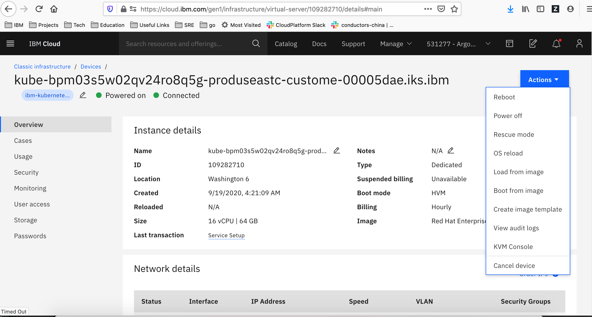

Alert
{: .label .label-purple}

## Overview

This runbook describes how to deal with alerts reporting a **carrier** or **tugboat** node is troubled.

_The steps in this runbook are **invalid** for non-tugboat cruiser clusters_


## Steps for Carriers/Tugboats

This runbook describes how to deal with alerts with carrier/tugboat nodes being down or troubled. It covers nodes down across availability zones and explains how to recover from them.

| Alert_Situation | Info | Start |
| --------------- | ---- | ----- |
| `MultipleNodesNotReadyInAZ`| Multiple nodes are down in a specific availability zone. Immediate action needed | [Multiple nodes not ready in availability zone](#multiple-nodes-not-ready-in-availability-zone) |
| `NodesNotReadyInAZ` or `CordonedNodesNotReadyInAZ` | A node is reporting a not ready status in a specific availability zone | [Nodes not ready in availability zone](#nodes-not-ready-in-availability-zone) |
| `FlappingNodeDetected`| A node has been identified as a flapping node | [Flapping node detected](#flapping-node-detected) |

## Actions to take

<span style="color:red">Look at the alert name and follow the table of contents above.</span> There are two different scenarios and `MultipleNodesNotReadyInAZ` should take priority over `NodesNotReadyInAZ`.

### Multiple nodes not ready in availability zone

#### Example alerts for multiple nodes not ready

~~~~s
Labels:
  - severity = "critical",
  - service = "armada-infra",
  - availability_zone = "dal12"
  - alert_situation = "az_dal12_has_multiple_node_status_ready_false"
  - carrier_name = "prod-dal12-carrier2
Annotations:
  - summary = "There are multiple nodes in availability zone dal12 that are reporting ready state of false",
  - description = "There are multiple nodes in availability zone dal12 that are reporting ready state of false",
~~~~

Multiple nodes are down in a specific availability zone listed in the alert. Immediate action is needed to prevent down times.

#### Actions to take for multiple nodes not ready

Use either prometheus route or logging directly in the carrier to get info

##### Prometheus

1. Lets go to prometheus and find all nodes down in the specific availability zone  
_More info on how to get to prometheus can be found in [armada-general-debugging-info --> general-prometheus-usage](./armada-general-debugging-info.html#general-prometheus-usage)_

1. Run the following query and replace `<availability_zone>` with the availability_zone in the alert

   ~~~~s
   (count(kube_node_status_condition{condition="Ready", status="true"} == 0) by (node)) * on(node) group_left(label_failure_domain_beta_kubernetes_io_zone) (kube_node_labels{label_failure_domain_beta_kubernetes_io_zone="<availability_zone>"})
   ~~~~

1. Go to this section to find and recover the troubled nodes [Debugging the troubled node](#debugging-the-troubled-node)

##### Logging into the carrier

1. Alternative to prometheus is to Find and login into the carrier master having issues, or if it is a tugboat (carrier100+) log onto the hub in the region  
_More info on how to do this step can be found in [armada-general-debugging-info  --> finding-the-carrier-to-log-into-from-pagerduty-alert](./armada-general-debugging-info.html#finding-the-carrier-to-log-into-from-pagerduty-alert)_

1. Run the following command to see the `NotReady` nodes in the specific availability zone  
_Replace `<availability_zone>` with the availability_zone in the alert_

   ~~~~shell
   export AZ=<availability_zone>
   kubectl get nodes -l failure-domain.beta.kubernetes.io/zone=$AZ

   NAME             STATUS       ROLES     AGE       VERSION
   10.130.231.136   Ready        <none>    14d       v1.8.15+IKS
   10.130.231.197   NotReady     <none>    109d      v1.8.15+IKS
   10.130.231.211   NotReady     <none>    109d      v1.8.15+IKS
   10.131.16.67     NotReady     <none>    109d      v1.8.15+IKS
   ~~~~

1. Go to this section to find and recover the troubled nodes [Debugging the troubled node](#debugging-the-troubled-node)

### Nodes not ready in availability zone

#### Example alerts for nodes not ready

~~~~s
Labels:
  - severity = "critical",
  - service = "armada-infra",
  - node = "{{ $labels.node }}",
  - availability_zone = "dal12"
  - troubled_node = "10.341.32.132",
  - alert_situation = "10.341.12.312_in_az_dal12_has_node_status_ready_is_false"
Annotations:
- summary = "Ten or more customer pods in the kubx-* namespaces are in unknown state. Need cleaning up"
- description = "Ten or more customer pods in the kubx-* namespaces are in unknown state. Need cleaning up"
~~~~

#### Actions to take for nodes not ready

There are two scenarios this triggers for.  
- A node is NotReady (cordoned nodes are excluded from the standard 10 minute alert) 
- A node is NotReady but has been cordoned in this state for 8 hours or more

The alert indicates there is a node down in a specific availability zone. The node in question will be in the alert
   - If there is an alert triggering for the same availability zone as this alert with  
   `az_<availabilty_zone>_has_multiple_node_status_ready_false`  
   go to [**Multiple nodes not ready in availability zone**](#multiple-nodes-not-ready-in-availability-zone)
    
   - Else continue [below] to debug further [Debugging the troubled node](#debugging-the-troubled-node)

## Debugging the troubled node

There are tools which now assist with recovering bad nodes (~igorina~ Chlorine and carrier-autorecovery both help)
The initial checks should be to determine if any automation is taking actions against the node.

If the cordoned node alert is firing, then skip to the section on debugging the node in [bot-chlorine-logging](https://ibm-argonauts.slack.com/messages/CDG1R2D5Y) slack channel.  The majority of instances where this fires is because a previous reload attempt has failed to complete.

### For carriers only

Execute `task status` against `Chlorine ~igorina~ bot` to see if there is an active process running against the node then follow the appropriate action(s) bulleted below

   ~~~~shell
   igorina-ha-blue:  (accepting new work) *I'm working on:*
   carrier autorecovery *reload* current:[prod-syd01-carrier2-worker-1012] Ticket: `CHG0272428` `reload-ap-south` (carrier autorecovery)   duration: 31m0s
   Paul Cullen (IKS SRE UK Lead) *reload* current:[prod-mil01-carrier8-worker-1017] Ticket: `CHG0272445` `reload-eu-central` (Paul Cullen (IKS SRE UK Lead))  Passed:[0], Failed:[0], Skipped:[0], Unattempted:[1], InProgress:[0](prod-mil01-carrier8-worker-1017) progress: 1/2, duration: 0s
   Paul Cullen (IKS SRE UK Lead) *reload* current:[prod-syd04-carrier1-worker-1011] Ticket: `CHG0272443` `reload-ap-south` (Paul Cullen (IKS SRE UK Lead))  Passed:[0], Failed:[0], Skipped:[0], Unattempted:[13], InProgress:[0](prod-syd04-carrier1-worker-1011) progress: 1/14, duration: 0s
   carrier autorecovery *reload* current:[prod-syd01-carrier1-worker-1013] Ticket: `CHG0272398` `reload-ap-south` (carrier autorecovery)   duration: 52m0s
   Paul Cullen (IKS SRE UK Lead) *reload* current:[prod-lon02-carrier2-worker-1010] Ticket: `CHG0272447` `reload-uk-south` (Paul Cullen (IKS SRE UK Lead))  Passed:[0], Failed:[0], Skipped:[0], Unattempted:[20], InProgress:[0](prod-lon02-carrier2-worker-1010) progress: 1/21, duration: 0s
   ~~~~

- **If an action is being executed against the node reporting as Not Ready**  
**_"monitor the in progress action"_ :**
    1. Go to [#bot-igorina-logging channel in slack](https://ibm-argonauts.slack.com/messages/CDG1R2D5Y) and search for the machine or ServiceNow Change request number associated with the machine.  
    This should reveal a thread which logs all the actions being taken!
    1. Check the following once the transaction has been found
       - When did the last entry log?  
       If it was several hours ago, it's likely something along the way has failed and not triggered the next step of the reload process (in this case it's usually Softlayer transaction failure or bootstrap failure)
        A typical entry in the slack channel is:
        ~~~~
          prod-lon04-carrier4-worker-1057) Master, processing OS reload for node `prod-lon04-carrier4-worker-1057` (10.45.169.204). Status: reload/bootstrap in progress (osimage 2111415)... this can take between 30 minutes and 2 hours
        ~~~~
       - Find the machine in https://control.softlayer.com
          - If there are no active transactions for the machine and the `Reloaded` date is recent, but the machine is not reachable via SSH, [issue a reload of the server](#reloading-worker-node).
          - If there are no active transactions for the machine, and you can ssh to the machine, when on the machine, check the following:
             - `uptime -s`  
             if the uptime is not recent then it's possible the machine did not even start a reload.  
             [Issue a new reload request](#reloading-worker-node).
             - Check  `/opt/` for log files.  A file named `ws.<machinename>` should exist once a bootstrap is complete.  If this is not present, then there has probably been a failure triggering the bootstrap.  Trigger a new [bootstrap using instructions here](../bootstrap_executing_and_debugging.html)

- **If there are no active transactions listed for this server in `task status` then**
   - Search in [#bot-igorina-logging channel in slack](https://ibm-argonauts.slack.com/messages/CDG1R2D5Y) for the machine name and/or IP address, if hits for this machine are found, review the log entries.
      -  Are the entries recent?
      -  Did anything fail?
      -  Typical failures are with ssh client connections failing, with nodes failing to add to the cluster or patching failures.

- **If you are confident the Node _has_ been reloaded**
   1. Re-execute a command line bootsrap as per [bootstrap using instructions here](../bootstrap_executing_and_debugging.html)  
   _this will re-run a bootstrap and re-run patching_
   1. Follow these steps to [re-add the node to bastion](./armada-carrier-reload-carrier-workers.html#7-add-node-to-bastion)
   1. Once patching has completed for the node, re-run the deploy steps for this node to get it added to the cluster.  This can be achieved by running `@Igorina bot (SRE) worker <node> deploy outage:0` in slack.

- **If no recent entries for this machine are found in [#bot-chlorine-logging channel in slack](https://ibm-argonauts.slack.com/messages/CDG1R2D5Y)**  
**_continue with the remainder of this runbook_**

### For carriers
1. Find and login into the carrier master having issues, or if it is a tugboat (carrier100+) see next section  
_More info on how to do this step can be found in [armada-general-debugging-info --> finding-the-carrier-to-log-into-from-pagerduty-alert](./armada-general-debugging-info.html#finding-the-carrier-to-log-into-from-pagerduty-alert)_

1. List all nodes  
`kubectl get nodes`  
_or, for only "not ready" nodes..._  
_`kubectl get nodes | grep -v " Ready"`_

   ~~~~shell
   kubectl get nodes
   NAME            STATUS     AGE
   10.176.31.233   Ready      21d
   10.176.31.236   Ready      21d
   10.176.31.249   Ready      21d
   10.176.31.251   Ready      21d
   10.176.31.254   NotReady   21d
   ~~~~

1. Cordon all nodes that are **not** listed as `Ready`.  
_Useful to `export` the problem IP addresses as `NODE` for the following command_  
`armada-cordon-node --reason "Node down. Investigation in progress" $NODE`  
_Use the following command to see all cordoned nodes, including the reason for cordoning_  
_`armada-get-cordoned-nodes`_
1. Now that the nodes are cordoned, we can investigate.
1. First, describe the node and look at the `Conditions` section.  
`kubectl describe node $NODE`  
_This information can be added to the ticket if it is being escalated, so save it for later._

   ~~~~shell
   kubectl describe node $NODE

   Roles:              <none>
   Labels:             arch=amd64
                       beta.kubernetes.io/arch=amd64
                       beta.kubernetes.io/os=linux
                       failure-domain.beta.kubernetes.io/region=us-south
                       failure-domain.beta.kubernetes.io/zone=dal12a
                       ibm-cloud.kubernetes.io/worker-version=1.10.11_1536
                       kubernetes.io/hostname=10.185.94.96
                       multi-az-worker=true
   Annotations:        node.alpha.kubernetes.io/ttl=15
                       volumes.kubernetes.io/controller-managed-attach-detach=true
   CreationTimestamp:  Thu, 10 Jan 2019 15:44:09 +0000
   Taints:             multi-az-worker=true:NoSchedule
   Unschedulable:      false
   Conditions:
     Type             Status  LastHeartbeatTime                 LastTransitionTime                Reason                       Message
     ----             ------  -----------------                 ------------------                ------                       -------
     OutOfDisk        False   Tue, 22 Jan 2019 15:51:43 +0000   Thu, 10 Jan 2019 15:44:09 +0000   KubeletHasSufficientDisk     kubelet has sufficient disk space available
     MemoryPressure   False   Tue, 22 Jan 2019 15:51:43 +0000   Thu, 10 Jan 2019 15:44:09 +0000   KubeletHasSufficientMemory   kubelet has sufficient memory available
     DiskPressure     False   Tue, 22 Jan 2019 15:51:43 +0000   Thu, 10 Jan 2019 15:44:09 +0000   KubeletHasNoDiskPressure     kubelet has no disk pressure
     PIDPressure      False   Tue, 22 Jan 2019 15:51:43 +0000   Thu, 10 Jan 2019 15:44:09 +0000   KubeletHasSufficientPID      kubelet has sufficient PID available
     Ready            True    Tue, 22 Jan 2019 15:51:43 +0000   Thu, 10 Jan 2019 15:44:39 +0000   KubeletReady                 kubelet is posting ready status. AppArmor enabled
   ~~~~

Especially check out the `Events` section for any indication of what is the root cause for the node to be troubled. For further debugging, you can also ssh to the node.

1. Reload or reboot depending on type:
   - For carriers: Lets attempt to reboot the worker node(s). [Rebooting worker node](#rebooting-worker-node)
   - For tugboats: Lets attempt to reboot the worker node(s). [Rebooting tugboat worker node](#rebooting-tugboat-worker-node)


1. For carriers & tugboat: If rebooting the worker node does not fix the problem, [reload the worker node](#reloading-worker-node)

1. If reloading does not fix the problem escalate [escalation policy](#escalation-policy)

### For tugboats
1. If it is a tugboat (carrier100+) log onto the hub in the region  
_More info on how to do this step can be found in [armada-tugboats --> access-the-tugboats](./armada-tugboats.html#access-the-tugboats)_
1. Do not forget to call  
`invoke-tugboat`
1. List all nodes  
`kubectl get nodes`  
_or, for only "not ready" nodes..._  
_`kubectl get nodes | grep -v " Ready"`_

   ~~~~shell
   kubectl get nodes
   NAME            STATUS     AGE
   10.176.31.233   Ready      21d
   10.176.31.236   Ready      21d
   10.176.31.249   Ready      21d
   10.176.31.251   Ready      21d
   10.176.31.254   NotReady   21d
   ~~~~

1. Cordon all nodes that are **not** listed as `Ready`.  
_Useful to `export` the problem IP addresses as `NODE` for the following command_  
`armada-cordon-node --reason "Node down. Investigation in progress" $NODE`  
_Use the following command to see all cordoned nodes, including the reason for cordoning_  
_`armada-get-cordoned-nodes`_
1. Now that the nodes are cordoned, we can investigate.
1. First, describe the node and look at the `Conditions` section.  
`kubectl describe node $NODE`  
_This information can be added to the ticket if it is being escalated, so save it for later._

   ~~~~shell
   kubectl describe node $NODE

   Roles:              <none>
   Labels:             arch=amd64
                       beta.kubernetes.io/arch=amd64
                       beta.kubernetes.io/os=linux
                       failure-domain.beta.kubernetes.io/region=us-south
                       failure-domain.beta.kubernetes.io/zone=dal12a
                       ibm-cloud.kubernetes.io/worker-version=1.10.11_1536
                       kubernetes.io/hostname=10.185.94.96
                       multi-az-worker=true
   Annotations:        node.alpha.kubernetes.io/ttl=15
                       volumes.kubernetes.io/controller-managed-attach-detach=true
   CreationTimestamp:  Thu, 10 Jan 2019 15:44:09 +0000
   Taints:             multi-az-worker=true:NoSchedule
   Unschedulable:      false
   Conditions:
     Type             Status  LastHeartbeatTime                 LastTransitionTime                Reason                       Message
     ----             ------  -----------------                 ------------------                ------                       -------
     OutOfDisk        False   Tue, 22 Jan 2019 15:51:43 +0000   Thu, 10 Jan 2019 15:44:09 +0000   KubeletHasSufficientDisk     kubelet has sufficient disk space available
     MemoryPressure   False   Tue, 22 Jan 2019 15:51:43 +0000   Thu, 10 Jan 2019 15:44:09 +0000   KubeletHasSufficientMemory   kubelet has sufficient memory available
     DiskPressure     False   Tue, 22 Jan 2019 15:51:43 +0000   Thu, 10 Jan 2019 15:44:09 +0000   KubeletHasNoDiskPressure     kubelet has no disk pressure
     PIDPressure      False   Tue, 22 Jan 2019 15:51:43 +0000   Thu, 10 Jan 2019 15:44:09 +0000   KubeletHasSufficientPID      kubelet has sufficient PID available
     Ready            True    Tue, 22 Jan 2019 15:51:43 +0000   Thu, 10 Jan 2019 15:44:39 +0000   KubeletReady                 kubelet is posting ready status. AppArmor enabled
   ~~~~

Especially check out the `Events` section for any indication of what is the root cause for the node to be troubled.

1. For further debugging, you cannot ssh to a worker tugboat node. Instead, use [running commands on worker nodes runbook](armada-run-commands-on-workers.html) to safely gain access to IKS worker nodes.

Then you can run commands in this shell for further debugging.

1. Reload or reboot depending on type:
   - For carriers: Lets attempt to reboot the worker node(s). [Rebooting worker node](#rebooting-worker-node)
   - For tugboats: Lets attempt to reboot the worker node(s). [Rebooting tugboat worker node](#rebooting-tugboat-worker-node)

1. For carriers & tugboat: If rebooting the worker node does not fix the problem, [reload the worker node](#reloading-worker-node)

1. If reloading does not fix the problem escalate [escalation policy](#escalation-policy)


### Flapping node detected

This alert is triggered by using the Prometheus function `changes()`.

We will count the node status changing (Ready <-> NotReady) times within 30mins. If that count reaches 4 or above, this alert will be triggered.

There are currently two known causes of flapping nodes:

- **The worker is overloaded**  
These will typically flap until action is taken or workload is reduced sufficiently
- **Calico IP blocks are badly fragmente**  
This will often affect multiple workers, may quickly resolve on one worker only to be seen on another, and has been seen during patch updates.

#### Steps to Take

1. Get the worker name, e.g. `prod-fra02-carrier2-worker-1035` or `kube-bofo5oed00km5g506qvg-produssouth-custome-000069bd`

1. Bring up the [Alchemy Dashboard](https://alchemy-dashboard.containers.cloud.ibm.com)

1. Navigate to [IBM CLoud Logs](https://cloud.ibm.com/observability/logging) then click on the `Cloud Logs` tab.  Select the Instance for the region and click on `Open Dashboard`.

1. In the query field at the top of the window enter a query like this, replacing `WORKER` with
the worker name:  
`host:WORKER app:kubelet.log "setters.go"`

1. If you see messages like the following with `PLEG is not healthy` go to [PLEG is not healthy](#pleg-is-not-healthy).

    ~~~~
    Aug 3 17:33:01 prod-sao01-carrier8-worker-1008 kubelet.log I0803 22:33:00.895924    1701 setters.go:541] Node became not ready: {Type:Ready Status:False LastHeartbeatTime:2020-08-03 22:33:00.895519165 +0000 UTC m=+1885571.887843195 LastTransitionTime:2020-08-03 22:33:00.895519165 +0000 UTC m=+1885571.887843195 Reason:KubeletNotReady Message:PLEG is not healthy: pleg was last seen active 3m15.791311346s ago; threshold is 3m0s}
    ~~~~

1. If you see messages like the following with `container runtime is down` go to [container runtime is down](#container-runtime-is-down)

    ~~~~
    Aug 21 07:51:45 prod-fra02-carrier2-worker-1035 kubelet.log I0821 12:51:45.515407    4945 setters.go:541] Node became not ready: {Type:Ready Status:False LastHeartbeatTime:2020-08-21 12:51:45.515269111 +0000 UTC m=+3253.765863675 LastTransitionTime:2020-08-21 12:51:45.515269111 +0000 UTC m=+3253.765863675 Reason:KubeletNotReady Message:container runtime is down}
    ~~~~

1. Otherwise the messages may reveal another cause that you or development can act on.

#### PLEG is not healthy

`PLEG is not healthy` indicates the worker is overloaded; follow the steps in [Rebooting worker node](#rebooting-worker-node) to recover the worker.

#### container runtime is down

1. Change the IBM Cloud Logs query to a query like this, replacing `WORKER` with the worker name:  
`host:WORKER app:syslog ipam.go "Attempting to assign IPs from non-affine block"`

  That query looks for `syslog` messages like:

  ~~~~
  Aug 21 08:14:29 prod-fra02-carrier2-worker-1035 syslog 2020-08-21 13:14:29.039 [INFO][23948] ipam.go 547: Attempting to assign IPs from non-affine block 172.16.4.0/26 handle="k8s-pod-network.f97b8bcee33bc736ce66918824452e6856c962087c857f36e1291cabaa8ea7d5" host="prod-fra02-carrier2-worker-1035.alchemy.ibm.com"
  ~~~~

1. If the query does not return current messages follow the steps in [Rebooting worker node](#rebooting-worker-node) to recover the worker.

1. If that query returns current messages Calico IP blocks are fragmented and the procedure Calico
uses to assign a pod IP address can take 1 to 2 minutes. The node will continue to operate normally
but the time required to create new pods is degraded. Escalate to the *armada-network* squad.
  * Escalation policy: [Alchemy - Containers Tribe - armada-network](https://ibm.pagerduty.com/escalation_policies#P2MK3WQ)
  * Slack channels: [#armada-dev](https://ibm-argonauts.slack.com/messages/armada-dev), [#armada-network](https://ibm-argonauts.slack.com/messages/armada-network)
  * GHE issues: [armada-network](https://github.ibm.com/alchemy-containers/armada-network/issues/)

  If patch updates are in progress notify the *armada-update* squad. Send a message to `@update` in the `#armada-update` Slack channel.
  They might want to pause updates in the affected region until the problem is resolved.

**TODO:** Investigate a way to inhibit `FlappingNodeDetected` alerts when the problem is due
to Calico. There is a risk that would also inhibit alerts caused by an overloaded node.

## Rebooting worker node

Rebooting a carrier worker node in Armada is not as trivial as issuing a reboot command.  There are steps to take to ensure a proper reboot happens and that customer pods on the worker are rescheduled onto different worker nodes prior to the reboot.

As a result, bots are available to help and perform the manual steps required to safely reboot a node or set of nodes in a region.

### Using bots to reboot

Non SREs - use `igor` to initate a reboot - `reboot <machine> outage  none`

SREs - use `igorina` to initiate a reboot - `reboot <machines> outage:0`

Monitor the progress of the reboot in the channel or DM thread.

## Rebooting tugboat worker node 

Currently, rebooting a tugboat worker node is not supported by bot / jenkins job so hard reboot should be performed via IBM Cloud Classic Infrastructre interface following by the steps below
  - Get IBM Cloud Account number via @netmax `WORKER_NODE`
  - Log into the IBM Cloud account > Classic Infrastructre > Device List
  - Filter by the actual worker ID or IP 
  - Use the `Actions` drop down menu, select `Reboot` option
    

### Manual steps

### Before starting

<span style="color:red">Do NOT drain more than 1 node at a time.</span> This can cause customer outages and drains should be done one at a time.

<span style="color:red">A drain needs to complete successfully before any further action can be completed.</span>

Rebooting multiple nodes at a time is fine, but make sure they have been drained first, one at a time.

### Steps to Take

1. ssh onto the appropriate **master**  
_see the `- environment = prod-xxxnn-carriern` line in the alert_
1. export the variable `NODE`  
_see the line ` - node = {ip address}`_  
`export NODE=ipAddress`
1. Cordon the node if not already done.  
   `armada-cordon-node --reason "REASON" $NODE`  
   _More info on cordon can be found [kubernetes cordon](https://kubernetes.io/docs/user-guide/kubectl/v1.6/#cordon)_
1. Drain the node  
   `armada-drain-node --reason "Node is troubled. Rebooting" $NODE`  
   _The drain will clean up custom resource definitions (CRDs), unknown pods, and all other pods on the troubled node_

1. **Do NOT** continue if a drain fails!  
   Investigate further on why it failed.  
   Look at the 2 scenario below and see if the error relates to any of those.  
   If error is not below, create an issue and escalate [escalation policy](#escalation-policy)

   * If the following errors are reported from the drain:
   1. try the drain again and see if it works
   1. if failed again the second time, check the pods on the node. `kubectl get pods --all-namespaces --field-selector spec.nodeName=$NODE`, if all the pods are in terminating, it is ok to continue this runbook and proceed to reboot.
   1. **Note:** Daemonset pods can be ignored. To see Daemonsets that manage the pods: `kubectl get daemonsets --all-namespaces`
   1. if pods are still in running escalate [escalation policy](#escalation-policy)
     * Error: Timeout reached

     ~~~~txt
     error: Drain did not complete within ...
     ~~~~

     * Error: Unknown controller kind

     ~~~~txt
     error: Unknown controller kind "EtcdCluster" ....
     ~~~~

   * If the following errors are reported from the drain, then try and recover etcd before continuing [etcd recovery run book](./armada-cluster-etcd-unhealthy.html)
        * Error: Unhealthy Etcd Cluster

        ~~~~txt
        EtcdCluster for cluster $CLUSTER_ID in namespace $NAMESPACE is not healthy. It had $RUNNING_CRD_PODS/3 and the EtcdCluster state: "${SUCCESS}" is empty or not available. Manual restore required
        ~~~~
        * Error: Failed to recover Etcd Cluster after delete

        ~~~~txt
        CRD was never able to restore for cluster $CLUSTER_ID in namespace $NAMESPACE. The etcdcluster CRD was never able to reach success status and/or 3 pods never went to running. A manual restore is required before continuing
        ~~~~
1. Issue the worker reboot  
The recommended way to reboot a node is via **Igorina bot** [Slack channel](https://ibm-argonauts.slack.com/messages/DE7DH1YFP), e.g.  
`reboot <nodeToReboot> outage:0`

   _include `nodrain` if all the previous steps have been followed e.g._  
   _`reboot <nodeToReboot> outage:0 nodrain`_

   Alternatively, if Igorina is not available...  
   _Reminder, run these commands on the **worker node** you want to reboot, **not the master**_
   * First, issue the [sync command](https://linux.die.net/man/8/sync)  
   _Sync writes any data buffered in memory out to disk  
   `sync`
   * Next, issue the reboot  
   `sudo reboot -f`

1. Wait for worker to come back online.  
   Note, **both** conditions below need to pass!
   * Run the following commands to monitor the node
     * Ping. Once it starts responding it has come back up  
        `ping -a $NODE`
     * Show node in kubernetes and wait for it to come up as `Ready`  
        `kubectl get nodes -l kubernetes.io/hostname=$NODE -w`
   * If it does not show up after a few minutes after the server has come back online, you will need to log in to the affected worker and troubleshoot further.  Run `sudo -i` and then `journalctl -u kubelet.service` to look for any errors. See [How to view kubelet and other systemd logs via journalctl.](./armada-carrier-view-systemd-logs.html) for more details.
1. Verify the services using Victory. In a DM message `victory` `@victory validate-worker $NODE`
1. If Victory does not work from the previous step, verify services on the node post reboot. SSH to the worker node and run the following commands. All of the following services should be `active (running)`:
   * kubelet  
   `service kubelet status`
   * kube-proxy  
   `service kube-proxy status`
   * docker  
   `service docker status`
   * calico-node  
   `kubectl get pods -n kube-system -l k8s-app=calico-node -o wide | grep $NODE`
1. If these services are not running post-reboot, please attempt to start them.  For kubelet, kube-proxy, and docker, use:  
`service kubelet start`
1. If calico-node does not get to `2/2    Running` status, use the [Kubernetes Networking Calico Node Troubleshooting Runbook](./armada-network-calico-node-troubleshooting.html) to get it running again.
1. If any problems are hit starting these services, please skip the `uncordoning` step and escalate [escalation policy](#escalation-policy)
1. Uncordon the Node  
   `armada-uncordon-node $NODE`
   * more info on uncordon can be found [kubernetes uncordon](https://kubernetes.io/docs/user-guide/kubectl/v1.6/#uncordon)

If reboots of a node do not resolve the issues seen, consider following [reloading instructions below](#reloading-worker-node)

## Reloading worker node

### For Non-SREs, contact the on-call SREs in [#conductors](https://ibm-argonauts.slack.com/messages/C54H08JSK) to initiate a reload of the troubled node.  Please create a GHE ticket in the [conductors team board](https://github.ibm.com/alchemy-conductors/team/issues/new) to track this request.

### For SREs

#### Carrier Reloads

use [#igorina-bot](https://ibm-argonauts.slack.com/messages/DFE2ZN2FL) to initiate a reload, for example, `reload <machinename> outage:0`

#### Tugboat Reloads

1. message `@Chlorine bot (Igorina) (SRE)` the following `@chlorine reload ${NODE_IP_OR_WORKER_ID} outage:0s`. Update `0s` to a more appropriate time if an outage is expected (unlikely)
1. approve ops train that above job raised
1. Wait for chlorine to complete. You can view status in the thread of above cmd, in #chlorine-bot-logging, or by messaging chlorine `task status`
1. If it failed because `error:SoftLayer_Exception_Virtual_Guest_ActiveTransactionExists: There is currently an outstanding transaction for this cloud instance. (HTTP 500)`, check the machine in cloud.ibm.com. If the transaction has been ongoing for a while, raise a ticket with IaaS asking them to investigate.
1. If it failed because `sorry, but request CHG3550472 has been aborted(unstarted)`, it means the train was either rejected or timed out. Try again and be sure to approval the train within 2 hours to prevent it from timing out.
1. all other failures escalate [escalation policy](#escalation-policy)

#### Manual Tugboat Reloads
if the above isnt working because jenkins is down, you can manually reload the tugboat with:

1. raise a prod train using the below template, wait for approval
```
Squad: SRE
Service: tugboat-reload
Title: manual worker reload of <worker> in cluster <cluster>
Environment: <region name>
Details: cordon, drain reload and uncordon worker
Risk: low
PlannedStartTime: now
PlannedEndTime: now+1h
BackoutPlan: Manual repair by conductor
Ops: true
```
1. with approval, start the prod train by DMing Fat controller: `start train <trainID>`
1. on the cluster, drain the node with `armada-drain-node  --reason "broken node needs reload" $node`
1. locally on your machine, log into ibmcloud using the service API key from: https://pimconsole.sos.ibm.com/SecretServer/app/#/secret/28235/general
1. `ibmcloud login --apikey  $API_KEY`
1. list clusters with: `ibmcloud cs clusters`
1. get the cluster name from the tugboat name here: https://github.ibm.com/alchemy-containers/tugboat-cluster-update-monitor/blob/master/maps.json
1. `ibmcloud cs workers --cluster $CLUSTER_ID | grep $IP`
1. issue the reload with: `ic ks worker reload -c $CLISTER_ID -w $NODE`
eg:
```
  ic ks worker reload -c prod-ap-north-carrier100 -w kube-bknls91t0bjak3uaisag-prodapnorth-custome-00008bae
```
1. wait for the reload to complete
1. the node should be uncordoned automatically by the reload work.
1. stop the train - DM Fat controller with `complete train <trainID>`

## Escalation Policy

If a CIE has been raised and you need assistance, please engage the development squad using the [{{ site.data.teams.armada-carrier.escalate.name }}]({{ site.data.teams.armada-carrier.escalate.link }}) pagerduty escalation policy.

If this is not a CIE, you can reach out using the [{{ site.data.teams.armada-carrier.comm.name }}]({{ site.data.teams.armada-carrier.comm.link }}) Slack channel or create a issue in the [{{ site.data.teams.armada-carrier.name }}]({{ site.data.teams.armada-carrier.issue }}) Github repository for later follow-up.
