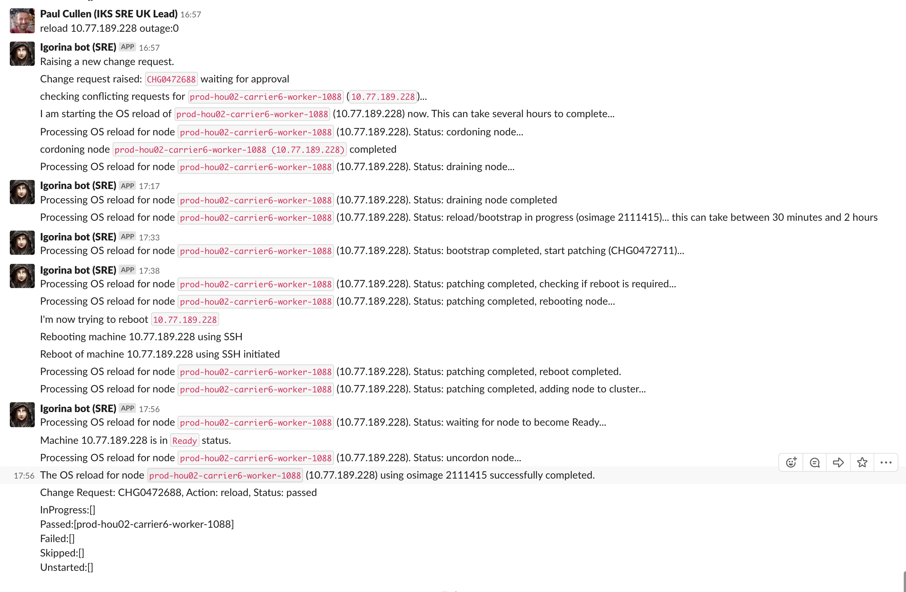

Informational
{: .label }

## Overview

This runbook provides steps for reloading an existing carrier worker that has encountered problems.  

It covers **both**:

- automation in place to assist with worker node reloads
- manual steps needed to do a worker reload if the automation has problems or is unavailable.

## Assumptions

All work in production needs to have prod-trains approval!

## Detailed Information

There are two sections covering how to reload existing worker nodes:

1. [Automated reload steps](#automated-reload-steps)  
_the automated/tooling approaches - which is the preferred method of reload_
1. [Manual reload steps](#manual-reload-steps)  
_describes the manual steps_  
_**NB. These should only be followed if there are issues with the automation!**_

## Automated reload steps

Automated reloading makes use of the `Chlorine bot` (formerly `igorina bot` in [IBM Argonauts slack](https://ibm-argonauts.slack.com)

Example `Chlorine bot` reload commands are:

- `reload 10.77.189.228 outage:0`  
- `reload prod-hou02-carrier6-worker-1088 outage:0`  
_NB: Type `help` command to get list and syntax of all commands supported by `Chlorine`_

The submission of the request will result in the following action being performed by the bot:

1. raise a prod train  
_which will be reviewed and approved by the on-call SREs_
1. After receiving approval, the reload process will log high level status to the submitter in the direct message chat where the request was submitted.

   For example:  

Further logging is available in [#bot-igorina-logging](https://ibm-argonauts.slack.com/archives/CDG1R2D5Y) and in [The Support Accounts LogDNA instance](https://app.us-south.logging.cloud.ibm.com/ca1620a740/logs/view)  
_NB: Only approved persons will have access to LogDNA Logs_

## Manual reload steps

The following steps should be executed **only** when the automation is having issues!

All steps below should be executed on one of the _master nodes of the carrier cluster_ where the worker is located.  

_The steps follow a real example for reloading a worker node (10.77.189.228)_

### 1. Cordon and drain

Drain the worker using the `armada-drain-node` tool  
`armada-drain-node --reason "Performing a manual osreload - your name" 10.77.189.228`

Once the drain completes, verify that the kubx-masters on that node have all been evicted  
`kubectl get pods -o wide -n kubx-masters | grep master | grep <machineIP>`

If the worker is down and there are still master pods on the machine, we need to delete them manually using these steps:  

- get the pod list with:  
`kubectl get pods -o wide -n kubx-masters | grep master | grep <machineIP> > podlist.txt`

- force delete those pods with:  
`awk '{printf "%s\n",$1}' podlist.txt | xargs -rn1 kubectl delete pod -n kubx-masters --force --grace-period 0 -n`

- check that all the pods have been delete from that node by running:  
`kubectl get pods -o wide -n kubx-masters | grep master | grep <machineIP>`

### 2. Issue a reload via IBM Cloud Infrastructure

Once the drain has completed, the worker must be OS reloaded via the IBM Cloud Infrastructure portal

1. The correct image for particular environment and region can be found from [Razee Flags](https://razeeflags.containers.cloud.ibm.com/alchemy-containers/flags/default/production/worker-image). The image name will have a date component at the end e.g. `1190-836-20210429` meaning this image was created on `29 Apr 2021`.
2. Find the device in [IBM Cloud Infrastructure](https://cloud.ibm.com/classic)
3. Go to `Actions -> Load from image`.
4. Select the correct image as determined from Razee in the list of images available to reload from. For example, the image highlighted above is available in the list as `armada-worker-20210429.1`. Notice how the date component matches up.
5. You need to update the **post-provision script** field to point to the correct `bootstrap-one` endpoint.  
_If you are unsure, [see bootstrap-one](https://github.ibm.com/alchemy-conductors/bootstrap-one#os-reload) repo for full details of the endpoint to use._
1. Agree to any confirmation pop ups and then wait for it to complete.

_NB. After the reload has been initiated, the machine "technically" stops being a "worker" as it no longer has `kube` installed!_

### 3. Monitor progress

Monitor the progress of the reload in the [IBM Cloud Infrastructure](https://cloud.ibm.com/classic) portal.

A timer icon will appear when a reload transaction is in progress. Once this disappears, the reload would have completed.

_**If, after several hours, the timer icon is still present, hover over it to get status and raise a support case against IBM Cloud Infrastructure to investigate why the reload has stalled.**_

### 4. Validate bootstrap has completed

Verify that the machine (former worker) has been bootstrapped post reload by following these steps.

- Monitor the slack channel [#bootstrap-bot-alerts](https://ibm-argonauts.slack.com/messages/C53PSDQUC) for information about the machine, you should be looking for a message like  
`** SUCCESS ** <machine> has completed bootstrap`

If bootstrapping has failed, use [bootstrap documentation](./../bootstrap_contents.html) to help debug.

### 5. Validate patching has occurred

A [smith] patch request is submitted at the end of the bootstrap process.  

To verify patching has completed, view the `smith-agent.log` on the reloaded machine.  

- `ssh <user>@<ip of node>`
- `cat /opt/smith-agent.log`

Review the log for completion and whether the patch operation was successful.  A log entry of `Attempting to update state file  /tmp/smith-agent.state  with  [complete Completed successfully]` indicates that patching completed successfully.

If errors are present, investigate and/or engage the UK SRE Squad for assistance if required.

To re-submit a patch request, refer to the [SRE Patching runbook](../sre_patching.html)

### 6. Reboot the machine

After successful completion of patching, the machine will require a restart to complete the patch process and to boot the server into the latest kernel.

_NB: Attempting rebooting via `Chlorine bot` at this stage will report a failure as the machine is not **yet** part of a carrier (not a worker, since `kube` still isn't installed) so will never enter a ready state!_

Log into the machine and issue the reboot command:  
`sudo shutdown -r now`  
_As the machine is not in a K8S cluster yet (hence not "in production") and is being reloaded via a current prod train, a reboot can be performed without an additional prod train_

### 7. Add node to bastion

After a successful patch and reboot, we must add the node to bastion.

Go to the job [bastion-register-nodes-ww](https://alchemy-containers-jenkins.swg-devops.com/job/armada-ops/job/bastion-register-nodes-ww/) and `Build with parameters`  
 _Note: if the node is from **eu-fr2**, please use the [bastion-register-node job](https://alchemy-containers-jenkins.swg-devops.com/job/armada-ops/job/bastion-register-nodes/)_

   - Enter `TARGET_HOSTS_IP` as the node IP(s) which need to be registered to bastion.
   - Enter `TARGET_HOSTNAME` as the hostname of the machine you are registering or one hostname from the same region.  
      - _Example: if the node region is `prod-wdc06` then pick one of worker of that region ie `prod-wdc04-carrier1-worker-1001`_  
   _This is used to figure out which bastion to add the target node to_
   - _Leave `Branch` field defaulting to `master`_

Monitor the output of jenkins job and make sure it succeeds. If it fails for some reason, open a [conductors team issue](https://github.ibm.com/alchemy-conductors/team/issues) with output of jenkins job and label the issue as `bastion`.

### 8. Deploy the machine back into the cluster

If `Chlorine bot` is available, use it to re-deploy the worker node  
`worker 10.77.189.228 deploy outage:0`  
_This process will report status to the user who called it via a Slack Direct message_

If `Chlorine bot` is unavailable, the carrier deploy job can be called directly if needed, details are below:

- In the [armada-carrier-deploy job](https://alchemy-containers-jenkins.swg-devops.com/job/Containers-Runtime/job/armada-carrier-deploy), click on `Build with Parameters`.

Set the following fields based on the environment and carrier you are trying to reload (using the example link above for valid values).  Please double check these fields prior to moving on:

- `Environment`: prod-hou02
- `Carrier`: carrier6
- `WORKERS`: 10.77.189.228

Important: You _MUST_ select the correct branch of armada-ansible to use, or else you will end up with mismatched kubernetes/ansible version for carrier workers.

Use the details in [armada-envs GHE repo](https://github.ibm.com/alchemy-containers/armada-envs/)  
For example, for [prod-hou02 carrier6](https://github.ibm.com/alchemy-containers/armada-envs/blob/master/prod-hou02/carrier6.yml) the values for `BRANCH` and `TARGET_BOM_OVERRIDE` are set in this repo.

Once the parameters are filled in, click `Build`.  
Watch the deploy progress in Jenkins.  [Victory](https://github.ibm.com/sre-bots/victory/) will announce in the [armada-runtime](https://ibm-argonauts.slack.com/messages/C52JJA0EP) Slack channel when the deploy has begun.

### 9. Un-cordon the machine

After the deploy has finished successfully, please remember to un-cordon the worker node.  

This can be done via `Chlorine` using command:  
`worker  10.77.189.228 uncordon outage:0`

Or, from carrier master node using the `armada-uncordon-node` utility:  
`armada-uncordon-node 10.77.189.228`

## Node Validation Post-Deploy

### Automated (easy)

The [armada-node-validation](https://alchemy-containers-jenkins.swg-devops.com/job/Containers-Runtime/job/armada-node-validation/) Jenkins job accepts an IP address and will run the [verify carrier worker node](https://pages.github.ibm.com/alchemy-conductors/documentation-pages/docs/runbooks/armada/armada-carrier-verify-carrier-worker-node.html) runbook then dump the result back to a desired Slack channel (default: armada-runtime).

### Manual

Please use the following [runbook](https://pages.github.ibm.com/alchemy-conductors/documentation-pages/docs/runbooks/armada/armada-carrier-verify-carrier-worker-node.html) for verifying a carrier worker node is up and ready.

## Escalation Policy

If a CIE has been raised and you need assistance, please engage the development squad using the [{{ site.data.teams.armada-carrier.escalate.name }}]({{ site.data.teams.armada-carrier.escalate.link }}) pagerduty escalation policy.

If this is not a CIE, you can reach out using the [{{ site.data.teams.armada-carrier.comm.name }}]({{ site.data.teams.armada-carrier.comm.link }}) Slack channel or create a issue in the [{{ site.data.teams.armada-carrier.name }}]({{ site.data.teams.armada-carrier.issue }}) Github repository for later follow-up.

## Related runbooks

- [Scale Out Existing Carriers](./armada-carrier-scale-out-existing-carriers.html)
- [Ordering new, additional carrier worker nodes](../conductors_requesting_carrier_workers.html)
- [Reload Carrier Master Node](./armada-carrier-reload-carrier-masters.html)
