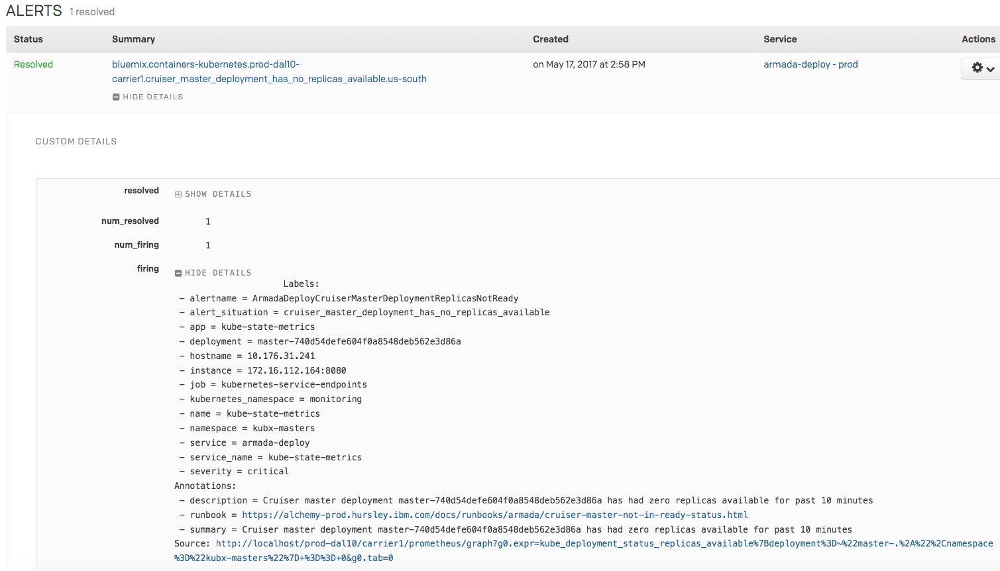

Alert
{: .label .label-purple}

## Overview

This runbook describes how to handle alerts which report a cruiser master deployment which has no replicas available.

kubx-masters are the master node for a customers cruiser.  They run as a pod in the kubx-masters namespace and will be located on a carrier-worker host.

## Example alert(s)

PD alert examples:

- `bluemix.containers-kubernetes.prod-dal10-carrier1.cruiser_master_deployment_has_no_replicas_available.us-south`

## Automation

None

## Actions to take

**First**, check to see if the PD alert has  

    alert_situation = high_percentage_cruiser_master_deployments_no_replicas_available  

  - If it is, follow the steps in the following runbook  
  
    [high_percentage_cruiser_master_deployments_no_replicas_available](armada-deploy-high-percentage-cruiser-master-not-in-ready-status.html)
  
    This alert takes priority and symptoms of this alert are the currently views alert.  
    _Only return to this runbook for the Pagerduty alert once the **high percentage** issue has been resolved._

If just this alert is triggering on its own, we've had at least 1 cruiser master with no replicas available, and has remained unavailable for over 10 minutes.

**Second**, check the alert to see if it is on a patrol carrier and if so, determine whether the master pod is HA by following steps below. 
**If it's an Openshift4 cluster, go to the runbook [Armada HA Cruiser Patrol Master](./armada-ha-cruiser-patrol-master.html)!** 
1. Find and login into the carrier master having issues  
_**Or if it is a tugboat (carrier100+) log onto the hub in the region!**_  
_More info on how to do this step can be found [here](./armada-general-debugging-info.html#finding-the-carrier-to-log-into-from-pagerduty-alert)_
2. Run the following commands  
   If the alert is for an IKS or Openshift3 cluster, the namespace should be kubx-masters.
   
   **For IKS/Openshift3 clusters**
   ~~~
   export NAMESPACE=kubx-masters
   ~~~ 
   
   If the alert is for an Openshift4 cluster, the namespace should be `master-<clusterid>`.
  
    **For Openshift 4 clusters**
   ~~~ 
   export NAMESPACE=master-<clusterid>
   ~~~

    _replacing `<deployment>` with the deployment in the alert_
    ~~~ sh
    export DEPLOYMENT=<deployment>
    kubectl get po -n $NAMESPACE -l app=$DEPLOYMENT
    kubectl get po -n $NAMESPACE -l app=$DEPLOYMENT -o jsonpath="{.items[*].spec.containers[*].name}" | tr " " "\n" | sort | uniq
    ~~~
    
    _Example output:_
    ~~~~    
    $ export DEPLOYMENT="master-fd790681949244cfa467c1b44fc1f1cc"
    $ export NAMESPACE=kubx-masters
    $ kubectl get po -n $NAMESPACE -l app=$DEPLOYMENT
    NAME                                                      READY   STATUS    RESTARTS   AGE
    master-fd790681949244cfa467c1b44fc1f1cc-887bdbbdf-87pkk   4/4     Running   0          9h
    master-fd790681949244cfa467c1b44fc1f1cc-887bdbbdf-vb579   4/4     Running   0          9h
    master-fd790681949244cfa467c1b44fc1f1cc-887bdbbdf-xpkxk   4/4     Running   0          9h
    $ kubectl get po -n kubx-masters -l app=$DEPLOYMENT -o jsonpath="{.items[*].spec.containers[*].name}" | tr " " "\n" | sort | uniq
    apiserver
    controller-manager
    scheduler
    vpn
    ~~~~
3. A cluster is HA if has container `vpn` or `cloud-controller-manager` and does NOT have container `openvpn` and `etcd`
A cluster is non-HA if it has container `openvpn` and `etcd`.
If it is HA then **go to the runbook [Armada HA Cruiser Patrol Master](./armada-ha-cruiser-patrol-master.html)!**  
If it is not HA then
**This runbook can be continued.**
    
    
## Known issues
Next, check if any of the following known issues are occurring for your particular alert.

- **Pods stuck in ContainerCreating, cannot get secrets**

If none of them apply, you can proceed to the next section (**Delete the master pod**) to restart the master pod.

### Pods stuck in ContainerCreating, cannot get secrets

You may see pods stuck in `ContainerCreating` using:

`kubectl get pods -o wide -n $NAMESPACE |grep ContainerCreating`

~~~
jmcmeek@prod-dal12-carrier5-master-01:~$ kubectl get pods -o wide -n $NAMESPACE |grep ContainerCreating
master-4845775e116144bf9b330b7f33d46a4a-282703836-tg31s    0/6       ContainerCreating   0          15m       <none>           10.184.47.41
~~~

`export MYPOD=<podFromCommandAboveResults>`

`kubectl -n $NAMESPACE describe pod $MYPOD`

In the `Events:` section (at the end the description) look for an error related to `get secrets` like this:

~~~
17m		1m		11	{kubelet 10.184.47.40}			Warning		FailedMount	MountVolume.SetUp failed for volume "kubernetes.io/secret/328a7433-c439-11e7-89f3-06f2d382a4a2-default-token-9rpjv" (spec.Name: "default-token-9rpjv") pod "328a7433-c439-11e7-89f3-06f2d382a4a2" (UID: "328a7433-c439-11e7-89f3-06f2d382a4a2") with: the server cannot complete the requested operation at this time, try again later (get secrets default-token-9rpjv)
~~~

If you see an error like that, try restarting the apiserver on the carrier master:

1. Make sure you are logged in to the carrier master
1. `sudo -i`
1. `crictl stop $(crictl ps | grep "kube-apiserver" | awk '{ print $1 }')`
1. `crictl start $(crictl ps | grep "kube-apiserver" | awk '{ print $1 }')`
1. Run `kubectl -n $NAMESPACE get secret`.  That should now succeed.

Monitor the pods to confirm that they are being created properly.  It may take a few minutes for kubernetes to retry.

`kubectl get pods -o wide -n $NAMESPACE |grep ContainerCreating`

#### `unable to mount volume` event
~~~
  Warning  FailedMount            1m    kubelet, 10.144.112.215  Unable to mount volumes for pod "master-5fdf5a05340e4f62a05cb65218d535a1-776f4847f6-sj2z7_kubx-masters(f536b064-1f2e-11e9-af3c-0611a35b86b4)": timeout expired waiting for volumes to attach/mount for pod "kubx-masters"/"master-5fdf5a05340e4f62a05cb65218d535a1-776f4847f6-sj2z7". list of unattached/unmounted volumes=[kubx-masters-nfs]
  Warning  FailedSync             1m    kubelet, 10.144.112.215  Error syncing pod
~~~

If you see an error like that, it means the node needs to be rebooted because it can’t connect to nfs. Which is only an issue for patrol masters not regular ones (so there may be some working and some non working kubx-master pods)

cordon, drain and reboot the machine  
`armada-drain-node --reason "unable to mount NFS volume needs reboot" <NODEIP>`

then get armada-deploy to check the machine before uncordoning it.

## Delete the master pod
If none of the above known issues apply to your particular alert scenario, the one thing that you can try is just simply deleting the master pod.  Kubernetes will automatically recreate the pod once it is deleted.

1. Identify the carrier for the alert by reading the alert subject name, for example, `prod-dal10-carrier1`

1. Inside the body of the alert, there may be two sections, `firing` and `resolved`. An example screenshot of what you may see in the alert can be seen below. Note that you should only process the deployments detailed in the `firing` section. (Be aware that there may be *multiple* deployments in the `firing` section)

  

1. For each master deployment in the `firing` section, perform the following steps:

  * Get the deployment name from the pagerduty alert, set an environment variable where you run kubectl to reference the deployment you are dealing with, and gather details about each deployments pod status. (ex: `master-3dab9ce28c30481183a5c15c944e62ab`)

    ~~~
    export MASTER_ID=master-3dab9ce28c30481183a5c15c944e62ab
    ~~~

  * Retrieve POD status for this deployment.

    ~~~
    kubectl get pods -n $NAMESPACE -o wide -l app=${MASTER_ID}
    ~~~
    
   If the alert is for an IKS or Openshift3 cluster, the namespace should be kux-masters.
   
   **For IKS/Openshift3 clusters**
   ~~~
   export NAMESPACE=kubx-masters
   ~~~ 
   
   If the alert is for an Openshift4 cluster, the namespace should be `master-<clusterid>`.
  
    **For Openshift 4 clusters**
   ~~~ 
   export NAMESPACE=master-<clusterid>
   ~~~

  * Please note the IP of the NODE this Master Pod is located on.  You may have to run through the [Verifying a Carrier Worker](armada-carrier-verify-carrier-worker-node.html) runbook to troubleshoot that actual worker node that this pod has landed on.

  * If you see a master pod with successful output (example below), then that pod is running without error.  Move onto the next deployment in the pagerduty alert. If no more deployments are listed, then the alert should auto resolve and nothing further needs to be done.

    ~~~
    NAME                                                     READY     STATUS             RESTARTS   AGE
    master-3dab9ce28c30481183a5c15c944e62ab-2686662830-xf7ts   6/6      Running           12         21m
    ~~~

  * If `get pods` returns an error state (example below), then continue to the next step

    ~~~
    NAME                                                     READY     STATUS             RESTARTS   AGE
    master-3dab9ce28c30481183a5c15c944e62ab-2686662830-xf7ts   5/6       CrashLoopBackOff   12         21m
    ~~~

  * Gather further details and delete the pod to trigger kubernetes to re-deploy it.

    ~~~
    kubectl describe pods -n $NAMESPACE -l app=${MASTER_ID} > ${MASTER_ID}.describe.txt
    kubectl delete pod -n $NAMESPACE -l app=${MASTER_ID}
    ~~~

  * Monitor the recreation - this process can take several minutes.

    ~~~
    kubectl get pods -w -n $NAMESPACE -l app=${MASTER_ID}   
    ~~~

  * If the pod fails to recreate, re-capture logs for the pod and follow the escalation path detailed below.

  * If the pod recreates successfully, move onto the next deployment in the pagerduty alert.

1. If no more deployments are listed, then the pagerduty alert should auto resolve.

## Escalation Policy

Assuming none of the troubleshooting tips above worked for you to resolve the alert, you will need to just escalate the alert to the dev squad for them to investigate.

### Unique case affecting one customer or cruisers

If this is a unique issue affecting one customer, please involve the `armada-deploy` squad via Slack (#armada-deploy) or create an issue for [{{ site.data.teams.armada-deploy.name }}]({{ site.data.teams.armada-deploy.issue }}) to track.

Snooze the pagerduty and pass to the next SRE shift at handover.

### Affecting multiple customers or cruisers

If a CIE has been raised and you need assistance, please engage the development squad using the [{{ site.data.teams.armada-deploy.escalate.name }}]({{ site.data.teams.armada-deploy.escalate.link }}) pagerduty escalation policy.

If this is not a CIE, you can reach out using the [{{ site.data.teams.armada-deploy.comm.name }}]({{ site.data.teams.armada-deploy.comm.link }}) Slack channel or create a issue in the [{{ site.data.teams.armada-deploy.name }}]({{ site.data.teams.armada-deploy.issue }}) Github repository for later follow-up.

