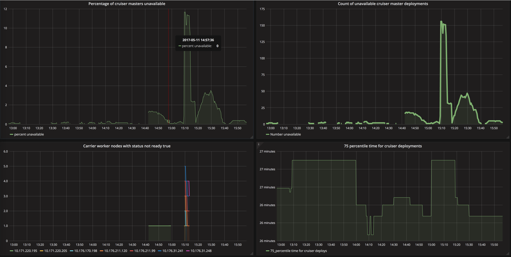

Troubleshooting
{: .label .label-red}

## Overview

This runbook describes how to handle alerts which report a high percentage of cruiser master deployment which have no replicas available.

kubx-masters are the master node for a customers cruiser.  They run as a pod in the kubx-masters namespace and will be located on a carrier-worker host.

## Example alerts

PD alert examples

- `bluemix.containers-kubernetes.prod-dal10-carrier1.high_percentage_cruiser_master_deployments_no_replicas_available.us-south`

## Investigation and Action

### Understanding the impact

If, in a production environment, the alert with situation `high_percentage_cruiser_master_deployments_no_replicas_available` is triggering, then a [pCIE may be required](#discussions-to-have-in-the-cie-channel).

When this alert triggers, we have to monitor the situation in more detail as kubernetes may well be working to resolve the issue automatically.

## Review other alerts at this time

This alert usually triggers when a carrier-worker node has gone into a `Not Ready` state and the cruiser-master deployments on that worker node are being re-scheduled onto other worker node(s).

Look for other alerts triggering at the same time as this alert which may hold a clue as to what has occurred to cause this alert to trigger.

- Node or service `scrape failures`
- `bluemix.containers-kubernetes.prod-dal10-carrier1.az_{{ $labels.label_failure_domain_beta_kubernetes_io_zone }}_has_multiple_node_status_ready_false.us-south`
- `bluemix.containers-kubernetes.prod-dal10-carrier1.{{ $labels.node }}_in_az_{{ $labels.label_failure_domain_beta_kubernetes_io_zone }}_has_node_status_ready_false.us-south`

When a node enters a `Not Ready` state, kubernetes reschedules the cruiser-master deployment PODs on other worker nodes.  

Depending on the number of master pods on the node, this takes several minutes, and the grafana dashboards should be used to see if this has occurred.

### Review grafana

Review the dashboard named `Cruiser master health`

Example link for [prod-dal10-carrier1](https://alchemy-dashboard.containers.cloud.ibm.com/prod-dal10/carrier1/grafana/dashboard/db/cruiser-master-health?orgId=1)

On the dashboard we report metrics which help determine health of the cruiser masters and items that could affect how cruiser masters are running (such as whether a node is in Ready State)

- Total number of cruiser masters deployed in this environment.
- Percentage of cruiser masters unavailable - if over 1% AND this equals 50 or more cruiser masters, it's deemed a pCIE (because of low numbers of cruiser masters being deployed, then when writing this, 1200 cruiser masters existed making 1% only 12 cruiser masters so the decision was made to state 50 cruiser masters as a minimum number but keep the percentage check in place for when numbers of users increases.)
- Count of unavailable cruiser masters - this queries at a deployment level and reports when a deployment has zero replicas available
- Carrier worker nodes in a not ready state - this will show if a machine is in a not ready state - if this happens, it's likely all of the cruiser masters will be in the process of being re-deployed to other worker nodes and the graph for unavailable should be dropping
- 75th percentile time for cruiser deployments - a graph showing the time taken for deployments - long deploy times could account for long times where cruiser masters are unavailable

Here is an example screenshot of the grafana dashboard.

This example relates to a confirmed CIE where we had several worker nodes enter a `Not Ready` state, resulting in over 11% of cruiser masters going unavailable.  Kubernetes automatically resolved this situation by re-deploying these pods to other worker nodes but the process took several minutes (around 30minutes) to complete.  A CIE was raised due to the large number being unavailable even though the issue resolved quite quickly.

### Discussions to have in the cie channel

First, start a discussion in the `#containers-cie` channel stating this alert has triggered and investigation is under way.

Key information we are after to understand if this is a CIE is;

- The percentage of cruiser masters unavailable
- The number of cruiser masters unavailable
- The trend of these figures - are they increasing or decreasing and what is the rate of the increase/decrease.

If the numbers have plateaued above 1% and over 50 cruiser masters are affected, or the numbers are increasing then invoke the CIE process.  The pCIE process is [documented here](../clm-incidents.html) - CIEs are not required for staging environments.

If the numbers are decreasing then discuss further in the CIE channel as a CIE may not be required.  Try and work out the rate of decrease and how long it is estimated to be until the figures reach under 50 cruiser masters being unavailable.

### Actions to take

If the number of cruiser masters not in ready state is not reducing, follow the steps in [cruiser masters not in ready state](armada-deploy-cruiser-master-not-in-ready-status.html) runbook.

## Escalation Policy

If a CIE has been raised and you need assistance, please engage the development squad using the [{{ site.data.teams.armada-deploy.escalate.name }}]({{ site.data.teams.armada-deploy.escalate.link }}) pagerduty escalation policy.

If this is not a CIE, you can reach out using the [{{ site.data.teams.armada-deploy.comm.name }}]({{ site.data.teams.armada-deploy.comm.link }}) Slack channel or create a issue in the [{{ site.data.teams.armada-deploy.name }}]({{ site.data.teams.armada-deploy.issue }}) Github repository for later follow-up.
