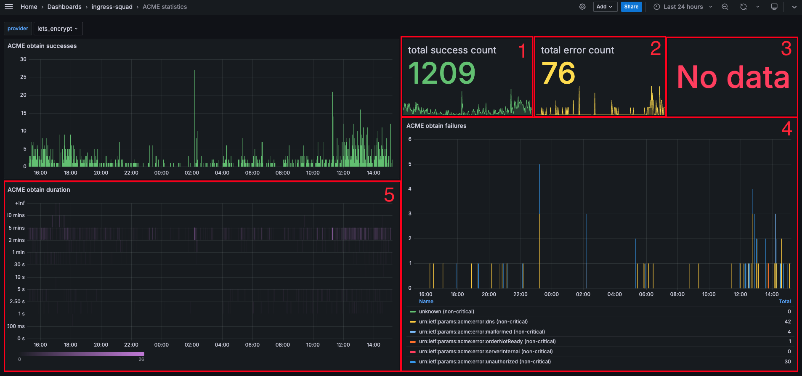

Troubleshooting
{: .label .label-red}

# Certificate Generation Failures

## Overview

This runbook describes how to troubleshoot certificate generation failures.

_armada-dns-microservice_ generates TLS certificates for DNS subdomains whenever a new subdomain is created and then renews the certificate every ~60-90 days. The generation or renewal process might fail for various reasons (issues with the certificate provider, issues with the DNS provider, networking issues, rate limits, etc.).

## Severity

Certificate generation (or renewal) failures can be categorized into critical and non-critical failures.

Critical failures:
- if we fail to generate certificates for new subdomains,
- if we fail to renew certificates for existing subdomains that is going to expire in two days or already expired,
- if we receive a rate limit error for the certificate provider that impacts a whole region or our base subdomain (such as `appdomain.cloud`, `containers.appdomain.cloud` or `satellite.appdomain.cloud`).

Non-critical failures:
- if we fail to renew certificates for existing subdomains where certificates are not close to their expiry dates,
- if we fail to generate certificates for new subdomains due to rate limit errors for a specific subdomain (for example `mycluster-accounthash-0000.eu-gb.containers.appdomain.cloud`).

If _armada-dns-microservice_ records critical failures for a longer period of time a PagerDuty alert is fired.

## Example Alert

PagerDuty would have created an alert with info similar to the following:

```
alertname = IngressDNSCertificateGenerationFailures
alert_key = armada-dns/certificate_generation_failures
alert_situation = certificate_generation_failures
carrier_name = prod-lon04-carrier101
carrier_type = hub-tugboat-etcd
crn_cname = bluemix
crn_ctype = public
crn_region = eu-gb
crn_servicename = containers-kubernetes
crn_version = v1
service = armada-dns
severity = critical
tip_customer_impacting = false
```

Expression:
```
expr: sum(increase(armada_dns_certificate_generation_failure_count{severity="critical"}[10m])) > 0
for: 30m
```

## Investigation and Action

### Certificate Provider Outage

1. Check the [Let's Encrypt status page](https://letsencrypt.status.io/) and the [community forum](https://community.letsencrypt.org/) to see if there are any outages If there are current outages, no further investigation is required. Snooze the alert and inform the Ingress squad. Jump to [Escalation Policy](#escalation-policy) section.

### DNS Provider Outage

1. Check the [Akamai status page](https://www.akamaistatus.com/) to see if there are any outages. If there are current outages, no further investigation is required. Snooze the alert and inform the Ingress squad. Jump to [Escalation Policy](#escalation-policy) section.

1. There might be an issue reaching our DNS nameservers. If you see `ArmadaDNSNameserverError` alerts firing, this alert is just a downstream error, follow the steps in the following runbook: [Akamai nameserver failures](https://github.ibm.com/alchemy-conductors/documentation-pages/blob/master/docs/runbooks/armada/armada-dns-nameserver-failures.md). Snooze the alert and inform the Ingress squad. Jump to [Escalation Policy](#escalation-policy) section.

### ACME Errors

Open the "ACME statistics" Grafana dashboard on the impacted carrier and interpret the results.



Panel 1-2: Compare the success and failure counts. If we have an outstanding number of failures compared to there might be a generic problem and we need to investigate the cause. See Panel 4 for the error breakdown. Document the findings (screenshot) and continue the investigation.

Panel 3: Critical ACME issues impact the whole region. Page the Ingress squad immediately if this shows a number greater than 0. Jump to [Escalation Policy](#escalation-policy) section.

Panel 5: If we have lots of certificate generations queued up (for example after an outage), the obtain duration will be higher than expected. Check if you see an increase in the obtain durations. Document the findings (screenshot) and continue the investigation.

### Logs

1. Select the correct regional IBM Cloud Logs instance in [Alchemy Production's Account 1185207](https://cloud.ibm.com/observe/logging) (kubx-master-microservices-$REGION-STS)

1. Filter the certificate failure logs in _armada-dns-microservice_:
    ```
    Apps: armada-dns-microservice
    search string: certificate generation failed
    ```

1. Review the logs. If you see "i/o timeout" errors we might have a network outage. Try reloading reloading node(s) that host the failing _armada-dns-microservice_ pods.

1. Document the logs (export / copy to a text file).

## Escalation Policy

1. Create a GHE issue in the [armada-frontdoor](https://github.ibm.com/alchemy-containers/armada-frontdoor/issues/) repository and provide results from the investigation.
1. Inform the Ingress squad about the problem via Slack in [#armada-ingress](https://ibm-containers.slack.com/archives/armada-ingress) with the GHE issue link.
1. Escalate the PagerDuty alert  [Armada - containers tribe - Ingress](https://ibm.pagerduty.com/escalation_policies#PPDGLNB), including details of the GHE ticket raised.

## Instructions for Ingress Squad Members

If you conclude that the issue is related to DNS provider problems, raise an [Akamai support ticket](https://github.ibm.com/alchemy-containers/armada-frontdoor/blob/master/wiki/Important-Contacts/README.md#support-cases) and reach out to [Akamai contacts](https://github.ibm.com/alchemy-containers/armada-frontdoor/blob/master/wiki/Important-Contacts/README.md#akamai).

If you conclude that the issue is related to certificate provider problems,it may be necessary to [contact Let's Encrypt](https://github.ibm.com/alchemy-containers/armada-frontdoor/blob/master/wiki/Important-Contacts/README.md#lets-encrypt). Additionally, it might be useful if you open a Let's Encrypt community post with the details of the issue.
