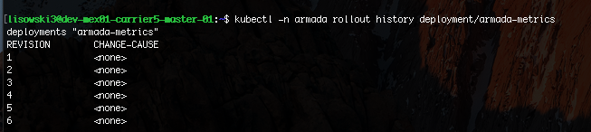

Alert
{: .label .label-purple}

# Armada-Fluentd-Cartographer CrashLoopBackOff troubleshooting

## Overview

Armada-Fluentd-Cartographer is unable to run on carrier.

## Example alert

- `KubernetesPodScrapeFailure`

{{ example_alert }}

## Action to take

### Verify armada-fluentd-cartographer is running in carrier.

1. ssh into the master for the triggered carrier. The list of carriers with their masters can be found in the [{{ site.data.monitoring.cfs-inventory.name }}]({{ site.data.monitoring.cfs-inventory.link }})
2. Check for cartographer's status. `kubectl -n armada get pods | grep cartographer`. Ensure cartographer is running.
    - If the status of cartographer is `CrashLoopBackOff`, delete the pod with `kubectl -n armada delete pod <pod name>`. If the pod doesn't come up in `Running` state then follow the escalation policy.
    - If the status of cartographer is `ImagePullBackoff`, then attempt a rollback of the pod.
    - If the pod is in running state, then the issue has resolved it self. The page can be closed.
    - For any other status besides `Running` follow the escalation policy.

## How to rollback a armada-fluentd-cartographer pod

1. Run `kubectl -n armada rollout history deployment/armada-fluentd-cartographer`
 
2. Rollback to second highest number on list. (in above would be 5) . Using `kubectl -n armada rollout undo deployment/armada-fluentd-cartographer --to-revision=<2nd highest number>`
3. Wait for rollback to finish. To verify rollback finished, observe this command `kubectl -n armada rollout history deployment/armada-fluentd-cartographer` having an extra entry from step 1.
4. If a roll back does not leave the armada-fluentd-cartographer pod in `Running` state then follow the escalation policy.

## Escalation Policy
Please notify {{ site.data.teams.armada-api.comm.name }} and create an issue here {{ site.data.teams.armada-api.link }}.  

- Escalate to [{{ site.data.teams.armada-api.escalate.name }}]({{ site.data.teams.armada-api.escalate.link }})

## Automation
None
