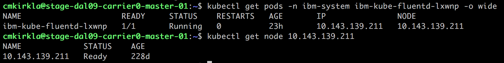
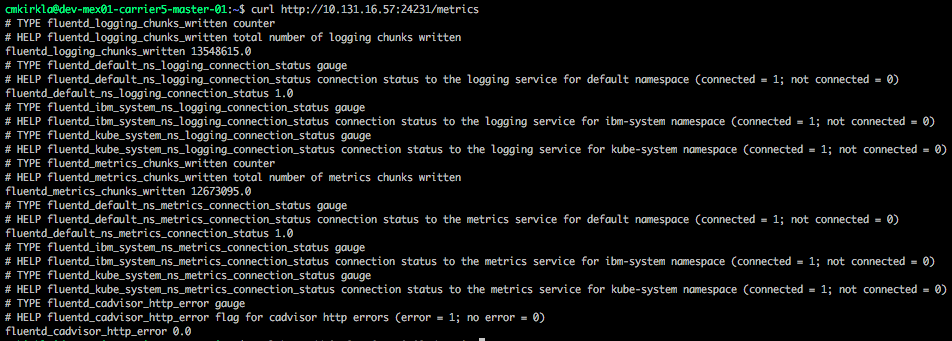

Alert
{: .label .label-purple}

## Overview


This incident is raised when armada-ops cannot probe ibm-kube-fluentd for a period of time.
This is likely due to either ibm-kube-fluentd being down or deployed improperly.
This could also be due to the armada-op checks being too sensitive (paging after one transient fail).

## Example alert
n/a

## Action to take 

### Examine production environment

**Steps:**

1) Log into the proper carrier VM in the production environment so you can run kubectl commands
  * `ssh <username>@<carrier_IP>`
  *  Requires VPN access to the environment as well

2) Ensure the problem is isolated to one pod.  Grab the pod ID from the alert body, and ensure all other fluentd pods are running:
   `kubectl get pods -n kube-system -l app=ibm-kube-fluentd`.
   If more than a few fluentd pods are not Running, escalate to [{{ site.data.teams.armada-api.escalate.name }}]({{ site.data.teams.armada-api.escalate.link }}).
   If the problem is isolated the alerting pod (or a few), continue.

3) Ensure the corresponding node is Ready:
  <a href="images/armada-fluentd/check-node-status.png">
  </a>
   Ensure other pods Running on that node:
   `kubectl get pods --all-namespaces -o wide | grep <NODE_IP> `

   If the node is in a state other than Ready (Ready,SchedulingDisabled is acceptable)  or multiple other pods are not
   Running on that node, escalate to [{{ site.data.teams.armada-api.escalate.name }}]({{ site.data.teams.armada-api.escalate.link }}).

4) If the status of the pod in question is `ImagePullBackOff`, ensure the image version is the same in the fluentd DaemonSet and pod:
 ```
  kubectl -n kube-system get pod <POD_ID> -o json | jq -r '.spec.containers[0].image'  # check pod image
  kubectl -n kube-system get ds ibm-kube-fluentd -o json | jq -r '.spec.template.spec.containers[0].image'  # check daemonset image
 ```
 If the pod image version is different than the DaemonSet image version, delete the pod and wait unit a new pod comes up on that node.  If the new pod
 is in ImagePullBackoff, check the image version of a fluentd pod that is Running on another node.  If that pod's image version is **older** than the
 DaemonSet's image version,  [rollback the fluentd DaemonSet](#rollback-daemonset).

4) If the status of the pod in question's state is not `Running` or `ImagePullBackoff`, escalate to [{{ site.data.teams.armada-api.escalate.name }}]({{ site.data.teams.armada-api.escalate.link }}).

5) If the status of the pod in question is Running, we need to verify that the pod's metrics endpoint is accessible.  From the Carrier master/worker,
  run `curl http://<NODE_IP>:24232/metrics` where <NODE_IP> is the host for the pod in question.  For example,
  <a href="images/armada-fluentd/metrics-endpoint.png">
  </a>
  If the metrics endpoint can be successfully curled, resolve the alert.  Otherwise, escalate to [{{ site.data.teams.armada-api.escalate.name }}]({{ site.data.teams.armada-api.escalate.link }}).


### Actions To Take

#### Rollback Daemonset

NOTE: This only applies for k8s 1.7+!  If you've gotten here when the Carrier still runs k8s 1.5.x, escalate to [{{ site.data.teams.armada-api.escalate.name }}]({{ site.data.teams.armada-api.escalate.link }}).  You can check which
      k8s version the carrier is running via `kubectl version | grep Server`.

1. Roll the DaemonSet back to the previous version: `kubectl -n kube-system rollout undo ds/ibm-kube-fluentd`.
2. Wait for all of the fluentd pods to be restarted; they should be restarted manaully.  However, if they aren't restarted within a few minutes,
  [perform a manual restart](#restart-fluentd-pods).
3. If any of the pods don't reach `Running` state after a few minutes, escalate to [{{ site.data.teams.armada-api.escalate.name }}]({{ site.data.teams.armada-api.escalate.link }}).

#### Restart Fluentd Pods

Run the following to restart all fluentd pods slowly:
```
kubectl -n kube-system get pods -l app=ibm-kube-fluentd | grep -v NAME > fluent_pods.txt

while read line; do
  name=$(echo $line | cut -d ' ' -f1 | xargs)
  kubectl -n kube-system delete pod $name
  sleep 3
done <fluent_pods.txt

echo "pods are all updated, waiting for a bit then checking status"
sleep 15
kubectl -n kube-system get pods -l app=ibm-kube-fluentd
```

If there are relatively few nodes in the cluster (<20ish), you can restart all pods more simply:
```
kubectl -n kube-system delete pods -l app=ibm-kube-fluentd
```
In most Carrier, this isn't a problem.  However, in some large clusters (e.g. Watson/WDP), this can overwhelm the Logging/Metrics services Lumberjack stacks with
too many new connection.

## Automation
None

## Escalation Policy

[{{ site.data.teams.armada-api.escalate.name }}]({{ site.data.teams.armada-api.escalate.link }})
