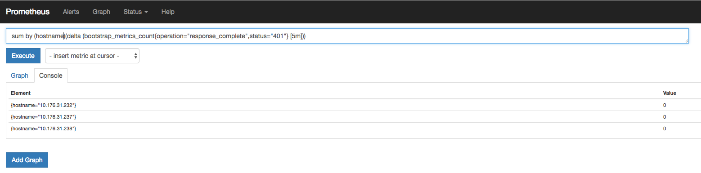

Informational
{: .label }

## Overview

This runbook can be used to go into more depth on how certain actions can be performed. It is helpful for general steps used for debugging armada related work. 
Feel free to add any information to this runbook that can be linked from another runbook. It will help reduce the "noise" in the main runbooks.

## Detailed Information

### General Prometheus Usage
Access Prometheus for the specific region by going to the [Prometheus web UI](https://alchemy-dashboard.containers.cloud.ibm.com/carrier) for the desired carrier.

Insert query into top box and click execute.

Clicking on Alerts on the top banner will bring you to a page with all alerts. Failures will show at the top of this page in red

Under the status dropdown clicking rules will bring you to a list of alerts with links

Clicking a link on this page will run a query for you

### Finding the carrier to log into from PagerDuty Alert
If the alert has the `environment` field populated we can use that to find the carrier where the alert is coming from
* For example: `environment="dev-mex01-carrier5"`

Below are 2 different ways to find this information

### Access the tugboats
To know if the alert is coming from a tugboat, look at the `carrier_name` field and see if the number is `100+`, if so it is a tugboat.
Example PagerDuty is [https://ibm.pagerduty.com/alerts/PER1SZW](https://ibm.pagerduty.com/alerts/PER1SZW)

More info on access the tugboats can be found here: [access the tugboats](./armada-tugboats.html#access-the-tugboats)

##### Using netmax
Send a private message to `netmax` in slack. The message should contain `<environment>-master-01`
* For example: `dev-mex01-carrier5-master-01`

He will send back the Private IP of the master node. 

@kodie:
>*dev-mex01-carrier5-master-01* (_Virtual Server_) - Mexico 1:01 - Acct659397
>_Public:_ `169.57.40.154` _169.57.40.128/25_ (_Dev/Mex01/Carrier1/F_) (_1298 (fcr01a.mex01)_)
>_Private:_ `10.130.231.164` _10.130.231.128/25_ (_Dev/Mex01/Carrier1/B_) (_1297 (bcr01a.mex01)_)
>_OS:_ UBUNTU_16_64

##### Using armada-envs
Go to this repo in github: [https://github.ibm.com/alchemy-containers/armada-envs](https://github.ibm.com/alchemy-containers/armada-envs)
1. Find the region the `environment` field is in
* For example: `dev-mex01-carrier5-master-01` would point to [https://github.ibm.com/alchemy-containers/armada-envs/tree/master/dev-mex01](https://github.ibm.com/alchemy-containers/armada-envs/tree/master/dev-mex01)
1. Navigate down to the carrier hosts that the `environment` field has
* For example: `dev-mex01-carrier5-master-01` would point to [https://github.ibm.com/alchemy-containers/armada-envs/blob/master/dev-mex01/carrier5.hosts](https://github.ibm.com/alchemy-containers/armada-envs/blob/master/dev-mex01/carrier5.hosts)
1. Now, grab the privateIP address listed under the `masters-<environment>` field. 

The private IP can be SSH'd to when openVPN is connected to that specific environment

### View container logs without kubectl
This section will explain how to find container logs of a pod without having to use kubectl. There are cases in kubernetes where viewing logs is not possible, such as when a pod
hits `DeadlineExceeded`. The user will get errors like this when trying to view logs:
~~~~
kubx-etcd-06    job-etcd-op-cont-dev-south-06-1536580800-4gjnq                    0/1       DeadlineExceeded    0          7h        <none>           10.130.231.132
kubectl logs -n kubx-etcd-06 job-etcd-op-cont-dev-south-06-1536580800-4gjnq
Error from server (BadRequest): container "kubx-etcd-backup" in pod "job-etcd-op-cont-dev-south-06-1536580800-4gjnq" is not available
~~~~

1. First, lets export the pod ID and namespace where we are trying to get logs
    ~~~~
    export NAMESPACE=<namespace>
    export POD_ID=<podID>
    ~~~~
1. Now, lets find the node that the pod is on
    ~~~~
    kubectl get po -n $NAMESPACE -o wide -a | grep $POD_ID
    
    
    job-etcd-op-cont-dev-south-06-1536580800-4gjnq                   0/1       DeadlineExceeded   0          7h        <none>           10.130.231.132
    ~~~~
1. SSH to the node that shows the pod being on, in this case `ssh <user>@10.130.231.132`
1. Find the container using docker
    ~~~~
    docker ps -a | grep $POD_ID | grep -v pause
    
    
    a97d831bd1ec        registry.ng.bluemix.net/armada-master/armada-etcd-recovery          "/bin/sh -c 'cp /bin…"         7 hours ago         Exited (1) 7 hours ago                              k8s_kubx-etcd-backup_job-etcd-op-cont-dev-south-06-1536580800-4gjnq_kubx-etcd-06_0e1043fb-b4f1-11e8-b4ed-0689a6c6ce3a_14
    ~~~~
1. Use the ID or the container name from above to view the logs
    ~~~~
    docker logs $CONTAINER_ID
    
    For example:
    docker logs a97d831bd1ec
    ~~~~

### General Grafana Usage

Access Grafana for the specific region by going to the [Grafana web UI](https://alchemy-dashboard.containers.cloud.ibm.com/carrier) for the desired carrier.

Select the grafana dashbaord you wish to see.
You can adjust the time frame and refresh interval in the upper right corner of the screen.
