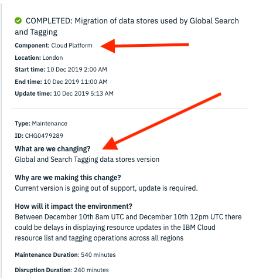

Alert
{: .label .label-purple}

# Armada-Global-API GHoST troubleshooting

## Overview

armada-sync is experiencing HTTP failures when communicating with hypersync.  If armada-sync cannot propogate changes from ETCD to GHoST, then armada-global-api may provide outdated cluster information to users.  The goal should be to identify the root cause and, when necessary, mitigate the affects on our global API responses.

For context, here's some information about GHoST:
> The search service is a global and shared resource properties repository that is integrated in the IBM Cloud Platform. It's used for storing and searching cloud resource attributes. It categorizes and classifies resources. A resource is controlled and owned by resource providers within the IBM Cloud platform, such as Cloud Foundry, IBM Containers, or Resource Controller. Resources are uniquely identified by a Cloud Resource Naming identifier (CRN). The properties of a resource include tags and system properties. Both properties are defined within an IBM Cloud billing account, and span across many regions.
>
> -- https://cloud.ibm.com/apidocs/search

For the purposes of IKS integrations, you can think of GHoST as a global caching layer between the UI/Console (and our global API) and backend IBM services.

## Example alert

- `ArmadaGlobalAPIHypersyncDown`

{{ example_alert }}

## Action to take

### Verify hypersync api

1. Check the IBM Cloud status page (cloud.ibm.com/status) to determine if there are any related outtages or planned maintenance in the affected region; pay particular attention outage and/or maintenance for:
   1. Infrastructure/SoftLayer networking - Wait until the underlying infrastructure outage is mitigated and then ensure the alert resolves.  If not, continue with the runbook.
   1. Hyperwarp/Hypersync - Reach out to the Hyperwarp team on slack [(#hyperwarp-on-duty)](https://ibm-cloudplatform.slack.com/archives/CD464Q9AA/p1572123398019700) to try and understand the outage.
   1. IAM (PDP) or any BSS Components (resource-controller, resource-manager, etc.) - escalate to the relevant team. See the note below about status notifications for these services.
1. Verify the type of failure occuring using this prometheus query
`sum by(code) delta(armada_sync_request_latencies_ms_count{dependency="bss",code!="202"}[15m])`. Escalate to the relevant team based on the status code and then proceed to the **Mitigation** steps below.
    1. If the prometheus query is returning 4XX errors, then we may have an error on the containers side and the PD should be escalated to the containers team using the esclation policy below
    1. If the prometheus query is returning 5XX errors, then the error is on the hypersync side. Escalate to the hypersync team (BSS) here, to this team https://ibm.pagerduty.com/escalation_policies#PI1OUCW.

<br/>
_NOTE: Status and maintenance notifications for IAM and BSS components show up under the generic component name "Cloud Platform".  You will often need to read the notification for more context to determine whether or not it is relevant.  Here is an example maintenance notification for GHoST:_
<p align="center">
    <a href="images/example-ghost-maintenance.png">
        
    </a>
</p>


### Mitigation

GHoST containing stale data can lead to incorrect results being return to our customers from `armada-global-api`.  To mitigate that, we need to disable GHoST as a data source:

1. Go to the [armada-global-api.data-route](https://flags.razee.io/alchemy-containers/flags/armada-users/production/armada-global-api.data-route) feature flag in Razeeflags.
2. Change all three targetting rules from `both-with-cancellation` to `regional` using the drop down.  You'll be prompted to fill in fields for a prod train; use the following:
```
Type: prod
Environment: <affected region>
Squad: Conductors
Test Url: N/A
Risk: Low
Details: disabling GHoST as a data source for armada-global-api to mitigate an observed outage.
Backout Plan: revert to previous value.
```
3. Approve the prod train in `#cfs-prod-trains` and deploy the change using Razeeflags. `armada-global-api` will automatically pick up the change; no pod restarts are required.
4. Once the Hyperwarp outage is mitigated, revert the changes from step 2. **This step is very important as customer will experience degraded API performance while GHoST data is disabled in our global API.** Using Razeeflags, switch all targetting rules back from `regional` to `both-with-cancellation`, create the prod trains, and deploy the change once approved.  You can use the following template for the trains:
```
Type: prod
Environment: <affected region>
Squad: Conductors
Test Url: N/A
Risk: Low
Details: reenabling GHoST as a data source for armada-global-api as Hyperwarp outage has resolved.
Backout Plan: revert to previous value.
```

## Escalation Policy
Please notify {{ site.data.teams.armada-api.comm.name }} and create an issue here {{ site.data.teams.armada-api.link }}.

- Escalate to [{{ site.data.teams.armada-api.escalate.name }}]({{ site.data.teams.armada-api.escalate.link }})

## Automation
None
