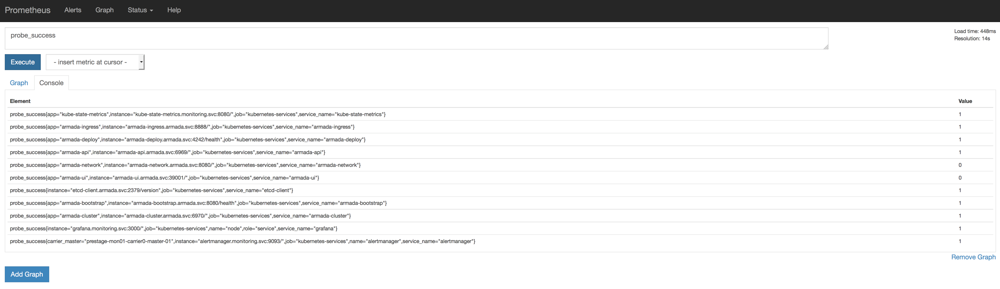
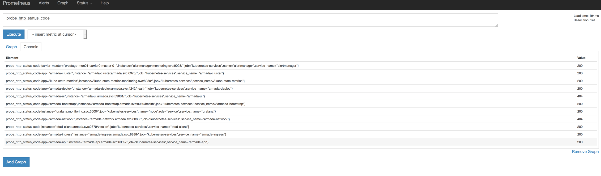

Troubleshooting
{: .label .label-red}

## Overview

The alert triggers when blackbox exporter cannot probe a service.

Blackbox exporter is performing a probe against the service, and in our instance, expecting a HTTP 200 return code to return from the service endpoint we probe.

Blackbox exporter docs are [available here](https://github.com/prometheus/blackbox_exporter) and explain how probing works.

## Example alerts

Example PD title:

- `#3530622: bluemix.containers-kubernetes.prod-dal10-carrier1.kubernetes-services_armada-ingress_probe_failure_service_down.us-south`


## Investigation and Action

- Navigate to prometheus dashboard for the carrier where these alerts are triggering. This can be found here on the [Alchemy prod dashboard](https://alchemy-dashboard.containers.cloud.ibm.com/carrier)

- On the `graph` page, run `probe_success` to return details of all probes occurring - if a service is down, the value returned is 0.

<a href="images/armada-ops/probe_success.png">
</a>

- On the `graph` page, run `probe_http_status_code` to see the HTTP return code of the probe.

<a href="images/armada-ops/probe_http_status_code.png">
</a>

If the probe_success is zero, and the probe_http_status_code is not 200, then we need to check the service status.

For all other cases, follow the escalation steps.

### Checks and possible resolution steps using kubectl

These should be executed from either from your privileged machine which has connection to the environment, or from carrier master node for that environment.

---

Find the state of the pods running for the microservice reporting failures:

For example:  
`kubectl get pods -l app=$SERVICE_NAME --namespace=$NAMESPACE`

```
NAME                              READY     STATUS      RESTARTS   AGE
armada-ingress-3696733406-669w4   0/1       Not Ready   0          13h
armada-ingress-3696733406-dz5lm   0/1       Not Ready   0          13h
armada-ingress-3696733406-g09x1   0/1       Not Ready   0          13h
```

Usually, if a probe attempt is failing, then the service is down, and no PODs will be running.

If the PODs are in `ContainerCreating` state then kubernetes may be in the process of resolving the issue and re-creating the containers.  

If this is the case, monitor the PODs and only continuing with further steps if the containers fail to create after a period of 5 to 10 minutes.

If the PODs are in the `NotReady` state then action will need to be taken  - follow these steps to revive the PODs.

First collect debug incase it is required to further investigate by the development team.

- `kubectl describe pod <pod-name> -n armada` - this will describe the health of the pod and the latest messages associated with it.
- Collect the logs for each pod in this state, this may be needed later for further debug `kubectl logs <pod-name> -n armada > <file>.log 2>&1` (substituting the values in <> with meaningful names)

After collecting debug, delete the PODs:

- `kubectl delete pod <pod-name> -n armada` - this deletes the pod (which will be in not ready state) and the pod is recreated automatically.
-  After deleting, monitor the POD recreation by running `kubectl get pods -n armada` to ensure the pod has recovered successfully.
- You can also re-check the prometheus dashboard as per the start of this runbook to see the results for probe_success and probe_http_status_code.

If the PODs recreate successfully, the associated pagerduty alert should auto resolve.

If the PODs fail to create, re-gather the debug and pod logs as described earlier and follow the steps in `escalation paths` below

## Escalation Policy

If the PODs for the service will not recreate, escalate to the appropriate development squad, as detailed in the [escalation policy](./armada_pagerduty_escalation_policies.html) document.

All debug should be documented in GHE against the squad who owns the service.
