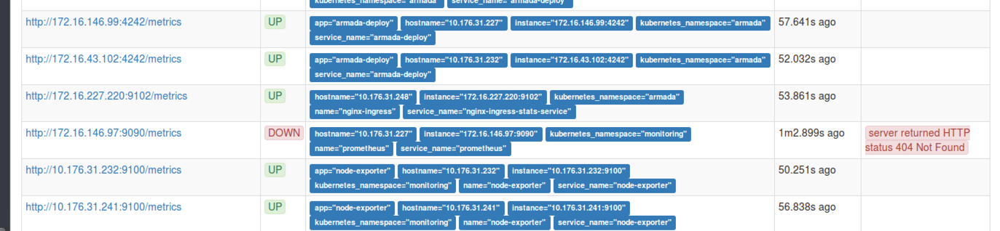

Troubleshooting
{: .label .label-red}

## Overview

The alert triggers when scraping of a service endpoint fails. This alert also acts as a catch-all for any misconfigured microservices.

We will alert if prometheus has been unable to scrape metrics from a service endpoint.

## Example alerts

Example PD title:

- `bluemix.containers-kubernetes.prod-dal10-carrier1.10.176.31.239_prometheus_scrape_failure.us-south`
- `bluemix.containers-kubernetes.prod-dal10-carrier1.10.176.31.239__armada-api_scrape_failure.us-south`
- `bluemix.containers-kubernetes.prod-dal10-carrier1.10.176.31.239_docker-metrics-endpoint_scrape_failure.us-south`
- `ibmcloud.CloudFunctions.functions-prod-us-east-02.10.188.165.182:9100__scrape_failure.us-east`
- `bluemix.containers-kubernetes.prod-fra02-carrier100.10.75.197.52_kubernetes-cadvisor_scrape_failure.eu-de`

Example body:

```
Labels:
- alertname = KubernetesEndpointScrapeFailure
- alert_situation = 10.176.31.239_node-exporter_scrape_failure
- app = node-exporter
- hostname = 10.176.31.239
- instance = 10.176.31.239:9100
- job = kubernetes-service-endpoints
- kubernetes_namespace = monitoring
- name = node-exporter
- pod_name = node-exporter-4hgbs
- service = node-exporter
- service_name = node-exporter
- severity = critical
Annotations:
- description = The node-exporter service-endpoint on host 10.176.31.239 has been failing to scrape for more than 1 minute. Prometheus has been unable to scrape for data
- runbook = https://pages.github.ibm.com/alchemy-conductors/documentation-pages/docs/runbooks/armada/armada-global-scrape-failure.html
- summary = A service-endpoint hosted on 10.176.31.239 is failing to scrape
```

## Investigation and Action 

To identify whether there is a node-exporter failure, please search the alert body for the keyword `node-exporter`. If this is the case, please follow the runbook [How to handle node exporter problem on a master node](./armada-ops-node-exporter-on-carrier-master-troubled.html).

If the carrier is a tugboat (`carrier_name` field number is greater than or equal to 100), please follow the runbook [General debugging info for armada tugboat carriers](./armada-tugboats.html) to access the tugboat first.

### Troubleshooting tips

Executing the following command in the `Chlorine` bot may provide relevant information:

`lookup <node IP>`

For example, after executing a Chlorine lookup on a particular node:

`lookup 10.73.45.242`

Yields the following information:

```
Name: `prod-dal13-carrier3-worker-8009` IP: `10.73.45.242`  IsMaster: `false` IsWorker: `true`
SL Account: `Acct531277` ID: `62043647` Type: `Virtual Server`
Carrier: `prod-dal10-carrier3` Zone: `dal13` Masters: `prod-dal10-carrier3-master-01.alchemy.ibm.com`(10.176.215.15) `prod-dal12-carrier3-master-02.alchemy.ibm.com`(10.185.116.47) `prod-dal13-carrier3-master-03.alchemy.ibm.com`(10.209.39.207)
```

### Verify calico-node is running

Login directly into the carrier or tugboat in the alert. The alert field is `carrier_name`. The namespace for calico-node is `kube-system`.  

To get more details, execute the following commnads:

`export WORKER_IP=<worker IP address>`

If the carrier or tugboat is running IKS version 1.28 or lower:
`kubectl get pods -n kube-system -l k8s-app=calico-node -o wide | grep ${WORKER_IP}`
Else:
`kubectl get pods -n calico-system -l k8s-app=calico-node -o wide | grep ${WORKER_IP}`

Note: in IKS 1.29 and above the calico-node pods are running in the calico-system namespace.

The output will be something similar to the following:
   ```
   jordanj@vbox-jordanj:~$ kubectl get pods -n kube-system -l k8s-app=calico-node -o wide | grep 10.188.165.182
   calico-node-g8vgl   1/1       Running   4          22d       10.188.165.182   10.188.165.182
   ```

If calico-node is not at `1/1    Running` status, use the runbook [Kubernetes Networking Calico Node Troubleshooting Runbook](./armada-network-calico-node-troubleshooting.html) to get it running again.

### If calico-node is running, perform further checks.

1. If the PagerDuty does not auto resolve after fixing calico-node, or if calico-node was already running, follow the remainder of the runbook.

1. Log onto the [prometheus dashboard](https://alchemy-dashboard.containers.cloud.ibm.com/carrier) for the carrier where these alerts are triggering.

1. Switch to the `status -> targets` page

    <a href="images/armada-ops/scrape_error.png">
    </a>


Possible errors include:

- `server returned HTTP status 404 Not Found` - the scrape endpoint is invalid and cannot be scraped.
- `context deadline exceeded` - This means that the scrape timed out and did not complete

### HTTP 404 actions

Escalate to the squad which owns the component which prometheus is unable to scrape. It is likely that the metrics endpoint for this component is not configured properly.  See details in escalation section below for the policy to escalate to.

### Context deadline exceeded actions.

1. Log into worker node which is mentioned in the PD alert

1. From the PD alert, an instance would have been mentioned (an IP address and port).  Use the following command to curl the metrics endpoint of this instance and time how long it takes to return.

   Where instance in the example is `10.176.31.239:9100`

   `time curl -k 10.176.31.239:9100/metrics`

1. This will report the time taken for the metrics endpoint to return its metrics.

   ```
   process_start_time_seconds 1.49676021172e+09
   # HELP process_virtual_memory_bytes Virtual memory size in bytes.
   # TYPE process_virtual_memory_bytes gauge
   process_virtual_memory_bytes 1.713508352e+09

   real	0m0.285s
   user	0m0.000s
   sys	0m0.016s
   ```

1. If this time exceeds 10 seconds, this is the reason why `context deadline exceeded` is occurring.  It's likely a resource issue or docker issue is occurring on the worker node so further investigation is required.

1. To debug further, recheck `calico-node` status as above, and if that is running ok, investigate performance related issues on the worker node.  

1. Check the kubernetes health of the node by issuing:  
`kubectl describe node ${WORKER_IP}`  
_The health output should show recent events and may show events such as OOM errors._

   Use the following checks - this is not an exhaustive list of checks. Use your engineering skills to debug accordingly.

   - Check for high memory on the worker node - Use command `top -o  %MEM` to list processes sorted by memory consumption.  Monitor this output for several minutes and investigate any processes which are consuming high memory, or processes whose memory is rapidly growing.

   Tip: For any processes which are consuming high memory, capture the PID, and check the following file - `/proc/<PID>/cpuset` - this will give details about the process, for example, if it's part of a container, it'll give the docker id.

   - Investigate the processes and escalate to development if issues are found that point at a particular service or component causing high memory which may be causing the prometheus scrapes to timeout on this node.

   - Check for other alerts for this node, such as docker not healthy alerts.  Follow recovery steps for docker health if docker is being reported as unhealthy.

### Context Deadline Exceeded and alerts firing for multiple carriers actions.

If alerts are firing for multiple carriers, and it is determined that calico and the worker nodes are healthy after completing the steps above, then this is most likely an issue with etcd.

- Check the status of the pods that are failing to scrape - Log onto the carrier where the POD is located, and get running pods.  
`kubectl get pods -n <name space> <pod name>`  
_If the PODs are in a non-running state then obtain the logs from some of the pods which are failing to scrape (example commands below and output from a POD failing to connect to Armada etcd.)_

~~~
pcullen@prod-dal12-carrier2-master-01:~$ kubectl get pods -n armada -o wide | grep armada-api
armada-api-5867d86996-5fgc2           0/1       CrashLoopBackOff   322        19h       172.16.2.135     10.185.16.244
armada-api-5867d86996-bzmsq           0/1       CrashLoopBackOff   328        19h       172.16.100.30    10.184.18.162
armada-api-5867d86996-hmvpt           1/1       Running            220        12h       172.16.216.179   10.185.16.144

pcullen@prod-dal12-carrier2-master-01:~$ kubectl -n armada logs armada-api-5867d86996-5fgc2
{"level":"fatal","ts":"2019-11-22T11:52:24.946Z","caller":"lib/etcd.go:38","msg":"error creating etcd client","error":"failed to create prometheus.StoreFactory: failed to create data.StoreFactory: Error getting etcd client: context deadline exceeded", ...}
~~~

If the logs indicate the pod can't connect to etcd, jump to the [general etcd debugging runbook](./armada-etcd-general-troubleshooting.html).

### Blast of alert firing for carrier/tugboat or regional level

When there are substantial number of alert triggered in carrier / tugboat / region level, but all checkpoints above are confirmed not to be related, then it's time to revise network components outside of cluster. 

#### Vyatta healthcheck

Vyatta needs to be checked if it is healthy via [Network Intelligence Vyatta Healthcheck](https://pages.github.ibm.com/alchemy-conductors/documentation-pages/docs/runbooks/netint_vyatta_healthcheck.html)

Manually, high `conntrack` or `ping` can be checked to identify if there is any performance related issue. If so, we need to escalate according to [https://pages.github.ibm.com/alchemy-conductors/documentation-pages/docs/runbooks/netint_vyatta_highping.html](https://pages.github.ibm.com/alchemy-conductors/documentation-pages/docs/runbooks/netint_vyatta_highping.html)

#### HAProxy VIP failover

Another issue that can contribute to performance degradation of private endpoint is slowness with VIP. In this case, we can try to run `VIP Failover` [https://pages.github.ibm.com/alchemy-conductors/documentation-pages/docs/runbooks/armada/armada-carrier-vip-failover.html](https://pages.github.ibm.com/alchemy-conductors/documentation-pages/docs/runbooks/armada/armada-carrier-vip-failover.html) to see if the situation can be eased. 

#### CSE troubleshooting

`cAdvsior scrape failure` can be also caused by CSE itself. If no issue is found with Vyatta and VIP, then it's time to check the response from CSE. There is a jenkins job to help [Customer Service Endpoints for Tugboats](https://pages.github.ibm.com/alchemy-conductors/documentation-pages/docs/runbooks/armada/jenkins-cse-operations.html)


Another method is to use network diagonstic tool such as `mtr` to probe network connection. An example below indicates packet loss between vyatta to CSE box (details can be collected from the jenkins job)
```
alexmk@prod-lon02-firewall-vyattaha1-02:~$ sudo mtr -w -P 30001 -T -c 100 166.9.30.13
Start: 2023-02-17T08:43:18+0000
HOST: prod-lon02-firewall-vyattaha1-02    Loss%   Snt   Last   Avg  Best  Wrst StDev
  1.|-- 10.113.39.195                        0.0%   100    1.0   1.4   0.8  12.6   1.4
  2.|-- ???                                 100.0   100    0.0   0.0   0.0   0.0   0.0
  3.|-- ???                                 100.0   100    0.0   0.0   0.0   0.0   0.0
  4.|-- ???                                 100.0   100    0.0   0.0   0.0   0.0   0.0
  5.|-- ???                                 100.0   100    0.0   0.0   0.0   0.0   0.0
  6.|-- ???                                 100.0   100    0.0   0.0   0.0   0.0   0.0
  7.|-- ???                                 100.0   100    0.0   0.0   0.0   0.0   0.0
  8.|-- 169.254.37.221                       0.0%   100   13.0  13.0  12.1  25.5   1.5
  9.|-- d.1e.09a6.ip4.static.sl-reverse.com  7.0%   100  1083. 709.0  13.1 1113. 504.8
```

Once identified network connectivity failure with CSE, you can engage CSE SRE via `#service-endpoint-sre` channel

**NOTE**: connectivity issue with CSE could cause significant impact to carrier/tugboat, it needs to be addressed timely. 


#### 

### Other useful checks

You can test pulling the metrics for the endpoint which is failing to scrape from outside of the worker node by running these steps.

1. Find the pod in kubernetes matching the problem host IP.

   This is a field in the PD alert or can be found by issuing this command  
   `kubectl get pods --all-namespaces -o wide | grep <ip>`  
   _where IP is the IP of the worker node where the scrape is failing_

1. Discover the port for this POD:  
`kubectl get pod <pod name> --template='{{(index (index .spec.containers 0).ports 0).containerPort}}{{"\n"}}' -n armada`

1. Proxy the metrics endpoint to your local machine:  
`kubectl port-forward -n armada <pod_name> <port>`

1. With the metrics endpoint proxied to your local machine, you should be able to check whether it is working
by visiting `http://localhost:<port>/<path>` in your Web browser. For instance, if the endpoint `instance` value is `172.16.252.168:8080`, then `<port>` would be `8080` and `<path>` would be `metrics` typically.

If the endpoint is working, then there is an issue between prometheus and the endpoint and the armada-ops team will need to investigate.

If the endpoint is not working, delete the pod using `kubectl delete pod <name>` and kubernetes will replace it.
If the issue still exists with the replacement pod, work with the squad who owns the service to fix the scraping issues.

## Escalation Policy

The service could be down and unable to scrape. You'd see multiple alerts related to the service include probe failures.
If this is the case, escalate to the owning squad, and work with them to understand the issue and resolve.  

Engage the correct development squad and work with them to further investigate the issue.

Review the [escalation policy](./armada_pagerduty_escalation_policies.html) document for full details of which squad to escalate to.
