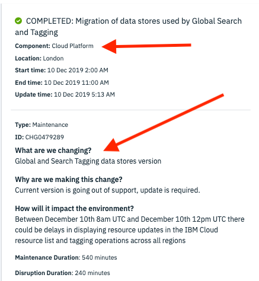

Alert
{: .label .label-purple}

# armada-iam-events hyperwarp callback debugging

## Overview

armada-iam-events ingests iam changes via a webhook registered with hyperwarp. This alert fires when the webhook has not
received events in the last 15 minutes. This could be because of 2 reasons;

our micro service is down
hyperwarp is down

We will be using armada endpoints to debug the situation, find them here: https://github.ibm.com/alchemy-containers/armada-secure/blob/master/secure/armada/armada-regions.yaml#L71

If this alert fires, it is critically important to resolve the situation ASAP.

## Example alert

- `ArmadaIAMEventsHyperwarpIngestDown`

{{ example_alert }}

## Action to take

### Verify our micro service is up

To verify that our microservice is up, take the regional endpoint linked above and append this to the URL. `/v1/iam-events`
Your request should look similar to this: curl -XPOST https://origin.containers.test.cloud.ibm.com/v1/iam-events -vvv

The result should be a 400 Bad Request. If you don't get a response, this means our service is down. 

### Verify Hyperwarp  
View the status of Hyperwarp via the IBM Cloud portal. It is also worth reaching out in #hyperwarp-adopters 

 
_NOTE: Status and maintenance notifications for IAM and BSS components show up under the generic component name "Cloud Platform".  You will often need to read the notification for more context to determine whether or not it is relevant.  Here is an example maintenance notification for GHoST:_

    

### Mitigation

### Microservice Down

Follow normal operating procedures for a pod being down. Restart the pods in the affected region. If there are general issues
in the region (network / compute outages) then obviously those will need to be resolved first.

### Hyperwarp Down

Hyperwarp/Hypersync - Reach out to the Hyperwarp team on slack [(#hyperwarp-on-duty)](https://ibm-cloudplatform.slack.com/archives/CD464Q9AA/p1572123398019700) to try and understand the outage.

## Escalation Policy

- Escalate to [{{ site.data.teams.armada-api.escalate.name }}]({{ site.data.teams.armada-api.escalate.link }}) in the event of unknown errors or unable to recover the pods.
Do not page the team out over Hyperwarp being down, we will not be able to do anything different than the on-call SRE.

## Automation
None