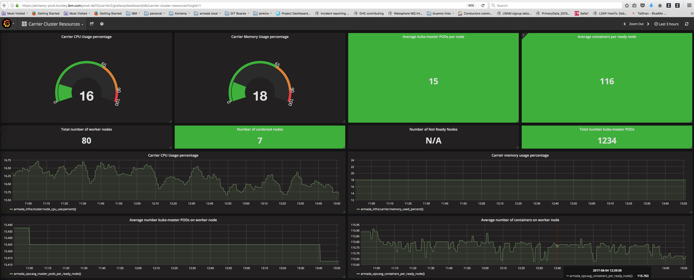

Troubleshooting
{: .label .label-red}

## Overview

This runbook describes how to handle both warning and critical alerts for approaching resource limits for a carrier.

## Example alerts

### Critical alerts which would have brought you here are:

These will trigger if a limit is exceeded for over 1 hour.

- `reached_master_pod_cluster_limit`
- `too_many_containers_for_the_cluster`
- `carrier_memory_over_90_percent`
- `carrier_cpu_over_90_percent`

### Warning alerts that would have brought you here are:

These will trigger if we exceed this limit but do not exceed the critical limits.

- `approaching_master_pod_cluster_limit`
- `warning_too_many_containers_for_the_cluster`
- `carrier_memory_over_65_percent`
- `carrier_cpu_over_65_percent`

## Background information

The alerts were created as a result of [this GHE issue](https://github.ibm.com/alchemy-containers/armada-ops/issues/623)

Their aim is predict when we are moving close to resource limits but before we hit a scenario where the offering becomes impacted as a result.

These threshold will be continually reviewed for accuracy.

The following thresholds have initially been put in place as a result of work completed by armada-ops and the performance teams.

- If the **average number of containers across a carrier for worker nodes in a ready state exceeds** and remains above;

    - `400` for 24 hours - a warning/ low priority alert and automatic GHE issue will be created against the `armada-ops` squad.
    - `500` for 1 hour - a high priority PD alert trigger to SRE on call.

- If the **carrier used CPU average exceeds** and remains above;

    - `65%` for 24 hours - a warning/ low priority alert and automatic GHE issue will be created against the `armada-ops` squad.
    - `90%` for 1 hour - a high priority PD alert trigger to SRE on call.

- If the **carrier used memory average exceeds** and remains above;

    - `65%` for 24 hours - a warning/ low priority alert and automatic GHE issue will be created against the `armada-ops` squad.
    - `90%` for 1 hour - a high priority PD alert trigger to SRE on call.

## Investigation and actions to take.

To make a decision on next steps, start by reviewing the details on the `Carrier Cluster Resources` grafana dashboard.

An example link to prod-dal12 carrier2 is [here](https://alchemy-dashboard.containers.cloud.ibm.com/prod-dal12/carrier2/grafana/dashboard/db/carrier-cluster-resources?orgId=1)

When the **warning** alerts are triggered, they will also automatically raise a GHE issue in the [armada-ops repository](https://github.ibm.com/alchemy-containers/armada-ops/issues).

For **warning** alerts, the armada-ops squad will review the alerts and resources being consumed, and if deemed appropriate will take further actions (such as ordering new worker nodes or setting up a new carrier).

For **critical** alerts, consider these scenarios.

1. Reach out to the armada-carrier squad via [{{ site.data.teams.armada-carrier.escalate.name }}]({{ site.data.teams.armada-carrier.escalate.link }})
  Discussion points with the armada-carrier squad would be:

    - How many worker nodes are there in the environment? Can further nodes be added?
    - Is a new carrier required for this region?

1. Run the manual miner jobs to check that unauthorized use of our service is causing issues

    Until inquisition is created by NetInt, we need should run this [jenkins job](https://alchemy-conductors-jenkins.swg-devops.com/view/Conductors/job/Sandbox/job/test-armada-blast-radius/) to check for miners.

    This job does run automatically several times each day, and will post in [#armada-minerbot](https://ibm-argonauts.slack.com/messages/C69PKMWT0) slack channel.

1. Is this the carrier where patrols (free clusters) are being created?  If so, can the free trial be pointed at another carrier in that region which is not as busy?  Again, this is a discussion point with the development leads.

1. If maintenance is on-going and multiple worker nodes are in `Not Ready` or in `Cordoned` state, this will mean load is spread across fewer worker nodes.  

    In this instance, we'll likely monitor the situation and ensure that the worker nodes where maintenance is being performed are brought back into service as soon as possible.  We should be aware of this maintenance, if not, raise questions in #armada-dev slack channel, and consider paging out the armada-carrier squad.

    Cordoned node status can be checked by log in the master node for a carrier (eg: prod-dal12-carrier2-master-01) and running command `armada-get-cordoned-nodes`

    Work with the development team via the [{{ site.data.teams.armada-carrier.comm.name }}]({{ site.data.teams.armada-carrier.comm.link }}) channel to see if nodes can be uncordoned.

1.  If there are no miners, and all worker nodes are operational (i.e. none are down/not ready state or cordoned) then it's likely usage of the kubernetes offering has increased in this region and additional worker nodes are now required before we hit thresholds where the service will be impacted.

    If this is the case, follow the steps in this [runbook](../conductors_requesting_carrier_workers.html) to order new worker nodes to reduce the resource strain on the environment.

1.  If the alert for `reached_master_pod_cluster_limit` is triggering, then it is likely a new carrier is required to take on new masters. The SRE squad should work with the `armada-carrier` squad to start the ordering process.  Check in [GHE](https://github.ibm.com/alchemy-containers/armada-ops/issues/) for already open GHE issues covering ordering a new carrier.

    For new carriers, we have this runbook which helps order [a new carrier for patrol accounts](./armada-infra-new-carrier-for-patrols.html)

1.  If the alert for `approaching_master_pod_cluster_limit` is triggering, inform the `armada-carrier` squad and Ralph that the carrier is reaching capacity. They will decide on if we need to increase capacity. 

## More information

If the alerts are triggering on a regular basis then we will likely need to engage the performance team to perform further investigation into capacity and resource limits for a carrier.

## Escalation Policy

If a CIE has been raised and you need assistance, please engage the development squad using the [{{ site.data.teams.armada-carrier.escalate.name }}]({{ site.data.teams.armada-carrier.escalate.link }}) pagerduty escalation policy.

If this is not a CIE, you can reach out using the [{{ site.data.teams.armada-carrier.comm.name }}]({{ site.data.teams.armada-carrier.comm.link }}) Slack channel or create a issue in the [{{ site.data.teams.armada-carrier.name }}]({{ site.data.teams.armada-carrier.issue }}) Github repository for later follow-up.
