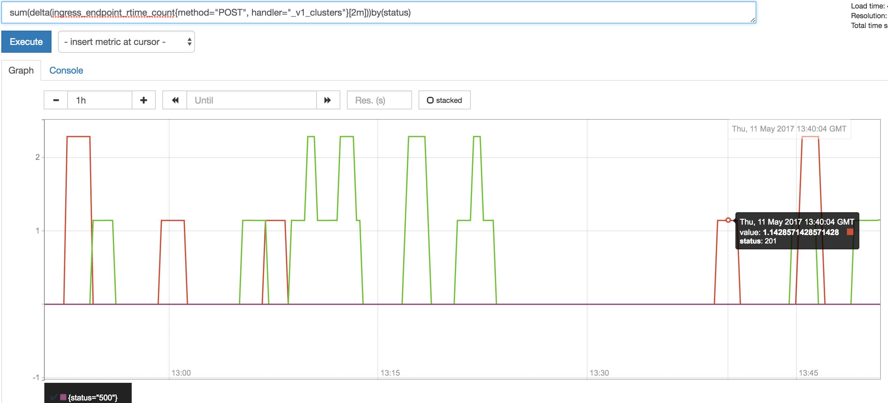

Troubleshooting
{: .label .label-red}

## Overview

This runbook describes how to deal with ingress reporting 5xx errors while creating clusters.

The alert triggering means that an external user has attempted to perform a cluster deploy but it has failed with an internal server error response.
SRE need to investigate this to see if it is a one off issue, or if the ability to create clusters is severely impacted.

## Example Alerts

- `bluemix.containers-kubernetes.prod-dal10-carrier1.v1_clusters-5xx-errors.us-south`

## Determining the severity of the issue

We trigger a PD alert when too many 5xx errors are returned to users when creating clusters.

To understand this, run this query in prometheus:

`sum by (rc, action, path) (increase(armada_global_api_response_codes{rc=~"5..|2..", path=~".*/createCluster.*"}[1m]))`

The query will overlay the number of cluster create API calls for both successful and failed responses.

To determine severity and how customers are impacted, identify the following:

1. Is this a one-off burst of errors?
    * We need to determine if the 5xx responses were surrounded by successful calls or were contained within a short burst.
    * If 2xx responses have occurred, then the problem may have resolved already. The alert may still need investigating, so details should be passed to the `armada-ironsides` squad.
2. Are all calls to create clusters failing?
    * If only 5xx errors are being reported and no 201 success return codes are observed, then cluster creation may be impacted.
    * **However**, the data is gathered from actual customer attempts so be aware that there may not be further attempts to create a cluster.
3. Are both IKS and Satellite affected?
    * If you see 5xx response codes with `/satellite` in the paths, then Satellite is impacted.
    * If you see 5xx response codes without `/satellite` in the paths, then IKS is impacted.

## Investigation and Action
1) If this alert is seen in conjunction with the `response_time_increasing` alert, the 5XX errors may be due to timeout issues. Start by following the `response time increasing` [runbook](https://pages.github.ibm.com/alchemy-conductors/documentation-pages/docs/runbooks/armada/armada-api-response_time_increasing.html). If not, continue with this runbook.

2) Begin by going to the [Alchemy Dashboard](https://alchemy-dashboard.containers.cloud.ibm.com/carrier) and selecting the `Prometheus` icon in the alerted environment.

3) Click on the `Alerts` tab in Prometheus, it should show an active alert (indicated in red) for the corresponding failure and a value.  This value will show the number of occurrences in the past 30 minute window.

4) The `IF` condition is the Prometheus query triggering the alert - click that to go to the graphical view.
From here you can view the query. If a CIE is required, the number triggering will need to be communicated to the development team and ERMs as they will be looking to understand the impact of the problem and how many users have or could be affected.

4) To get a more detailed view of what services are returning errors, run the following query in prometheus"
- `sum by (rc, action, path) (increase(armada_global_api_response_codes{rc=~"5..", path=~".*/createCluster.*"}[1m]))`

  Click on the graph to see what services are reporting `5xx` errors:

Use this graph to identify whether it was a single service failing on lots of machines (hostname will be different for the different errors), multiple different services failing on the same machine (hostname will be the same ), or something else.

5) now lets see how the 500 createCluster errors compare with the amount of traffic going through the system with other return codes:
- `sum by (rc) (increase(armada_global_api_response_codes{path=~".*/v1/.*|.*/v2/.*"}[1m]))`

normally we would expect `200`s  (and maybe some `4xx`s) to be the vast majority of the traffic.

if there are multiple `500` errors, please check the section titled `Is it a pCIE?` and then continue to gather the information for a GHE.

6) let's check if other paths are affected:
- `sum by (path) (increase(armada_global_api_response_codes{rc=~"5..", path=~".*/v1/.*|.*/v2/.*"}[1m]))`
You can ignore `/observe/logging` and `/observe/monitoring` when evaluating if a pCIE to be raised.
If you see that other paths are also affected then only `.*createCluster.*`, that suggest that this is a generic back-end error.

## Raise a GHE (see below where)

6) Use `kubectl` commands on the master node to analyse the situation further:

These steps will need running for both the `armada-api` and `armada-deploy` PODs.

- Log onto the carrier master node for the environment the alerts are triggering, for example, `prod-dal10-carrier1-master-01`.
- `kubectl get pods -n armada` - this will show all pods running in the armada namespace
- `kubectl describe pod armada-api-4034288990-fthbq -n armada` - will give further info on the pod (where `4034288990-fthbq` is the instance/pod) within the armada namespace
- `kubectl logs armada-api-4034288990-fthbq -n armada` - displays the logs for that pod - this will have to be repeated for all pods - re-direct this output to a log file on the server for further analysis - You can use [ scripts located here](https://github.ibm.com/alchemy-conductors/conductors-tools/tree/master/armada/kubectl_tools) to help with obtaining logs.

7) Add results from the Prometheus query, the logs gathered, reinforced with `kubectl` results to the corresponding repository as a New Issue in GitHub

## LogDNA logs

For further investigation, you should be able to find the corresponding error in LogDNA as all logs are forwarded here.
Access LogDNA by going to the [Alchemy Dashboard](https://alchemy-dashboard.containers.cloud.ibm.com/carrier) and selecting the `LogDNA` icon in the alerted environment.

### LogDNA single account check: Ensure a single account isn't generating many 5xx errors

Access LogDNA by going to the [Alchemy Dashboard](https://alchemy-dashboard.containers.cloud.ibm.com/carrier) and selecting the `LogDNA` icon in the alerted environment.

1. In LogDNA run the following query `app:armada-api "statusCode":(>=500)`.
2. Expand a single log entry and select `Extract fields`.
3. In the menu, set the following:
  - Select `iamAccountID` under Include auto-parsed fields.
  - Set the Time Range according to when the errors triggered the alert.
  - Query should auto populate as set in Step 1.
4. Click `Run`, an Aggregated fields menu will pop up. This will show how frequently particular accounts showed up in the current 5xx errors. This can be viewed as % instead of count. If the majority of errors are triggered from one account, this could indicate that it is not a true CIE situation.

## Escalation Policy

### Is it a pCIE?
Based on the results from **5)** with the prometheus query:
- Global API responses: `sum by (rc) (increase(armada_global_api_response_codes{path=~".*/createCluster.*"}[1m]))`
- Armada API responses: `sum(increase(istio_requests_total{destination_app="armada-api",request_path=~".*/createCluster.*"}[1m])) by (response_code)`

Any sustained stream of 5xx responses requires a pCIE.

To determine pCIE severity and its impact, see the [Determining severity](#determining-the-severity-of-the-issue) section above.

If a single customer is generating an error, it needs to be evaluated, why they are able to trigger a 500 RC with user input, or we need to check what the armada-api errors are in LogDNA.

Any `500` error for a failure to create a cluster that has been exposed to a customer.
If cluster creates have been successful following the error (eg: can see spikes on the graph of `200`s after the `500` error that triggered this alert) , and no errors occur for 30 minutes after the fact, then the pCIE can be closed.

If more than 50 failures have occurred and more than 1% of customers are affected, then a pCIE is required as a large number of users are affected, follow the pCIE process as [documented here](../clm-incidents.html) Check the "Cruiser master health" dashboard in Grafana to find the total number of cruiser masters in that specific environment.

Monitor and contribute to the CIE in the #containers-cie channel

If the `500` errors are a large proportion (or all) of the traffic response codes, then something is seriously wrong, and th pCIE should probably become a full CIE.

Work with the development team and the ERMs to resolve the CIE as soon as possible.

### For all issues

Escalate the page to the [armada-api](./armada_pagerduty_escalation_policies.html) escalation policy so the squad can start working the issue.

Raise a [GHE issue](https://github.ibm.com/alchemy-containers/armada-ironsides/issues/new/choose) issue to document the analysis and investigation.
