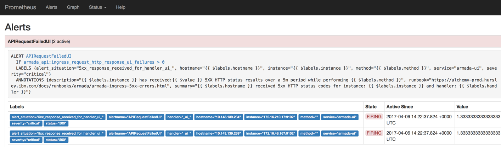
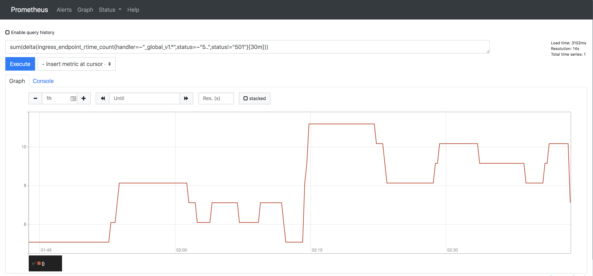
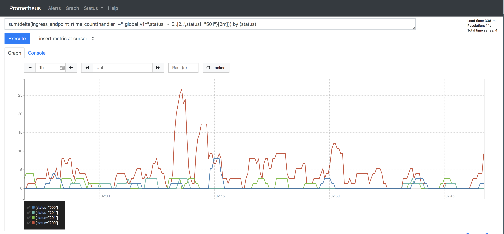

Troubleshooting
{: .label .label-red}

## Overview

This runbook describes how to deal with ingress reporting 5xx errors from the `_global_v1_` backend service.

## Example Alerts

There are several alerts which could have brought you here:

You could have been directly sent here from one of the following alerts from the `armada-global-api` service:

- `bluemix.containers-kubernetes.prod-dal12-carrier2.5xx_responses_received_for_global_v1_handler.us-south`

- `bluemix.containers-kubernetes.prod-dal12-carrier2.critical_number_of_5xx_response_received_for_v1_handler.us-south`

The above alerts may also be triggering at the same time these alerts from the `armada-api` service:

- `bluemix.containers-kubernetes.prod-dal12-carrier2.5xx_response_received_for_v1_handler.us-south`

- `bluemix.containers-kubernetes.prod-dal12-carrier2.critical_number_of_5xx_response_received_for_v1_handler.us-south`

  If these alerts are also triggering then the underlying cause is coming from the armada-api microservice.

The above alerts may also be triggering at the same time as the `_ui_` handler alerts:

- `bluemix.containers-kubernetes.prod-dal12-carrier2.5xx_response_received_for_ui_handler.us-south`

  If the `armada-global-api` and `_ui_` alerts are both triggering together then it is likely the underlying cause is a `armada-global-api` service issue (especially if the rate of alerts for each service is the same), so the investigation into the `armada-global-api` service issues should take priority.

## Investigation and Action

The investigation depends on which alerts are triggering.

- `critical_number_of_5xx_response_received_for_v1_handler` alert is triggering from the `armada-global-api` service, then we've hit the threshold where the pCIE process needs to be invoked. Keep reading this list if other alerts mentioned above are also present.

  SRE engineers may see this issue auto resolve quickly in pagerduty - if that happens investigation into the issue is _**still**_ required and a retro active PCIE _**is**_ required.

- `5xx_responses_received_for_global_v1_handler` is triggering on its own, (with or without any `_ui_` related 5xx alerts) then go to the section titled `investigating the problem` below.

  This alert triggering on its own means we have received 15 or more errors from the `armada-global-api` service in the last 30 minutes. We have a threshold of 50 errors from the `armada-global-api` service in a 2 min window before a pCIE is required. We therefore need to investigate the `warning` level alert as it could be early signs that there is a problem with the armada-api service.

- `5xx_response_received_for_v1_handler` or `5xx_response_received_for_v1_handle` (note: these aren't `armada-global-api` service alerts but `armada-api` service alerts) are also triggering. This means that there are issues in the armada-api microservice. Since the armada-global-api microservice is a proxy to the armada-api microservice, the underlying issue triggering this alert lies with armada-api. **Stop and immediately follow the [armada-ingress-v1-handler-5xx-errors runbook](./armada-ingress-v1-handler-5xx-errors.html) to resolve.** Once the `armada-api` service handler alerts are resolved, the `armada-global-api` service handler alerts should automatically resolve.

### Actions to take if a pCIE is required.

Follow the pCIE process as [documented here](../clm-incidents.html)

Immediately escalate the page to [{{site.data.teams.armada-api.escalate.name}}]({{site.data.teams.armada-api.escalate.link}}) (a.k.a ironsides squad)

Use the `#containers-cie` channel in slack for communications about investigation into the problem.

Collect information that is described below. To decide if a (p)CIE is needed, you need learn
- what the source of the issue is
- if a single path(maybe logical pathgroup) is affected
- if a single customer is generating many errors
- if IKS is affected (request path does not contain `/satellite`)
- if Satellite is affected (request path contains `/satellite`)

### Investigating the problem

First, determine the rate of v1 5xx status codes over a 2min period by:

- Checking [prometheus](#prometheus-checks-to-determine-the-rate-of-5xx-errors)

To determine severity, and how customers are impacted, we need to understand if this is;

1. A one off, short lived error and successful global/v1 calls have occurred since; or
1. All calls to global/v1 are failing.

Some guidelines:

- If the rate of 5xx errors exceeds 50 global/v1 errors in a 2min period, then we can confirm we have experienced a customer impact event.

- If the rate of 5xx errors exceeds 50 in a 2min period and is still rising, then the problem is still actively occurring.

- If the rate is below 50 in a 2min period and has since dropped, then it is likely a short lived issue but will still need investigation, but no CIE will be required. [Open a GHE issue](#create-a-ghe-issue) for the dev team to investigate.

- If the rate is below 50 but is climbing, then the problem may potentially escalate and should be investigated and escalated to [{{site.data.teams.armada-api.escalate.name}}]({{site.data.teams.armada-api.escalate.link}}) (a.k.a. ironsides squad).

After determining the rate and the impact using the [prometheus](#prometheus-checks-to-determine-the-rate-of-5xx-errors) steps below, inform the development squad via slack in [{{site.data.teams.armada-api.comm.name}}]({{site.data.teams.armada-api.comm.link}}) by tagging `@ironsides`.

### Prometheus checks to determine the rate of 5xx errors

Determining the rate of 5xx status codes for an alert via Prometheus

1. Begin by going to the [Alchemy Dashboard](https://alchemy-dashboard.containers.cloud.ibm.com/carrier) and selecting the `Prometheus` icon in the alerted environment.

2. Click on the `Alerts` tab in Prometheus, it should show an active alert (indicated in red) for the corresponding failure and a value.  This value will show the number of occurrences in the past 30 minute window.

3. The `IF` condition is the Prometheus query triggering the alert - click that to go to the graphical view.
From here you can view the query.

4. To see the rate of errors over a much shorter period (2 minutes rather than 30 minutes) then execute this query in Prometheus
`sum(increase(armada_global_api_response_codes{rc=~"5..", rc!="501", path=~".*/v1/.*|.*/v2/.*"}[2m])) >= 50`

  Querying over a shorter period provides a much better picture of whether this was a short lived issue, or whether a problem has occurred, and is still persisting.

5. To also plot successful return codes for `_global_v1_` over the same period, you can use this query  
`sum by (rc) (increase(armada_global_api_response_codes{rc=~"5..|2..", rc!="501", path=~".*/v1/.*|.*/v2/.*"}[2m])) >= 50`

  Adding 2xx responses also helps see if any successful calls have occurred during and after the time of the 5xx errors.

### Source of the error

1. Check if there is a specific region(url) contributing to the alert:
`sum by (code,url)(rate(armada_global_api_regional_error_code{code=~"5.*"}[1m]))`
2. Check if there is a specific request path contributing to the alert
`sum by (code,action,path)(rate(armada_global_api_regional_error_code{code=~"5.*"}[1m]))`

If multiple Requests are returning 5xx, we are possibly facing a generic(global) error.
If it is one, or some paths, maybe they can logically grouped together(eg. encryption related group could be: createCluster&enableKMS; or there could be a VPC related group of worker and cluster create) to drill down to the service we depend on. Chapter about checking LogDNA might reveal more information

### Kubectl investigation and logs gathering

In all cases, a GHE issue should be created to gather logs and attempt to determine the underlying issue causing the 5xx errors.

To gather further logs to pass to the development team, use `kubectl` commands on the master node for the environment where the errors are triggering

1) Use `kubectl` commands on the master node to analyse the situation further:

   - Log onto the carrier master node for the environment the alerts are triggering, for example, `prod-dal12-carrier2-master-01`.
   - to show all armada-global-api pods running in the armada namespace
   `kubectl get pods -n armada -l app=armada-global-api`
   - to get further info on the pod (where `4034288990-fthbq` is the instance/pod) within the armada namespace
   `kubectl describe pod armada-global-api-4034288990-fthbq -n armada`
   
   - If you don't have access to LogDNA or can't find pod logs there for any reason: to display the logs for that pod
    `kubectl logs armada-global-api-4034288990-fthbq -n armada`
   - this will have to be repeated for all global-api pods
   - re-direct this output to a log file on the server for further analysis
   - You can use [scripts located here](https://github.ibm.com/alchemy-conductors/conductors-tools/tree/master/armada/kubectl_tools) to help with obtaining logs.

## LogDNA Logs

You find the corresponding error in LogDNA as all logs are forwarded here.
Access LogDNA by going to the [Alchemy Dashboard](https://alchemy-dashboard.containers.cloud.ibm.com/carrier) and selecting the `LogDNA` icon in the alerted environment.

In LogDNA run the following query `app:"armada-global-api" status_code:>=500 -status_code:501`.

The `path` and `method` fields will tell you which specific APIs are failing. Any one of these failures can be drilled down into further by clearing out the query and replacing it with `req-id:<request id>` where `request id` is the value from the `req-id` field from one of the log lines returned in the previous query.

Look for error and warning level messages, that should tell you the reason of the failure. Include these log entries in the GHE. There might be multiple error level entry per request.

If you are having issues accessing the LogDNA logs, ask in the #conductors channel in slack to be added.

### Review LogDNA logs/Review the POD logs captured
Review the logs you've open in LogDNA or downloaded and match up the log entries with the alert times.
Some strings to search for which may help narrow down problems are:
- `:500` - this will find some of the 500 return codes
- `error` - find any text entries for error.

### LogDNA single account check: Ensure a single account isn't generating many 5xx errors

Access LogDNA by going to the [Alchemy Dashboard](https://alchemy-dashboard.containers.cloud.ibm.com/carrier) and selecting the `LogDNA` icon in the alerted environment.

1. In LogDNA run the following query `app:armada-api "statusCode":(>=500)`.
2. Expand a single log entry and select `Extract fields`.
3. In the menu, set the following:
   - Select `iamAccountID` under Include auto-parsed fields.
   - Set the Time Range according to when the errors triggered the alert.
   - Query should auto populate as set in Step 1.
4. Click `Run`, an Aggregated fields menu will pop up. This will show how frequently particular accounts showed up in the current 5xx errors. This can be viewed as % instead of count. If the majority of errors are triggered from one account, this could indicate that it is not a true CIE situation.

### Create a GHE issue
Raise a [GHE]({{site.data.teams.armada-api.issue}}) issue against ironsides squad.

Add results from the Prometheus query, the logs gathered and the analysis performed, reinforced with `kubectl` results to the GHE issue raised in the earlier steps.

## Escalation Policy

Once the initial investigation is performed and the GHE issue updated, if not already done so as part of a pCIE, escalate the Pagerduty to the [{{site.data.teams.armada-api.escalate.name}}]({{site.data.teams.armada-api.escalate.link}}) (a.k.a. ironsides squad), including details of the GHE ticket raised.

# OPTIONAL Additional Investigation:

## Review Grafana

Grafana dashboards exist which will show the exact impact.

These alerts are stacked within a 30 minute period (as defined in Prometheus).

### Ingress Stats Dashboard
States can be seen in Grafana using the links below (specifically the `Armada API, Global API, and UI 500 Errors` graph):

- [Production US-South ingress stats](https://alchemy-dashboard.containers.cloud.ibm.com/prod-dal12/carrier2/grafana/dashboard/db/ingress-stats). This is for the prod dal12-carrier2 dashboard. Go to the dashboard for the alerted region.
- [Staging US-South ingress status](https://alchemy-dashboard.containers.cloud.ibm.com/stage-dal09/carrier0/grafana/dashboard/db/ingress-stats)

### Grafana Armada Global API Dashboard
This is the [Armada Global API Dashboard](https://alchemy-dashboard.containers.cloud.ibm.com/prod-dal12/carrier2/grafana/dashboard/db/armada-global-api). This is for the prod dal12-carrier2 dashboard. Go to the dashboard for the alerted region. Graphs of note here are:

- `5XX Codes`: count of 5XX codes returned from global API over a 1m period (501s can be ignored)
- `5XX Codes by Request`: count of 5XX codes returned from global API over a 1m period broken up by request (501s can be ignored)
- `Response Codes`: All response codes returned from global API over a 1m period to determine if any successful requests are being returned
- `Regional API 5XX Codes`: 5XX response codes that armada-global-api is getting back from armada-api over a 1m period . If a large number of these are seen, then the underlying issue most likely lies with armada-api and the [armada-ingress-v1-handler-5xx-errors runbook](./armada-ingress-v1-handler-5xx-errors.html) can be followed
- `Ghost Error Codes`: Error codes that armada-global-api is getting back from GhoST. A large number of these, alone should not be enough to cause an outage or trigger this alert since armada-global-api falls back on armada-api endpoints in the event of a GhoST failure.
