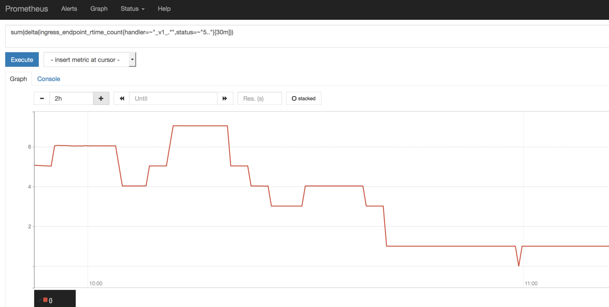
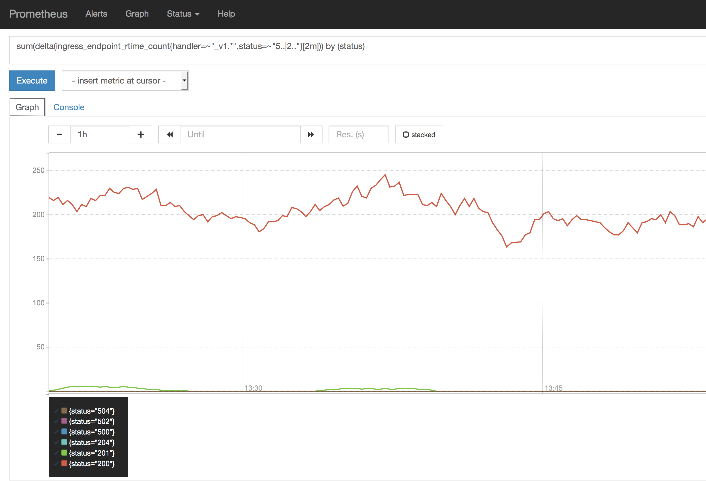

Troubleshooting
{: .label .label-red}

## Overview

This runbook describes how to deal with ingress reporting 5xx errors from the `_v1_` backend services.

## Example Alerts

There are several alerts which could have brought you here:

You could have been directly sent here from one of the following alerts:

- `bluemix.containers-kubernetes.prod-dal10-carrier3.5xx_response_received_for_v1_handler.us-south`

- `bluemix.containers-kubernetes.prod-dal10-carrier3.critical_number_of_5xx_response_received_for_v1_handler.us-south`


The above alerts may also be triggering at the same time as the `_ui_` handler alerts:

- `bluemix.containers-kubernetes.prod-dal10-carrier3.5xx_response_received_for_ui_handler.us-south`

If the `_v1_` and `_ui_` alerts are both triggering together then it is likely the underlying cause is a `_v1_` issue (especially if the rate of alerts for each handler is the same), so the investigation into the `_v1_` issues should take priority.

The above alerts may also be triggering at the same time as the `_global_v1` handler alerts:

- `bluemix.containers-kubernetes.prod-dal10-carrier3.5xx_response_received_for_global_v1_handler.us-south`

- `bluemix.containers-kubernetes.prod-dal10-carrier3.critical_number_of_5xx_response_received_for_global_v1_handler.us-south`

This is because the global API relies on the `_v1_` routes. The `_global_v1` handler alerts will automatically resolve when the issue causing the `_v1_` handler routes is resolved.

## Investigation and Action
If this alert is seen in conjuction with the `response_time_increasing` alert, the 5XX errors may be due to timeout issues, start by following the `response time increasing` [runbook](https://pages.github.ibm.com/alchemy-conductors/documentation-pages/docs/runbooks/armada/armada-api-response_time_increasing.html). If not, continue with this runbook.

The `5xx_response_received_for_v1_handler` alert can be associated with istio gateway issues. Check the [Armada Istio Gateway Timeouts](armada-istio-gateway-timeouts.html) runbook and return here if that doesn't resolve the alert.

The investigation depends on which alerts are triggering.

If `5xx_response_received_for_v1_handler` is triggering on its own, (with or without any `_ui_` related 5xx alerts) then begin [investigating the problem](#investigating-the-impact).

This alert triggering on its own means we have received 15 or more `_v1_` errors in the last 30 minutes.
These `warning` level alerts will in future be automatically handled, but for now, we need to manually gather information.

We have a threshold of 50 `_v1_` errors in a 2 min window before we start reporting that kubernetes containers is down in estado.  We therefore need to investigate the `warning` level alert as it could be early signs that there is a problem with the armada-api service.

If the `critical_number_of_5xx_response_received_for_v1_handler` alert is triggering, then we've hit the threshold and we will be reporting down in the estado tool - the pCIE process therefore needs to be invoked.

SRE engineers may see this issue auto resolve quickly in pagerduty - if that happens investigation into the issue is _**still**_ required.

### Actions to take if a pCIE is required.

Follow the pCIE process as [documented here](../clm-incidents.html)

Immediately escalate the page to the [armada-api](./armada_pagerduty_escalation_policies.html) escalation policy so the squad can start working the issue.

Simultaneously with escalating, begin [investigating the impact](#investigating-the-impact) and [investigating the problem](#kubectl-investigation-and-logs-gathering).

Use the `#containers-cie` channel in slack for communications about investigation into the problem.

### Investigating the impact

First, determine the rate of v1 5xx status codes over a 2min period by checking [prometheus](#prometheus-checks-to-determine-the-rate-of-5xx-errors)

To determine severity, and how customers are impacted, we need to understand if this is;

1. A one off, short lived error and successful v1 calls have occurred since; or
1. All calls to v1 are failing.

Some guidelines:

- If the number of 5xx errors exceeds 50 v1 errors in a 2min period, then we can confirm we have experienced a customer impact event.

- If the number of 5xx errors exceeds 50 and is still rising, then the problem is still actively occurring.

- If the number is below 50 and has since dropped, then it is likely a short lived issue but will still need investigation and GHE raising but no CIE will be required.

- If the number is below 50 but is climbing, then the problem may potentially escalate and should be investigated and escalated to the `armada-api` squad.

- If a single user is generating the errors, most probably a CIE is not required, but it has to be investigated immediately to make sure it doesn't spread.

- If any 5xx response has a request path containing `/satellite`, then Satellite is impacted.
- If any 5xx response has a request path that **_does not_** contain `/satellite`, then IKS is impacted.

After determining the rate and the impact, inform the development squad via slack, and proceed with further [investigation].

#### Prometheus checks to determine the rate of 5xx errors

Determining the rate of 5xx status codes for an alert via Prometheus

_If you already have the Prometheus link from the alert, skip to Step (3)._

1. Begin by going to the [Alchemy Dashboard](https://alchemy-dashboard.containers.cloud.ibm.com/carrier) and selecting the `Prometheus` icon in the alerted environment.

2. Click on the `Alerts` tab in Prometheus, it should show an active alert (indicated in red) for the corresponding failure and a value.  This value will show the number of occurrences in the past 30 minute window.

   <a href="images/armada-ops/Prometheus_alert_link.png">
   </a>

3. The `IF` condition is the is the Prometheus query triggering the alert - click that to go to the graphical view.
From here you can view the query.

   <a href="images/armada-ops/Prometheus_graph_view.png">
   </a>

4. To see the rate of errors over a much shorter period (2 minutes rather than 30 minutes) then execute this query in Prometheus
   ```
   sum(increase(armada_global_api_response_codes{rc=~"5..", path=~".*/v1/.*|.*/v2/.*"}[2m]))
   ```

   Querying over a shorter period provides a much better picture of whether this was a short lived issue, or whether a problem has occurred, and is still persisting.

5. To also plot successful return codes for `_v1_` over the same period, you can use this query
   ```
   sum by(rc) (increase(armada_global_api_response_codes{rc=~"5..|2..", path=~".*/v1/.*|.*/v2/.*"}[2m]))
   ```

   Adding 2xx responses also helps see if any successful calls have occurred during and after the time of the 5xx errors.  The below example shows a system under normal operating conditions with many 2xx response codes and little to no 5xx errors reported.

   <a href="images/armada-ops/Prometheus_v1_status_codes.png">
   </a>

#### Prometheus check for service dependencies response errors

With these steps we'll determine if a dependency is causing the alert.
Checking the graphs are informative, but might not be conclusive, as a server error, or a user error does not 1:1 translate to the same type of error that the service returns.
Open Prometheus for those regions, then search for error responses.

1. Go to the [Alchemy Dashboard](https://alchemy-dashboard.containers.cloud.ibm.com/carrier) and select the Prometheus icon in the causing environment. 

2. Open the graph for service dependencies rate limiting the service:
```
sum by(service, method, status) (increase(serviceDependencies_http_req_status{hostService="armada-api", status="429"}[5m]))
```
Increase the range to include metric values from before the alert fired.
> If an upstream service responds with an elevated number of 429 status codes, we need to get in touch with them to understand what change is causing it. This value is normally `0`.

3. Open the graph for service dependencies failing with server errors:
```
sum by(service, method, status) (increase(serviceDependencies_http_req_status{hostService="armada-api", status=~"5.."}[5m]))
```
Increase the range to include metric values from before the alert fired.
> If a service responds with an increased number of server error code, we need to get in touch with them to understand if there is an issue ongoing on their side. A value larger than `0` might not mean an upstream issue, probably an increased number should be investigated.

4. Open the graph for service dependencies failing with user errors:
```
sum by(service, method, status) (increase(serviceDependencies_http_req_status{hostService="armada-api", status=~"4.."}[5m]))
```
Increase the range to include metric values from before the alert fired.
> User errors might mean an issue with our service. At the metrics level currently it's not possible to tell if the method was invoked by our serviceID, or the user is performing it. When you see an increase in these, log analysis should be continued as described in [Check the logs in LogDNA](#check-the-logs-in-logdna)

### Kubectl investigation and logs gathering
Begin with [checking the logs in LogDNA](#check-the-logs-in-logdna) to find the potential problem.

In all cases, a GHE issue should be created to [gather logs](#gather-logs-for-the-ghe-issue) and attempt to determine the underlying issue causing the 5xx errors.

#### LogDNA single account check: Ensure a single account isn't generating many 5xx errors

_Note that this may return a different list of 5xx errors to the [Check the logs in LogDNA](#check-the-logs-in-logdna) query, so be mindful of the timestamps of the errors found._

Access LogDNA by going to the [Alchemy Dashboard](https://alchemy-dashboard.containers.cloud.ibm.com/carrier) and selecting the `LogDNA` icon in the alerted environment.

1. In LogDNA run the following query `app:armada-api "statusCode":(>=500)`.
2. Expand a single log entry and select `Extract fields`.
3. In the menu, set the following:
   - Select `iamAccountID` under Include auto-parsed fields.
   - Set the Time Range according to when the errors triggered the alert.
   - Query should auto populate as set in Step 1.
4. Click `Run`, an Aggregated fields menu will pop up. This will show how frequently particular accounts showed up in the current 5xx errors. This can be viewed as % instead of count. If the majority of errors are triggered from one account, this could indicate that it is not a true CIE situation.


#### Check the logs in LogDNA
1. Begin by going to the [Alchemy Dashboard](https://alchemy-dashboard.containers.cloud.ibm.com/carrier) and selecting the `LogDNA` icon in the alerted environment.

2. In LogDNA, under `All Apps` select only `armada-api`.

3. Continue on to inspect the armada-api logs to identify the problem. Start with [tracing a failed request through the logs](#inspect-the-logs-for-the-5xx-requests). Also look for [potential issues](#inspect-the-logs-for-potential-issues).


##### Inspect the logs for the 5XX requests
1. After targeting the armada-api microservice under `All Apps`, find a 5XX request in the logs. Search for `status_code:>=500`

2. Check if the 5XX errors are returning for a specific route, or if multiple routes are having 5XX issues.
   - The `method` and `path` fields will show you which route the failure was for: e.g. `"method": POST "path": /v2/vpc/createCluster`.
   - Are the method and path the same for all the `status_code:5XX` logs during this spike, or are the errors occurring for the different requests? 
     - Expand one of the entries and select `Extract fields`.
     - Under `Include auto-parsed fields`, select `_method`, `_path`, `status_code`
     - Set the Time Range according to when the errors triggered the alert.
     - Click `Run`, an Aggregated fields menu will pop up showing the results.
   - Pass this information onto dev in Slack or in the GHE ticket

3. Inspect some of the failed requests
   - Grab a `req-id` from 2 or 3 of the `status_code:5XX` log messages, preferably for different method/paths.
   - For each of these, do a new search in LogDNA on the value of the `req-id` field.
   - Look for logs at the `error` level within that request.
   - If the errors contain `circuit is open`, proceed to circuit breaker trips in the [next section](#inspect-the-logs-for-potential-issues)
   - If the errors contain `Too many requests`, proceed to rate limiting from IAM in the [next section](#inspect-the-logs-for-potential-issues)
   - Pass the error logs along to dev in Slack or in the GHE ticket

##### Inspect the logs for potential issues

1. Circuit breaker trips
   - After targeting the armada-api microservice, search LogDNA for "circuit is open".
   - Expand the timeline toggle to see if there is a spike in this type of log that corresponds to the timeline of the alert.
   - If so, check the reason and which endpoint the circuit is open for. This information is following  `circuit is open:` in the logs.
   - Example: 
     ```
     "error":"circuit is open: Post https://iam.bluemix.net/v2/authz: dial tcp: lookup iam.bluemix.net on 172.20.0.10:53: read udp 172.16.28.186:54295->172.20.0.10:53: i/o timeout",
     "errorVerbose":"Post https://iam.bluemix.net/v2/authz: dial tcp: lookup iam.bluemix.net on 172.20.0.10:53: read udp 172.16.28.186:54295->172.20.0.10:53: i/o timeout
     ```
   - This indicates that the circuit breaker was tripped on calls to IAM due to time outs.
   - Include the errors you have found in the information you are passing to dev in Slack or in the GHE issue

2. Rate limiting from IAM
   - Search LogDNA for "Too Many Requests"
   - Expand the timeline toggle to see if there is a spike in this type of log that corresponds to the timeline of the alert.
   - Example:
     ```
     {"level":"error","ts":"2020-08-26T21:48:55.173Z","caller":"iam/pep.go:197","msg":"error getting authz roles from IAM",
     "req-id":"116723d8-f0e7-4219-a2be-ba9fdc3cab95","cdn-id":"","txnID":"116723d8-f0e7-4219-a2be-ba9fdc3cab95",
     "accountID":"247a00ed76bf9a51d847b85652ee202f","resourceGroupID":"b67d9228670d473097259e2a343de463",
     "txnID":"116723d8-f0e7-4219-a2be-ba9fdc3cab95","accountID":"247a00ed76bf9a51d847b85652ee202f",
     "status code":429,"error":"429 Too Many Requests"}
     ```
   - Note the error message `error getting authz roles from IAM`. This indicates that the rate limiting is coming from IAM. We have seen this in the past when our caching of tokens for our service ID had broken.
   - Pass this information along to dev in Slack or in the GHE issue.
   - Simultaneously, if the rate limiting is coming from IAM, you will need to engage the IAM team either in the Slack channel [#iam-issues](https://ibm-argonauts.slack.com/archives/C3C46LY7N) or escalating [{{ site.data.teams.IAM.escalate.name }}]({{ site.data.teams.IAM.escalate.link }})
      - Tell the IAM team that IKS is being rate limited and give them a `txnID` from the `429 Too Many Requests` log message.
        - Ask them to look it up in their logs to give us more details.
        - Ask them what our rate limit is set to
        - Ask them if this rate limit can be temporarily increased to mitigate the CIE while dev investigates the cause of the issue.

#### Gather logs for the GHE issue.
To gather further logs to pass to the development team, use `kubectl` commands on the master node for the environment where the errors are triggering

1. Use `kubectl` commands on the master node to analyze the situation further:

   - Log onto the carrier master node for the environment the alerts are triggering (for example, `prod-dal10-carrier3-master-01`), or to a relevant carrier if the alert is from a tugboat.
   - `kubectl get pods -n armada` - this will show all pods running in the armada namespace
   - `kubectl describe pod armada-api-4034288990-fthbq -n armada` - will give further info on the pod (where `4034288990-fthbq` is the instance/pod) within the armada namespace
   - `kubectl logs armada-api-4034288990-fthbq -n armada` - displays the logs for that pod - this will have to be repeated for all pods - re-direct this output to a log file on the server for further analysis - You can use [scripts located here](https://github.ibm.com/alchemy-conductors/conductors-tools/tree/master/armada/kubectl_tools) to help with obtaining logs.

2. Review the POD logs captured.

   Review the logs you've download and match up the log entries with the alert times.

### Create a GHE issue

Raise a [GHE](https://github.ibm.com/alchemy-containers/armada-ironsides) issue against `ironsides` squad.

Add results from the Prometheus query, the logs gathered and the analysis performed, reinforced with `kubectl` results to the GHE issue raised in the earlier steps.

## Escalation Policy

Once the initial investigation is performed and the GHE issue updated, if not already done so as part of a pCIE, escalate the Pagerduty to the `armada-api` squad, including details of the GHE ticket raised.

The following document has [escalation policy details](./armada_pagerduty_escalation_policies.html)
