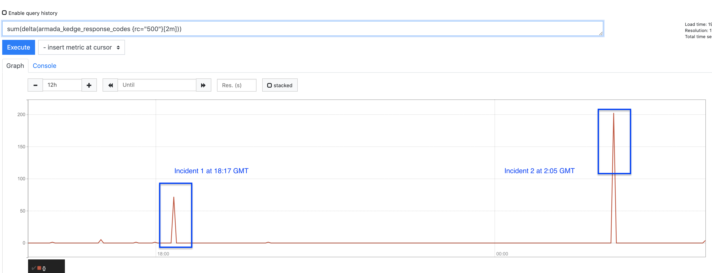
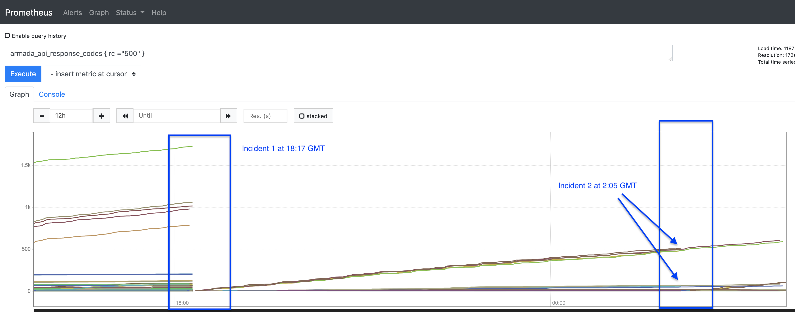
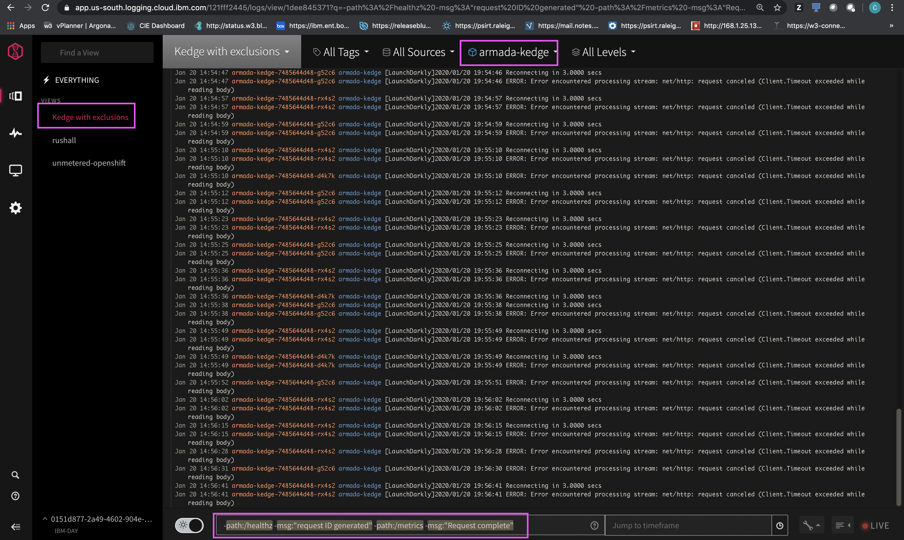

Alert
{: .label .label-purple}

# Armada-Kedge 5xx errors

## Overview

Armada-Kedge customers are hitting 5xx errors.

## Example alert
Pending alert creation.

## Action to take

### Verify armada-kedge is running in carrier.

1. ssh into the master for the triggered carrier  
_The list of carriers with their masters can be found in the [{{ site.data.monitoring.cfs-inventory.name }}]({{ site.data.monitoring.cfs-inventory.link }})_
1. Check for kedge's status and ensure that kedge is running with the command:  
`kubectl -n armada get pods -o wide | grep kedge`
   - If the status of kedge is `CrashLoopBackOff`
      1. delete the pod with  
      `kubectl -n armada delete pod <pod name>`
      1. If the pod doesn't come up in `Running` state then  
      **follow the escalation policy**
   
   - If the status of kedge is `ImagePullBackoff`, then  
   **follow the escalation policy**

### Look for armada restarts

Often times, `500` errors result from the armada-api service restarting, which causes cluster queries to fail.

Try to correlate if the `500` errors occurred at the same time as an armada-api restart using a Prometheus session for the environment where the `500` erros occurred  
_The [Alchemy Dashboard](https://alchemy-dashboard.containers.cloud.ibm.com/) lists all the required resources necessary_

1. To see **when** the `armada-kedge 500` errors occured use:  
`sum(delta(armada_kedge_response_codes {rc="500"}[2m]))`

   For example:
   

1. To see the number of armada-api 500 errors over time, add a second Prometheus graph and use:  
`armada_global_api_regional_api_response_codes { rc = "500" }`

   For example:
   

   In the example above, you can see that for Incident 1, all the metrics dropped and the armada-api servers all restarted at the time of the 500 errors.

   For Incident 2, you can see that the metrics dropped for some armada-api servers at the time of the 500 errors, indicating they were restarted.

If you see this correlation between `armada-kedge 500` errors occurring at the same time as armada-api restarts, then you can assume the `500`s occurred because kedge could not communicate with armada-api.

### Check the number of users hitting the error in LogDNA.
If the `500` errors do not correlate to armada-api restarts, use LogDNA to diagnose the problem.

1. Using the [Alchemy Dashboard](https://alchemy-dashboard.containers.cloud.ibm.com/), navigate to the LogDNA instance for the region with the alert that is triggering.

1. Open the kedge with exclusions view:
   

   If you cannot find the view use:  
   **query**:  
   `-path:/healthz -msg:"request ID generated" -path:/metrics -msg:"Request complete"`  
   **app**:  
   `armada-kedge`

 
1. Add `"status_code":500` to the filter, which should give some indication of the location and rate of the error.

1. Raise a ticket against the escalation policy, please include any information found in the logs.

## Escalation Policy
Please notify {{ site.data.teams.armada-kedge.comm.name }} on Argonauts and create an issue [here]({{ site.data.teams.armada-kedge.link }})

Escalation policy - `Armada - Kedge` 
