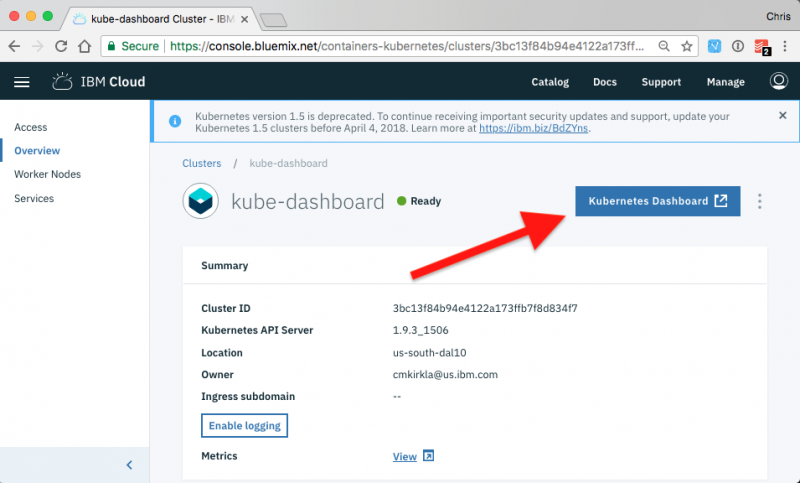
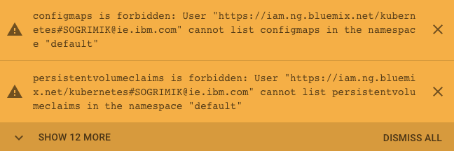

Informational
{: .label }

## Overview
This runbook describes how to access the Kubernetes dashboard UI provided by an armada cluster and debug issues for customers attempting to access the Kubernetes dashboard through the IBM Cloud Console.

The Kubernetes dashboard is a general purpose, web-based UI for Kubernetes clusters. It allows users to manage applications running in the cluster
and troubleshoot them, as well as manage the cluster itself.  It is running on each armada cluster as a Kubernetes deployment, and because of the
way its service is exposed, it is a bit tricky to access it. This runbook will show you how! These instruction are similar to the following customer
documentation: [Accessing the Kubernetes dashboard for IBM Bluemix Container Service](https://console.ng.bluemix.net/docs/containers/cs_apps.html#cs_cli_dashboard).

Read more about the Kubernetes dashboard [here](https://github.com/kubernetes/dashboard).

## Detailed information

Detailed information about how to acess the dashboard will be found in the following sections for the officially supported method as well as several manual methods.

## IBM Cloud Console (officially supported solution)

In addition to several manual paths for accessing the dashboard, there is an officially supported method for customers. This method is the preferred way for customers to access the Kubernetes dashboard for their clusters because it is continuously monitored, covered by alerts, and integrates with IAM access control. For comparison, all manual methods will be available only to cluster/account administrators.  Access to the dashboard is provided by the `armada-kube-dashboard-proxy` microservice. You can find an overview in this [blog post](https://www.ibm.com/blogs/bluemix/2018/05/kubernetes-dashboard-access/) and more detailed information is include in the projects [README](https://github.ibm.com/alchemy-containers/armada-kube-dashboard-proxy/#armada-kube-dashboard-proxy).

### Accessing the dashboard

For IKS clusters with master version 1.8+, all authorized users will have access to the Kubernetes dashboard for their clusters; permissions within the dashboard are dictated by the IAM policies for that account and/or resource group.  For ISK clusters with master versions 1.5/1.7, only account administrators can access their Kubernetes dashboard.

The button to access the dashboard is located under the `Cluster overview` page in the IBM Cloud Console:
<a href="images/kube-dashboard-button.png">
  
</a>

### Debugging

Here are some of the common errors a user might encounter trying to access their dashboard via the `Kubernetes Dashboard` button in the UI and how to solve them.

NOTE: All interactions with customer clusters are assumed to take place from a master/worker node in the Carrier where the cluster's master is provisioned.  You can find which Carrier to use in the #armada-xo channel in Slack.

#### Cluster not Ready

The Kubernetes dashboard will not be availabe until the cluster is fully provisioned and shows status `Ready` in the CLI or UI.  Attempting to access the dashboard before that point will fail with a HTTP 4XX/5XX error.

#### Kubernetes Dashboard isn't running

Even after the cluster is fully provisioned, the kubernetes dashboard may not be ready for a few minutes.  First check the status of the dashboard pod:
```
cmkirkla@prestage-mon01-carrier1-master-01:~$ kubx-kubectl 1a7f612842934b649d503868fce165cc get -n kube-system pods -l k8s-app=kubernetes-dashboard
NAME                                    READY     STATUS    RESTARTS   AGE
kubernetes-dashboard-767c775786-f5w8c   1/1       Running   0          5d
```

Assuming the `kubernetes-dashboard` pod is `Running`, check the logs for any obvious problems:

```
cmkirkla@prestage-mon01-carrier1-master-01:~$ kubx-kubectl 1a7f612842934b649d503868fce165cc -n kube-system logs kubernetes-dashboard-767c775786-f5w8c --tail=100
2018/06/20 17:28:43 Starting overwatch
2018/06/20 17:28:43 Using in-cluster config to connect to apiserver
2018/06/20 17:28:43 Using service account token for csrf signing
2018/06/20 17:28:43 No request provided. Skipping authorization
2018/06/20 17:28:43 Successful initial request to the apiserver, version: v1.10.3-2+c8f1f59d8d233c
2018/06/20 17:28:43 Generating JWE encryption key
2018/06/20 17:28:43 New synchronizer has been registered: kubernetes-dashboard-key-holder-kube-system. Starting
2018/06/20 17:28:43 Starting secret synchronizer for kubernetes-dashboard-key-holder in namespace kube-system
2018/06/20 17:28:43 Storing encryption key in a secret
2018/06/20 17:28:43 Creating in-cluster Heapster client
2018/06/20 17:28:43 Auto-generating certificates
2018/06/20 17:28:43 Certificates already exist. Returning.
2018/06/20 17:28:43 Serving securely on HTTPS port: 8443
2018/06/20 17:28:43 Metric client health check failed: an error on the server ("unknown") has prevented the request from succeeding (get services heapster). Retrying in 30 seconds.
2018/06/20 17:31:24 Metric client health check failed: an error on the server ("Error: 'dial tcp 172.30.236.68:8082: getsockopt: connection timed out'\nTrying to reach: 'http://172.30.236.68:8082/healthz'") has prevented the request from succeeding (get services heapster). Retrying in 30 seconds.
2018/06/20 17:32:58 Successful request to heapster
```

If there any obvious error messages like the `Metric client health check failed` as above, trying restarting the `kubernetes-dashboard` pod and asking the customer to try again:

```
cmkirkla@prestage-mon01-carrier1-master-01:~$ kubx-kubectl 1a7f612842934b649d503868fce165cc delete -n kube-system pods -l k8s-app=kubernetes-dashboard
pod "kubernetes-dashboard-767c775786-f5w8c" deleted
cmkirkla@prestage-mon01-carrier1-master-01:~$ kubx-kubectl 1a7f612842934b649d503868fce165cc get -n kube-system pods -l k8s-app=kubernetes-dashboard
NAME                                    READY     STATUS    RESTARTS   AGE
kubernetes-dashboard-767c775786-vcbm7   1/1       Running   0          10s
```

#### Multi-AZ setup

For Classic MZR clusters (workers in multiple different zones in the region), VLAN spanning or VRF must be enabled for the Softlayer/infrastructure account.  This configuration option must be manually set by the user which allows workers from different subnets to route traffic to each other.  This will usually manifest by HTTP 5XX errors to the user and `armada-kube-dashboard-proxy` will see request timeouts trying to connect to the customer's dashboard.

Here are instructions for how to [enable VLAN spanning](https://cloud.ibm.com/docs/vlans?topic=vlans-vlan-spanning). Ask a customer for a screenshot of the VLAN spanning "radio buttons" in the Infrastruture UI. Once they have turned VLAN spanning on, it may take up to 15 minutes to propagate to their cluster(s), but clusters do not need to be recreated.

#### RBAC policies not setup correctly

If the customer can access their dashboard, but see's `Permission denied` banners across their screen, they have the wrong permissions to access the resource the are trying to access or there was an issue with RBAC setup for their cluster.

Here is an example banner:

<a href="images/kube-dashboard-authorization-banner.png">
  
</a>


Ask the customer what their IAM role is in the account/resource group for the cluster and if that role is sufficient to access/modify the target resource.  For instance,
- `viewer`s cannot edit anything in the cluster.
- `editor`s may view or edit _most_ resources in non-privileged namespaces (e.g. not `kube-system`, `ibm-system`, etc.)

If the user doesn't have the necessary permissions, they need to speak to their account administrator.

If the user believes they have the necessary permissions, verify their name shows up in the correct RBAC policies:
```
# viewer and above
cmkirkla@prestage-mon01-carrier1-master-01:~$ kubx-kubectl 1a7f612842934b649d503868fce165cc get rolebinding --all-namespaces -o json | jq -r '.items[] | select(.roleRef.name == "view") | .subjects[].name'
https://iam.stage1.ng.bluemix.net/kubernetes#cmkirkla@us.ibm.com

# editor and above
cmkirkla@prestage-mon01-carrier1-master-01:~$ kubx-kubectl 1a7f612842934b649d503868fce165cc get rolebinding --all-namespaces -o json | jq -r '.items[] | select(.roleRef.name == "edit") | .subjects[].name'
https://iam.stage1.ng.bluemix.net/kubernetes#cmkirkla@us.ibm.com

# operator and above
cmkirkla@prestage-mon01-carrier1-master-01:~$ kubx-kubectl 1a7f612842934b649d503868fce165cc get clusterrolebinding -o json | jq -r '.items[] | select(.roleRef.name == "admin") | .subjects[].name'
https://iam.stage1.ng.bluemix.net/kubernetes#cmkirkla@us.ibm.com

# admin only
cmkirkla@prestage-mon01-carrier1-master-01:~$ kubx-kubectl 1a7f612842934b649d503868fce165cc get clusterrolebinding -o json | jq -r '.items[] | select(.roleRef.name == "cluster-admin") | .subjects[].name'
```
In terms of privilege escalation, IAM roles are ordered `admin > operator > editor > viewer`.

If the user's email does not appear, ask them to attempt to access the Kubernetes dashboard again.  If the email still does not appear, work with the dev team as laid out in the escalation policy.

## Manual methods

### Prerequisites
In order to complete the following steps, you will need VPN/SSH access for the systems you are trying to interact with.

### The easy way
The fastest way to access the Kubernetes dashboard for a particular cluster is to just use an SSH tunnel.

#### Step 1 - Run a proxy to the Kubernetes API server
Perform the following command to start the Kubernetes proxy. Use your cluster username (e.g. SOS IDMgt username) in place of `<username>` and insert the
appropriate IP address of the node in place of `<cluster-node-ip>`. If the node is behind a VPN, ensure that you are on the necessary VPN connection.

~~~
ssh -L8001:localhost:8001 <username>@<cluster-node-ip> kubectl proxy
~~~

#### Step 2 - Open the UI
With the proxy started, you should now be able to access the dashboard by visiting `http://localhost:8001/ui` in your browser.

### The hard way
Doing it the hard way isn't necessarily hard, but does require a little more time and work to get started.

#### Step 1 - Install kubectl, copy certs, export KUBECONFIG
Follow this [runbook](./armada-local-kube-cli-usage.html) to install the kubectl CLI locally on your
system, as well as copy the required cert files from the cluster and export the KUBECONFIG environment variable.

#### Step 2 - Run a proxy to the Kubernetes API server
Similar to step 1 above, you need to start the Kubernetes proxy.  This time however, you can just use your own local kubectl to do it.

~~~
kubectl proxy
~~~

#### Step 3 - Open the UI
With the proxy started, you should now be able to access the dashboard by visiting `http://localhost:8001/ui` in your browser.

### Problems

If the cluster is working fine but `kubectl proxy` fails or the connection to `http://localhost:8001/ui` times out then refer to
[Accessing the Kubernetes dashboard fails in IBM Bluemix Container Service](https://console.ng.bluemix.net/docs/containers/cs_troubleshoot.html#cs_kubedashboard)
for OpenVPN client troubleshooting tips. If the OpenVPN client is working properly then verify that the OpenVPN server for the cluster
is also running and available. The server is running in the cluster master deployer on an armada carrier worker.

~~~
kubectl describe deployment -n kubx-masters master-<cluster-id>
...
kubectl logs -n kubx-masters `kubectl get pods -n kubx-masters -l app=master-<cluster-id> --no-headers -o custom-columns=:.metadata.name` openvpn
~~~

## Escalation paths

If unable to resolve problems with access to the Kubernetes dashboard via any of the manual methods, reach out to the [#armada-dev](https://ibm-argonauts.slack.com/messages/armada-dev) slack channel.

If unable to resolve problems with access to the Kubernetes dashboard via the officially supported method, involve the {{ site.data.teams.armada-api.name }} squad directly.
  * Escalation policy: [{{ site.data.teams.armada-api.escalate.name }}]({{ site.data.teams.armada-api.escalate.link }})
  * Slack channels: [{{ site.data.teams.armada-api.comm.name }}]({{ site.data.teams.armada-api.comm.link }})
  * GHE issues: [{{ site.data.teams.armada-api.name }}]({{ site.data.teams.armada-api.issue }})

