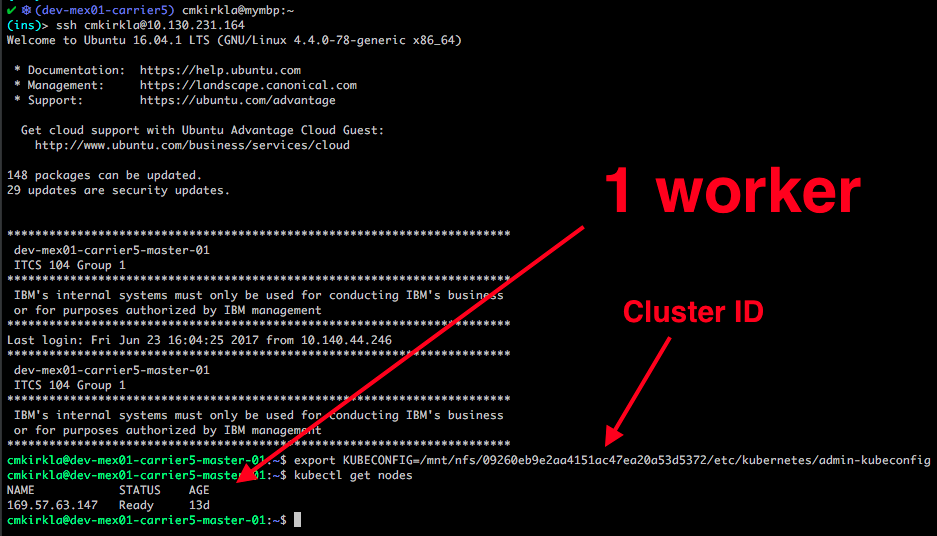
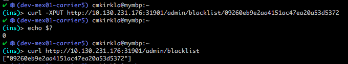
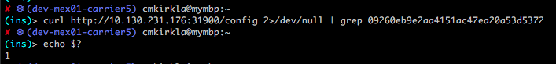
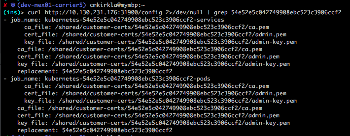

Alert
{: .label .label-purple}

# Armada Cruiser Component Has Too Many Instances
 
This incident is raised when kubx-prometheus detects the given armada service on Cruiser has an unexpectedly
high number of instances.  This likely means the customer has deleted the given armada service on Cruiser and replaced
it with their own application.  In the worst case, that means the customer is maliciously acting in attempt to overload
kubx-prometheus on Carrier in an attempt overload our infrastructure.

## Overview

The goal of this runbook is to first verify that the alert is valid (if necessary).  Assuming the alert is not a false positive,
you will blacklist the offending Cruiser cluster in kubx-prometheus and ensure that that cluster is no longer being scraped
by kubx-prometheus.

## Example Alert(s)

None

## Cruiser Services

Here are the armada services deployed on Cruiser that we actively monitor via kubx-prometheus and their corresponding alert
names:

<!-- generated by http://www.tablesgenerator.com/html_tables# -->
<table>
  <tr>
    <th>Service</th>
    <th>Prometheus Alert Name</th>
  </tr>
  <tr>
    <td>prom-proxy</td>
    <td>TooManyPromProxyServices</td>
  </tr>
  <tr>
    <td>docker-metrics-endpoint</td>
    <td>TooManyDockerHealthPods</td>
  </tr>
  <tr>
    <td>ibm-kube-fluentd</td>
    <td>TooManyFluentdPods</td>
  </tr>
  <tr>
    <td>ingress-ctl</td>
    <td>TooManyIngressControllers</td>
  </tr>
</table>

## Diagnosing problem

### Examine production environment

If the environment cannot be accessed, please escalate to the **armada-infra** team. 
See [escalation policy](./armada_pagerduty_escalation_policies.html).
 
**Steps:**

1) Identify the Cruiser cluster ID and offending service/pod from the PD alert information.

2) If offending service is `ibm-kube-fluentd-*` or `docker-metrics-endpoint-*`, 
[check the number of cluster workers](#check-the-number-of-cluster-workers) before proceeding.

3) [Blacklist the offending cluster ID in kubx-prometheus](#blacklist-the-offending-cluster).

4) Assuming the rest of these steps could be completed successfully, you can resolve the PD alert.  Otherwise, [escalate](#escalation-policy).
    
### Actions To Take

#### Check the Number of Cluster Workers

Steps:
* SSH into the master node for the appropriate Carrier.
* List Cruiser workers: `kubx-kubectl <clusterid> get nodes`

Example: 

 
 
If the number of Cruiser workers is less than the number of instances for the offending service in the given alert, proceed
to [blacklist the offending cluster](#blacklist-the-offending-cluster).   Otherwise, please open an issue against 
[armada-kubx-ops](https://github.ibm.com/alchemy-containers/armada-kubx-ops/issues) with a quick summary of results of your
investigation and a link to the PD alert, and resolve the PD alert.

#### Blacklist the Offending Cluster

In this action, you will add the ID of the offending cluster to the kubx-prometheus blacklist.

Using the previously acquired Carrier worker IP from the [initial steps](#examine-production-environment):
 * Backlist the cluster: `curl -XPUT http://<Worker-IP>:31901/admin/blacklist/<Cluster-ID>`
 * Ensure the cluster is on the blacklist: `curl http://<Worker-IP>:31901/admin/blacklist`
 
 See the following example for sample output: 
 
 
 
 If either of these commands produce an error, wait a few seconds and repeat.  If API errors persist, [escalate](#escalation-policy)
 
 Assuming these steps are successful, proceed to 
 [check Prometheus is no longer configured to scrape the offending Cluster](#check-prometheus-is-not-scraping-given-cluster).
 
 
#### Check Prometheus is not Scraping Given Cluster

Search for the offending cluster in the kubx-prometheus config: `http://<Worker-IP>:31900/config | grep <Cluster-ID>`
_NOTE: It may take up to 5 minutes for the Configuration to be updated!_

If, after 5 minutes, the offending cluster is still in the kubx-prometheus config, [escalate](#escalation-policy).

Desired Output Example:

Error -- Cluster Still in Config example:

## Escalation Policy

Involve the `armada-metrics` squad via their [escalation policy](./armada_pagerduty_escalation_policies.html)
