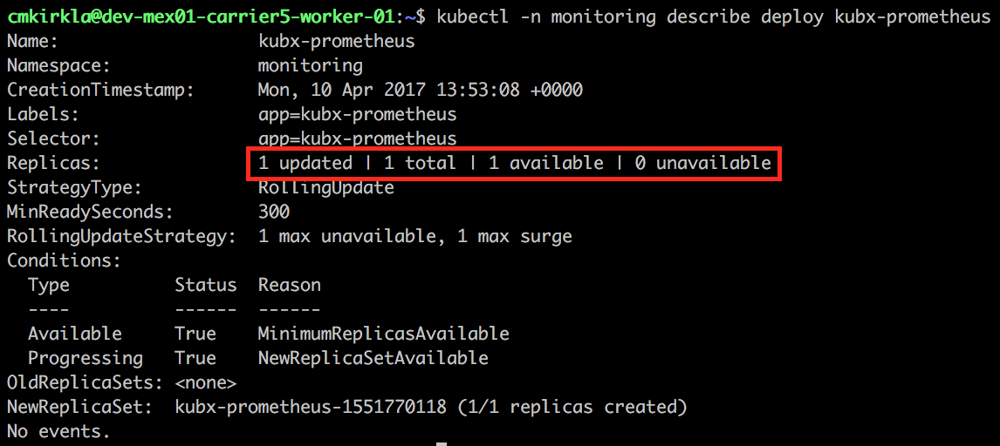
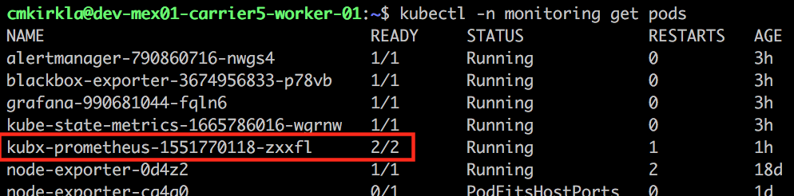
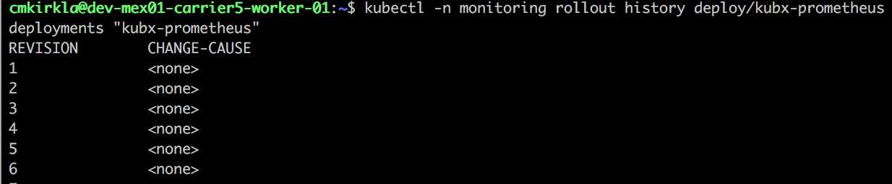
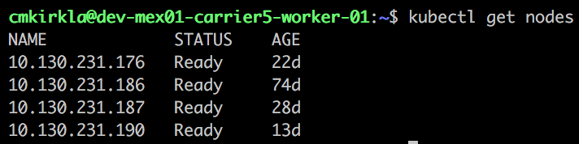
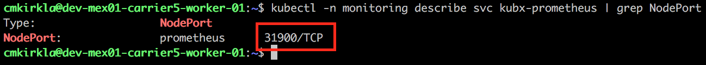
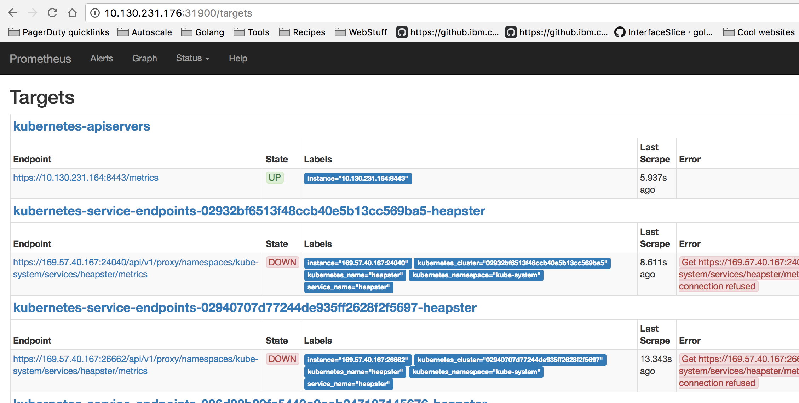

Troubleshooting
{: .label .label-red}

# Kubx-Prometheus Is Down Runbook
 
 
This incident is raised when armada-ops cannot probe kubx-prometheus for a period of time. 

This is likely due to either kubx-prometheus being down or deployed improperly.

This could also be due to the armada-op checks being too sensitive (paging after one transient fail)
or kube-dns failing (causes K8 DNS lookups to fail).

## Symptoms

* A pager duty incident came in that states kubx-prometheus service is down.

## Diagnosing problem

### Examine production environment

If the environment cannot be accessed, please escalate to the **armada-infra** team. 
See [escalation policy](./armada_pagerduty_escalation_policies.html).
 
**Steps:**

1) Log into the proper carrier VM in the production environment so you can run kubectl commands
  * `ssh <username>@<carrier_IP>`
  *  Requires VPN access to the environment as well
    

2) List Deployment Information
  * Describe the deployment with `kubectl -n monitoring describe deploy kubx-prometheus`
  * Typical output pictured below  
  
  
  * Verify that **at least 1 replica exists (total) and at least 1 replica available**.
    * If total does not have at least one replica see [Change Deployment to 1 Replica](#change-deployment-to-1-replica)
  * If the deployment cannot be found, see [escalation](#escalation).
  * Otherwise, continue to the next step
    

  
3) Verify Kubx-Prometheus Pod(s)
 * Run `kubectl -n monitoring get pods` and look for kubx-prometheus pods 
 
  
 * Check pod(s) Status
   * If 1 or more pods are in Running
     * Follow [Verify Prometheus Dashboard is Accessible](#verify-prometheus-dashboard-is-accessible)
   * If all are in CrashLoopBackOff:
     * Delete all the pods in CrashLoopBackOff `kubectl -n monitoring delete pod kubx-prometheus-<hash>-<hash>`.
     The deployment will handle respinning them back up.
     * Wait 1 minute then check to see if the pod(s) are still in CrashLoopBackOff state.
     The goal of this step is to see if the service can recover from the failure or if it will
     consistently reoccur. 
     * If still in CrashLoopBackOff after a minute [perform a rollback](#rollback-to-previous-version)
     * If pod(s) entered Running state,  [verify the Prometheus dashboard is accessible](#verify-prometheus-dashboard-is-accessible)
   * If all are in ImagePullBackoff **this is most likely an error in the build process**.
     * See if problem is happening across multiple armada-microservices
       * List all armada pods with `kubectl get pods | grep -P "(armada|monitoring)"`
       * If happening across multiple (2+) pod types, **escalate to the pvg pipeline team**.
       See  [escalation policy](./armada_pagerduty_escalation_policies.html)
     * If bad state seen on just kubx-prometheus pod(s), follow [perform a rollback](#rollback-to-previous-version)
              
    
### Actions To Take

#### Change Deployment to 1 Replica

In this action, you will set the replica count of the deployment to one so a replica is available. 
This should only be done when no replicas are in the deployment.
 * Run `kubectl -n monitoring scale --replicas=1 deploy/kubx-prometheus`
 * Output should be `deployment "kubx-prometheus" scaled`
 * Wait a few seconds then describe the deployment with `kubectl -n monitoring describe deploy kubx-prometheus`
 * Output should have  `1 updated | 1 total | 1 available | 0 unavailable` 
 
  
 * If the output has one available, move to [Verify Prometheus Dashboard is Accessible](#verify-prometheus-dashboard-is-accessible)
 
 
#### Rollback to previous version

In this action, you will roll back the deployment to the previous version. This should only be done
when the current version is consistently failing.
 * Run `kubectl -n monitoring rollout history deploy/kubx-prometheus`
 * Output similar to below: 
 
 
 * Rollback to the **second highest number** (most recent backup) deployment (in above would be 5)
   * Run `kubectl -n monitoring rollout undo deploy/kubx-prometheus --to-revision=<2nd highest number>`
 * Wait for rollback to occur
   * `kubectl -n monitoring rollout history deploy/kubx-prometheus` should have another entry 
   when rollback completes
 * Follow [Verify Prometheus Dashboard is Accessible](#verify-prometheus-dashboard-is-accessible) after completing roll back.
 
 
 
#### Verify Prometheus Dashboard is Accessible
This is the final verification action.
   * Determine a worker node IP.  If you are on a worker, you can inspect the IP of that machine.  Otherwise, choose an IP
     from the list of kubernetes nodes: `kubectl get nodes`.   
     
   * Determine the kubx-prometheus NodePort: `kubectl -n monitoring describe svc/kubx-prometheus | grep NodePort`  
     
   * Try to reach the prometheus dashboard at `http://${workerip}:${nodeport}/targets` using your web browser.
   * Verify that the `kubernetes-apiserver` section is present on the Targets page  
     
     Other endpoints being down or other errors being present is not a problem.
   * If the targets page is reachable and meets the above criteria, **the pager duty can be resolved!**
   * Otherwise, see [Escalation](#escalation).

#### Ultimate Goal
Ultimately, the person resolving the problem is just trying to ensure you can successfully access the kubx-prometheus dashboard. 
If you can reach the dashboard, **the pager duty can be resolved**. 
If the route cannot be hit and there are no apparent wide spread networking, deployment, or build issues see [escalation](#escalation). 
**If there are wide spread armada issues like the ones listed above**, this problem is probably a side effect of a larger 
issue and should be escalated to the proper team to solve the larger issue. Once the larger issue is solved,  the verification can then take place. 
 
 
 
#### Escalation

Involve the `armada-metrics` squad via their [escalation policy](./armada_pagerduty_escalation_policies.html)
