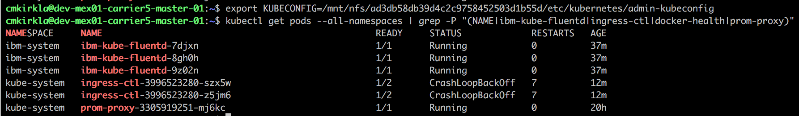

Alert
{: .label .label-purple}

# prom-proxy is Down in Customer Cluster
 
This incident is raised when kubx-prometheus detects that the prom-proxy service is down in the given customer cluster.

## Overview

The goal of this runbook is to determine the scope of the failure and attempt to bring prom-proxy back up in the given 
cluster.

## Example Alert(s)

None

## Diagnosing problem

### Examine production environment

If the environment/carrier cannot be accessed, please escalate to the **armada-infra** team. 
See [escalation policy](./armada_pagerduty_escalation_policies.html).
 
**Steps:**

1) Identify the Carrier name and Cruiser cluster ID in the PagerDuty alert.

 

2) SSH into the Carrier master node.  This assumes you have the appropriate VPN connection setup.  You can find the Carrier master IPs from the [cfs-inventory repo](https://github.ibm.com/alchemy-conductors/cfs-inventory/).
Example for dev-mex01-carrier5: 

 

3) Before continuing, ensure that [other pods in the Cruiser cluster are up](#check-that-other-cruiser-pods-are-up-in-kubernetes).

4) If other pods are up in kubectl, check that you can [manually connect to prom-proxy](#manually-connect-to-prom-proxy).

5) If other pods are up in kubectl and prom-proxy can't be curled, [determine the scope of the outage for prom-proxy](#determine-the-scope-of-the-outage)
 and take appropriate action.

6) If none of the previous steps resolved the issue, [escalate](#escalation-policy).

### Actions To Take

#### Check that other Cruiser pods are up in Kubernetes

The goal in this subsection is to determine that the armada pods on Cruiser (other than prom-proxy) are up in Kubernetes.

1. List relevant pods deployed by Armada infra on Cruiser:
    `kubx-kubectl <clusterid> get pods --all-namespaces | grep -P "(NAME|ibm-kube-fluentd|ingress-ctl|docker-health|prom-proxy)"`.

1. If multiple of these pods have the status `CrashLoopBackoff` or `ImagePullBackoff`, it's likely there was a problem
    with the cluster deploy process (possibly an issue with the image pull secret).  Escalate to the **armada-deploy** team via their 
    [escalation policy](./armada_pagerduty_escalation_policies.html).

1. If several of these pods are have status other than `Running`, `CrashLoopBackoff`, or `ImagePullBackoff`, wait a few minutes to
    see if the problem auto-resolves.  If the problem doesn't resolve after a few minutes, escalate to the **armada-deploy** team via their 
    [escalation policy](./armada_pagerduty_escalation_policies.html).

1. If none of the other relevant pods are down (i.e. have a status other than `Running`), continue with the steps described in
    the [main section](#diagnosing-problem).

Full example of expected ("happy path") `kubectl` output from Cruiser `0257016b28754fb692221bc6bc403c8f` in `dev-mex01-carrier5`:

 

#### Manually connect to prom-proxy

1) Source the Cruiser clusters's KUBECONFIG as in [the previous subsection](#check-that-other-cruiser-pods-are-up-in-kubernetes).

2) Determine the prom-proxy Pod ID: `kubectl -n kube-system get pods | grep prom-proxy | cut -d' ' -f1`

3) Exec into the prom-proxy Pod: `kubectl -n kube-system exec -it <PROM_PROXY_POD_ID> bash`

4) Curl the main prom-proxy route and make sure the HTTP response code printed is 200: 
    `curl --connect-timeout 3 --write-out %{http_code} --silent http://localhost:6969/proxy/localhost/6969/metrics -o /dev/null; echo`
   
5) If prom-proxy can be curled and returns a 200 HTTP status, wait a few minutes to see if the alert auto-resolves.
    If the alert doesn't auto-resolve, continue with the steps described in the [main section](#diagnosing-problem).
    
6) If the curl request times out or the returned response code is something other than 200, continue with the steps describe in
    the [main section](#diagnosing-problem).
    
Full example of expected ("happy path") output from Cruiser `ad3db58db39d4c2c9758452503d1b55d` in `dev-mex01-carrier5`:

 

*NOTE: Ignore the CrashLoopBackoff in the sample output.  These pods should be in `Running` state.*

#### Determine the scope of the outage

The goal here is to determine whether or not this issue is affecting prom-proxy in a few Cruiser cluster or many Cruiser clusters.

1) Navigate to the graph page for the kubx-prometheus dashboard for the appropriate environment in your browser. You can
    find this URL on the [hursley dashboard](https://alchemy-dashboard.containers.cloud.ibm.com/carrier).
    For example, in dev-mex01-carrier5, open `https://alchemy-dashboard.containers.cloud.ibm.com/dev-mex01/carrier5/kubx-prometheus/graph`. 

2) Determine the percentage of clusters that have prom-proxy down by performing the following query: 
    `100 - sum(up{name="prom-proxy"})/count(up{name="prom-proxy"}) * 100`

3) If the displayed percentage of clusters that have prom-proxy down is less than 5%, [escalate](#escalation-policy).

4) If the displayed percentage of clusters that have prom-proxy down is greater than 5%, [perform a rollback](#rollback-armada-metrics).

#### Rollback armada-metrics

You will only perform this action if a large percentage of customer clusters have prom-proxy down.  Here we correct that by
rolling back armada-metrics which will trigger a rollback of prom-proxy in ALL customer clusters.

1) Log in to the appropriate Carrier and ensure you are targetting the Carrier; i.e. `unset KUBECONFIG` if you've previously
    been targeting a Cruiser cluster.

2) Run `kubectl -n armada rollout history deployment/armada-metrics`
 * Output similar to below: 
 
 
 * Rollback to the **second highest number** (most recent backup) deployment (in above would be 5)
   * Run `kubectl -n armada rollout undo deployment/armada-metrics --to-revision=<2nd highest number>`
 * Wait for rollback to occur
   * `kubectl -n armada rollout history deployment/armada-metrics` should have another entry 
   when rollback completes

3) Retarget the appropriate Cruiser cluster with your KUBECONFIG.  Wait until `prom-proxy` is redeployed in the appropriate 
    Cruiser cluster (may take several minutes); you can watch these pods using `kubectl -n kube-system get pods -w`.  The existing pod should go into `Terminating` Status and a new pod will
    will be started; the new Pod will cycle through `ContainerCreating` --> `Running`.

4) Once the new `prom-proxy` comes up in `Running` state, check that kubx-prometheus shows `prom-proxy` as `UP` in the appropriate
    Cruiser cluster.  Navigate to the graph page on the kubx-prometheus dashboard as in the 
    [previous subsection](#determine-the-scope-of-the-outage).

5) Check that the value of the `UP` series for `prom-proxy` in the appropriate Cruiser cluster is 1 using the query: 
    `up{name="prom-proxy", cluster_id="<CRUISER_ID>"}`.  If the value of this query is 1, the PagerDuty alert can be resolved.
    Please open an issue against the [armada-kubx-ops repo](https://github.ibm.com/alchemy-containers/armada-kubx-ops/issues/new) with a link to the PagerDuty alert and any relevant details
    not contained in the PagerDuty log.
    
6) If the value of the `UP` series determined from the previous query
    is 0 after 1 minute, [escalate](#escalation-policy).

 
 

## Escalation Policy

Involve the `armada-metrics` squad via their [escalation policy](./armada_pagerduty_escalation_policies.html)

<!--
#### Check that other services are being monitored

1) Navigate to the targets page for the kubx-prometheus dashboard for the appropriate environment in your browser.
    For example, in dev-mex01-carrier5, open `https://alchemy-dashboard.containers.cloud.ibm.com/dev-mex01/carrier5/kubx-prometheus/targets`.
    
2) Locate the appropriate scrape section for the pods in the desired Cruiser cluster; e.g. `kubernetes-<CRUISER_ID-pods` 

3) Check that the relevant pods have State `UP` (green).  If multiple pods are showing up as 
-->
