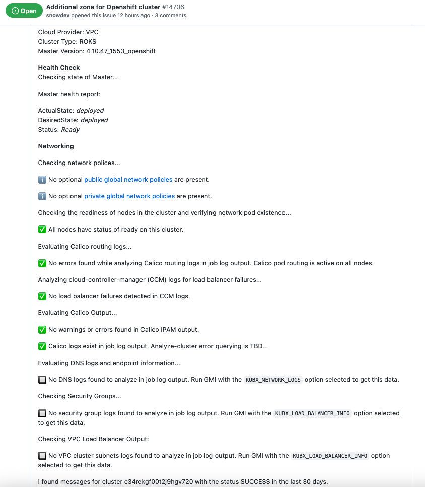

Troubleshooting
{: .label .label-red}

## Overview

This runbook describes the steps to take to verify that a cluster master is healthy.  The goal of this runbook is to rule out any issues with an individual cluster master, including:

- Master pods in CrashLoopBackOff
- Master pods restarting often due to memory or other issues
- Master pods on an unhealthy carrier/tugboat worker
- Master etcd limits or problems
- Webhook issues
- Other things I can't think of now

## Example Alerts

This is a general troubleshooting runbook and is not tied to any specific alerts

## Investigation and Action

The following sections describe what to check to ensure the cluster master is healthy

## Check Cluster Master Health

### Run Analyze Cluster

There is a job that scans all the GHE customer tickets in the [customer-ticket repo](https://github.ibm.com/alchemy-containers/customer-tickets/issues) every hour, and for any tickets that don't have the label `analysis-report` (so for all new tickets) it runs the `HMS Victory` slack bot: `@victory analyze-cluster <CLUSTER_ID>` (assuming it can find a cluster ID).  This bot does the following:

1. Runs the get-master-info (GMI) jenkins job [https://alchemy-containers-jenkins.swg-devops.com/job/Containers-Runtime/job/armada-deploy-get-master-info/](https://alchemy-containers-jenkins.swg-devops.com/job/Containers-Runtime/job/armada-deploy-get-master-info/) on the first three cluster IDs that it finds in the issue if any.
1. Analyzes the GMI output checking for common problems, and puts the results into the ticket itself.

So if you want to check the health of a cluster for a GHE ticket, the data might already be in the ticket.  If it isn't (yet), you can run `@victory analyze-cluster <CLUSTER_ID>` manually to get the output in slack.

### Example Healthy Output

Here is an example of analyze-cluster output for a healthy cluster

Generally if the following items are in the Cluster analysis in the ticket, the master is healthy:

1. For "Master health report", we want to see:
    - ActualState: deployed
    - DesiredState: deployed
    - Status: Ready

1. Checking the readiness of nodes in the cluster...
    - We want to see a green check and "All nodes have status of ready on this cluster"
    - Just because a node or two is NotReady does not necessarily indicate a problem with the master
        - If there are just a few nodes in NotReady state, ask the customer to reload (for Classic) or replace (for VPC) those workers
        - If all nodes, or all nodes in a zone are NotReady, then after finishing the checks in this runbook, go on to the [IKS/ROKS Worker NotReady or Critical Troubleshooting](./armada-network-node-not-ready-troubleshooting.html) runbook.

1. Evaluating Calico routing logs...
    - We want to see a green check and "No errors found while analyzing Calico routing logs in job log output"
    - If there are any problems reported here, it means one or more nodes aren't able to establish a tcp connection to all the other nodes (to pass pod routes via BGP protocol)
        - If it is a node or two that is reporting the problem, ask the customer to reload (for Classic) or replace (for VPC) those workers
        - If all nodes, or all nodes in a zone are reporting the problem here, it could be Security Groups, Calico policies, or IaaS problem that is preventing workers from connecting to each other.  Ask the customer to provide all the network MustGather info if they haven't already.

1. Analyzing cloud-controller-manager (CCM) logs for load balancer failures...
    - We want to see a green check and "No load balancer failures detected in CCM logs."
    - If there are problems reported and the customer's ticket is complaining of a problem with their Load Balancer (or Ingress, which uses a Load Balancer), then ask the customer to provide all the network MustGather info if they haven't already.

1. Evaluating Calico Output
    - We want to see "No warnings or errors found in Calico IPAM output.

## Escalation Policy

If the above steps reveal problems that can not be resolved, use the following escalation policies:

1. If the problem appears to be network related, use the escalation steps below to involve the `armada-network` squad:
  * Escalation policy: [Alchemy - Containers Tribe - armada-network](https://ibm.pagerduty.com/escalation_policies#P2MK3WQ)
  * Slack channel: [#armada-network](https://ibm-argonauts.slack.com/messages/armada-network)
  * GHE issues: [armada-network](https://github.ibm.com/alchemy-containers/armada-network/issues/)

## References

  * [Armada Architecture](https://github.ibm.com/alchemy-containers/armada/tree/master/architecture)
