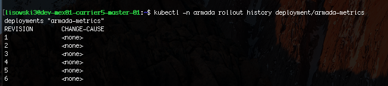

Troubleshooting
{: .label .label-red}

# Armada-Metrics Is Down Runbook
 
 
This incident is raised when armada-ops cannot probe armada-metrics for a period of time. 

This is likely due to either armada-metrics being down or deployed improperly.

This could also be due to the armada-op checks being too sensitive (paging after one transient fail)
or kube-dns failing (causes K8 DNS lookups to fail).

## Symptoms

* A pager duty incident came in that states armada-metrics service is down.

## Diagnosing problem

### Examine production environment

If the environment cannot be accessed, please escalate to the **armada-infra** team. 
See [escalation policy](./armada_pagerduty_escalation_policies.html).
 
**Steps:**

1) Log into the proper carrier VM in the production environment so you can run kubectl commands
  * `ssh <username>@<carrier_IP>`
  *  Requires VPN access to the environment as well
    

2) List Deployment Information
  * Describe the deployment with `kubectl -n armada describe deployment armada-metrics`
  * Typical output pictured below  
  
  
  * Verify that **at least 1 replica exists (total) and at least 1 replica available**.
    * If total does not have at least one replica see [Change Deployment to 1 Replica](#change-deployment-to-1-replica)
  * If the deployment cannot be found, see [escalation](#escalation).
  * Otherwise, continue to the next step
    

  
3) Verify Armada Metrics Pod(s)
 * Run `kubectl -n armada get pods` and look for armada-metric pods 
 
 
 * Check pod(s) Status
   * If 1 or more pods are in Running
     * Follow [Verify Health Route](#verify-health-route) 
   * If all are in CrashLoopBackOff:
     * Delete all the pods in CrashLoopBackOff `kubectl -n armada delete pod armada-metrics-<hash>-<hash>`.
     The deployment will handle respinning them back up.
     * Wait 1 minute then check to see if the pod(s) are still in CrashLoopBackOff state.
     The goal of this step is to see if the service can recover from the failure or if it will
     consistently reoccur. 
     * If still in CrashLoopBackOff after a minute [perform a rollback](#rollback-to-previous-version)
     * If pod(s) entered Running state, [verify the health route](#verify-health-route)
   * If all are in ImagePullBackoff **this is most likely an error in the build process**.
     * See if problem is happening across multiple armada-microservices
       * List all armada pods with `kubectl -n armada get pods`
       * If happening across multiple (2+) pod types, **escalate to the pvg pipeline team**.
       See  [escalation policy](./armada_pagerduty_escalation_policies.html)
     * If bad state seen on just armada-metric pods, follow [perform a rollback](#rollback-to-previous-version)
              
    
### Actions To Take

#### Change Deployment to 1 Replica

In this action, you will set the replica count of the deployment to one so a replica is available. 
This should only be done when no replicas are in the deployment.
 * Run `kubectl -n armada scale --replicas=1 deployment/armada-metrics`
 * Output should be `deployment "armada-metrics" scaled`
 * Wait a few seconds then describe the deployment with `kubectl -n armada describe deployment armada-metrics`
 * Output should have  `1 updated | 1 total | 1 available | 0 unavailable` 
 
 
 * If the output has one available, move to [Verify Health Route](#verify-health-route)
 
 
#### Rollback to previous version

In this action, you will roll back the deployment to the previous version. This should only be done
when the current version is consistently failing.
 * Run `kubectl -n armada rollout history deployment/armada-metrics`
 * Output similar to below: 
 
 
 * Rollback to the **second highest number** (most recent backup) deployment (in above would be 5)
   * Run `kubectl -n armada rollout undo deployment/armada-metrics --to-revision=<2nd highest number>`
 * Wait for rollback to occur
   * `kubectl -n armada rollout history deployment/armada-metrics` should have another entry 
   when rollback completes
 * Follow [Verify Health Route](#verify-health-route) after completing roll back.
 
 
 
#### Verify Health Route
This is the final verification action.
 * Find the port of the service definiton
   * Run `kubectl -n armada get service armada-metrics`
   * Note the port in the service definiton (picture shown below) 
   
 
   * If service cannot be found, see [Escalation](#escalation)
 * Exec into an armada metrics pod
   * Run `kubectl -n armada get pods`
   * Find a pod that contains *armada-metrics* in its name (will have some extra hash values after) and 
   is in *running* state
   * Exec into that pod `kubectl -n armada exec -it armada-metrics-<hash val>-<hashval> -- /bin/sh`
   * You should see a different prompt. In the terminal, run `wget http://armada-metrics:<port_from_service>/`
     * Output should be similar to below 
     
 
   * If that route can successfully be curled, **the pager duty can be resolved!**
   * Otherwise, see [Escalation](#escalation)

#### Ultimate Goal
Ultimately, the person resolving the problem is just trying to ensure they can successfully issue an HTTP request against
the armada-metrics service (`http://armada-metrics:<port>`). That is what is checked by the probe 
and triggers an alert if it cannot be hit. If that route can be done successfully hit, **the 
pager duty can be resolved**. If the route cannot be hit and there are no apparent wide spread networking, deployment, or build issues
see [escalation](#escalation). **If there are wide spread armada issues like the ones listed above**, this problem is probably a side effect of a larger 
issue and should be escalated to the proper team to solve the larger issue. Once the larger issue is solved,  the verification can then take place. 
 
 
 
#### Escalation

Involve the `armada-metrics` squad via their [escalation policy](./armada_pagerduty_escalation_policies.html)
