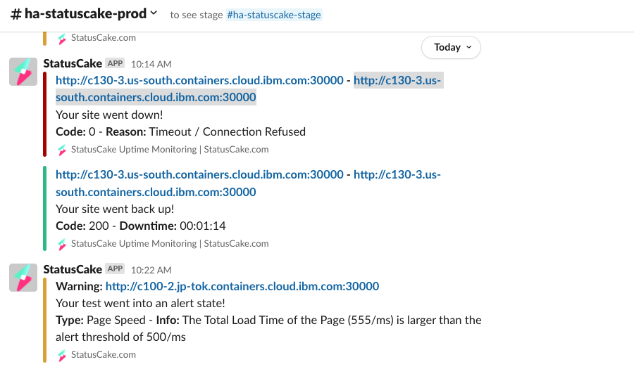

Troubleshooting
{: .label .label-red}


## Overview

This runbook describes the troubleshooting steps for various IKS/ROKS control plane network components including:

- Service Endpoints
- Tugboat Edge Node
- "haproxy" VSIs for Legacy Carriers
- cse-health-check pods

This runbook got quite long, so I might need to create a separate runbook with fewer steps and explanations that is just focused on getting a service endpoint back working when it is having problems, and have this be more of an educational document and something that can be used for in depth troubleshooting and RCAs.

## Example Alerts

This is a general troubleshooting runbook and is not tied to any specific alerts

## Investigation and Action

The path between IKS/ROKS cluster workers and the cluster apiserver and openvpn/konnectivity server pods includes several different components, each of which could malfunction and possibly prevent workers from connecting to the masters.  This runbook describes how to check whether these components that are part of the IKS/ROKS control plane are functioning properly, and also whether they were functioning properly at a time in the past (for use when a customer requests an RCA).

## Overview Of Worker to Master Private Network Path

This section is just for general background.  Skip to the section **Verify Cloud Service Endpoints (CSEs) Are Working Correctly** if you just want the troubleshooting steps

The exact worker to master network path(s) depend on what type of cluster it is.  Run `@xo cluster <CLUSTERID> show=all` (or look in GMI) to check this:

- `DefaultProvider: g2` indicates the cluster is a VPC cluster, `DefaultProvider: ` (empty) or `DefaultProvider: null` indicates the cluster is Classic
- If the `ActualPrivateServiceEndpointURL` entry is not `null`, then the cluster has a private service endpoint
    - Note that ALL VPC clusters have a private service endpoint, it is not optional
- If the `ActualPublicServiceEndpointURL` entry is not `null`, then the cluster has a public service endpoint

Note: In the rest of the runbook, I'll be describing the network paths for our multi-zone regions.  Several of our regions have single-zone carriers/tugboats, so if the cluster master is on one of these, then there is only one public and one private control plane IP and only one CSE.

### VPC Cluster With Public and Private Service Endpoint

These VPC cluster workers will first try to use the VPE Gateway in the customer's VPC to connect to the master.  The VPE Gateway connects to the multi-zone private service endpoint using only the 166.9.x.x IP that corresponds to the zone the worker is in.  This private service endpoint is also known as the Cloud Service Endpoint (CSE).  This multi-zone CSE tries to connect to all three IKS/ROKS control plane private IPs (10.x.x.x IPs) for the tugboat/carrier cluster.

If this private connection through the VPE Gateway is failing its health check, then the ibm-master-proxy-static pod running haproxy will try the public control plane IPs as a backup.

TODO: Create VPC Worker to Master Private network path diagram

TODO: Create VPC Worker to Master Public network path diagram

### Classic Cluster With Public and Private Service Endpoint

These Classic cluster workers will first try to use the three single zone private service endpoints to connect to the master (one for each zone).  These single zone private service endpoints, also known as the Cloud Service Endpoints (CSEs), only try to connect to the IKS/ROKS control plane private IP in the one zone they are in.  However the haproxy config in the ibm-master-proxy-static pod lists all three separately, so the workers can use any of the three.  If all three of these private connections are failing their health checks, then the workers will try the three public control plane IPs as a backup.

TODO: Create Classic Worker to Master Private network path diagram

TODO: Create Classic Worker to Master Public network path diagram

### VPC Cluster with Private Service Endpoint Only

Same as in **VPC Cluster With Public and Private Service Endpoint** above, but it does not use the public control plane IPs as a backup

### Classic Cluster with Private Service Endpoint Only

Same as in **Classic Cluster With Public and Private Service Endpoint** above, but it does not use the public control plane IPs as a backup

### Classic Cluster with Public Service Endpoint Only

These Classic cluster workers use all of the three public control plane IPs to connect to the master (one for each zone).  The haproxy config in the ibm-master-proxy-static pod lists all three separately, so the workers can use any of the three.  If any of these IPs fail their health check, haproxy will stop using it, and will send all new connections to only the ones that are working

## Verify Cloud Service Endpoints (CSEs) Are Working Correctly

Unless the cluster is a public service endpoint only classic cluster, the workers will be communicating with the master first over the private serivce endpoint (using the public service endpoint as a backup if the private service endpoints/CSEs are down).  We are constantly monitoring all our CSEs, and can view prometheus graphs to see current and historical data to check if the CSEs and the IKS/ROKS control plane IPs they connect to are up and if they were up in the past.

It is important to note that when prometheus is monitoring/health checking the hostnames for these private service endpoints, it isn't always connecting to the 166.9.x.x CSE IP.  From what I understand, prometheus is running on each tugboat and on each legacy carrier, and is monitoring only the CSEs and VIPs for that one tugboat/carrier.  This, combined with the fact that armada-dnsman is adding its own Corefile to the cluster DNS for each carrier/tugboat with entries to override some of these DNS names, and that the prometheus pods are using `dnsPolicy: ClusterFirst`, means the following:

**cXXX.private.<REGION>.containers.cloud.ibm.com** - When prometheus is health checking/monitoring this hostname, it is actually resolving to one of the three 10.x.x.x endpoints (at random) because armada-dnsman overrides this hostname to resolve to these 10.x.x.x IPs

**cXXX-Y-1.private.<REGION>.containers.cloud.ibm.com** - These are separate CSEs that only route traffic within the zone they are in (where Y is 1, 2, or 3 based on the zone).  These hostnames are not overridden by armada-dnsman, so prometheus health checking/monitoring is connecting to the 166.9.x.x CSE IPs for these.

**cX.private.<REGION>.containers.cloud.ibm.com** - When prometheus is health checking/monitoring this hostname, it is actually resolving to one of the three 10.x.x.x endpoints (at random) because armada-dnsman overrides this hostname (and it appears all hostnames like this in the region) to resolve to the 10.x.x.x IPs.  I verified this on prod-dal12-carrier2 via GMI job https://alchemy-containers-jenkins.swg-devops.com/job/Containers-Runtime/job/armada-deploy-get-master-info/94785/.  However it looks like on stage-dal10-carrier0 that there are no dnsman entries, so this will work differently in stage

**cX-Y-1.private.<REGION>.containers.cloud.ibm.com** - These are separate CSEs that only route traffic within the zone they are in (where Y is 1, 2, or 3 based on the zone).  These hostnames are not overridden by armada-dnsman, so prometheus health checking/monitoring is connecting to the 166.9.x.x CSE IPs for these.

I verified this in stage for tugboats by exec'ing into a monitoring/armada-ops-blackbox-exporter-... pod (which I believe is what does the checks on these service endpoints) on stage-dal10-carrier105 and running `curl -vvv https://c105.private.containers.test.cloud.ibm.com:30001` and seeing that it used one of the 10.x.x.x IPs from the kube-system/coredns configmap's armada-dnsman Corefile.  I also tried `curl -vvv https://c105-1-1.private.containers.test.cloud.ibm.com:30001` and saw that it used the 166.9.x.x IP.

We should set up prometheus monitors that check both the connection through the CSE as well as the connection direct to the 10.x.x.x VIPs so that when there is a problem we can easily see whether it is related to one of the CSEs or just a problem with one of the three 10.x.x.x VIPs.  I created issue https://github.ibm.com/alchemy-containers/armada-network/issues/7714 for this, so we should update this runbook when that is complete.  Until this is done, we also can use the checks of the 10.x.x.x IPs that armada-dnsman is doing, the failures of these checks are reported in [#armada-dnsman-alerts](https://ibm-argonauts.slack.com/archives/C01F3V0E2AH).  I am not sure how often those checks are run though.

### View Prometheus Data for Private Service Endpoints

To check if any of the CSEs for the tugboat or carrier that a cluster master is on reported any problems do the following:

1. Get the `ActualPrivateServiceEndpointURL` from XO or from GMI.  It will be of the form `<carrier_or_tugboat_number>.private.<region>.containers.cloud.ibm.com:<NodePort>` The `<carrier_or_tugboat_number>` will be one of the following (ignore the `-e` if it is there):
    - cXXX: This cluster master is on a tugboat
    - cX: This cluster master is on a legacy carrier

2. Go to https://alchemy-dashboard.containers.cloud.ibm.com/carrier and log in if needed.  Select the region and legacy carrier or tugboat based on the `ActualPrivateServiceEndpointURL` (from the URL above), then choose "Prometheus"

3. Put `probe_success{job=~"master-private-endpoint-.*"} == 0` in the "Expression box at the top of the page and click "Execute".  Then select the "Graph" tab.  This will show you the last hour of data.  If you need to check on values in the past, just specify the time range in the boxes right below the "Graph" tab.  Note that graphing larger time spans means that some intermediate data points are not used, so to see smaller outages you might need to use 1h or 2h spans.  If it reports "Empty query result" for the time span chosen, then it means there were no outages detected in CSE connection monitoring and that they seem to be working correctly.  If there are periods of time where the graph shows that the probe_success value was 0, that means the connection test of the CSE failed at that time for that specific CSE, and that should be investigated further.  The following example graph shows a generally healthy set of CSEs for the control plane tugboat c113 in eu-central (eu-de):


There are two individual points where prometheus queried the CSE and it failed (as shown by the two dots).  Note that times in the prometheus graphs are in UTC:

    - First was around 03:12 when querying c113-3-1.private.eu-de.containers.cloud.ibm.com
    - Second was around 03:31 when querying c113.private.eu-de.containers.cloud.ibm.com

Since these were both just single failures they would not have caused problems for any workers.  When we are looking at these we are looking for periods of 30 seconds or more (multiple failures in a row) at minimum.

4. Another useful query is `probe_http_duration_seconds{phase="connect",job=~"master-private-endpoint-c.*"} < 0.3` which will show you the response time of the CSEs instead of just if they were up or down.  The following example graph shows a healthy set of CSEs for the control plane tugboat c100 in eu-central (eu-de):


Most of the response times are very good, less than 5 ms), with a few taking up to 40 ms which is not unusual and not a problem.  We use the conditional to only show us response times less than 0.3 s (300 ms) just so the scale of the graph isn't thrown off if occasionally a response takes 1 or 2 seconds.  You can always remove this `< 0.3` conditional at the end of the expression to see all the values, and see if there are a lot of queries taking over a second (which could indicate a problem).

You can also see a small break in the blue line (for c100-2-1.private...) around 11:54.  This is also not a cause for concern, and usually means that either that request took more than 300ms (which is fine if it doesn't happen very often), or that prometheus for some reason wasn't able to report or record that data.

If this graph shows consistently high response times (in the 50+ ms range for a majority of responses) for one or more CSEs, or if it shows frequent 0 values then that does indicate a problem either with the CSE or with one of the tugboat edge nodes (for cXXX URLs) or one of the "haproxy" VSIs used by cX legacy carriers.  In that case rebooting the edge nodes or haproxy VSIs for the region showing the problem is a good first step to resolve the issue.  Use the next section to do so.

### How To Identify and Reload Tugboat Edge Nodes or Fail Over Legacy Carrier Haproxy VSIs

If the prometheus data above show a current problem where either one or more of the endpoints is reporting down or has consistently high response times, the best first step is to fail over the problem nodes to their backups to see if that resolves the issue.  Note that these instructions cover both cXXX (tugboats) and cX (legacy carriers), but the examples will use cXXX.

1. Use `dig +short cXXX-Y-1.private.<region>.containers.cloud.ibm.com` for the problem endpoint to get the 166.9.x.x CSE IP.  Note that if the problem endpoint in the prometheus graph is `cXXX.private.<region>.containers.cloud.ibm.com` and the three cXXX-Y-1... endpoints all look fine, that is harder to figure out because that DNS name resolves to three different 166.9.x.x IPs, one in each zone.  In that case skip to **Check Private Control Plane VIPs**.  And if following that section and the sections below don't help determine a cause, then come back to this section and reboot or fail over all three zones one at a time.
2. Go to the [https://alchemy-containers-jenkins.swg-devops.com/job/Containers-Runtime/job/armada-network-private-service-endpoint-operations/](https://alchemy-containers-jenkins.swg-devops.com/job/Containers-Runtime/job/armada-network-private-service-endpoint-operations/) jenkins job that can be used to dump all IKS/ROKS CSE data for a given region.  Either find an existing dump-cse-data job for the region in question that has been run in the last few months (since these CSEs aren't added/changed very often), or run a dump-cse-data job for the region if you can't find a recent one.
3. Search the dump-cse-data job output for that 166.9.x.x IP from step 1.  You will find a json section that looks something like this:

```
    "service": {
      "service": "prod-dal13-tugboat106-se-private-01",
      "serviceAddresses": [
        "10.209.143.10"
      ],
      ...
    "endpoints": [
      {
        "seid": "us-south-prod-dal13-tugboat106-se-private-01-iks-allcustomers-dedi-st-1g-1226852e-dal13",
        "staticAddress": "166.9.16.112",
        "netmask": "23",
        "dnsStatus": "Y",
        "dataCenter": "dal13",
        "status": "Ready"
      }
    ]
```

4. The `serviceAddresses` section will show you the 10.x.x.x VIP, and the `datacenter` section in `endpoints` will show you the zone the VIP is in.

5a. For cXXX (tugboats) only: An SRE can then run the following on that tugboat to find the two edge nodes for that zone: `kubectl get pods -n ibm-system -o wide | grep ibm-cloud-provider-ip-10.x.x.x` (replacing 10.x.x.x with the actual VIP).  The two nodes that those pods for that VIP are running on are the ones that should be reloaded using chlorine-bot I believe.  This should be done one at a time, making sure the first reloaded edge node is up, in ready state, and has a new `ibm-cloud-provider-ip-10.x.x.x...` pod running before reloading the second edge node.  Even if the first reload resolves the issue (because that reloaded node was the active one, and as soon as the reload process shut down that node the other node took over as the active one), it is still a good idea to either reload the second one, or at least fail the VIP back over to the reloaded one (by killing the pod on the second one or rebooting the second one).  This way we can verify that the reload of the first one resolved whatever the issue was on that node.

5b. For cX (legacy carriers only): Ask either Netint or SREs to fail over the active haproxy box for the given legacy carrier in the specific zone.  If this resolves the issue it will be up to Netint to decide what to do next, if they want to fail back to the original to see if the problem still exists (or if clearing all the connections resolved the issue).  It will also be up to Netint how to try to find the cause of the problem.

If this does not resolve the problem, then it is likely a problem with the CSE, or with the cse-health-check pods, or maybe the network in general, so continue on with this runbook.

## Further Troubleshooting of Service Endpoint Problems

If the above graphs do show a problem either currently, or a problem in the past that resolved automatically, there are several possible causes.  It might be a problem with the IKS/ROKS Virtual IPs (VIPs) or the nodes those VIPs are on (tugboat edge nodes or legacy carrier haproxy VSIs) that those CSEs send traffic to.  It could be a problem with a specific CSE, or just a problem with the IaaS networking for that specific region.  It could also indicate a problem with the cse-health-check pods on the tugboats or legacy carriers.  Here are some things to check, in order, to rule out different components.

### Troubleshoot Current Problems with Private Control Plane VIPs

For `cXXX` (tugboat) endpoints, these private VIPs live on the tugboat edge nodes, which are tugboat worker nodes with the `dedicated: edge` label.  They are managed by our Classic LoadBalancer v1.0 `ibm-system/ibm-cloud-provider-ip-<VIP>...` pods that run keepalived.

For `cX` (legacy carrier) endpoints, the private VIPs live on classic VSIs (or sometimes bare metal machines) that are separate from the legacy carrier clusters.  They are named: `prod-<ZONE>-carrierX-haproxy-0Y`.  Y is either 1 or 2 because there is an active and a passive for each zone for each carrier (so for example, `prod-dal10-carrier2-haproxy-01` is one of the two "haproxy" VSIs in zone dal10 for carrier2).  These haproxy VSIs actually do not run haproxy, instead they run an IPVS loadbalancer that uses keepalived to manage the VIP between the pair of VSIs.  The traffic coming in is load balanced to all the legacy carrier workers in the same zone as the haproxy box, to whatever NodePort is in the URL.

Since **How To Identify and Reload Tugboat Edge Nodes or Fail Over Legacy Carrier Haproxy VSIs** did not resolve this problem, do the following to troubleshoot the CSEs first:

1. Ensure you are either connected to a pre-prod VPN or are on a VSI in IBM Cloud (so you have access to the 166.9.x.x IPs)
2. ping the following dns names to ensure the CSEs are up and running (assuming it is tugboat prod-wdc04-carrier105):
    - `ping -c5 c105.private.us-east.containers.cloud.ibm.com`
    - `dig +short c105.private.us-east.containers.cloud.ibm.com`
        - If this only returns one IP, then this is a single-zone tugboat (like prod-sjc03-carrier109 for example), and stop here (do not ping the `cXXX-Y-1` entries below)
        - If this returns three IPs, then ping each of the IPs and then continue on
    - `ping -c5 c105-1-1.private.us-east.containers.cloud.ibm.com` (only for multi-zone tugboats)
    - `ping -c5 c105-2-1.private.us-east.containers.cloud.ibm.com` (only for multi-zone tugboats)
    - `ping -c5 c105-3-1.private.us-east.containers.cloud.ibm.com` (only for multi-zone tugboats)

If any of those do not ping successfully, then skip to the section **Write Issue to CSE Team To Investigate CSE**

If the ping checks above work fine, but the prometheus graphs still show a current problem, then continue on.

If it is a tugboat, run GMI on the tugboat (can get the clusterID from [armada-envs](https://github.ibm.com/alchemy-containers/armada-envs/) and check the following boxes:

- `CLUSTER_ETCD_INFO`
- `MASTER_ETCD_INFO`
- `MASTER_CONTROL_PLANE_RESOURCES`
- `KUBX_LOAD_BALANCER_INFO`
- `CUSTOM_KUBX_KUBECTL`
    - "get pods -n ibm-system -o wide; describe node"
    - this will show you all the Loadbalancer `ibm-cloud-provider-ip-VIP` pods and which edge nodes they are on, and `describe node` will show you which edge nodes are for which zone

Once the GMI job for the tugboat finishes, look to make sure the `ibm-cloud-provider-ip-VIP` pods are all up and running (two per VIP) and are Ready and look healthy.  Make sure all the edge nodes are Ready.  And look at the `ibm-cloud-provider-ip-VIP` logs to make sure that for each pair, one is the active and has the VIP, and the other is the passive.  If any of these conditions are not met, work with the SREs to restart the pods and/or edge nodes necessary to get them back working using the instructions from **How To Identify and Reload Tugboat Edge Nodes or Fail Over Legacy Carrier Haproxy VSIs**.  If they still are having problems even after a reload of the edge nodes, it might make sense to just replace the edge nodes in that zone completely

If instead this is a legacy carrier, then contact the Netint teams to ask them to investigate the haproxy box for the carrier and zone that is having the problem.  Or if it is urgent and Netint isn't available, ask the on call SREs to reboot or failover both haproxy boxes one at a time.  If that doesn't work, the Netint team will need to investigate.

If no problems are found and if failing over our edge nodes/haproxy VSIs does not resolve the current problem, then it is possibly a problem with the CSE so skip to the section **Write Issue to CSE Team To Investigate CSE**


### Troubleshoot Current Problems with Public Control Plane VIPs

The public control plane VIPs are managed the same as the private ones are as described in "Troubleshoot Current Problems with Private Control Plane VIPs" as far as where they are located for tugboats and for legacy carriers.  There are several differences though.

There are only 3 public VIPs per tugboat/carrier, and CSEs aren't involved at all so the network path is shorter and more simple.

To further troubleshoot problems with the public service endpoints, do the following:

- ping the following dns names (assuming it is tugboat prod-wdc04-carrier105):
    - `ping -c5 c105.us-east.containers.cloud.ibm.com`
    - `ping -c5 c105-1.us-east.containers.cloud.ibm.com` (only for multi-zone tugboats)
    - `ping -c5 c105-2.us-east.containers.cloud.ibm.com` (only for multi-zone tugboats)
    - `ping -c5 c105-3.us-east.containers.cloud.ibm.com` (only for multi-zone tugboats)

If any of the VIPs do not ping successfully, then if it is a tugboat, run GMI on the tugboat (can get the clusterID from [armada-envs](https://github.ibm.com/alchemy-containers/armada-envs/) and check the following boxes:

- `CLUSTER_ETCD_INFO`
- `MASTER_ETCD_INFO`
- `MASTER_CONTROL_PLANE_RESOURCES`
- `KUBX_LOAD_BALANCER_INFO`
- `CUSTOM_KUBX_KUBECTL`
    - "get pods -n ibm-system -o wide; describe node"
    - this will show you all the Loadbalancer `ibm-cloud-provider-ip-VIP` pods and which edge nodes they are on, and `describe node` will show you which edge nodes are for which zone

Once the GMI job for the tugboat finishes, look to make sure the `ibm-cloud-provider-ip-VIP` pods are all up and running (two per VIP) and are Ready and look healthy.  The 3 public VIPs are the IPs that correspond to the `c105-Y.<region>.containers.cloud.ibm.com` hostnames (with Y in {1, 2, 3}).  Make sure all the edge nodes are Ready.  And look at the `ibm-cloud-provider-ip-VIP` logs to make sure that for each pair, one is the active and has the VIP, and the other is the passive.  If any of these conditions are not met, work with the SREs to restart the pods and/or edge nodes necessary to get them back working using the instructions from **How To Identify and Reload Tugboat Edge Nodes or Fail Over Legacy Carrier Haproxy VSIs** starting with step 5a (and replacing the 10.x.x.x VIP with the public VIP identified in this section).  If they still are having problems even after a reload of the edge nodes, it might make sense to just replace the edge nodes in that zone completely

If instead this is a legacy carrier, then contact the Netint teams to ask them to investigate the haproxy box for the public VIP that is having the problem, or just to fail over that active haproxy box.  Or if it is urgent and Netint isn't available, ask the on call SREs to reboot or failover both haproxy boxes one at a time.  If that doesn't work, the Netint team will need to investigate.

### Investigating Past Problems with Private Control Plane VIPs

If the steps in **View Prometheus Data for Private Service Endpoints** don't show any problems over the time the customer is asking about, then just let the customer know that our monitoring shows that the private service endpoint was up and running during this time.  If the problem reported is nodes reporting NotReady or critical, then use the [IKS/ROKS Worker NotReady or Critical Troubleshooting](./armada-network-node-not-ready-troubleshooting.html) runbook and focus on the checks that don't involve the service endpoint.

Otherwise if the prometheus data does show health check problems, then use the sections below to check the components that might have caused a problem:

- **Check `ibm-cloud-provider-ip-VIP-...` logs in IBM Cloud Logs** for the specific VIP that had the problem (if tugboat)
- **Check Tugboat Edge Node Health** for the tugboat and zone that had the problem (if tugboat), otherwise ask Netint to check the haproxy VSI health and logs for the legacy carrier and zone that had the problem
- **Check cse-health-check Pod Availability**
- **Write Issue to CSE Team To Investigate CSE** if all our IKS components look fine for the time the endpoint had the problem

### Investigating Past Problems with Public Control Plane VIPs

We don't have prometheus monitoring of these public IPs like we do the private CSEs, but we do use "statuscake" to monitor the health of these.  You can see the results in the slack channel [#ha-statuscake-prod](https://ibm-argonauts.slack.com/archives/CD54PESFP).  Here is an example [Site down message](https://ibm-argonauts.slack.com/archives/CD54PESFP/p1674663276011409) message that shows a connection timeout to `http://c130-3.us-south.containers.cloud.ibm.com:30000`



This means the the public VIP for prod-dal10-carrier130 (c130-x.us-south...) from the 3rd region (cXXX-3.<region>...) failed to respond at 10:14 CST on 1/25/23, but responded successfully on 10:15, about a minute later.

So if doing an RCA for a time in the past you can search this slack channel for the public endpoints the cluster is using to see if the ones for the cluster you are investigating was reporting down at times in the past.  If you are investigating an ongoing issue you could also just run this health check manually: `curl http://c130-3.us-south.containers.cloud.ibm.com:30000/`

If there are no statuscake outages reported, then check the prometheus data using **View Prometheus Data for Private Service Endpoints** since the public and private service endpoints often us the same tugboat edge node (or legacy carrier haproxy VSI).  Also:

- **Check `ibm-cloud-provider-ip-VIP-... logs in IBM CLoud Logs** for the specific VIP that had the problem (if tugboat)
- **Check Tugboat Edge Node Health** for the tugboat and zone that had the problem (if tugboat), otherwise ask Netint to check the haproxy VSI health and logs for the legacy carrier and zone that had the problem
- **Check cse-health-check Pod Availability**

### Write Issue to CSE Team To Investigate CSE

If the above steps found a possible problem with a CSE, use these instructions to write an issue to the CSE team to investigate:

TODO: include how to write a ticket to the CSE team similar to [https://github.ibm.com/NetworkTribe/MISsupport/issues/597](https://github.ibm.com/NetworkTribe/MISsupport/issues/597)  Probably just refer to the steps in **How To Identify and Reload Tugboat Edge Nodes or Fail Over Legacy Carrier Haproxy VSIs** for how to get CSE specification.

### Check `ibm-cloud-provider-ip-VIP-...` logs in IBM Cloud Log

Open [IBM CLoud Logs](https://cloud.ibm.com/observability/logging) then clicking on the `Cloud Logs` tab. Select Logs -> Explore Logs page in the menu and then query for `ibm-cloud-provider-ip-` in the subsystem filter.

### Check Tugboat Edge Node Health

TODO: Get Prometheus queries and examples from https://github.ibm.com/alchemy-containers/armada-network/issues/7721

### Check cse-health-check Pod Availability

TODO: Get Prometheus queries and examples from https://github.ibm.com/alchemy-containers/armada-network/issues/7721

## Escalation Policy

If the above steps don't resolve the issue, and the problem appears to be network related, use the escalation steps below to involve the `armada-network` squad:

  * Escalation policy: [Alchemy - Containers Tribe - armada-network](https://ibm.pagerduty.com/escalation_policies#P2MK3WQ)
  * Slack channel: [#armada-network](https://ibm-argonauts.slack.com/messages/armada-network)
  * GHE issues: [armada-network](https://github.ibm.com/alchemy-containers/armada-network/issues/)

## References

  * [Armada Architecture](https://github.ibm.com/alchemy-containers/armada/tree/master/architecture)
