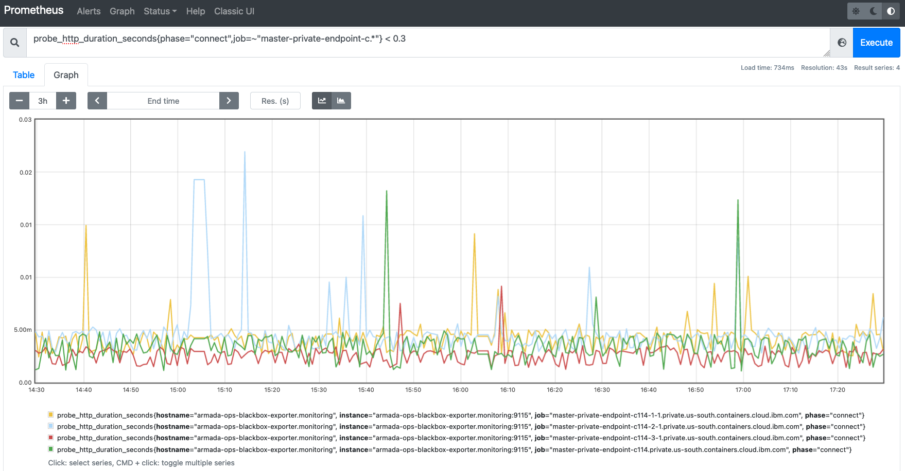
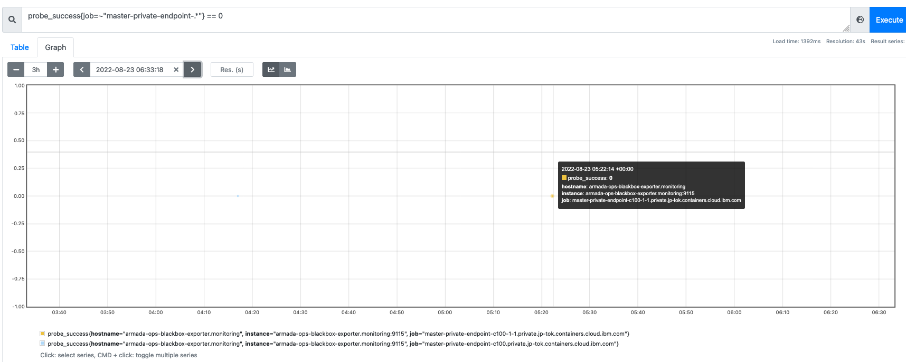
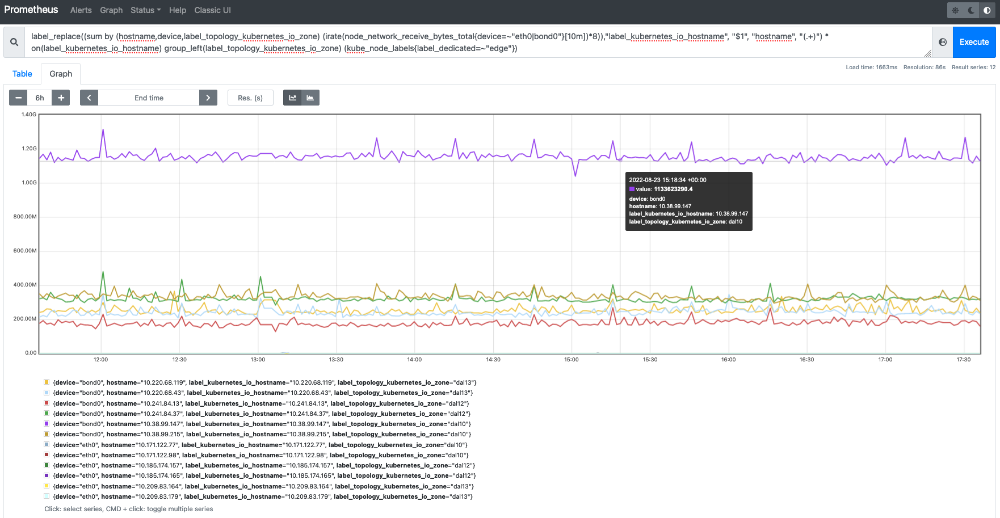

Informational
{: .label }

## Overview

This runbook provides a list of useful metrics when troubleshooting possible network problems on a given control plane cluster (tugboat or carrier).  I think all of these came from John McMeeking.

## Detailed Information

## Tugboat/Carrier Edge Node Graphs and Metrics

If a customer is reporting that they get intermittent connection problems from their worker to the apiserver, or while using kubectl, or when calling the k8s APIs directly, the prometheus graphs listed in this runbook can show whether there might be a problem connecting through our edge nodes.

The links in the sections below show the graphs of this data for the specific tugboat prod-dal10-carrier114.  To see other tugboats or carriers just replace that part of the URL with the tugboat/carrier you want to look at.  The specific tugboat/carrier that a customer cluster is on can be found via: `@xo cluster <CLUSTER-ID>` in the `ActualDatacenterCluster` property.  These graphs also default to showing the last 3 or 6 hours, which is just a starting point.  Zooming in or out will show additional details or more of a pattern.  The arrows on the date/time will show you older or newer data.  Typically Prometheus keeps 7 days of data so you won't see anything older than that.

These graphs can also be useful if a customer reports that their workers (especially VPC workers since currently they route through the VPE and only to the VIP in the zone they are in) went NotReady for a set amount of time in the past, but now are fine.  These graphs can be used to see if the private service endpoint was down during the time in question.

I have created issue [https://github.ibm.com/alchemy-containers/armada-network/issues/6756](https://github.ibm.com/alchemy-containers/armada-network/issues/6756) to improve the alerting that we have for these service endpoints, and also to clarify and simplify the runbooks mentioned.  That issue contains more details about this alerting.

### Graphs Of Connection Times and Connection Failures to Private Service Endpoints

[Prometheus Edge Node Latency And Connection Failures For prod-dal10-carrier114](https://alchemy-dashboard.containers.cloud.ibm.com/prod-dal10/carrier114/prometheus/graph?g0.expr=probe_http_duration_seconds%7Bphase%3D%22connect%22%2Cjob%3D~%22master-private-endpoint-c.*%22%7D%20%3C%200.3&g0.tab=0&g0.stacked=0&g0.range_input=3h&g1.expr=probe_success%7Bjob%3D~%22master-private-endpoint-.*%22%7D%20%3D%3D%200&g1.tab=0&g1.stacked=0&g1.range_input=3h)

The first graph shows how long the initial part of a connection takes.  By default we graph only those connection times that are < 0.3 seconds.  This is because there are occasional connections that take over a second (due to a SYN packet getting dropped, which doesn't get resent by the TCP stack for 1 second), and including those sets the scale of the graph to a point where it is not very useful.  If you do want to see how often the connection takes longer, just remove the `< 0.3` from the query.  If the response time is greater than 300ms for 5 minutes or more use runbook [armada-master-private-service-endpoint-slow](./armada-master-private-service-endpoint-slow.html) to handle this.  We do have an alert for this that should trigger as well.

The second graph shows any connection errors.  There should be almost none of these, if there are any significant number of them (more than 1 or 2 per 20 minutes), this indicates some kind of problem and you should refer to runbook [armada-service-endpoint-down](armada-service-endpoint-down.html)  Again, zooming in to only show 30 minutes or so can show you more detail and can show you connection problems that don't appear if you are looking at a 1 hour or longer range.

### Graphs of Amount of Traffic

[Prometheus Edge Node Throughput For prod-dal10-carrier114](https://alchemy-dashboard.containers.cloud.ibm.com/prod-dal10/carrier114/prometheus/graph?g0.expr=label_replace((sum%20by%20(hostname%2Cdevice%2Clabel_topology_kubernetes_io_zone)%20(irate(node_network_receive_bytes_total{device%3D~%22eth0|bond0%22}[10m])*8))%2C%22label_kubernetes_io_hostname%22%2C%20%22%241%22%2C%20%22hostname%22%2C%20%22(.%2B)%22)%20*%20on(label_kubernetes_io_hostname)%20group_left(label_topology_kubernetes_io_zone)%20(kube_node_labels{label_dedicated%3D~%22edge%22})&g0.tab=0&g0.stacked=0&g0.range_input=6h&g1.expr=label_replace((sum%20by%20(hostname%2Cdevice%2Clabel_topology_kubernetes_io_zone)%20(irate(node_network_receive_packets_total{device%3D~%22eth0|bond0%22}[10m])))%2C%22label_kubernetes_io_hostname%22%2C%20%22%241%22%2C%20%22hostname%22%2C%20%22(.%2B)%22)%20*%20on(label_kubernetes_io_hostname)%20group_left(label_topology_kubernetes_io_zone)%20(kube_node_labels{label_dedicated%3D~%22edge%22})&g1.tab=0&g1.stacked=0&g1.range_input=6h)

These prometheus graphs show how much traffic is flowing to/through our private service endpoints for a given tugboat or carrier.  The first one shows the throughput in Mbits/sec (or Gbits or Kbits depending on the scale).  The second one shows packets per second.  Both only show the data/packets coming in, but that is usually proportional to the data/packets going out.  To see the outgoing data instead just use "node_network_transmit_bytes_total" or "node_network_transmit_packets_total" in the query (use "transmit" instead of "receive").

The "typical" values can vary greatly depending on the number and type of clusters the tugboat/carrier is managing.  If the edge nodes are VSIs (using the eth0 interface), anything near or above 1 Gbit/sec or above might indicate a problem since VSIs are only guaranteed 1 Gbit/sec I think.  Or if the packets per second are above 200k for VSIs (although this number may change based on investigations described in here [https://github.ibm.com/alchemy-containers/armada-ops-alert-conf/issues/585](https://github.ibm.com/alchemy-containers/armada-ops-alert-conf/issues/585) ), then that might indicate a problem as well.  Either of these might mean we need to move to bare metal edge nodes, so we should contact the SREs to discuss this.  We are already using bare metal edge nodes for some of our busiest tugboats.
