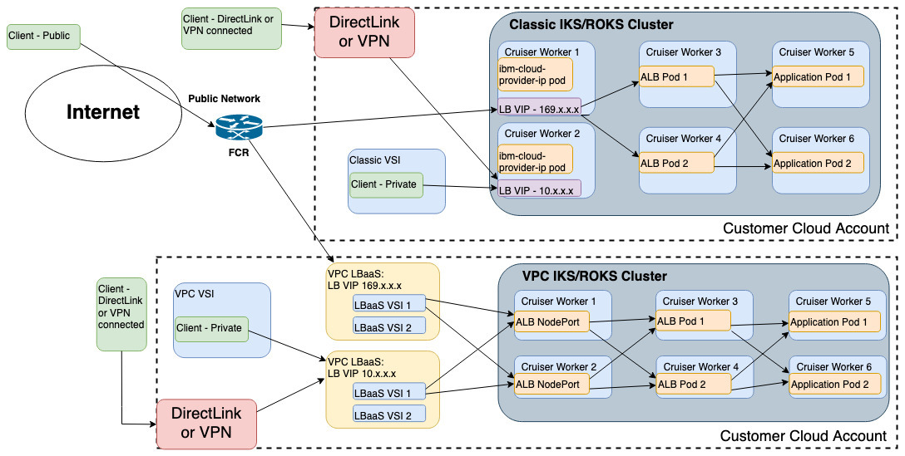

Troubleshooting
{: .label .label-red}

## Overview: IKS VPC Load Balancers

The IBM Cloud Kubernetes Service (IKS) running with VPC on Classic hardware implements the load balancer services
(i.e. type `LoadBalancer`) via a Layer 7 VPC LBaaS load Balancer running in the customer's virtual private cloud.

When a user requests Kubernetes to create, update, or delete a load balancer service, Kubernetes invokes the `ibm`
cloud provider to complete the request. Similar to other Kubernetes cloud providers (such as Google or Amazon),
the IBM cloud provider, when running in a VPC on Classic cluster, configures an external load balancer outside the Kubernetes
cluster in the networking VPC infrastructure.  The `ibm` cloud provider has been updated to configure the VPC LBaaS service
to create the external load balancer.  Incoming requests to the VPC LBaaS external load balancer are delivered into the
Kubernetes cluster via the Kubernetes node port(s) associated with the service.

External documentation on IKS and VPC load balancers:

- [VPC: Exposing apps with VPC load balancers](https://cloud.ibm.com/docs/containers?topic=containers-vpc-lbaas)
for additional background information about IKS support for VPC LBaaS
- [Troubleshooting VPC clusters](https://cloud.ibm.com/docs/containers?topic=containers-vpc_troubleshoot#vpc_ts_lb)
for troubleshooting information that is provided to customers



## Example Alerts

This is a general troubleshooting runbook and is not tied to any specific alerts

## Limitations

Before troubleshooting, review the following:

- [VPC LBaaS limitations](https://cloud.ibm.com/docs/vpc-on-classic?topic=vpc-on-classic-quotas#load-balancer-quotas)
- [IKS VPC LB limitations](https://cloud.ibm.com/docs/containers?topic=containers-vpc-lbaas#lbaas_limitations)

NOTE: IKS load balancer services are **not** supported in IKS "free" clusters.

## Investigation and Action

### Troubleshoot load balancer service creation

Start by troubleshooting load balancer service creation. Use the `kubectl describe service` command to describe the service.
Look for the following in the output.

```bash
$ kubectl describe service echo-server
Name:                     echo-server
Namespace:                default
Selector:                 app=echo-server
Type:                     LoadBalancer
IP:                       172.21.251.151
LoadBalancer Ingress:     66694775-us-south.lb.appdomain.cloud
Port:                     <unset>  80/TCP
TargetPort:               8080/TCP
NodePort:                 <unset>  30277/TCP
Endpoints:                172.30.101.10:8080,172.30.13.65:8080,172.30.135.193:8080 + 3 more...
Session Affinity:         None
External Traffic Policy:  Cluster
Events:
  Type    Reason                           Age   From                Message
  ----    ------                           ----  ----                -------
  Normal  EnsuringLoadBalancer             10m   service-controller  Ensuring load balancer
  Normal  EnsuredLoadBalancer              10m   service-controller  Ensured load balancer
  Normal  CloudVPCLoadBalancerNormalEvent  82s   ibm-cloud-provider  Event on cloud load balancer echo-server for service default/echo-server with UID e18e9f2a-91d3-44bf-9200-fb09e659f4b4: The VPC load balancer that routes requests to this Kubernetes LoadBalancer service is currently online/active
```

1. `Type` must be set to `LoadBalancer`. If not, then the user did not create a load balancer service.
2. `Endpoints` must reference the pods associated with the load balancer service. If no endpoints exist or the endpoint
   ports aren't correct, then the user did not properly associate the load balancer service with the Kubernetes resources
   (i.e. pod, replicaset, deployment, etc.) when the load balancer service was created. The user must delete and recreate
   the load balancer service with the correct information.
3. `LoadBalancer Ingress` must be set to the VPC LBaaS hostname for the load balancer service.  If the `LoadBalancer Ingress` hostname is missing
   or listed as `<pending>`, then there was an error trying to create the VPC load balancer resource.  The `Events` listed on
   the load balancer will contain additional details about why the load balancer create failed.
4. Examine the `Events` that are listed for the load balancer:
   - If there are no `Events` listed, the load balancer was likely created over an hour ago and everything appears to be OK (from the cloud provider perspective).
     Proceed to the `Troubleshooting load balancer connection` section.
   - If there is a `Normal` event with reason `CloudVPCLoadBalancerNormalEvent` from `ibm-cloud-provider`, then the load balancer was successfully created.
     Proceed to the `Troubleshooting load balancer connection` section.
   - If the normal event with reason `CloudVPCLoadBalancerNormalEvent` from `ibm-cloud-provider` does not appear, look for a `Normal` event with
     reason `EnsuredLoadBalancer` from `service-controller`.  This event signals the initial creation of the VPC load balancer resource.
     It takes on average of 10 minutes between the `EnsuredLoadBalancer` and the `CloudVPCLoadBalancerNormalEvent` events.
     If it has been greater than 20 minutes and the `CloudVPCLoadBalancerNormalEvent` still has not been logged,
     proceed to the `Examine the state of the VPC load balancer resource` section

#### Examine all warning service events

Review all `Events` for the service to determine which actions need to be taken to resolve the problem.
A few common `Warning` events include:

- `There are no nodes in the zone associated with the load balancer`: There are no nodes available to support load balancer services.
  Ensure that the `service.kubernetes.io/ibm-load-balancer-cloud-provider-zone` annotation specifies a valid zone string.
- `There are no available nodes for this service`: There are no nodes available to support load balancer services. Run
  `kubectl describe nodes` for a list of available nodes. If no nodes are found then the cluster deployment may have failed
  during node provisioning.  If nodes are found, then ensure that the `service.kubernetes.io/ibm-load-balancer-cloud-provider-zone`
  annotation (if specified on the service) specifies a valid zone string.
- `Value for service annotation service.kubernetes.io/ibm-load-balancer-cloud-provider-ip-type must be 'public' or 'private'`: The
  user must delete and recreate the service with a valid value for the `service.kubernetes.io/ibm-load-balancer-cloud-provider-ip-type`
  annotation.
- `The load balancer was created as a [public|private] load balancer. This setting can not be changed`: The user must delete and recreate
  the service in order to specify a different value for the `service.kubernetes.io/ibm-load-balancer-cloud-provider-ip-type` annotation.
  If the annotation is not specified, the default is `public`.
- `LoadBalancer is busy: online/update_pending`: If the Kubernetes service is modified multiple times in succession, this event may be logged.
  This event should be transient and is typically just informational.  Wait for a few minutes and determine if this event is still being logged
  regularly.  If so, this would indicate that updates to the Kubernetes service are being done faster than the VPC LBaaS can keep up.
  Proceed to the `Examine the state of the VPC load balancer resource` section

If unable to resolve, see the escalation paths.

### Troubleshoot load balancer service connection

Start by troubleshooting load balancer service creation.  If the service was created successfully then proceed with this troubleshooting section.
If you suspect general networking problems, refer to the [armada network troubleshooting runbook](./armada-network-initial-troubleshooting.html).
See the escalation paths if you are unable to resolve any of the problems encountered.

#### Check the application pods

Ensure that the user's application is running. Use the `kubectl describe pod` and `kubectl logs` commands to collect
information about each pod supporting the load balancer service. Look for the following in the output:

1. `Status` must be: `Running`. If not `Running`, troubleshoot the problem before proceeding. Event messages may indicate why
   the pod isn't running.
2. `IP` must be set to the internal IP address for the pod. If not set, troubleshoot the problem before proceeding. Again,
   event messages may indicate why the pod doesn't have an internal IP address.
3. `Containers.<container>.Port` must be set to the port being used by the application running within the pod. If not correct
   or unset, the pod must be re-deployed with the correct port.
4. Ensure that the logs show the application is running. If not running, troubleshoot the application problem before
   proceeding.

```bash
$ kubectl describe pod echo-server-5xk5k
Name:               echo-server-5xk5k
Namespace:          default
Priority:           0
PriorityClassName:  <none>
Node:               10.240.0.8/10.240.0.8
Start Time:         Thu, 01 Aug 2019 15:58:09 -0500
Labels:             app=echo-server
                    controller-revision-hash=554458754f
                    pod-template-generation=1
Annotations:        kubernetes.io/psp: ibm-privileged-psp
Status:             Running
IP:                 172.30.93.193
Controlled By:      DaemonSet/echo-server
Containers:
  echo-server:
    Container ID:   containerd://12bae3e7a32886c2e7d20867c9b38392e7fcbd6b7010b9349109a9fd9ce6fa63
    Image:          k8s.gcr.io/echoserver:1.10
    Image ID:       k8s.gcr.io/echoserver@sha256:cb5c1bddd1b5665e1867a7fa1b5fa843a47ee433bbb75d4293888b71def53229
    Port:           <none>
    Host Port:      <none>
    State:          Running
      Started:      Thu, 01 Aug 2019 15:58:17 -0500
    Ready:          True
    Restart Count:  0
    Environment:
      HOSTNAME:       echo-server-5xk5k (v1:metadata.name)
      NODE_NAME:       (v1:spec.nodeName)
      POD_NAME:       echo-server-5xk5k (v1:metadata.name)
      POD_NAMESPACE:  default (v1:metadata.namespace)
      POD_IP:          (v1:status.podIP)
    Mounts:
      /var/run/secrets/kubernetes.io/serviceaccount from default-token-s2v6d (ro)
Conditions:
  Type              Status
  Initialized       True
  Ready             True
  ContainersReady   True
  PodScheduled      True
Volumes:
  default-token-s2v6d:
    Type:        Secret (a volume populated by a Secret)
    SecretName:  default-token-s2v6d
    Optional:    false
QoS Class:       BestEffort
Node-Selectors:  <none>
Tolerations:     node.kubernetes.io/disk-pressure:NoSchedule
                 node.kubernetes.io/memory-pressure:NoSchedule
                 node.kubernetes.io/not-ready:NoExecute
                 node.kubernetes.io/pid-pressure:NoSchedule
                 node.kubernetes.io/unreachable:NoExecute
                 node.kubernetes.io/unschedulable:NoSchedule
Events:          <none>

$ kubectl logs echo-server-5xk5k
Generating self-signed cert
Generating a 2048 bit RSA private key
***
```

#### Check the load balancer service node port(s)

Kubernetes allocates a node port for each port of the load balancer service.  These are the same ports that the external VPC LBaaS load balancer
will send traffic to. A duplicate node port (defined in Kubernetes services) will cause the load balancer service connection to fail.
Run `kubectl get services --all-namespaces -o yaml | grep nodePort | grep <lb-node-port>` on each node port of the load balancer service.
If the result is greater than 1 then two services have been defined to use the same node port. The user must delete and recreate the load balancer service.

To verify that the backend application is "alive" and can process incoming requests, exec into a pod on the customer's cluster and send
an incoming request (i.e. curl) to the node port of the service.  If the customer's application can not process an incoming request to the
node port (from a pod running in the same cluster), then it will not be able to handle incoming requests from the external VPC load balancer.
In order to do this test, you need to understand the protocol of the client's application so that a correctly formatted request can be generated.
Unless the customer's application accepts HTTP traffic, simulating an incoming request from inside of the cluster may be difficult.

For those cases in which the application specific request can not be generated, we can still check to see if the TCP port is listening on the
node port of the service by using `nc`:

1. Determine the node port of the Kubernetes load balancer service:

    ```bash
    $ kubectl get service echo-server -o yaml | grep nodePort
      - nodePort: 30277
    ```

2. Determine the IP addresses of the IKS worker nodes:

    ```bash
    $ kubectl get nodes
    NAME            STATUS   ROLES    AGE   VERSION
    10.240.0.11     Ready    <none>   25d   v1.15.1+IKS
    10.240.0.8      Ready    <none>   25d   v1.15.1+IKS
    10.240.128.12   Ready    <none>   25d   v1.15.1+IKS
    10.240.128.6    Ready    <none>   25d   v1.15.1+IKS
    10.240.64.12    Ready    <none>   25d   v1.15.1+IKS
    10.240.64.6     Ready    <none>   25d   v1.15.1+IKS
    ```

3. Run an interactive debug pod and use `nc` to check the node port on each of the worker nodes:

    ```log
    $ REGISTRY=$(kubectl get deployment -n kube-system -o custom-columns=':.spec.template.spec.containers[*].image' coredns --no-headers |  head -1 | cut -d/ -f1)
    $ kubectl run -it --rm debug --image=${REGISTRY}/armada-master/alpine --restart=Never -- sh
    If you don't see a command prompt, try pressing enter.
    / # nc -vzw 30  10.240.0.11   30277
    10.240.0.11 (10.240.0.11:30277) open
    / # nc -vzw 30  10.240.0.8    30277
    10.240.0.8 (10.240.0.8:30277) open
    / # nc -vzw 30  10.240.128.12 30277
    nc: 10.240.128.12 (10.240.128.12:30277): Operation timed out
    / # nc -vzw 30  10.240.128.6  30277
    nc: 10.240.128.6 (10.240.128.6:30277): Operation timed out
    / # nc -vzw 30  10.240.64.12  30277
    nc: 10.240.64.12 (10.240.64.12:30277): Operation timed out
    / # nc -vzw 30  10.240.64.6   30277
    nc: 10.240.64.6 (10.240.64.6:30277): Operation timed out
    ```

    In the above case, `externalTrafficPolicy: local` is set on the service and the backend application pods
    are only located on nodes: `10.240.0.11` and `10.240.0.8`

4. If the TCP node port is not listening, you will not see `open` or `Operation timed out`:

    ```log
    $ kubectl run -it --rm debug --image=alpine  --restart=Never -- sh
    If you don't see a command prompt, try pressing enter.
    / # nc -vzw 30  10.240.0.11  30276
    / # nc -vzw 30  10.240.0.11  30277
    10.240.0.11 (10.240.0.11:30277) open
    / # nc -vzw 30  10.240.0.11  30278
    / # nc -vzw 30  10.240.0.11  30279
    ```

    In the above case, `30277` is a valid TCP node port for the service.
    The other 3 node ports are not being used by a service.

#### Check the load balancer service health check node port

If the Kubernetes load balancer service has been configured with: `externalTrafficPolicy: local`, then Kubernetes
will automatically create an HTTP health check node port which will return the status of the application pod on
that specific IKS worker node.  The HTTP health check node port value is stored in the Kubernetes service definition:

```bash
$ kubectl get service echo-server -o yaml | grep "externalTrafficPolicy:"
  externalTrafficPolicy: Local

$ kubectl get service echo-server -o yaml | grep "healthCheckNodePort:"
  healthCheckNodePort: 30487

$ kubectl get service echo-server -o yaml | grep "nodePort:"
  - nodePort: 30277
```

When the external VPC load balancer is created/configured to route incoming TCP traffic to the application
back end pods, the health check options for the VPC pool resource are configured differently depending on
the `externalTrafficPolicy` setting:

- `Local` : HTTP to the `healthCheckNodePort` of each of the IKS worker nodes
- `Cluster` : TCP to the `nodePort` of each of the IKS worker nodes

To test the `healthCheckNodePort` of a Kubernetes load balancer service in a VPC cluster:

1. Determine the IP addresses of the IKS worker nodes:

    ```bash
    $ kubectl get nodes
    NAME            STATUS   ROLES    AGE   VERSION
    10.240.0.11     Ready    <none>   25d   v1.15.1+IKS
    10.240.0.8      Ready    <none>   25d   v1.15.1+IKS
    10.240.128.12   Ready    <none>   25d   v1.15.1+IKS
    10.240.128.6    Ready    <none>   25d   v1.15.1+IKS
    10.240.64.12    Ready    <none>   25d   v1.15.1+IKS
    10.240.64.6     Ready    <none>   25d   v1.15.1+IKS
    ```

2. Run an interactive debug pod and use `wget` to check the `healthCheckNodePort` on each worker node:

    ```log
    $ REGISTRY=$(kubectl get deployment -n kube-system -o custom-columns=':.spec.template.spec.containers[*].image' coredns --no-headers |  head -1 | cut -d/ -f1)
    $ kubectl run -it --rm debug --image=${REGISTRY}/armada-master/alpine --restart=Never -- sh
    If you don't see a command prompt, try pressing enter.
    / # wget -q -O- -S  10.240.0.11:30487
      HTTP/1.1 200 OK
      Content-Type: application/json
      Date: Mon, 26 Aug 2019 18:19:03 GMT
      Content-Length: 92
      Connection: close
    {
      "service": {
        "namespace": "default",
        "name": "echo-server"
      },
      "localEndpoints": 1
    }
    / # wget -q -O- -S  10.240.128.12:30487
      HTTP/1.1 503 Service Unavailable
    wget: server returned error: HTTP/1.1 503 Service Unavailable

    ```

    In the above case, `externalTrafficPolicy: local` is set on the service and the backend application pod
    is located on node `10.240.0.11` and not on node `10.240.128.12`

#### VPC LBaaS health checks are failing

There have been some cases in which VPC LBaaS is unable to reach the Kubernetes load balancer service `nodePort` over TCP or the
`healthCheckNodePort` over HTTP.  In order to correct this cases, the VPC security group associated with the VPC subnet
in the customer's VPC need to get updated to allow incoming HTTP and TCP traffic to the IKS node port range: 30,000-32767.

#### Examine the state of the VPC load balancer resource

The `Events` listed on the Kubernetes load balancer service will help track down some errors, but in many cases, there are no events generated and the only
way to debug what is going on is to look at the VPC LBaaS load balancer resource itself.  Unfortunately there is no easy way to access this information.
The VPC load balancer resource name is:

`"kube-" + <cluster ID> +  "-" + <Kubernetes service UID with "-" removed>`

The service UID can be determined by:

```bash
$ kubectl get service echo-server -o yaml | grep uid
uid: e18e9f2a-91d3-44bf-9200-fb09e659f4b4
```

In the above example, if the cluster ID is: `bl0u3dbd06u1ksfn0o9g`, then VPC load balancer name would be: `kube-bl0u3dbd06u1ksfn0o9g-e18e9f2a91d344bf9200fb09e659f4b4`

There are a number of ways to gather information about this VPC LBaaS resource:

1. CLI: [ibmcloud vpc-infrastructure plugin](https://cloud.ibm.com/docs/vpc-on-classic?topic=vpc-infrastructure-cli-plugin-vpc-reference) (v0.4.6 or later)
2. UI: [IBM Cloud: VPC on Classic](https://cloud.ibm.com/vpc/network/loadBalancers)
3. IKS: [Debug tool: network/loadBalancerInfo](https://cloud.ibm.com/docs/containers?topic=containers-cs_troubleshoot#debug_utility)
4. The `vpcctl` binary.  This is the same binary that is used by the `ibm cloud provider` and the `IKS debug tool`.
   There are no plans to make the `vpcctl` binary available to external IKS users.  It is strictly an internal tool.

#### VPC-infrastructure plugin CLI

All of the CLI [Load Balancer commands](https://cloud.ibm.com/docs/vpc-on-classic?topic=vpc-infrastructure-cli-plugin-vpc-reference#load-balancers):

```bash
$ ic is | grep load-balancer
   load-balancer, lb                                           View details of a load balancer
   load-balancer-create, lbc                                   Create a load balancer
   load-balancer-delete, lbd                                   Delete a load balancer
   load-balancer-listener, lb-l                                View details of a load balancer listener
   load-balancer-listener-create, lb-lc                        Create a load balancer listener
   load-balancer-listener-delete, lb-ld                        Delete a load balancer listener
   load-balancer-listener-policies, lb-lps                     List all load balancer policies
   load-balancer-listener-policy, lb-lp                        View details of load balancer listener policy
   load-balancer-listener-policy-create, lb-lpc                Create a load balancer listener policy
   load-balancer-listener-policy-delete, lb-lpd                Delete a policy from a load balancer listener
   load-balancer-listener-policy-rule, lb-lpr                  List single load balancer policy rule
   load-balancer-listener-policy-rule-create, lb-lprc          Create a load balancer listener policy rule
   load-balancer-listener-policy-rule-delete, lb-lprd          Delete a policy from a load balancer listener
   load-balancer-listener-policy-rule-update, lb-lpru          Update a rule of a load balancer listener policy
   load-balancer-listener-policy-rules, lb-lprs                List all load balancer policy rules
   load-balancer-listener-policy-update, lb-lpu                Update a policy of a load balancer listener
   load-balancer-listener-update, lb-lu                        Update a load balancer listener
   load-balancer-listeners, lb-ls                              List all load balancer listeners
   load-balancer-pool, lb-p                                    View details of a load balancer pool
   load-balancer-pool-create, lb-pc                            Create a load balancer pool
   load-balancer-pool-delete, lb-pd                            Delete a pool from a load balancer
   load-balancer-pool-member, lb-pm                            View details of load balancer pool member
   load-balancer-pool-member-create, lb-pmc                    Create a load balancer pool member
   load-balancer-pool-member-delete, lb-pmd                    Delete a member from a load balancer pool
   load-balancer-pool-member-update, lb-pmu                    Update a member of a load balancer pool
   load-balancer-pool-members, lb-pms                          List all the members of a load balancer pool
   load-balancer-pool-update, lb-pu                            Update a pool of a load balancer
   load-balancer-pools, lb-ps                                  List all pools of a load balancer
   load-balancer-statistics, lb-statistics                     List all statistics of a load balancer
   load-balancer-update, lbu                                   Update a load balancer
   load-balancers, lbs                                         List all load balancers
```

#### Gather the Kubernetes master controller logs

In order to determine what operations the `IBM cloud provider` performed in order to create/update the VPC load balancer resource,
the controller-manager logs of the Kubernetes master pod need to be examined.  The Jenkins job
[armada-deploy-get-master-info](https://alchemy-containers-jenkins.swg-devops.com/job/Containers-Runtime/job/armada-deploy-get-master-info/)
can be used to gather the Kubernetes master logs. The Jenkins job should be run with the following options:

- `CLUSTER`: The ID for the cluster to get master info for.
- `GET_CONTAINER_LOGS`: Get all container logs from the master pod.
- `ALL_CONTAINER_LOGS`: Retrieve all log output for each master container, instead of just the last 100 lines.
- `CLUSTER_NODES`: Get the status of all nodes in the cluster.
- `CLUSTER_SERVICES`: Get the list of all services in the cluster.
- `CREATE_COS_LOG`: Write all job output into a COS log. The COS log link will be provided in the job console instead.

All of the rest of the options can be turned off.
`CLUSTER_NODES` is useful to include in the output because all of the cluster nodes are added as VPC load balancer pool members by default.
`CLUSTER_SERVICES` is useful to include so that the log will have a summary of all of the Kubernetes load balancers and their corresponding VPC hostname.

Because we are retrieving all of the master pod logs (instead of just last 100 lines), it is helpful to write the log file to
cloud object storage so that the log file can be downloaded and viewed/parsed with local editor.
The `LOG URL` will be displayed in the Jenkins job `Console Output` similar to what is shown below:

```log
----------------------------------------
----------------------------------------

LOG URL: https://s3-api.us-geo.objectstorage.softlayer.net/armada-deploy-jenkins//home/jenkins/workspace/Containers-Runtime/armada-deploy-get-master-info/bl0u3dbd06u1ksfn0o9g-info.txt_20190820-162745.txt?AWSAccessKeyId=j1SH78ZeOPf5HvKaDrB9&Expires=1597854469&Signature=2DG6dmK3yOxowtkzaP6%2FkdIDSK8%3D

----------------------------------------
----------------------------------------
```

Use `curl` to retrieve the log file:

```bash
$ curl -Lo bl0u3dbd06u1ksfn0o9g.log "https://s3-api.us-geo.objectstorage.softlayer.net/armada-deploy-jenkins//home/jenkins/workspace/Containers-Runtime/armada-deploy-get-master-info/bl0u3dbd06u1ksfn0o9g-info.txt_20190820-162745.txt?AWSAccessKeyId=j1SH78ZeOPf5HvKaDrB9&Expires=1597854469&Signature=2DG6dmK3yOxowtkzaP6%2FkdIDSK8%3D"
  % Total    % Received % Xferd  Average Speed   Time    Time     Time  Current
                                 Dload  Upload   Total   Spent    Left  Speed
100 90.1M  100 90.1M    0     0  2336k      0  0:00:39  0:00:39 --:--:-- 2552k
```

The Kubernetes master log file will contain the complete logs for multiple containers across all three of the HA masters.
The Kubernetes log that contains the cloud provider log statements is the controller-manager container.  You can jump directly to those logs by
searching for the string "CONTROLLER-MANAGER LOGS" in the output.  The logs from all 3 Kubernetes master pods are included, but there is only one master
pods active at a time.  The VPC hostname can be useful search string to locate those log statement that deal with a specific VPC load balancer.

#### Check the Kubernetes network policies

Next ensure that the `calico-kube-controllers` pod is `Running`. Note that alico-kube-controllers pods are in the `kube-system` (IKS 1.28 or lower) or `calico-system` (IKS 1.29 and above) namespace for IKS, and in the `calico-system` namespace for ROKS.

```bash
$ kubectl get pod -n kube-system -o wide | grep -e calico.*controller -e NAME
NAME                                       READY   STATUS    RESTARTS   AGE    IP               NODE            NOMINATED NODE   READINESS GATES
calico-kube-controllers-7497554b5f-s6wvn   1/1     Running   0          14d    10.240.0.11      10.240.0.11     <none>           <none>
```

If `calico-kube-controllers` pod is not running, use the [Kubernetes Networking Calico Kube Controllers Troubleshooting Runbook](./armada-network-calico-kube-controllers-troubleshooting.html) to get it running again.

Users may apply [Kubernetes network policies](https://kubernetes.io/docs/concepts/services-networking/network-policies/) to control
access to pods (for example: [Simple Policy Demo](https://docs.projectcalico.org/v3.1/getting-started/kubernetes/tutorials/simple-policy)).

Run the `kubectl get networkpolicy -o yaml -n <namespace> | tee /tmp/save-networkpolicy.yaml` command to determine if there is a network policy
in place on the namespace of the pod(s) supporting the load balancer service. Such policies may be blocking the connection. To test this, note
the policy's current value and then remove it by running `kubectl delete networkpolicy -n <namespace> <name>`. The policy can be added back by running
`kubectl apply -f /tmp/save-networkpolicy.yaml`.

#### Time to escalate

If the previous actions do not resolve the load balancer service connection problem, see the escalation paths.

## Escalation Policy

If unable to resolve problems with a load balancer service, involve the `armada-network` squad:

- Escalation policy: [Alchemy - Containers Tribe - armada-network](https://ibm.pagerduty.com/escalation_policies#P2MK3WQ)
- Slack channels:
  - [#armada-network](https://ibm-argonauts.slack.com/messages/armada-network)
  - [#armada-dev](https://ibm-argonauts.slack.com/messages/armada-dev)
  - [#conductors](https://ibm-argonauts.slack.com/messages/conductors)
- GHE issues: [armada-network](https://github.ibm.com/alchemy-containers/armada-network/issues/)

## References

- [VPC: Exposing apps with VPC load balancers](https://cloud.ibm.com/docs/containers?topic=containers-vpc-lbaas)
- [Armada Architecture](https://github.ibm.com/alchemy-containers/armada/tree/master/architecture)
- [Connecting Applications with Services](https://kubernetes.io/docs/concepts/services-networking/connect-applications-service/)
- [Creating an External Load Balancer](https://kubernetes.io/docs/tasks/access-application-cluster/create-external-load-balancer/)
- [kubectl](https://kubernetes.io/docs/user-guide/kubectl/)
