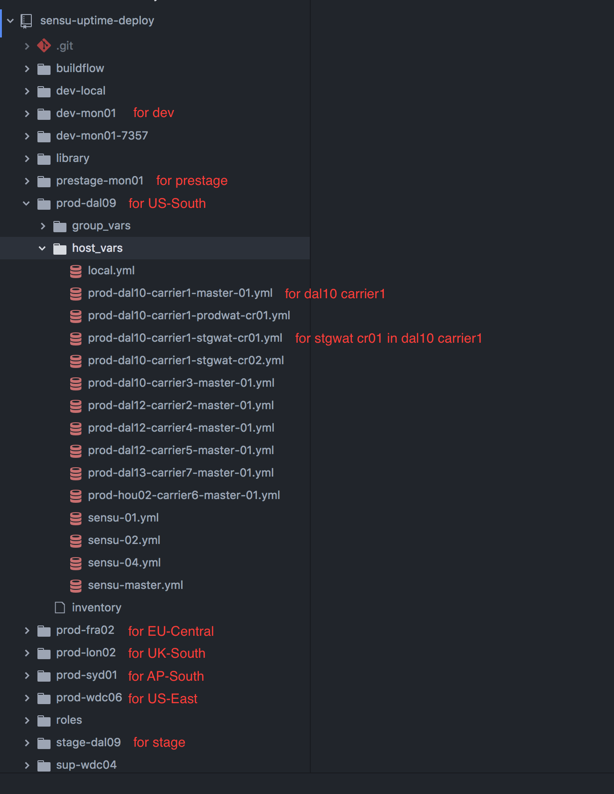

Ops
{: .label .label-green}

## Overview

This runbook is aimed to add prometheus and alertmanager checks in sensu-uptime. Once prometheus and alertmanager deployed into a new carrier or cruiser cluster, it asks to monitor the status of them so that prometheus could keep monitoring the cluster and alertmanager could notifies SRE ASAP when services down.

## Example alerts

None

## Detailed Information

None

## Detailed Procedure

Procedures of adding prometheus and alertmanager checks in sensu-uptime

### Step 1. Submit pull request in sensu-uptime-deploy project

1. clone project [{{ site.data.teams.sensu-uptime-deploy.name }}]({{ site.data.teams.sensu-uptime-deploy.link }}) locally.

2. Add hostname to inventory. According to the layout of sensu-uptime-deploy, go to the folder of the environment, and add hostname to **inventory** file.

<a href="images/armada-ops/sensu-uptime-deploy-layout.png">
</a>


For **Carrier**, the hostname is master node's hostname and it should be appended to group `armada-carriers`, like:

```
[armada-carriers]
prod-dal12-carrier2-master-01
prod-dal10-carrier3-master-01
prod-dal12-carrier4-master-01
```

Please refer to [{{ site.data.teams.sensu-uptime-deploy.inventory.name }}]({{ site.data.teams.sensu-uptime-deploy.inventory.link }})

3. add corresponding host variance files in host_vars.

For **Carrier**, the template is

```
---
target_host: 10.184.18.164   # The IP of master node
target_hostname: prod-dal12-carrier2-master-01 # master node hostname
ansible_host: "{{ target_host }}" # default
ansible_user: "{{ target_user }}" # default
```

4. After **inventory** file updated and **host_vars** file added, please create a pull request.

### Step 2. Waiting kubectl proxy deployment

Once the pull request merged, it will trigger job [{{ site.data.cicd.jobs.ansible-sensu-uptime-armada-update.name }}]({{ site.data.cicd.jobs.ansible-sensu-uptime-armada-update.link }}) to deploy kubectl proxy in sensu-uptime.  

If the deployment completed, there will be a success notification from jenkins reporting job **ansible-sensu-uptime-armada-update** status in channel [{{ site.data.teams.sensu-uptime-status.comm.name }}]({{ site.data.teams.sensu-uptime-status.comm.link }}).

If it's failed, please check the jenkins job log and create an issue in [{{ site.data.teams.sensu-uptime-deploy.name }}]({{ site.data.teams.sensu-uptime-deploy.link }}).


### Step 3. Add http checks in sensu-uptime project

1. Go to project [{{ site.data.teams.sensu-uptime.name }}]({{ site.data.teams.sensu-uptime.link }})

2. follow guidance [here]({{ site.data.teams.sensu-uptime.pages.urlcheck }}) to add http check

An example PR for **Carrier**:

```
prometheus-down.prod-dal10-carrier1,http://proddal10carrier1master01:8001/api/v1/proxy/namespaces/monitoring/services/prometheus:9090/prod-dal10/carrier1/prometheus/graph,200,3,60,armada-ops - prod,infra-dal10c1,armada/armada-ops-sensu-uptime-prometheus-down
alertmanager-down.prod-dal10-carrier1,http://proddal10carrier1master01:8001/api/v1/proxy/namespaces/monitoring/services/alertmanager:9093/,200,3,60,armada-ops - prod,infra-dal10c1,armada/armada-ops-sensu-uptime-alertmanager-down
```

## Automation

None

## Reference
