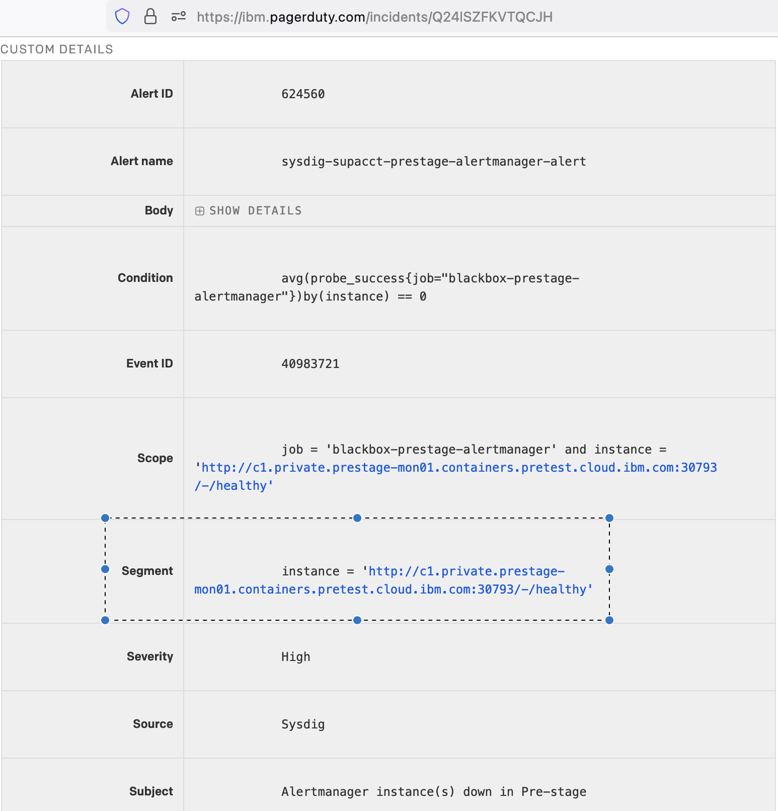
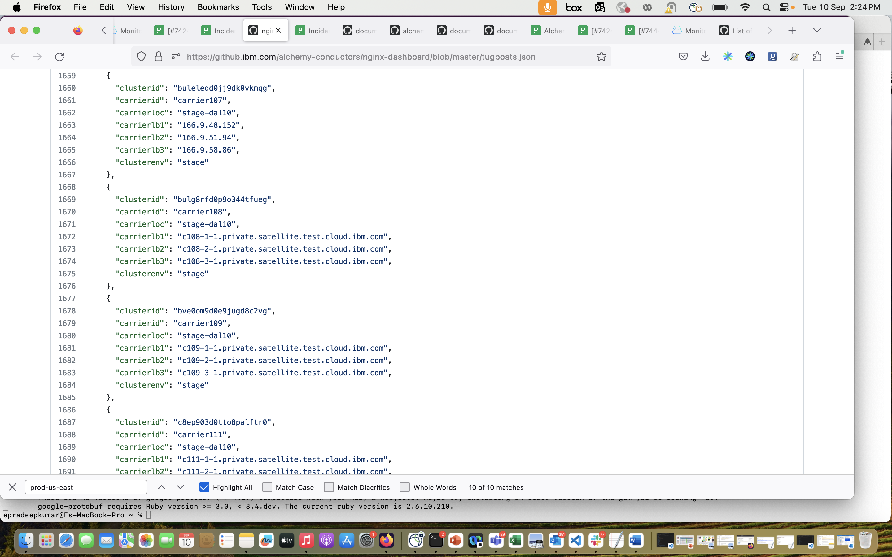

Troubleshooting
{: .label .label-red}

## Overview

This runbook describes how to deal with alerts arising from a Sysdig monitoring reporting alertmanager is down.

## Example Alerts

Example PD title:

- [Alertmanager instance(s) down in Pre-stage](https://ibm.pagerduty.com/incidents/Q24ISZFKVTQCJH)
   
## How to associate the instance mentioned in the alert with a specific target
  - Get `instance` value from `Segment` section in the alert
    - Example: <br>
      instance = `http://166.9.40.65:30903/-/healthy` <br>
      instance = `http://c102.private.eu-fr2.containers.cloud.ibm.com:30903/-/healthy`
      
  - Refer to the [tugboat info file](https://github.ibm.com/alchemy-conductors/nginx-dashboard/blob/master/tugboats.json)
    - Search for IP address or Private End Point mentioned in `instance`. Take the values from fields "carrierloc" and "carrierid" to form target name.
      - Example: <br>
        - Search for `166.9.40.65` in tugboats.json file, the field values are "carrierloc": "prod-tok02" and "carrierid": "carrier108". This forms target `prod-tok02-carrier108` <br>
        - For `c102.private.eu-fr2.containers.cloud.ibm.com`, search with `carrier102`(as its c102) keyword and look for `fr2` environment. The field values are "carrierloc": "prodfr2-par04" and "carrierid": "carrier102". This forms target `prodfr2-par04-carrier102`.
        

## Investigation and Action

Alertmanager is troubled and has either crashed or failed deployment to the environment.

This could be due to an ongoing promotion or maintenance.
**armda-ops-alertmanager promotion** This can be checked [here](https://razeeflags.containers.cloud.ibm.com/alchemy-containers/flags/default/production/armada-ops-alertmanager).

If no ongoing promotion or maintenance, then there are something wrong on the Alertmanager microservice, please do the following:

1. `kubectl get pods -n monitoring -o wide | grep alertmanager`. 
  - If the pod is not running, please [Restart alertmanager pod](#restart-alertmanager-pod) directly. 
  - If it's running, please make a note of alertmanager pod name and node IP, and continue.  
```
  kubectl get pods -n monitoring -o wide | grep alertmanager
  armada-ops-alertmanager-6769cd5cff-88ncx         1/1     Running       0          3d22h   172.16.76.138    10.130.231.206     <none>
```
2. Continue to [Fix alertmanager](#fix-alertmanager)

## Restart alertmanager pod
1. `kubectl describe pod <alertmanager-pod-name> -n monitoring` - this will describe the health of the pod and the latest messages associated with it
2. `kubectl logs <alertmanager-pod-name> -n monitoring > alertmanager.log 2>&1` - collect the logs for the pod, this may be needed later for further debug
3. `kubectl delete pods <alertmanager-pod-name> -n monitoring` - this deletes the pod (which will be in not ready state) and the pod is recreated automatically.

If the issue persists, view the logs (in step 2), there could be an issue with the current build causing this outage.

## Fix alertmanager
1. `kubectl get ep -n monitoring | grep alertmanager` - get the endpoint of alertmanager and verify on the worker node that alertmanager pod in and the master node with `curl <alertmanger-endpoint>`
```
  kubectl get ep -n monitoring | grep alert
  armada-ops-alertmanager         172.16.76.138:9093
```
2. If `curl <alertmanager-endpoint>` timeout in worker node, it indicates something wrong with the alertmanger pod.  Then please [Restart alertmanager pod](#restart-alertmanager-pod).

3. If `curl <alertmanager-endpoint>` returns normal in worker node, but timeout in master node, it indicates calico node is down on 1 or more master nodes (ha master). go to every master node, do the following
   - `sudo crictl ps | grep calico-node` - get the calico-node container id
   - `sudo crictl stop <container-id>` - restart the calico-node container

## False Positive alert
If PagerDuty Alert is still open after verifying that Alert Manager is up and running, refer to [Sysdig Monitoring On Support Act runbook](https://pages.github.ibm.com/alchemy-conductors/documentation-pages/docs/runbooks/sysdig-suptacct-debug.html) for further debugging steps.


## Escalation Policy

Post in [Conductors-for-life Slack Channel](https://ibm-argonauts.slack.com/messages/G53NY6QH0).
