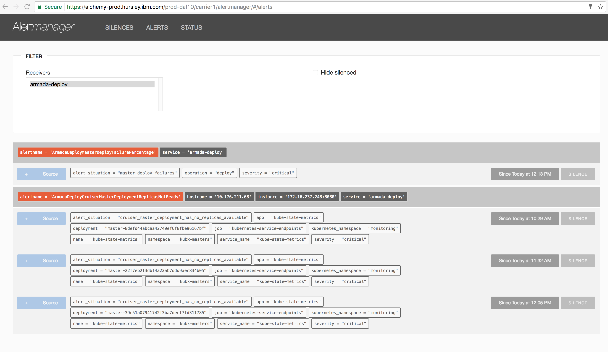
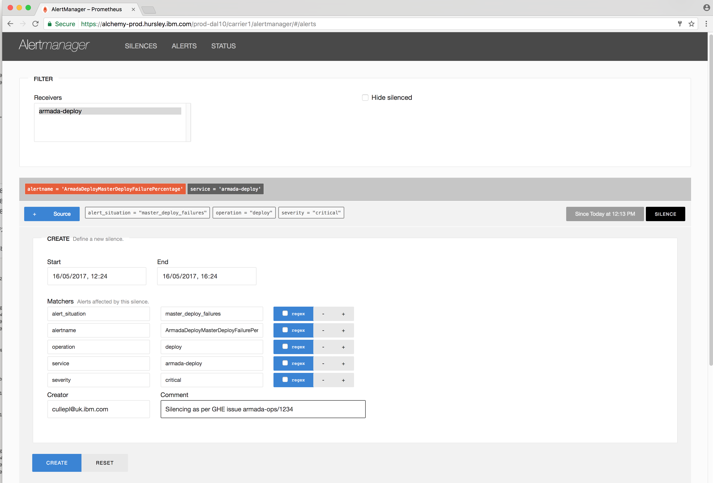
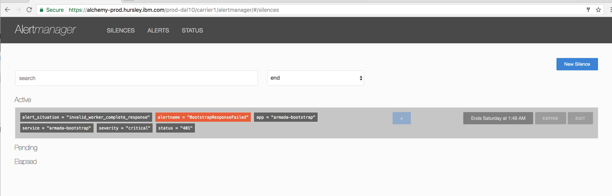
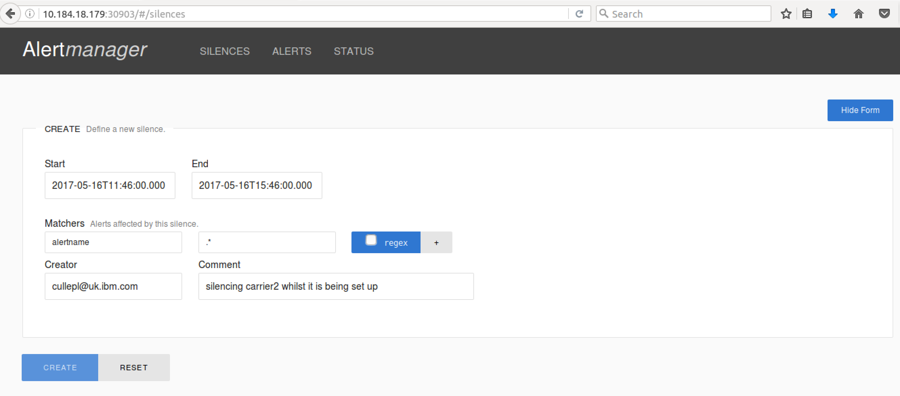

Informational
{: .label }

## Overview
This runbook if for operational work and describes how to silence armada carrier alerts in alertmanager.

**PLEASE NOTE** The alertmanager web interface should be accessed via a chrome or safari brower as the functionality to silence alerts with a regular expression does not work in firefox.

## Detailed Information

### Accessing alertmanager

Alertmanager runs within each carrier.

You can access alert manager either via;

- The [Alchemy prod dashboard](https://pages.github.ibm.com/alchemy-conductors/documentation-pages/docs/process/) by select `View` and clicking on the `alertmanager` icon for the carrier you want to manage alerts for - eg: [prod-dal10-carrier1](https://alchemy-dashboard.containers.cloud.ibm.com/prod-dal10/carrier1/alertmanager/#/alerts); or
- By establishing a VPN connection to the relevant environment and in a browser, navigating to the private ip address of a worker node and port 30903 - eg: `http://10.176.31.236:30903`

### Silencing an active alert

From the alertmanager web interface, click `Alerts` to show active alerts.

Click on the `silence` button next to the active alert.

This will expand the silence form.

Check that the time to silence from and until is accurate.

**NB** Keep the remainder of the fields as defaults or you can edit these but be careful as you don't want to accidentally silence other alerts!

Fill in your email address and the reason you are silencing the alert.  You should detail a GHE work item when silencing so we can track issues.

Click the `CREATE` button to create the silence.

### Viewing silences

To view silences, click on the `SILENCES` link at the top of the page.

This page allows you to edit, or expire active silences.

### Silencing a whole carrier

As it currently stands, an alertmanager is only responsible for an individual carrier, so it is easy to silence all alerts coming from a carrier.

The easiest way to do this is to create a regular expression to match on any alert name coming from that carrier.

For example, whilst prod-dal12-carrier2 was in the process of being setup, we enabled this silence with a `.*` regex match on alertname.

### Items of note

1.  When a new deploy of `armada-ops` alert manager code is performed, or if the alertmanager pod is manually re-deployed, all live silences will be lost and will have to be recreated.

### Need help?

For assistance with silences for armada, speak to the SRE team in `#conductors` slack channel or in the `#armada-ops channel` for development related questions on monitoring and alerting.
