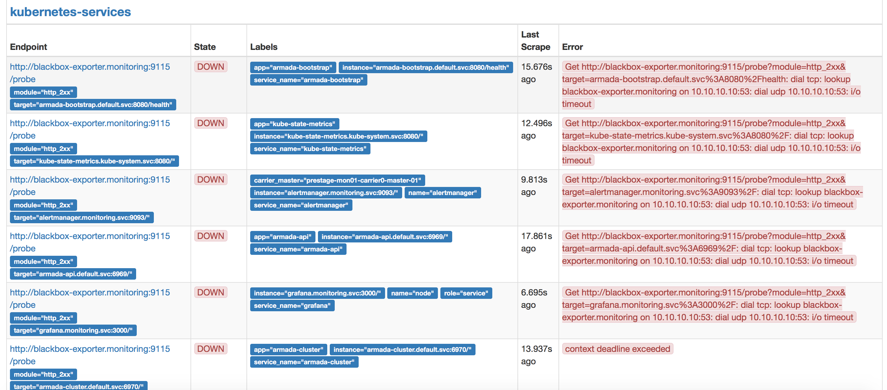

Troubleshooting
{: .label .label-red}

## Overview

This runbook describes how to handle a blackbox-exporter up check reporting down.


## Example Alerts

Example PD title:

- `blackbox_exporter_probing_for_armada-bootstrap_down`

## Investigation and Action


These alerts are triggered when blackbox-exporter runs into problems and is not running and probing one or more services.

This alert does not meant the service itself is troubled, but it will mean no uptime probing will be occurring for the affected services.

When this alert triggers check the following

* Log onto the corresponding prometheus environment:
 - [carrier0 in stage-dal09](https://alchemy-dashboard.containers.cloud.ibm.com/stage-dal09/carrier0/prometheus/graph)
 - [carrier1 in prod-dal10](https://alchemy-dashboard.containers.cloud.ibm.com/prod-dal10/carrier1/prometheus/graph)


* Click on Status drop down menu and then select targets - this should present further detail in the section titled `kubernetes-services`

<a href="images/armada-ops/blackbox-exporter-up-down.png">
</a>

* The error reported here should provide input as to what problems are being hit.  

Common issues seen:

-  Errors have occurred with blackbox-exporter - check log files by following these steps:

  * Logon to the carrier master for that environment.
  * Run `kubectl get pods -n monitoring` - this will list all the pods running on this environment, make a note of blackbox-exporter pod name

```
NAME                                  READY     STATUS    RESTARTS   AGE
alertmanager-2162462176-kcx4r         1/1       Running   0          1h
blackbox-exporter-60644949-47vbl      1/1       Running   0          1h
grafana-3904738335-h83nw              1/1       Running   0          1h
kube-state-metrics-3494959828-c9hjt   1/1       Running   0          1h
node-exporter-5jhvr                   1/1       Running   1          13d
node-exporter-61r64                   1/1       Running   1          20d
prometheus-1500618247-3hlh2           1/1       Running   0          1h`

```

If the blackbox-exporter is reporting `Not Ready`, or if READY column states `(0/1)` then follow these steps:

1. `kubectl describe pod <blackbox-exporter-pod-name> -n monitoring` - this will describe the health of the pod and the latest messages associated with it
1. `kubectl logs <blackbox-exporter-pod-name> -n monitoring > file.log 2>&1` - collect the logs for the pod, this may be needed later for further debug
1. `kubectl delete pod <blackbox-exporter-pod-name> -n monitoring` - this deletes the pod (which will be in not ready state) and the pod is recreated automatically.

Finish by running `kubectl get pods -n monitoring` to ensure the pod has recovered successfully. If problems persist, call out the #armada-ops team.

## Escalation Policy

Escalate the issue to the armada-ops squad as per their [escalation policy](./armada_pagerduty_escalation_policies.html)
