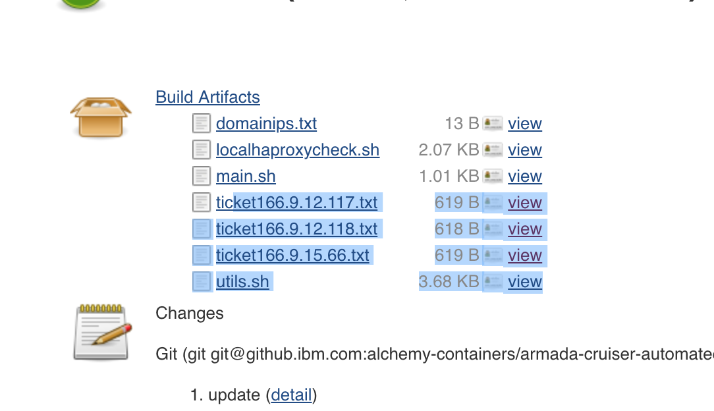

Alert
{: .label .label-purple}

## Overview
This runbook contains steps to take when debugging private service endpoint domain down failures

## Example Alert(s)

~~~~
labels:
  alert_key: armada-infra/master_private_endpoint_reporting_down
  alert_situation: master_private_endpoint_reporting_down
  service: armada-bootstrap
  severity: critical
annotations:
  description: Armada private service endpoint master-private-endpoint-c100-3-1.private.us-east.containers.cloud.ibm.com is reporting down for the past 25 minutes.
~~~~

## Raising a pCIE
1. Since the alert is triggered when the endpoint is down for more than 20 mins, Raise a pCIE by following [Steps for checking for customer private-only clusters on carriers
](#steps-for-checking-for-customer-private-only-clusters-on-carriers)

## Steps for checking for customer private-only clusters on carriers

1. Log on to the carrier, and check if there are any private service endpoint clusters on it.
   The cmd below will return all private service endpoint clusters belonging to that carrier:
   ~~~~ sh
   sudo /opt/bin/calicoctl get gnp --config=/etc/calico/calicoctl.cfg | grep block-public
   ~~~~
2. If there are clusters listed in the output from command,
**Consider [raising a pCIE](../sre_raising_cie.html) if the alert impacts atleast one customer cluster**
_Customer impact is:_
_`Customers may be unable to order private only clusters in <DC>, or manage existing private only clusters. Existing workload is unaffected`_
   - Because of the VPE for VPC limitation (see note above), there may still be a customer impact, even if no clusters are listed in the output above.
3. The pCIE can be a confirmed CIE if there are reported outages or the dev team confirms.

## Analyzing the impact on Customers

Is the endpoint reporting down a **mutli zone CSE** or a **single zone CSE**?
_More details can be found [here](./armada-service-endpoint-overview.html)_

Aside from VPE for VPC private-only clusters, in general the endpoints will be of the form:

   - **customer facing multi zone CSEs** (pointing to the loadbalancer CSE) will be of the form:
`c###.private.<REGION>.containers.cloud.ibm.com`
   - **customer facing single zone CSEs** (pointing to the CSE for a single zone) will be of the form:
`c###-#-1.private.<REGION>.containers.cloud.ibm.com`

### Note: VPE for VPC

There is a limitation that exists for VPC private service endpoint only clusters whose masters run on legacy carriers where the workers can only communicate with one zone's virtual IP.  There aren't many of these VPC clusters since most VCP cluster masters run on tugboats, but some do exist.   For these VPC clusters, a single zone endpoint such as `c#-#-1.private.<REGION>.containers.cloud.ibm.com` being down **can cause a CIE for customers**.

See [https://github.ibm.com/alchemy-containers/armada-network/issues/7899](https://github.ibm.com/alchemy-containers/armada-network/issues/7899) for more details about this.

## Actions to take

### 1. Get the Domain Name
1. Note the domain name in the description `description` or in the metric
_There are two examples below of what the domain value should be based off the field in the `job` field in the alert_
_The domain is achieve by removing `master-private-endpoint-` or `master-private-endpoint-firstboot`._

   - `master-private-endpoint-c3.private.mel01.containers.cloud.ibm.com`
   Domain: **`c3.private.mel01.containers.cloud.ibm.com`**

   - `master-private-endpoint-firstboot-private.au-syd.containers.cloud.ibm.com`
   Domain: **`private.au-syd.containers.cloud.ibm.com`**

### 2. Failing over VIP
2. Place the domain to this jenkins job in the `DOMAIN` variable and build the [job](https://alchemy-containers-jenkins.swg-devops.com/job/Containers-Runtime/job/armada-cruiser-automated-recovery/job/armada-service-endpoint-monitoring/build?delay=0sec)

   - **If the job completes successfully (green)** that means that network traffic is flowing from the IPVS box to the carrier.
   The alert should resolve **unless the problem lies between the service endpoint magic box and the IPVS box**.
   If the alert does not resolve, lots of time VIP is an issue. Try failing over VIP
      - for legacy carriers, [the VIP should be failed over](./armada-carrier-vip-failover.html).
      - for tugboats, try deleting the corresponding `ibm-cloud-provider-ip-<IP>*` pods in the `ibm-system` namespace. Do this one at a time and wait for the new pod to be Running and Ready before deleting the next. `<IP>` is the ip of the problematic loadbalancer containing dashes instead of dots. e.g. `ibm-cloud-provider-ip-10-188-32-226-56b68f4f4c-r6vhr`
   - **If the job fails at the `nslookup_check` step, verify the endpoint IPs on the tugboat**.
      - If the job fails at the step `DOMAIN_IPS=($(dig +short "$DOMAIN" | grep -E "166.9|166.8"))`, then the CSE endpoint
        may be down due to the `cse-health-check` pods on the tugboat having issues.
      - Verify the loadbalancer private IP via netmax, e.g. `prod-mad02-tugboat103-loadbalancer-private-vip` gives `10.118.7.210`
      - Log into the carrier and `invoke-tugboat` to get access to the tugboat
      - Verify that there is an Endpoint and NodePort on `30001`, e.g.:
        ```bash
        $ kubectl get ep -A |grep 30001
        armada                cse-health-check                     172.18.116.21:30001,172.18.168.212:30001,172.18.81.146:30001                3d3h
        $ kubectl get svc -A |grep 30001
        armada                cse-health-check                     NodePort       172.19.60.246    <none>          443:30001/TCP                   3d3h
        ```
      - Verify that the 3 `cse-health-check` pods are running, e.g.:
        ```bash
        $ kubectl -n armada get po -owide | grep cse-health-check
        cse-health-check-6ddbf89857-bwhrt                     1/1     Running   0          20h     172.18.106.220   10.118.68.244    <none>           <none>
        cse-health-check-6ddbf89857-h9v9m                     1/1     Running   0          20h     172.18.123.247   10.118.7.158     <none>           <none>
        cse-health-check-6ddbf89857-zbwmm                     1/1     Running   0          20h     172.18.53.209    10.118.133.203   <none>           <none>
        ```
      - For each of those 3 private IPs, verify if we can curl port 30001.
        This shows a failure (it times out):
        ```bash
        [prod-mad02-carrier103] patrick.doyle@prod-mad02-carrier1-worker-2001:~$ curl -v http://10.118.11.16:30001
        *   Trying 10.118.11.16:30001...
        * TCP_NODELAY set
        ^C
        ```
        This shows success:
        ```bash
        $ curl -v http://10.118.68.244:30001
        *   Trying 10.118.68.244:30001...
        * TCP_NODELAY set
        * Connected to 10.118.68.244 (10.118.68.244) port 30001 (#0)
        > GET / HTTP/1.1
        > Host: 10.118.68.244:30001
        > User-Agent: curl/7.68.0
        > Accept: */*
        > 
        * Empty reply from server
        * Connection #0 to host 10.118.68.244 left intact
        curl: (52) Empty reply from server
        ```
      - Verify that the correct Calico policies are present (this may occur with a new region rollout). If only about 8 entries as reported (as in the example below), then the default policies have not been applied; we would expect around 80 entries. In that case, raise an issue with Netint.
        ```bash
        $ kubectl get globalnetworkpolicies.crd.projectcalico.org -o wide -A
        NAME                                AGE
        default.allow-all-outbound          12d
        default.allow-all-private-default   12d
        default.allow-bigfix-port           12d
        default.allow-icmp                  12d
        default.allow-node-port-dnat        12d
        default.allow-sys-mgmt              12d
        default.allow-vrrp                  12d
        default.block-public-nodeports      12d
        ```

### 3. Contact the Service Endpoint Team
3. If the alert still not resolved, the service endpoint team needs to be engaged.
   _The job will output ticket text to give to the service endpoint team in the artifacts._

      An example build artifact is shown below. In the example below every ticket entry is prefixed with `ticket`. Take the text and work with the service endpoint team to validate traffic flows from the service endpoint box in the `#service-endpoint-sre` slack channel.

   <a href="images/service-endpoint-sre-ticket-text-example.png">
   </a>

   - **If the job does not complete successfully** there's validation that needs to occur on the haproxy boxes.
   The end of the console output of a job will have a short description of what it couldn't detect on the haproxy box like `nslookup didn't contain the proper ip. Netint needs to check the cloudflare configuration`. Take that information and follow this runbook [haproxy_troubleshooting](../armada_haproxy_troubleshooting.html)

## Further Investigation
This information can be provided to the Service-Endpoint-SRE team that could help in their investigation

1. Using the domain found above, try to curl the monitoring port manually. The monitoring port can be found in the config by searching for the domain. [example](https://github.ibm.com/alchemy-containers/armada-secure/blob/a853626538a110ab0ca47a38aa8beab17a180c8a/secure/armada/us-east/spokes/prod-wdc04-carrier100/armada-info.yaml#L37)

   ~~~
   $ curl http://c100.private.us-east.containers.cloud.ibm.com:30000
   <html><body><h1>200 OK</h1>
   Service ready.
   </body></html>
   ~~~

1. Try curling the service ep assigned to this ep. You can find this via `nslookup`
   ~~~
   $ nslookup c100.private.us-east.containers.cloud.ibm.com

   Name:	prod-us-east-tugboat.us-east.serviceendpoint.cloud.ibm.com
   Address: 166.9.24.19
   Name:	prod-us-east-tugboat.us-east.serviceendpoint.cloud.ibm.com
   Address: 166.9.20.38
   Name:	prod-us-east-tugboat.us-east.serviceendpoint.cloud.ibm.com
   Address: 166.9.22.26
   ~~~

   This is an MZR, so there are 3. Try curling all using the same port as above. You should receive the same output.

1. Each of these is mapped to a backend load balancer of the name `<level>-<DC>-[tugboat|carrier]###-loadbalancer-private-vip`. Use netmax to find their IPs and try curling them. Please note that you might need to update the value of the `carrier_name` field in the alert description to the correct type. For example, `carrier_name` for a tugboat in the alert is `prod-fra02-carrier115` which needs to be used as `prod-fra02-tugboat115` in `netmax` bot.

   eg: querying for `prod-wdc04-tugboat100-loadbalancer-private-vip` gives:
   > prod-wdc04-tugboat100-loadbalancer-private-vip (Portable) - Acct531277
   > Private: 10.211.40.194 10.211.40.192/29

   The curl output should be the same as above.

1. If the service ep (166.9 or 166.8 address) is not working, but the loadbalancer (10. address) is, the service ep team should be engaged.

1. If the service ep, and the loadbalancer are not working, then there is an issue with the VIP.
   - for legacy carriers, [the VIP should be failed over](./armada-carrier-vip-failover.html).
   - for tugboats, try deleting the corresponding `ibm-cloud-provider-ip-<IP>*` pods in the `ibm-system` namespace. Do this one at a time and wait for the new pod to be Running and Ready before deleting the next. `<IP>` is the ip of the problematic loadbalancer containing dashes instead of dots. e.g. `ibm-cloud-provider-ip-10-188-32-226-56b68f4f4c-r6vhr`

## Escalation Policy
Document all actions taken before escalating and provide a link to the documentation in the escalation. Escalate to the [#conductors](https://ibm-argonauts.slack.com/archives/C54H08JSK) channel.
