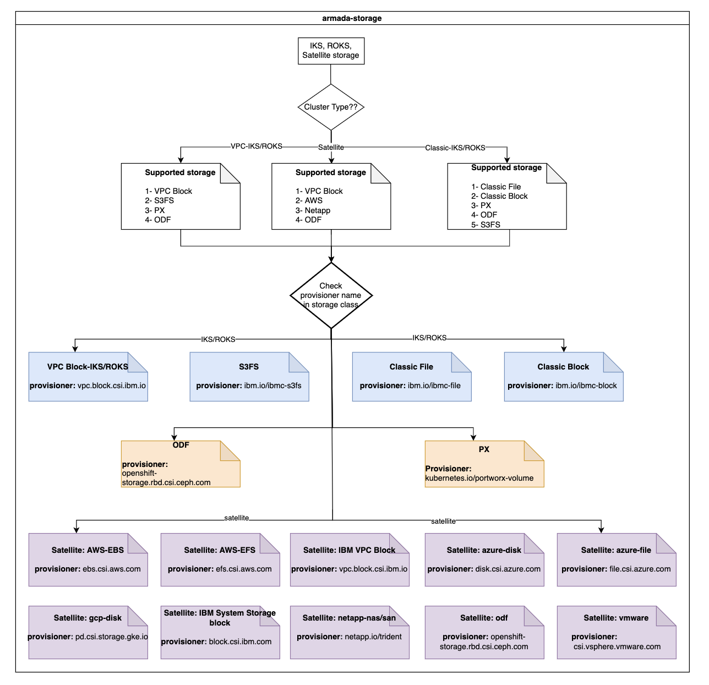

Troubleshooting
{: .label .label-red}

## Content:
{:.no_toc}

* Will be replaced with the ToC, excluding the "Contents" header
{:toc}

---

## Overview:

armada-storage team own following components which are getting deployed on customer cluser.

| Component Name | Provisioner Name | Supported IBM Cloud Services | Supported mode | Detail runbook link |
| -------------------------------- | ------------------------------ | ---------------------------- | ---------------------------- | ------------------------------ |
| VPC block CSI driver | vpc.block.csi.ibm.io | IKS, ROKS, IBM Satellite | RWO | [ here ]( https://pages.github.ibm.com/alchemy-conductors/documentation-pages/docs/runbooks/armada/armada-vpc-block-csi-troubleshooting.html) |
| VPC file CSI driver | vpc.file.csi.ibm.io | IKS, ROKS, IBM Satellite | RWX,RWO | [ here ](https://pages.github.ibm.com/alchemy-conductors/documentation-pages/docs/runbooks/armada/armada-vpc-file-csi-troubleshooting.html) |
| Classic block flex plugin | ibm.io/ibmc-block | IKS, ROKS  | RWO | [ here ](https://pages.github.ibm.com/alchemy-conductors/documentation-pages/docs/runbooks/armada/armada-storage-block-pvc-creation-mount-fail.html ) |
| Classic file flex plugin | ibm.io/ibmc-file | IKS, ROKS | RWX | [ here ](https://pages.github.ibm.com/alchemy-conductors/documentation-pages/docs/runbooks/armada/armada-stroage-pvc-creation-fail.html ) |
| S3fs plugin | ibm.io/ibmc-s3fs | IKS, ROKS | RWX | [ here ]( https://pages.github.ibm.com/alchemy-conductors/documentation-pages/docs/runbooks/armada/armada-storage-s3fs-plugin-troubleshooting.html) |
| ODF CSI driver | openshift-storage.rbd.csi.ceph.com | IKS, ROKS, IBM Satellite | RWX | [ here ]( https://pages.github.ibm.com/alchemy-conductors/documentation-pages/docs/runbooks/armada/odf-issues.html) |
| Satellite Storage Home | | IBM Satellite | | [ here ]( https://pages.github.ibm.com/alchemy-conductors/documentation-pages/docs/runbooks/armada/armada-satellite-storage-troubleshooting.html) |
| PortWorx |  kubernetes.io/portworx-volume |  IKS, ROKS, IBM Satellite | RWX | [ here ]( https://pages.github.ibm.com/alchemy-conductors/documentation-pages/docs/runbooks/armada/portworx_issues.html) |
| AWS EBS | ebs.csi.aws.com| IBM Satellite | RWO | [ here ]( https://pages.github.ibm.com/alchemy-conductors/documentation-pages/docs/runbooks/armada/armada-sat-storage-aws-ebs-efs-troubleshooting.html) |
| AWS EFS | efs.csi.aws.com | IBM Satellite | RWX | [here ]( https://pages.github.ibm.com/alchemy-conductors/documentation-pages/docs/runbooks/armada/armada-sat-storage-aws-ebs-efs-troubleshooting.html) |
| Azure Disk | disk.csi.azure.com | IBM Satellite | RWO | [ here ]( https://pages.github.ibm.com/alchemy-conductors/documentation-pages/docs/runbooks/armada/armada-sat-storage-azure-troubleshooting.html) |
| Azure File | file.csi.azure.com | IBM Satellite | RWO | [ here ]( https://pages.github.ibm.com/alchemy-conductors/documentation-pages/docs/runbooks/armada/armada-sat-storage-azure-troubleshooting.html) |
| GCP | pd.csi.storage.gke.io | IBM Satellite | RWO | [ here ]( https://pages.github.ibm.com/alchemy-conductors/documentation-pages/docs/runbooks/armada/armada-sat-storage-gcp-disk-troubleshooting.html) |
| IBM System Storage | block.csi.ibm.com | IBM Satellite | RWX | [ here ]( ) |
| NetApp | netapp.io/trident | IBM Satellite | RWX |  [ here ]( https://pages.github.ibm.com/alchemy-conductors/documentation-pages/docs/runbooks/armada/armada-sat-storage-netapp-troubleshooting.html) |
| VMWare |  csi.vsphere.vmware.com | IBM Satellite | RWX |  [ here ]( ) |


Following flow chart help to narrow down the issue to individual components



## Example Alert(s):

   None

## Investigation and Action:

This runbook is the top level runbook for all armada-storage components and talk about how to narrow down an issue to a particular armada-storage components.

### How to check which storage driver/plugin customer is using:

To check which storage driver/plugin is deployed on cluster, following are the sample commands and expected outputs

#### For VPC Block CSI driver

```
$ kubectl get pods -n kube-system | grep vpc-block-csi
ibm-vpc-block-csi-controller-0                        6/6     Running   0            7d
ibm-vpc-block-csi-node-fmvcf                          4/4     Running   0            7d
ibm-vpc-block-csi-node-jfvc2                          4/4     Running   0            7d
ibm-vpc-block-csi-node-jg45c                          4/4     Running   0            7d
ibm-vpc-block-csi-node-tkpp2                          4/4     Running   0            7d
$
```

Check version:

VPC CSI driver is getting deployed by using IBM managed addon on IKS and ROKS clusters

```
$ ibmcloud ks cluster addon ls --cluster vpc-us-south
OK
Name                   Version   Health State   Health Status   
vpc-block-csi-driver   4.2       normal         Addon Ready. For more info: http://ibm.biz/addon-state (H1500)   
$
```


More details can be found in [#VPC Block CSI driver runbook]( )

#### For Classic block plugin:

```
$ kubectl get pods -n kube-system | grep block
ibmcloud-block-storage-driver-hp49j                   1/1     Running   0               12d
ibmcloud-block-storage-driver-z25rz                   1/1     Running   0               12d
ibmcloud-block-storage-plugin-7d9547cbd9-pz98v        1/1     Running   0               12d
$
```


More details can be found in [#Classic block plugin runbook](https://pages.github.ibm.com/alchemy-conductors/documentation-pages/docs/runbooks/armada/armada-storage-block-pvc-creation-mount-fail.html)

#### For Classic file plugin:

```
$ kubectl get pods -n kube-system | grep file
ibm-file-plugin-8646c75dd5-r8mft                      1/1     Running   0               14d
$
```

More details can be found in [#Classic file plugin runbook PVC creation](https://pages.github.ibm.com/alchemy-conductors/documentation-pages/docs/runbooks/armada/armada-stroage-pvc-creation-fail.html)
[#Classic file plugin runbook PVC deletion](https://pages.github.ibm.com/alchemy-conductors/documentation-pages/docs/runbooks/armada/armada-storage-pvc-deletion-fail.html)

#### For s3fs plugin:

```
$ kubectl get pods -n ibm-object-s3fs -o wide | grep ibmcloud-object-storage
ibmcloud-object-storage-driver-nss6g              1/1     Running   0          2m7s   10.216.37.8      10.216.37.8    <none>           <none>
ibmcloud-object-storage-driver-qsnh8              1/1     Running   0          2m7s   10.216.37.14     10.216.37.14   <none>           <none>
ibmcloud-object-storage-plugin-7644559d65-4b2dr   1/1     Running   0          2m7s   172.30.207.136   10.216.37.14   <none>           <none>
```

In case bucketAccessPolicy is enabled for the plugin, the plugin is installed in kube-system namespace
```
$ kubectl get pods -n kube-system -o wide | grep ibmcloud-object-storage
ibmcloud-object-storage-driver-nss6g              1/1     Running   0          2m7s   10.216.37.8      10.216.37.8    <none>           <none>
ibmcloud-object-storage-driver-qsnh8              1/1     Running   0          2m7s   10.216.37.14     10.216.37.14   <none>           <none>
ibmcloud-object-storage-plugin-7644559d65-4b2dr   1/1     Running   0          2m7s   172.30.207.136   10.216.37.14   <none>           <none>
```

In case the plugin is installed in custom namesapce by the the customer,
```
$ kubectl get pods --all-namespaces -o wide | grep ibmcloud-object-storage
ibmcloud-object-storage-driver-nss6g              1/1     Running   0          2m7s   10.216.37.8      10.216.37.8    <none>           <none>
ibmcloud-object-storage-driver-qsnh8              1/1     Running   0          2m7s   10.216.37.14     10.216.37.14   <none>           <none>
ibmcloud-object-storage-plugin-7644559d65-4b2dr   1/1     Running   0          2m7s   172.30.207.136   10.216.37.14   <none>           <none>
```

More details can be found in [#s3fs plugin runbook](https://pages.github.ibm.com/alchemy-conductors/documentation-pages/docs/runbooks/armada/armada-storage-s3fs-plugin-troubleshooting.html)

#### For PX plugin:

More details can be found in [#PX plugin runbook]( )

#### For ODF plugin:

More details can be found in [#ODF plugin runbook](https://pages.github.ibm.com/alchemy-conductors/documentation-pages/docs/runbooks/armada/odf-issues.html)

#### For IBM Satellite storage:

More details can be found in [#IBM Satellite storage runbooks](https://pages.github.ibm.com/alchemy-conductors/documentation-pages/docs/runbooks/armada/armada-satellite-storage-troubleshooting.html)


### Checking plugin/driver details in case of PVC creation issue:

One can also identify armada storage plugin/driver details from PVC which is causing issues

If user is facing PVC creation issues then we can use following steps to identify which driver/plugin is used to create PVC

##### Step 1- Describe PVC and get storage class used:

Example:
```
$ kubectl describe pvc pvc-test -n default | grep StorageClass
StorageClass:  ibmc-vpc-block-5iops-tier
$
```

##### Step 2- Get provisioner name from storage class:

Example :
```
$ kubectl describe storageclass ibmc-vpc-block-5iops-tier | grep 'Provisioner'
Provisioner:           vpc.block.csi.ibm.io
$
```

Check if provisioner name in step-2 is matching with any of armada-storage components https://pages.github.ibm.com/alchemy-conductors/documentation-pages/docs/runbooks/armada/armada-storage-troubleshooting.html#overview


### Checking plugin/driver details in case of POD creation issue due to PVC:

One can aslo identify armada-storage components by using POD name which is using PVC

#### Step 1- Get PVC details from POD:

Example: This command is just to check some of the PVCs not all you may need to adjust your command accordingly

```
$ kubectl describe pod my-deployment-859d768897-ckz24 | grep 'Volumes:' -A 100 | grep ClaimName
    ClaimName:  pvc-test
$
```

#### Step 2- Describe PVC and get storage class used:

Example:
```
$ kubectl describe pvc pvc-test -n default | grep StorageClass
StorageClass:  ibmc-vpc-block-5iops-tier
$
```

#### Step 3- Get provisioner name from storage class:

Example :
```
$ kubectl describe storageclass ibmc-vpc-block-5iops-tier | grep 'Provisioner'
Provisioner:           vpc.block.csi.ibm.io
$
```

Check if provisioner name in step-2 is matching with any of armada-storage components https://pages.github.ibm.com/alchemy-conductors/documentation-pages/docs/runbooks/armada/armada-storage-troubleshooting.html#overview


### Other issues, concern and raising tickets:

Please reachout to [#armada-storage](https://ibm-argonauts.slack.com/archives/C53P14PFE) on Slack by tagging `@storage` team.

## Escalation Policy:
If you have any problems related with persistent storage on classic, vpc or statellite cluster please reachout to [#armada-storage](https://ibm-argonauts.slack.com/archives/C53P14PFE) on Slack by tagging `@storage` team.

If you are here because of a PD incident and need more help on an issue, you can escalate to the development squad by using the [Alchemy - Containers Tribe - armada-storage](https://ibm.pagerduty.com/escalation_policies#P5B6A9G) PD escalation policy.

If you run across any armada-storage problems during your search, you can open a GHE issue for [armada-storage issues](https://github.ibm.com/alchemy-containers/armada-storage/issues/new/choose).
