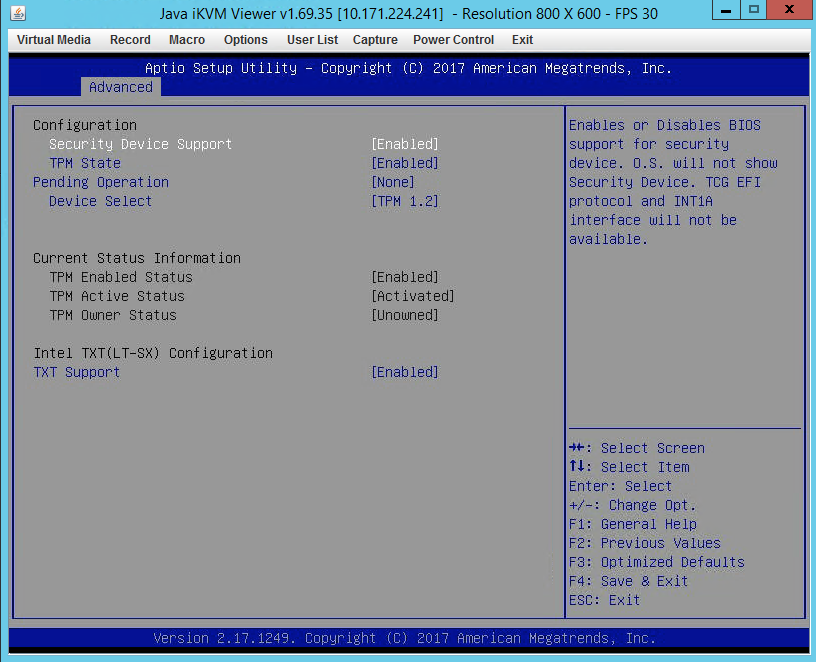
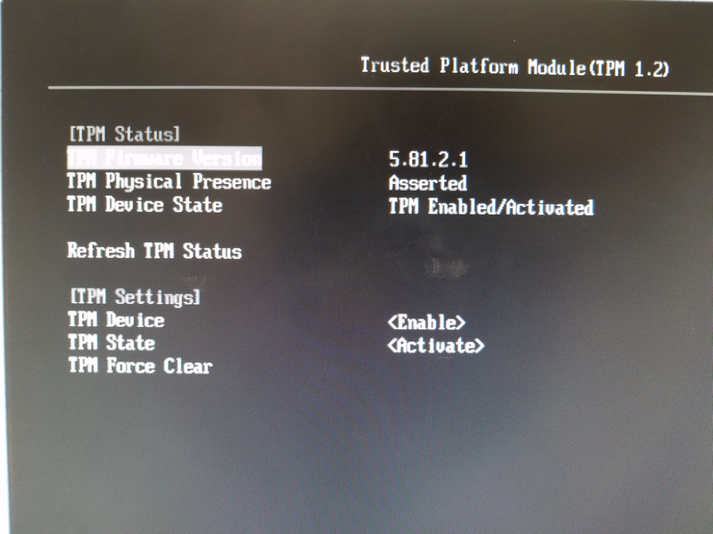

Informational
{: .label }
## Overview
This runbook describes how to manually fix a baremetal worker that has lost TXT/TPM ownership.

## Detailed Information
You will need to create a ticket with Softlayer to fix the effected worker. The Armada Softlayer team is Thom Baker `@twbaker` and Sean Crow `@scrow`.

After Softlayer takes the necessary steps and resolves the ticket, the customer will need to perform a `bx cs worker-reload` on the worker.

### Softlayer Ticket
The Softlayer team will need to perform the following steps on the worker. The ticket should contain the following information:

~~~
TITLE

Device <name or id> needs TXT/TPM reset and ownership cleared

DESCRIPTION

The bare-metal device <name or ID> needs to have it's TXT/TPM reset and ownership cleared.

The TXT/TPM reset procedure reference: https://wiki.softlayer.local/wiki/index.php/AOM-TPM-9655V,
and the procedure to enable TPM on a Lenovo x3650: https://wiki.softlayer.local/wiki/index.php/How_To_Enable_TPM_On_A_Lenovo_3650.

You have my permission to do anything necessary to clear the TPM state,
including powering off, rebooting, or any other operations at will for all devices.

Reference Steps:

These are the steps included in the wiki above.
The Softlayer team should not need any information beyond what is given in the ticket,
but the steps are laid out here just in case.

1. Reboot worker to BIOS
2. Set TPM pending action to "clear ownership"
3. Save and reboot (clearing ownership may disable TXT and/or TPM on some BIOS)
4. Enter BIOS
5. Set TPM pending action to "activate TPM"
6. Set TXT to "Enabled" (for some OEMs, steps 5 and 6 may require a reboot in between)
7. Reboot to normal OS
8. Verify TPM changes at the OS level.

Process for Supermicro motherboards, as it's slightly different then the above information.

1. Run the TPM Clear operation
2. When job is finished, reboot to BIOS
3. Set TPM pending action to “clear ownership”
4. Save and reboot
5. Enter BIOS
6. Set TPM to “Enabled”
7. Save and reboot
8. Enter BIOS
9. Set TXT to “Enabled”
10. Save and reboot
11. Verify all changes in BIOS
12. Reboot to normal OS
13. Verify TPM changes at the OS level.

Verification:

Run the following commands to verify TPM is running and the ownership is properly cleared/unowned.

$ txtstat
# The output should contain the text
TXT measured launch: TRUE
$ cat /sys/class/tpm/tpm0/device/enabled
1
$ cat /sys/class/tpm/tpm0/device/owned
0
$ cat /sys/class/tpm/tpm0/device/active
1
~~~

#### Megatrends BIOS
For systems with a Megatrends BIOS, the BIOS should look like this after completion:

 

- Security Device Support: Enabled
- TPM State: Enabled
- Pending Operation: None
- Device Select: TPM 1.2
- TXT Support: Enabled

#### Other BIOS
For systems with a non-Megatrends BIOS, the BIOS should look like this after completion:

 

- TPM Device State: TPM Enabled/Activated
- TPM Device: Enable
- TPM State: Active

## References
- [TPM Quick Reference Guide](https://www.intel.com/content/dam/support/us/en/documents/motherboards/desktop/d915gev/d915gev_d915gux_tpm_quickrefguide02.pdf)
  - See under section: "Clearing Trusted Platform Module Ownership"
- [Enabling TXT](https://software.intel.com/en-us/blogs/2012/09/25/how-to-enable-an-intel-trusted-execution-technology-capable-server)
- [Trusted Boot HOW-TO for Gentoo](https://wiki.gentoo.org/wiki/Trusted_Boot)
  - Not directly applicable for ubuntu but a good guide nevertheless
- [tboot source code](http://hg.code.sf.net/p/tboot)
- [Getting it to work: Provisioning Intel TXT](https://link.springer.com/content/pdf/10.1007%2F978-1-4302-6149-0_3.pdf)
- [Intel TXT enabling guide](https://software.intel.com/en-us/articles/intel-trusted-execution-technology-intel-txt-enabling-guide#_Toc383534392)
- [Linux TPM Encryption](http://blackcreatorsword.blogspot.com/2012/11/linux-tpm-encryption.html)
