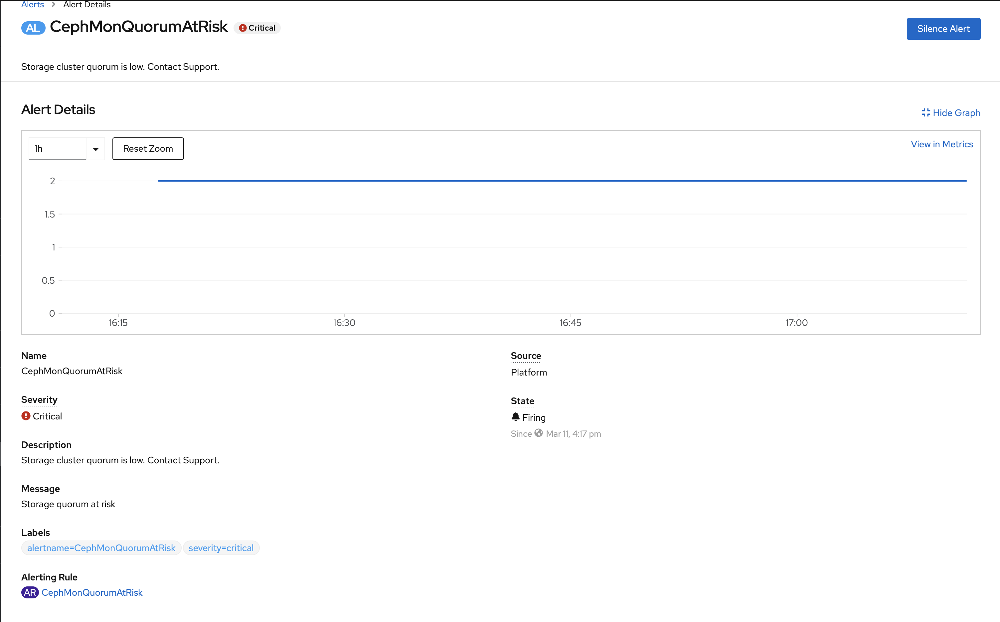
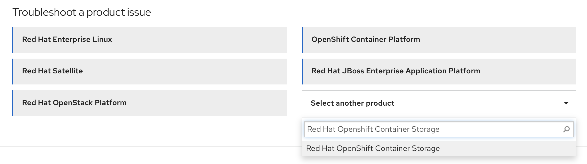

Troubleshooting
{: .label .label-red}

## Overview

This runbook contains some useful trouble shooting tips to recover from the issues with ODF install.

## Example Alerts

None

## Investigation and Action

- Log into the associated IBM Cloud account
  ```
  ibmcloud login --sso
  ```

- Target the correct region
  ```
  ibmcloud target -r <region>
  _e.g. `ibmcloud target -r us-south`_
  ```

- Identify the correct cluster
  ```
  % ibmcloud ks cluster ls
  OK
  Name               ID                     State    Created      Workers   Location             Version                 Resource Group Name   Provider   
  cluster-sat-prod   c0ugg01w0cgnt3goht7g   normal   3 days ago   3         was-multizone-prod   4.6.17_1533_openshift   Default               satellite   
  roks4.6ocs4.6      c0vh0frd0ptef6cfa460   normal   2 days ago   3         Dallas               4.6.17_1533_openshift   Default               vpc-gen2
  ```

- Direct your K8s commands to the cluster
  ```
  ibmcloud ks cluster config --cluster <cluster id> --admin
  ```

- List ODF add-on controller pod
  ```
   kubectl get pods -n kube-system | grep ocs
   NAME                                                  READY   STATUS    RESTARTS   AGE
   ibm-ocs-operator-controller-manager-f4bd9fd48-kl5tp   1/1     Running   0          11h
  ```

- Get logs of the `ibm-ocs-operator-controller-manager` pod
  ```
   kubectl logs ibm-ocs-operator-controller-manager-f4bd9fd48-kl5tp -n kube-system
  ```

- List metrics agent pod
  ```
   kubectl get pods -n kube-system -l name=ibm-storage-metrics-agent
   NAME                                                  READY   STATUS    RESTARTS   AGE
   ibm-storage-metrics-agent-8685869cc6-79qzq            1/1     Running   0          12d
  ```

- Get logs of the `ibm-storage-metrics-agent` pod
  ```
   kubectl logs ibm-storage-metrics-agent-8685869cc6-79qzq -n kube-system
  ```

- Get the `Storage Cluster Status` from the `ocscluster`
  ```
  kubectl describe ocscluster <ocscluster-name> -n openshift-storage
  ```

- Gather data about the cluster using must-gather.
  - Gather data about ODF using this command :
  ```
  oc adm must-gather --image=registry.redhat.io/odf4/ocs-must-gather-rhel8:<odf-version> --dest-dir=ocs_mustgather
  ```
  eg: oc adm must-gather --image=registry.redhat.io/odf4/ocs-must-gather-rhel8:v4.15 --dest-dir=ocs_mustgather
  If the above command is not working or the use `latest` instead of ODF version.
  
  - Gather data about OCP using this command  :
  ```
  oc adm must-gather --image=registry.redhat.io/ocs4/ocp-must-gather-rhel8:latest --dest-dir=ocp-mustgather
  ```

- Make sure the `disk-by-id` provided by the user for the `osd-device-path` and `mon-device-path` parameters in the `ocscluster` resource exists on the nodes in case of classic cluster.  

## Issues covered by this runbook.

- If the `ocscluster` resource shows `Storage Cluster Status` as `Error` and the logs of the `ibm-ocs-operator-controller-manager-xxxx-yy` pod shows error message as `Number of worker nodes less than 3. At least 3 worker nodes are required for odf deployment`
  **Error:**
   ```
   "Error: Number of worker nodes less than 3. At least 3 worker nodes are required for odf deployment"
   ```
   **Resolution:**
    1. The above error specifies that less than 3 worker nodes are specified in the CRD to install ODF. We need a minimum of 3 worker nodes for ODF.
    2. Edit the CRD to include at least 3 worker nodes.

- If the `ocscluster` resource shows `Storage Cluster Status` as `Error` and the logs of the `ibm-ocs-operator-controller-manager-xxxx-yy` pod shows error message as `Failed to update storage cluster : Decreasing the capacity not allowed`.

  **Error:**
    ```
    "Error: Failed to update storage cluster : Decreasing the capacity not allowed"
    ```
    **Resolution:**
     1. The above error specifies that the user has tried to scale down ODF by reducing the value of `numOfOsd`
     2. Inform the user that scaling down is not supported.  

- If the `ocscluster` resource shows `Storage Cluster Status` as `Error` and the logs of the `ibm-ocs-operator-controller-manager-xxxx-yy` pod shows error message as `"ERROR in reconcile of Local Volumes","error":"DevicePath has to be set for local volumes"`.

  **Error:**
    ```
    "Error: "ERROR in reconcile of Local Volumes","error":"DevicePath has to be set for local volumes""
    ```
    **Resolution:**
     1. The above error specifies that the user wants to deploy ODF on a cluster using local volume, but hasn't specified the device paths of the disks to be used for OSD and/or MON.
     2. Inform the user to specify the right `disk-by-id` of the device he wants to use for OSD and/or MON.        

- If the `ocscluster` resource shows `Storage Cluster Status` as `Progressing` for a long time, check describe of `noobaa`
  ```
  oc describe noobaa -n openshift-storage
  ```
  If under status, you see the message `Cloud credentials secret "ibm-cloud-cos-creds" is not ready yet`.

  **Error:**
    ```
    "Error: Cloud credentials secret "ibm-cloud-cos-creds" is not ready yet"
    ```
    **Resolution:**
     1. The above error specifies that the COS secret hasn't been created for using COS as backend storage.
     2. Follow this [link] (https://cloud.ibm.com/docs/openshift?topic=openshift-deploy-odf-vpc#odf-create-cos) to create the COS secret

- If the `ocscluster` resource shows `Storage Cluster Status` as `Progressing` for a long time, check describe of `noobaa`
  ```
  oc describe noobaa -n openshift-storage
  ```
  If under status, you see the message `InvalidAccessKeyId: The AWS Access Key ID you provided does not exist in our records.`.

  **Error:**
    ```
    "Error: InvalidAccessKeyId: The AWS Access Key ID you provided does not exist in our records."
    ```
    **Resolution:**
     1. The above error specifies that a valid COS access key hasn't been provided.
     2. Follow this [link] (https://cloud.ibm.com/docs/openshift?topic=openshift-deploy-odf-vpc#odf-create-cos) to create the correct COS secret

- If the `ocscluster` resource shows `Storage Cluster Status` as `Progressing` for a long time, check describe of `noobaa`
  ```
  oc describe noobaa -n openshift-storage
  ```
  If under status, you see the message `SignatureDoesNotMatch: The request signature we calculated does not match the signature you provided. Check your AWS Secret Access Key and signing method. For more information, see REST Authentication and SOAP Authentication for details.`.

  **Error:**
    ```
    "Error: SignatureDoesNotMatch: The request signature we calculated does not match the signature you provided. Check your AWS Secret Access Key and signing method. For more information, see REST Authentication and SOAP Authentication for details."
    ```
    **Resolution:**
     1. The above error specifies that a valid COS secret key hasn't been provided.
     2. Follow this [link] (https://cloud.ibm.com/docs/openshift?topic=openshift-deploy-odf-vpc#odf-create-cos) to create the correct COS secret

- If the mon or osd pods under the `openshift-storage` namespace are in pending state, check describe of the pod
  ```
  oc describe pod rook-ceph-mon-b-canary-6b8fbbfb7c-x2tj2 -n openshift-storage
  ```
  If in the `Events` section, you see `0/3 nodes are available: 1 node(s) didn't match pod affinity/anti-affinity, 2 node(s) had volume node affinity conflict.`.

  **Error:**
    ```
    "Error: 0/3 nodes are available: 1 node(s) didn't match pod affinity/anti-affinity, 2 node(s) had volume node affinity conflict."
    ```

    **Resolution:**
     1. The above error specifies that the user has used a storageclass with `VolumeBindingMode` `Immediate` in a multizone cluster for Mon and Osd
     2. Ask them to create a custom storageclass with `VolumeBindingMode` `WaitForFirstConsumer` instead and retry.

- If you don't see any pods coming up in the openshift-storage namespace and in the logs of `ibm-ocs-operator-controller-manager-xxxx-yy` pod, you repeatedly see the error `Failed to get StorageCluster","error":"no matches for kind \"StorageCluster\" in version \"ocs.openshift.io/v1\`

  **Error:**
    ```
    "error","ts":"2021-03-12T14:33:53.216Z","caller":"controllers/storageCluster.go:54","msg":"Failed to get StorageCluster","error":"no matches for kind \"StorageCluster\" in version \"ocs.openshift.io/v1\"","stacktrace":"github.ibm.com/alchemy-containers/ibm-ocs-operator/controllers.
    ```
   **Resolution:**
   1. The above error specifies that the catalogsource is unhealthy
   2. Let's proceed with removing all the catalogsources, and a new catalogsource and respective pods will get generated.
      ```
      $ oc -n openshift-marketplace delete catsrc --all
      ```
   3. Wait till the pods come back up
      ```
      $ oc get pods,catsrc -n openshift-marketplace
      ```  
   4. The ODF installation will proceed after this

- If the `ocscluster` resource shows `Storage Cluster Status` as `Cannot create more than one OcsCluster resource` and the logs of the `ibm-ocs-operator-controller-manager-xxxx-yy` pod shows error message as `cannot create more than one OcsCluster resource`

  **Error:**
    ```
    "error": "cannot create more than one OcsCluster resource"
    ```
   **Resolution:**
   1. The above error specifies that more than once ocscluster resource was created. However, we can only create one ocscluster resource
   2. List the ocscluster resources
   ```
   $ oc get ocscluster
   NAME               AGE
   ocscluster-auto    5m1s
   ocscluster1        2m1s
   ```
   3. Delete the ocscluster resources that are not required

- If the `ocscluster` resource shows `Storage Cluster Status` as `metrics agent not running successfully. please contact support` and the logs of the `ibm-ocs-operator-controller-manager-xxxx-yy` pod shows error message as `Metrics Agent not found. Please contact support` or `Metrics Agent not running. Please contact support`

  **Error:**
    ```
    "error": "metrics agent not running successfully. please contact support"
    ```
   **Resolution:**
   1. The above error specifies that the metrics agent pod in kube-system namespace is either not present or it's not running successfully.
   2. Follow the ibm-storage-metrics-agent [runbooks] (Placeholder) to resolve the issue

- If the `ocscluster` resource shows `Storage Cluster Status` as `satellite link not present in agent configmap. Please contact support` and the logs of the `ibm-ocs-operator-controller-manager-xxxx-yy` pod shows error message as `Failed to get container API route from configmap`

  **Error:**
    ```
    "error": "satellite link not present in agent configmap. Please contact support"
    ```
   **Resolution:**
   1. The above error specifies that the metrics agent was not able to successfully fetch the satellite link for the containersApi endpoint and place it in the agent configmap in kube-system namespace.
   2. Fetch the logs of the ibm-storage-metrics-agent pod
   3. Fetch the agent configmap using `kubectl get cm -n kube-system ibm-storage-metrics-agent -o yaml`
   3. Follow the ibm-storage-metrics-agent [runbooks] (Placeholder) to resolve the issue

- If the `ocscluster` resource shows `Storage Cluster Status` as `Progressing` and the osd/osd-prepare pods are in `Pending`

  **Error:**
    ```
    "error": "0/3 nodes available, 3 node (s) didn't find available persistent volumes to bind."
    ```
   **Resolution:**
   1. The above error specifies that no available persistent volumes were found for the osd pods.
   2. If using local disks and autoDiskDiscovery was set to true, verify that the disk to be used for ODF is raw and unformatted. Follow the below steps
      ```
      a. `$oc debug node/<node-name>`
      b. `chroot /host`
      c. Find the disk to be used for ODF (Verify that it's above 100Gi and is unmounted) `$ lsblk`
      d. Do `$ lsblk -f` and verify that the disk has no FSTYPE
      e. If it has an FSTYPE, wipe the existing file system using this : `$ wipefs -a /dev/<disk>`
      f. Repeat these steps on all nodes
      ```

- If the `ocscluster` resource shows `Storage Cluster Status` as `Progressing` and the noobaa-db-pg-0 pod in openshift-storage namespace is stuck in `Init:0/2`

  **Error:**
    ```
    noobaa-db-pg-0 pod in openshift-storage namespace is stuck in `Init:0/2`
    ```
   **Resolution:**
   1. The above error specifies that the prerequisites for ODF addon install on a classic cluster were not performed
   2. Please perform the following steps to recover :
   ```
      a. Delete the current installation
          ```
          $ oc delete ocscluster --all
          ```
      b. If ODF resources are not getting deleted, manually cleanup the openshift-storage and local-storage namespaces by following this : https://cloud.ibm.com/docs/satellite?topic=satellite-storage-namespace-terminating
      c. Delete any PVs in released state
      d. Perform step 1 here https://cloud.ibm.com/docs/openshift?topic=openshift-deploy-odf-classic#odf-cluster-prepare-classic to clean up any filesystem that might have been created on the disks we want to use for ODF
      e. On each node you want to use for ODF,
        i.  edit the /etc/kubernetes/kubelet.conf file and change the value of the parameter EnableControllerAttachDetach to true
        ii. Do systemctl kubelet restart
      f. Uninstall and Reinstall the ODF addon with the same parameters as before or create an ocscluster CR with the parameters
   ```
      Note: After making the changes in step e, we can't use the block plugin on the cluster anymore. And any given time, we can have only ODF or the block plugin working on the cluster. Not both. Block plugin requires the value of EnableControllerAttachDetach to be false and ODF 4.8 and above requires its value to be true.

- If any of the pods under `openshift-storage` namespace are not in `Running` state, check the describe of the pods to find out what the issue is


###  NOTE: If  the issue is not listed above or the issue is not resolved

- Please follow these steps to map the alert to the ODF Standard Operating Procedures
1. Navigate to the openshift web console of the cluster.
2. Under overview, select the `Persistent storage` tab.
3. In the `Status` section, check if any error messages are present.
4. Select `View details` next to the error message.
5. You can see the Alert details displayed there
  * Refer the image below for a sample alert `CephMonQuorumAtRisk`
    
- Map the alert to the [ODF standard operating procedures](https://red-hat-storage.github.io/ocs-sop/sop/index.html).
- Follow the steps given in the ODF standard operating procedures to resolve the issue.

###  NOTE: If the issue is not listed above or the issue is not resolved, please contact ODF support

   - Please follow these steps to raise a ticket at the Red Hat Customer Portal
   1. Access the Red Hat Customer Portal here : https://access.redhat.com
   2. Sign in with your support account credentials. Verify that the account ID is **7035210**
   3. From the `select another product` drop down menu, please choose `Red Hat Openshift Container Storage` as shown in the image below
      
   4. From the `Version` dropdown menu, select the version of ODF the issue occurred in
   5. Select `Continue` at the bottom of the page
   6. Under `Issue summary`, Enter a brief description of the issue you're facing
   7. Under `What are you experiencing? What are you expecting to happen?`, please elaborate on the issue and provide more details
   8. You can also upload an `sosreport`. Please follow the instructions in this [link](https://access.redhat.com/solutions/3592) to create an sosreport
   9. Select `open a case` at the bottom of the page to open a ticket with ODF support

## Escalation Policy

   For more help in searching the logs, please visit the [#armada-storage](https://ibm-argonauts.slack.com/archives/C53P14PFE) channel.

   If you are here because of a PD incident and need more help on an issue, you can escalate to the development squad by
   using the [Alchemy - Containers Tribe - armada-storage](https://ibm.pagerduty.com/escalation_policies#P5B6A9G) PD
   escalation policy.

   If you run across any armada-storage problems during your search, you can open a GHE issue for [armada-storage issues](https://github.ibm.com/alchemy-containers/armada-storage/issues/new/choose).
