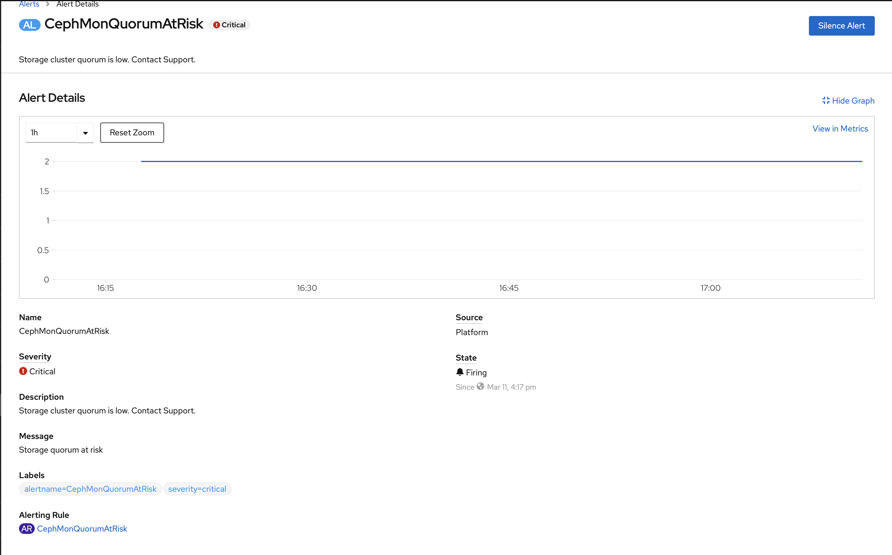
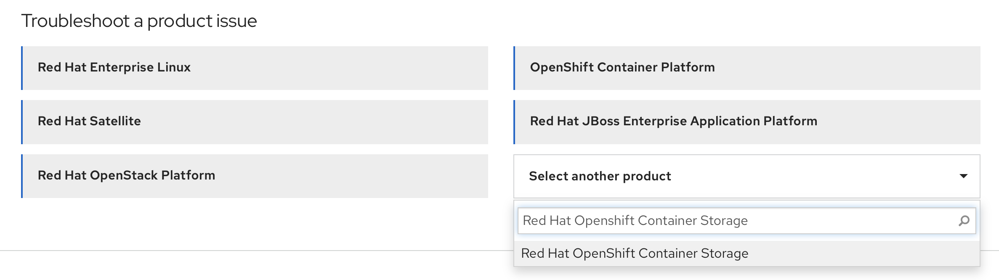

Troubleshooting
{: .label .label-red}

## Overview

This runbook contains some useful trouble shooting tips to recover from the odf uninstallation issues.

## Example Alerts

None

## Investigation and Action

- How to uninstall odf

  1. Delete the `ocscluster` (CRD) created

## Issues covered by this runbook

- The `ocscluster` CRD got deleted, but the resources created by ODF remained.

  **Resolution:**
   1. The above scenario occurs when the `ocscluster` (CRD) is deleted when the storagecluster status is `Progressing` or `Error`
   2. We need to manually delete all the resources created by ODF deployment
   3. Copy the following lines into a file

    ```
    #!/bin/bash

    oc delete ns openshift-storage --wait=false
    sleep 20
    kubectl -n openshift-storage patch persistentvolumeclaim/db-noobaa-db-0 -p '{"metadata":{"finalizers":[]}}' --type=merge
    kubectl -n openshift-storage patch cephblockpool.ceph.rook.io/ocs-storagecluster-cephblockpool -p '{"metadata":{"finalizers":[]}}' --type=merge
    kubectl -n openshift-storage patch cephcluster.ceph.rook.io/ocs-storagecluster-cephcluster -p '{"metadata":{"finalizers":[]}}' --type=merge
    kubectl -n openshift-storage patch cephfilesystem.ceph.rook.io/ocs-storagecluster-cephfilesystem -p '{"metadata":{"finalizers":[]}}' --type=merge
    kubectl -n openshift-storage patch cephobjectstore.ceph.rook.io/ocs-storagecluster-cephobjectstore -p '{"metadata":{"finalizers":[]}}' --type=merge
    kubectl -n openshift-storage patch cephobjectstoreuser.ceph.rook.io/noobaa-ceph-objectstore-user -p '{"metadata":{"finalizers":[]}}' --type=merge
    kubectl -n openshift-storage patch cephobjectstoreuser.ceph.rook.io/ocs-storagecluster-cephobjectstoreuser -p '{"metadata":{"finalizers":[]}}' --type=merge
    kubectl -n openshift-storage patch NooBaa/noobaa -p '{"metadata":{"finalizers":[]}}' --type=merge
    kubectl -n openshift-storage patch backingstores.noobaa.io/noobaa-default-backing-store -p '{"metadata":{"finalizers":[]}}' --type=merge
    kubectl -n openshift-storage patch bucketclasses.noobaa.io/noobaa-default-bucket-class -p '{"metadata":{"finalizers":[]}}' --type=merge
    kubectl -n openshift-storage patch storagecluster.ocs.openshift.io/ocs-storagecluster -p '{"metadata":{"finalizers":[]}}' --type=merge
    sleep 20
    oc delete pods -n openshift-storage --all --force --grace-period=0

    oc delete ns local-storage --wait=false
    sleep 20
    kubectl -n local-storage patch localvolume.local.storage.openshift.io/local-block -p '{"metadata":{"finalizers":[]}}' --type=merge
    kubectl -n local-storage patch localvolume.local.storage.openshift.io/local-file -p '{"metadata":{"finalizers":[]}}' --type=merge
    sleep 20
    oc delete pods -n local-storage --all --force --grace-period=0
    ```

    4. Run the script using the below command
    ```
    ./<filename>
    ```

    5. After the script has run, verify that the `openshift-storage` and the `local-storage` namespaces have been deleted
    6. If they are not deleted, manually cleanup the openshift-storage and local-storage namespaces by following this : https://cloud.ibm.com/docs/satellite?topic=satellite-storage-namespace-terminating

###  NOTE: If  the issue is not listed above or the issue is not resolved

- Please follow these steps to map the alert to the ODF Standard Operating Procedures
1. Navigate to the openshift web console of the cluster.
2. Under overview, select the `Persistent storage` tab.
3. In the `Status` section, check if any error messages are present.
4. Select `View details` next to the error message.
5. You can see the Alert details displayed there
  * Refer the image below for a sample alert `CephMonQuorumAtRisk`
    
- Map the alert to the [OCS standard operating procedures](https://red-hat-storage.github.io/ocs-sop/sop/index.html).
- Follow the steps given in the ODF standard operating procedures to resolve the issue.

###  NOTE: If the issue is not listed above or the issue is not resolved, please contact ODF support

   - Please follow these steps to raise a ticket at the Red Hat Customer Portal
   1. Access the Red Hat Customer Portal here : https://access.redhat.com
   2. Sign in with your support account credentials. Verify that the account ID is **7035210**
   3. From the `select another product` drop down menu, please choose `Red Hat Openshift Container Storage` as shown in the image below
      
   4. From the `Version` dropdown menu, select the version of ODF the issue occurred in
   5. Select `Continue` at the bottom of the page
   6. Under `Issue summary`, Enter a brief description of the issue you're facing
   7. Under `What are you experiencing? What are you expecting to happen?`, please elaborate on the issue and provide more details
   8. You can also upload an `sosreport`. Please follow the instructions in this [link](https://access.redhat.com/solutions/3592) to create an sosreport
   9. Select `open a case` at the bottom of the page to open a ticket with ODF support

## Escalation Policy

   For more help in searching the logs, please visit the [#armada-storage](https://ibm-argonauts.slack.com/archives/C53P14PFE) channel.

   If you are here because of a PD incident and need more help on an issue, you can escalate to the development squad by
   using the [Alchemy - Containers Tribe - armada-storage](https://ibm.pagerduty.com/escalation_policies#P5B6A9G) PD
   escalation policy.

   If you run across any armada-storage problems during your search, you can open a GHE issue for [armada-storage issues](https://github.ibm.com/alchemy-containers/armada-storage/issues/new/choose).
