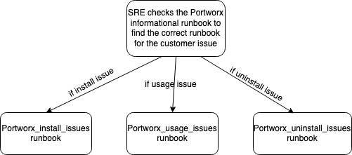

Informational
{: .label }

## Overview

This runbook contains references to all portworx runbooks.

## Example Alerts

None
## Detailed Information

None

## Investigation and Action

   

1. For the portworx  install issues check the following [runbook](https://pages.github.ibm.com/alchemy-conductors/documentation-pages/docs/runbooks/armada/portworx_install_issues.html)

2. For the portworx  post install issues check the following [runbook](https://pages.github.ibm.com/alchemy-conductors/documentation-pages/docs/runbooks/armada/portworx_usage_issues.html)

3. For the portworx  un-install issues check the following [runbook](https://pages.github.ibm.com/alchemy-conductors/documentation-pages/docs/runbooks/armada/portworx_uninstall_issues.html)

### NOTE: To get the support for the issues which are not resolved by refering above runbooks, please contact portworx support

   Please access the Portworx Service Portal here:

   https://pure1.purestorage.com/

   You can also reach them by phone at : 1-866-244-7121
   For a complete list of the Pure support phone numbers follow this link https://support.purestorage.com/Pure1/Support
   You can also submit a request via e-mail by mailing to mailto:support@purestorage.com

   For the sev1 and critical issues raise the **prodoutage request** and other issues raise problem report

##  Escalation Policy

   For more help in searching the logs, please visit the [#armada-storage](https://ibm-argonauts.slack.com/archives/C53P14PFE) channel.

   If you are here because of a PD incident and need more help on an issue, you can escalate to the development squad by
   using the [Alchemy - Containers Tribe - armada-storage](https://ibm.pagerduty.com/escalation_policies#P5B6A9G) PD
   escalation policy.

   If you run across any armada-storage problems during your search, you can open a GHE issue for armada-storage [issues].
   (https://github.ibm.com/alchemy-containers/armada-storage/issues/new/choose)
