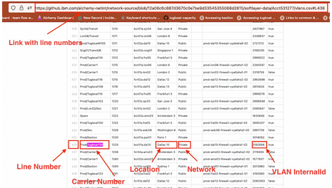
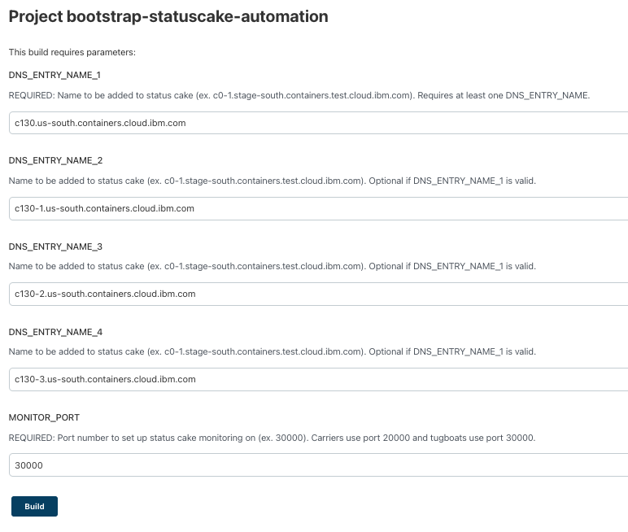

Informational
{: .label }

## Overview
This runbook describes how to create a new tugboat.  There is ongoing work to automate much of this process.  This is a work in progress and many steps have not yet been automated.  This runbook will be updated as needed.

There are 6 GHE tickets opened in the tugboat creation process. Shepherd will manage these tickets but there are still some manual steps needed.  As each ticket is closed, Shepherd will continue on with the process and open the next ticket.
1.	VLAN/Subnet/Loadbalancer procurement
2.	Service endpoint setup
3.	DNS setup
4.	Tugboat creation parameters
5.	Go-live
6.	Documentation updates

## Detailed Information
## Order tugboat through Shepherd bot

In [`#shepherds-channel`](https://ibm.enterprise.slack.com/archives/G7NGEV2GY) paste the following: `@shepherd-bot order $CARRIER_NAME $DC $TYPE`

- **TYPE** is one of the following:
    - `tugboatSzrSpokeRoks` - Single zone cluster which hosts customer ROKS masters 
    - `tugboatSzrSpokeIks` - Single zone cluster that hosts customer IKS masters  
    - `tugboatSzrPatrolIks` - Single zone cluster that hosts customer patrols 
    - `tugboatMzrSpokeRoks` - Multi (3) zone cluster that hosts customer ROKS masters  
    - `tugboatMzrSpokeIks` - Multi (3) zone cluster that hosts customer IKS masters  
    - `tugboatMzrHub` - Multi (3) zone cluster that hosts armada-etcd and microservices 
    - `tugboatMzrLinkApi` - Multi (3) zone cluster that hosts satellite-link API microservices
    - `tugboatMzrLinkTunnel` - Multi (3) zone cluster that provides satellite-link tunnels
    - `tugboatMzrRazeeSatellite` - Multi (3) zone cluster that hosts satellite-config microservices
    - `tugboatMzrSpokeSatellite` - Multi (3) zone cluster that hosts IKS customer locations
    - `tugboatMzrSpokeHypershiftSatellite` - Multi (3) zone cluster that hosts ROKS customer locations
     
- **DC** is either: `DC1` or `DC1,DC2,DC3`

Examples:
- **MZR**: @shepherd-bot order prod-dal10-carrier100 dal10,dal12,dal13 tugboatMzrSpokeRoks
- **SZR**: @shepherd-bot order prod-dal10-carrier101 sao01 tugboatSzrSpokeRoks

## Network setup  
### Procure VLAN/Subnet/Loadbalancer  
This is the first of two netint issues.  Netint will create the new vlans for the tugboat and update the network-source repo.  The new vlans will be located at https://github.ibm.com/alchemy-netint/network-source/blob/master/softlayer-data/Acct\<account\>/vlans.csv

Once this issue is closed Shepherd bot will open the next issue.  
     
### Create service endpoints  
**Example**: [GHE 343](https://github.ibm.com/alchemy-conductors/carrier-service-endpoints/issues/343)  
Runbook for manual CSE creation can be found [here](https://github.ibm.com/alchemy-conductors/carrier-service-endpoints/blob/master/service-eps/README.md)  
Jenkins Job for [armada-CSE-operations-pipeline](https://alchemy-containers-jenkins.swg-devops.com/job/Containers-Runtime/job/armada-CSE-operations-pipeline)

1.  Create a prod train 

    **Example prod train**
    ```
	  Squad: SRE
	  Title: create CSE for prod-dal10-carrier130
	  Environment: us-south
	  Details: |
	    https://github.ibm.com/alchemy-conductors/carrier-service-endpoints/issues/265
	  Risk: low
	  PlannedStartTime: now
	  PlannedEndTime: now + 2h
	  BackoutPlan: revert changes
	  Ops: true
    ```
2. Add the loadbalancer-vip IPs to the CSE creation GHE issue in [carrier-service-endpoints](https://github.ibm.com/alchemy-conductors/carrier-service-endpoints/issues)  

   ```
     SERVICEIP1=private ip of load balancer of the name: ${ARMADA_ENV}-${SERVICEIP1_DATACENTER}-${CARRIER}-loadbalancer-private-vip  
	 SERVICEIP2=private ip of load balancer of the name: ${ARMADA_ENV}-${SERVICEIP2_DATACENTER}-${CARRIER}-loadbalancer-private-vip  
	 SERVICEIP3=private ip of load balancer of the name: ${ARMADA_ENV}-${SERVICEIP3_DATACENTER}-${CARRIER}-loadbalancer-private-vip  
   ```
3. Run the armada-CSE-operations-pipeline [JJ](https://alchemy-containers-jenkins.swg-devops.com/job/Containers-Runtime/job/armada-CSE-operations-pipeline)

	Parameters:
	- `ARMADA_ENV` Build target environment  
	- `REGION`  
	- `OPERATION`The operation to be performed.   
	- `CHANGE_REQUEST_ID` Prod train for the CSE creation 
	- `DRY-RUN` De-select this option if creating CSEs
	- `GHE_ISSUE-URL` Link to the CSE creation GHE issue
4. Once the CSEs have been created the SRVIDs will be listed in the CSE creation GHE issue. \
   To get the URLs run the `armada-CSE-operations-pipeline` JJ again with `Operation=verify` and check the `{ARMADA-ENV}{REGION}{CARRIER}-verify.txt`. \
   Add the URLs and SRVIDs to the CSE creation issue and close the issue.

   **Example**:
   ```
    ===== SRVIDs (needed for service-endpoint-config.yaml in armada-secure) =====
    {
      "prod-dal10.carrier130": [
        "us-south-prod-dal10-tugboat130-se-private-01-iks-allcustomers-dedi-st-1g-5aa1a2fc",
        "us-south-prod-dal12-tugboat130-se-private-01-iks-allcustomers-dedi-st-1g-6f6f9e7a",
        "us-south-prod-dal13-tugboat130-se-private-01-iks-allcustomers-dedi-st-1g-ca8fc137",
        "us-south-prod-us-south-tugboat130-se-private-01-iks-allcustomers-dedi-st-1g-8cc6fedb"
      ]
    }
    ===== URLs (needed for DNS procurement issue) =====
    {
      "urls": [
        "prod-dal10-tugboat13.us-south.serviceendpoint.cloud.ibm.com",
        "prod-dal12-tugboat13.us-south.serviceendpoint.cloud.ibm.com",
        "prod-dal13-tugboat13.us-south.serviceendpoint.cloud.ibm.com",
        "prod-us-south-tugboa-848204.us-south.serviceendpoint.cloud.ibm.com"
      ]
    }
   ```

### DNS procurement   
Get the URLs from the CSE creation ticket to fill in the table in the DNS issue  
**Example**: [GHE 4598](https://github.ibm.com/alchemy-netint/firewall-requests/issues/4598#issuecomment-40506416)  

| DNS NAME | TYPE | BACKENDS |
| --- | --- | --- |
| c130-1-1.private.us-south.containers.cloud.ibm.com | CNAME | prod-dal10-tugboat13.us-south.serviceendpoint.cloud.ibm.com |
| c130-2-1.private.us-south.containers.cloud.ibm.com | CNAME | prod-dal12-tugboat13.us-south.serviceendpoint.cloud.ibm.com |
| c130-3-1.private.us-south.containers.cloud.ibm.com | CNAME | prod-dal13-tugboat13.us-south.serviceendpoint.cloud.ibm.com |
| c130.private.us-south.containers.cloud.ibm.com | CNAME | prod-us-south-tugboa-848204.us-south.serviceendpoint.cloud.ibm.com |

### Add subnet's to regional etcd CSE ACLs
Add this tugboat's subnets to the regional etcd CSE ACLs in the Satellite [Production|Stage] account
(CustomerWorkloadSatellite and LinkApiSatellite only)	
 
### Reserve openvpn cert for csutil
  **NOTE:** This MUST be completed before deploying the tugboat

1. Verify a ovpn cert is allocated to the cluster [here](https://github.ibm.com/alchemy-1337/cruiser-onboard-containers-kubernetes/tree/master/opvn_files)
```
    preprod is in range containerskubernetes050-59
        and containerskubernetes080-90
    prod is in range containerskubernetes060-79
        and containerskubernetes091-105
        and containerskubernetes131-160
        and ContainersKubernetesTugboat0002-0133
```

2.  View certificate_usage and find the last used certificate.  
3.  Increment the number for the next cluster to add. 
4.  Since this is added before cluster creation, use 'TBD' for the cluster id. 
5.  **Example**: [GHE 311](https://github.ibm.com/alchemy-1337/cruiser-onboard-containers-kubernetes/pull/311)  
6.  Each tugboat will have an entry similar to  `ContainersKubernetesTugboat0089,prod-us-south-o-carrier130,TBD`.  Once the tugboat is deployed the clusterID will be filled when the cruiser-onboard-containers-kubernetes PR is merged.  

### Verify `defaults.yaml` exists in armada-envs
  Verify armada-envs has a defaults.yml in the desired directory the cluster will be going in. This is pretty much always going to exist, unless for some reason we want to deploy to a new zone. The armada-envs directory will always be the desired zone name one of the cluster.
  
## Deploy
1.  Fill in the Creation Parameters ticket

    The creation parameters ticket will define the tugboat.  Review the ticket that is raised and fill in any missing info.  
	- SZR: [Example](https://github.ibm.com/alchemy-conductors/new-environments/issues/96)
	- MZR: [Example](https://github.ibm.com/alchemy-conductors/new-environments/issues/1413)

	VLAN information will be obtained from https://github.ibm.com/alchemy-netint/network-source/<non-master branch>/softlayer-data/Acct<account>/vlans.csv.  
	Do NOT use master branch.  
	
	There are three sections that need to be completed in the creation parameters ticket  
	Section 3 VLAN ids for Private and Public VLANS  
	Section 7 Links to the vlans.csv for the Private VLANS in the most recent commit, NOT master  
	Section 8 Links to the vlans.csv with line numbers for the Public VLANS in the most recent commit, NOT master  
	
	**Example** for a tugboat in Prod account  
	1. Go to the alchemy-netint/network-source repo  
	2. Go the the most recent commit  
  	   **Example**: https://github.ibm.com/alchemy-netint/network-source/blob/12a06c6c887d3670c0e7be9d33545355068d2615  
	3. Navigate to softlayer/Acct531277/vlans.csv  
	4. Search for the tugboat.  Instead of `carrierxxx`, search for `tugboatxxx`  
	5. Find the correct region then look for Private and Public VLANs  
	6. Fill in Section 3 with the Vlans InternalIds. One, Two and Three represents the datacenters in the MZR (dal10, dal121, dal13)  
	
	      <p align="center">
  	         
	      </p>

        - Section 3:
          ```  
          PrivateVLANOne:   3192894  
          PrivateVLANTwo:   3192898      
          PrivateVLANThree: 3192902  
          PublicVLANOne:    3192892  
          PublicVLANTwo:    3192896  
          PublicVLANThree:  3192900  
          ```
    7. Fill in Sections 7 and 8 with the links to the vlans.csv with line numbers for the Private and Public VLANS in the most recent commit, NOT master  
        - Section 7:
          ``` 
          PrivateVLANOneSource: https://github.ibm.com/alchemy-netint/network-source/blob/0e6185c7b976029ceb31099a131f063e9b8ff0d0/softlayer-data/Acct531277/vlans.csv#L426  
          PrivateVLANTwoSource: https://github.ibm.com/alchemy-netint/network-source/blob/0e6185c7b976029ceb31099a131f063e9b8ff0d0/softlayer-data/Acct531277/vlans.csv#L440  
          PrivateVLANThreeSource: https://github.ibm.com/alchemy-netint/network-source/blob/0e6185c7b976029ceb31099a131f063e9b8ff0d0/softlayer-data/Acct531277/vlans.csv#L711  
          ```
        - Section 8: 
          ```
          PublicVLANOneSource: https://github.ibm.com/alchemy-netint/network-source/blob/0e6185c7b976029ceb31099a131f063e9b8ff0d0/softlayer-data/Acct531277/vlans.csv#L569
          PublicVLANTwoSource: https://github.ibm.com/alchemy-netint/network-source/blob/0e6185c7b976029ceb31099a131f063e9b8ff0d0/softlayer-data/Acct531277/vlans.csv#L530
          PublicVLANThreeSource: https://github.ibm.com/alchemy-netint/network-source/blob/0e6185c7b976029ceb31099a131f063e9b8ff0d0/softlayer-data/Acct531277/vlans.csv#L690
          ```

      Once the Creation parameters ticket is complete, add the `APPROVAL_NEEDED` label.  When approved the tugboat can be deployed.  

2. Deploy the tugboat

   Tugboat deploy [bootstrap-minimal-tugboat-deploy](https://alchemy-containers-jenkins.swg-devops.com/job/Containers-Runtime/job/tugboat/job/bootstrap-minimal-tugboat-deploy/) parameters:  
	- `CLUSTER_ID` leave blank unless a previous bootstrap-minimal-tugboat-deploy job created the cluster but the deploy didn't complete, and you are rebuilding the job  
	- `CLUSTER_NAME` cluster name that you defined in the open vpn cert reservation above. e.g. prod-br-sao-hsd-carrier113  
	- `REGION` is one of us-south, br-sao, us-east, ca-tor, uk-south, eu-central, eu-fr2, ap-north, jp-osa, ap-south  
	- `PIPELINE_ENV` is one of dev, prestage, stage, prod, prodfr2. For armada-perf it will be the carrier hub number, for example stage2, stage5  
	- `NEW_ENV_GITHUB_ISSUE` needs to be the approved new-environments creation parameters issue link from above  
	- `CFS_PROD_TRAIN` Optional: If blank, the job will automatically raise a train For deployments in Prod/Stage \
       **Prod train example**:  
	    ```
	     Squad: Conductors
	     Title: Deploy prod-dal10-carrier128
	     Environment: us-south
	     Details: https://github.ibm.com/alchemy-conductors/new-environments/issues/978
	     Risk: low
	     StageDeployDate: 2022-04-01
	     Tests: https://alchemy-containers-jenkins.swg-devops.com/job/Containers-Runtime/view/tugboat/job/tugboat/job/tugboat-tester/2346/
	     TestsPassed: true
	     TestsEnvironment: stage
	     PlannedStartTime: now
	     PlannedEndTime: now + 6h
	     BackoutPlan: delete tug
	     OutageDuration: 0s
	     OutageReason: None
	    ```

   **IMPORTANT** It is critical that you deploy using the **`bootstrap-minimal-tugboat-deploy`** job, (NOT bootstrap-minimal-tugboat). This job has been updated to automatically call armada-tugboat-update and perform the worker pool updates, and tugboats now automatically deploy to the most suitable legacy carrier, so there is no longer a need to run any additional jobs manually during the deploy.

3. Check for Successful completion of the deploy

    Make sure the bootstrap-minimal-tugboat-deploy job completed successfully. If the job failed, rebuild it using the same parameters as before, including       NEW_ENV_GITHUB_ISSUE and the CLUSTER_ID of the newly created cluster

    Possible causes of failure. See `ibmcloud ks worker get` for any failed workers:

    - `Worker unable to talk to IKS servers. Please verify your firewall setup is allowing traffic from this worker`
     If workers are provisioned on a new subnet, it will take some time for the firewall rules to propagate through the pipeline. This is an automatic process but it can take some time. Once they do, the workers will provision and you will need to re-run the job at this time. Ping @ask-netint in #netint if this needs to be expedited  

    - `'classic' infrastructure exception: Could not place order. There is insufficient capacity to complete the request. For more information about capacity considerations, please see https://console.bluemix.net/docs/vsi/ts_capacity_bp.html Raise ticket against "Virtual Server"`

4. Check the location of the master

    Make sure that the tugboat masters are deployed correctly by getting the cluster info in xo (e.g. `@xo cluster $CLUSTER_ID`) and checking that the `ActualDatacenterCluster` field is reflecting a carrier and **NOT** a tugboat.

5. Update statuscake alerts

	[statuscake creation runbook]( https://github.ibm.com/alchemy-conductors/documentation-pages/blob/master/docs/runbooks/statuscake_creation.md#create-statuscake-alerts) \
	Update the statuscake alerts with [bootstrap-statuscake-automation JJ](https://alchemy-containers-jenkins.swg-devops.com/job/Containers-Runtime/job/bootstrap-statuscake-automation)  
	- DNS names will be in the armada-envs PR
	- monitor port is 30000 \
	```
	 SZR: 1 alert to add: field ha_managed_master_hostname
	 MZR: 4 alerts to add: field ha_managed_master_hostname and ha_master_endpoints_csv
	```
	**Example**:
	```
	 ha_managed_master_hostname: c130.us-south.containers.cloud.ibm.com
	 ha_master_endpoints_csv: c130-1.us-south.containers.cloud.ibm.com,c130-2.us-south.containers.cloud.ibm.com,c130-3.us-south.containers.cloud.ibm.com
	```


## Post-Deploy
### Tugboat cluster verification
1. Verify that all the workers are Red Hat \
    `kubectl get nodes -o wide`
    ```
    NAME            STATUS   ROLES    AGE     VERSION        INTERNAL-IP     EXTERNAL-IP      OS-IMAGE   KERNEL-VERSION               CONTAINER-RUNTIME
    10.95.133.237   Ready    <none>   2d23h   v1.12.10+IKS   10.95.133.237   52.117.138.88    Red Hat    3.10.0-957.21.3.el7.x86_64   containerd://1.1.7
    ```
2. Ensure that you can access the tugboat via the invoke-tugboat script
	 Details [here](https://github.ibm.com/alchemy-conductors/documentation-pages/blob/master/docs/runbooks/armada/armada-tugboats.md#access-the-tugboats)
	```
	milliner@prod-dal12-carrier2-worker-1033:~$ invoke-tugboat prod-dal10-carrier130
	Found kubeconfig in kubeconfigs-3 secret
	Network call kubeconfigsCarrier was successful
	```
	
### Merge post-deploy PRs
If successful, the bootstrap-minimal-tugboat job will raise six PRs before completing. Go to the Console output for the job you ran and scroll down. The list of PRs will be found towards the very end.  Copy and paste the list of PRs in to the BOM.  
	**Example**:
	
    - https://github.ibm.com/alchemy-containers/armada-envs/pull/2011
    - https://github.ibm.com/alchemy-containers/armada-secure/pull/6053
    - https://github.ibm.com/alchemy-conductors/nginx-dashboard/pull/856
    - https://github.ibm.com/alchemy-conductors/alchemy-dashboard/pull/890
    - https://github.ibm.com/alchemy-1337/cruiser-onboard-containers-kubernetes/pull/358
    - https://github.ibm.com/alchemy-containers/tugboat-cluster-update-monitor/pull/738

### Pre armada-secure actions
1. Add CSE srvids and IPs to `secure/armada/ap-south/service-endpoint-config.yaml` in the armada-secure PR that was raised [[example PR](https://github.ibm.com/alchemy-containers/armada-secure/pull/5412/files?file-filters%5B%5D=.yaml#diff-6c23f49cc712790c8070afcb1d1b0f2ac844525ec1c9e163d00dac9b1744b224)] (`non-Satellite` only) \
   **NOTE**: The SRVIDs should be listed in the CSE creation ticket.

2. Add `etcd.yaml` to the armada-secure PR that was raised [[example PR](https://github.ibm.com/alchemy-containers/armada-secure/pull/5194/files?file-filters%5B%5D=.yaml#diff-a1e00ea05fa7edb249faf9f0c01caa37fa380b1ad714ff67e913fb6f51599f7d)] (`CustomerWorkloadSatellite` and `LinkApiSatellite` only) 

### Merge and promote microservices
**NOTE**: This should be done as soon as possible to avoid compliance issues
1. Get approval from @razee-prod-approvers in #armada-secure for the armada-secure PR along with one other approver.
2. Merge all the PRs including armada-config-pusher.  This is a recent change.  `enabled` is now set to `alpha` until the tugboat goes live.
3. Using [razeeflags](https://razeeflags.containers.cloud.ibm.com/alchemy-containers/flags/default/production/armada-secure), promote armada-secure up to stage where it needs to remain for 24 hours before promoting to prod. 
4. Using [razeeflags](https://razeeflags.containers.cloud.ibm.com/alchemy-containers/flags/default/production/alchemy-dashboard), promote alchemy-dashboard to stage where it needs to remain for 24 hours before promoting to prod.
5. Using [razeeflags](https://razeeflags.containers.cloud.ibm.com/alchemy-containers/flags/default/production/armada-config-pusher), promote armada-config-pusher to stage where it needs to remain for 24 hours before promoting to prod.
6. Verify microservices were deployed and running. `kubectl get pods -n monitoring`, `kubectl get pods -n armada`, `kubectl get pods -n kube-system`
7. Verify prometheus is running.  Find the link on the dashboard https://alchemy-dashboard.containers.cloud.ibm.com/view.html \
**NOTE**: The prometheus pod takes a while to initialize. After the pod goes running, it may take up to a day for the webpage to be loadable. The below error is common when prom is initializing and will likely resolve itself
level=error ts=2019-09-05T19:03:55.046057636Z caller=notifier.go:481 component=notifier alertmanager=http://armada-ops-alertmanager.monitoring:9093/api/v1/alerts count=0 msg="Error sending alert" err="Post http://armada-ops-alertmanager.monitoring:9093/api/v1/alerts: context deadline exceeded"

### Verifying SOS scanning
1. Verify all pods are running in the ibm-services-system namespace are running
   `kubectl get pods -n ibm-services-system`
	```
	NAME                                      READY   STATUS    RESTARTS   AGE
	bes-local-client-zxdkm                    1/1     Running   0          2d23h
	kube-auditlog-forwarder-7dc6cb58f-jc4cx   1/1     Running   1          3d22h
	sos-tools-57c679fb69-h5f6r                3/3     Running   2          3d22h
	syslog-configurator-4h2bm                 1/1     Running   0          3d22h
	```
2. Verify the cluster is reporting scans in [SOS portal](https://w3.sos.ibm.com/inventory.nsf/compliance_portal.xsp?c_code=armada) (can take up to a day) 
     	• search %<CLUSTERID>%
     	• It is very important ALL workers are reporting and have green health checks in the dashboard

### Enable keyprotect
  
1. Enable KMS for the cluster ([runbook](https://pages.github.ibm.com/alchemy-conductors/documentation-pages/docs/runbooks/sre_keyprotect_enableKMS_tugboat.html)) \
[KMS Enablement Jenkins Job](https://alchemy-containers-jenkins.swg-devops.com/job/Containers-Runtime/job/tugboat/job/kms-enablement) Parameters:
    - `Type` Type of execution Region/Tugboat/Cluster  
    - `Cluster_ID` Supply the Cluster_ID if you select Cluster as the type. Otherwise, just leave blank  
    - `Tugboat` Supply the tugboat name if you select tugboat as the type. Otherwise, just leave blank  
    - `Region` Supply the region if you select region as the type. Otherwise, leave default  
    - `Pipeline_env` Choose prod if you are enabling KMS for production  
    - `KPInstance` The KeyProtect Instance name that you are targetting. You can find the list of name under tugboat-keyprotect resource groupkeyprotect-tugboat-us-south  (e.g. keyprotect-tugboat-us-south)
    - `ROOTKEY`Refers to the rootkey name that you are targetting. Note that each region should have its own root key (e.g. us-south-tugboat-crk-key)

### Deploy Monitoring services  

1. Move statuscake alerts out of Maintenance mode
[runbook](https://github.ibm.com/alchemy-conductors/documentation-pages/blob/master/docs/runbooks/statuscake_creation.md#when-ready-to-go-live)
	   
2. Add tugboat to sensu-uptime checks
[**Example** sensu-uptime PR](https://github.ibm.com/alchemy-conductors/sensu-uptime/pull/1209)
    
3. Promote sensu-uptime checks via [Jenkins](https://alchemy-conductors-jenkins.swg-devops.com/job/Conductors/job/Conductors-Monitoring/job/ansible-sensu-uptime-check-update/)

### Documentation tasks
1. Add tugboat to `victory-bot` \
[**Example** Victory PR](https://github.ibm.com/sre-bots/victory/pull/670)
     
2. Shepherd will raise an issue for a Documentation update [request](https://github.ibm.com/alchemy-containers/documentation/issues/) \
**Example**: https://github.ibm.com/alchemy-containers/documentation/issues/6066 \
Update [Firewall Outbound doc](https://github.com/ibm-cloud-docs/containers/blob/master/firewall.md)  

3. Update [Calico policies](https://github.com/IBM-Cloud/kube-samples/tree/master/calico-policies) \
**NOTE**: [automation](https://github.ibm.com/sre-bots/shepherd/issues/542) forthcoming. Get `@masanchez` to do it until then.
      
### Testing

*e2e Testing for new tugboats is done through the  tugboat dark launch test plan*
See the [runbook](https://github.ibm.com/alchemy-containers/kubernetes-e2e-test-plans/pull/535) for this process for more details.  
See the kubernetes-e2e-test-plans repo for available e2e test plans for [cruiser](https://github.ibm.com/alchemy-containers/kubernetes-e2e-test-plans/tree/master/tests/default) and [openshift](https://github.ibm.com/alchemy-containers/kubernetes-e2e-test-plans/tree/master/tests/default_openshift).  
      
All MZR tugboats need private and public VPC and classic test clusters. SZR tugboats only need classic private and public test clusters.  
	
#### Creating and testing clusters for new tugboat
   In the runbook, see [Kubernetes E2E Plan](https://alchemy-containers-jenkins.swg-devops.com/job/Containers-Runtime/view/armada-gate/job/kube-e2e-plan/) \
   Check [config-pusher](https://github.ibm.com/alchemy-containers/armada-config-pusher) and make sure that the tugboat you are testing has masterTarget  set to `"enabled": "alpha"`
	
1. Create a new test plan using https://alchemy-containers-jenkins.swg-devops.com/job/Containers-Runtime/view/armada-gate/job/kube-e2e-plan/ and run the job.
    - `TEST_PLAN_NAME`  Select the appropriate dark-launch-tugboat test plan from the drop-down menu 
    - `TEST_PLAN_DEFAULT_ACCOUNT` leave as "any"  
    - `TEST_PLAN_DEFAULT_REGION` Select the region from the drop-down menu  
    - `TEST_PLAN_SMOKE_TEST` Should be un-selected
    - `TEST_PLAN_DRY_RUN` Should be un-selected  
		
2. The kuberentes-e2e-plan JJ will create the plan and kick off the jobs to create and test the clusters.  Check the Console Output of each job to find the links to the kube-e2e-pvg jenkins jobs for the tugboat.
	   **Example**:

   ```
    https://alchemy-containers-jenkins.swg-devops.com/job/Containers-Runtime/job/kube-e2e-pvg/72481
    https://alchemy-containers-jenkins.swg-devops.com/job/Containers-Runtime/job/kube-e2e-pvg/72480
    https://alchemy-containers-jenkins.swg-devops.com/job/Containers-Runtime/job/kube-e2e-pvg/72479
    https://alchemy-containers-jenkins.swg-devops.com/job/Containers-Runtime/job/kube-e2e-pvg/72478
    https://alchemy-containers-jenkins.swg-devops.com/job/Containers-Runtime/job/kube-e2e-pvg/72477
   ```
3. Once all of the kube-e2e-pvg jobs have completed successfully go to the Console Output of each and get the link for the test results. \
	   **Example**: [Test results]( https://razeedash.containers.cloud.ibm.com/v2/alchemy-containers/clusters/cc1gav9203ceort562ng/testResults) \
	   Save these links and copy them to the go live  GHE ticket for the tugboat.  
	   
4. Go to slack channel #armada-update-tests and search for `alpha-target` and find the Victory thread that contains the test output for the test clusters.  Paste the slack thread link as well as screenshots the output into the Go Live GHE ticket for the tugboat in the `Cluster creation section`. 
	
5. Once the JJ has completed testing the cluster it is deleted.
